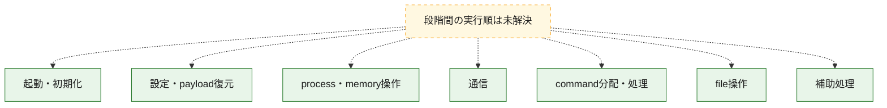
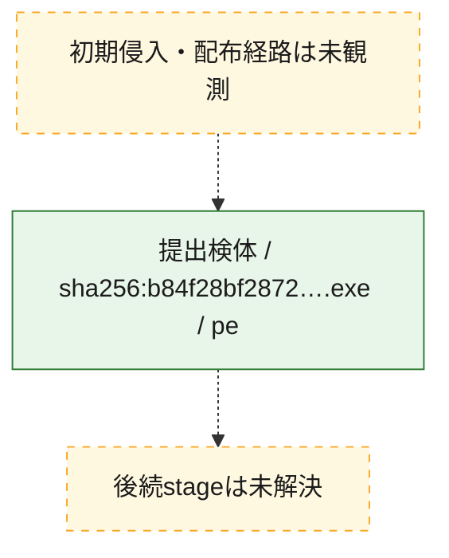
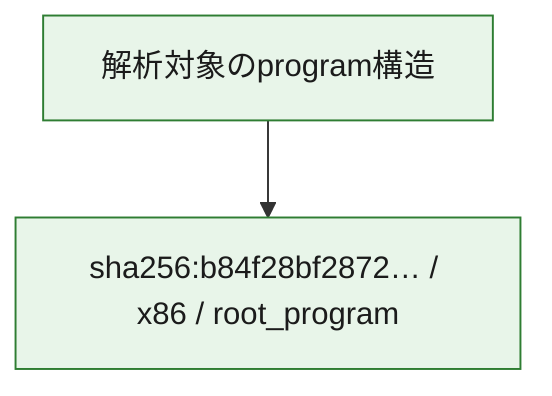

# 全体ロジック：b84f28bf2872715a977aafd9215358d078ae942c6e8ab1c5b397c189c9f5f970

代表関数の静的証跡から、起動・初期化、設定・payload復元、process・memory操作、通信、command分配・処理、file操作の処理群を確認しました。

## 読み方

- phaseの掲載順は解析上の整理順です。observed_call_edgesがない段階間の実行順を断定しません。
- 図の実線は静的に観測した関係、点線と黄色のノードは未観測・未解決の関係を示します。
- 図は静的な要約であり、動的実行を再現するものではありません。
- 詳細な関数解説とfingerprintは[STATIC-LOGIC.md](STATIC-LOGIC.md)を参照してください。

## 静的可視化

### 実行フロー

### 感染チェーン

### モジュール関係

## 処理段階

### 1. 起動・初期化

entry pointから初期化と後続処理への移行を確認します。
確度: `confirmed_static_function_evidence`

- `b84f28bf2872715a977aafd9215358d078ae942c6e8ab1c5b397c189c9f5f970:ghidra:0052a860` — 初期化と主要処理への分岐を行う入口関数です。 状態: `succeeded`、選定理由: `entry_point`, `meaningful_symbol_name`, `probable_go_main_user_code`, `reviewed_call_centrality:4`, `role:entrypoint`
- `b84f28bf2872715a977aafd9215358d078ae942c6e8ab1c5b397c189c9f5f970:ghidra:0052abe0` — 初期化と主要処理への分岐を行う入口関数です。 状態: `succeeded`、選定理由: `entry_point`, `meaningful_symbol_name`, `probable_go_main_user_code`, `reviewed_call_centrality:4`, `role:entrypoint`
- `b84f28bf2872715a977aafd9215358d078ae942c6e8ab1c5b397c189c9f5f970:ghidra:0052ac80` — 初期化と主要処理への分岐を行う入口関数です。 状態: `succeeded`、選定理由: `entry_point`, `meaningful_symbol_name`, `probable_go_main_user_code`, `reviewed_call_centrality:29`, `role:entrypoint`
- `b84f28bf2872715a977aafd9215358d078ae942c6e8ab1c5b397c189c9f5f970:ghidra:00532440` — 初期化と主要処理への分岐を行う入口関数です。 状態: `succeeded`、選定理由: `entry_point`, `meaningful_symbol_name`, `probable_go_main_user_code`, `reviewed_call_centrality:31`, `role:entrypoint`
- `b84f28bf2872715a977aafd9215358d078ae942c6e8ab1c5b397c189c9f5f970:ghidra:005356c0` — 初期化と主要処理への分岐を行う入口関数です。 状態: `succeeded`、選定理由: `entry_point`, `meaningful_symbol_name`, `probable_go_main_user_code`, `reviewed_call_centrality:29`, `role:entrypoint`
- `b84f28bf2872715a977aafd9215358d078ae942c6e8ab1c5b397c189c9f5f970:ghidra:0053b7a0` — 初期化と主要処理への分岐を行う入口関数です。 状態: `succeeded`、選定理由: `entry_point`, `meaningful_symbol_name`, `probable_go_main_user_code`, `reviewed_call_centrality:30`, `role:entrypoint`
- `b84f28bf2872715a977aafd9215358d078ae942c6e8ab1c5b397c189c9f5f970:ghidra:0053d020` — 初期化と主要処理への分岐を行う入口関数です。 状態: `succeeded`、選定理由: `entry_point`, `meaningful_symbol_name`, `probable_go_main_user_code`, `reviewed_call_centrality:32`, `role:entrypoint`
- `b84f28bf2872715a977aafd9215358d078ae942c6e8ab1c5b397c189c9f5f970:ghidra:00546dc0` — 初期化と主要処理への分岐を行う入口関数です。 状態: `succeeded`、選定理由: `entry_point`, `meaningful_symbol_name`, `probable_go_main_user_code`, `reviewed_call_centrality:8`, `role:entrypoint`
- `b84f28bf2872715a977aafd9215358d078ae942c6e8ab1c5b397c189c9f5f970:ghidra:00546f60` — 初期化と主要処理への分岐を行う入口関数です。 状態: `succeeded`、選定理由: `entry_point`, `meaningful_symbol_name`, `probable_go_main_user_code`, `reviewed_call_centrality:8`, `role:entrypoint`
- `b84f28bf2872715a977aafd9215358d078ae942c6e8ab1c5b397c189c9f5f970:ghidra:00547100` — 初期化と主要処理への分岐を行う入口関数です。 状態: `succeeded`、選定理由: `entry_point`, `meaningful_symbol_name`, `probable_go_main_user_code`, `reviewed_call_centrality:8`, `role:entrypoint`
- `b84f28bf2872715a977aafd9215358d078ae942c6e8ab1c5b397c189c9f5f970:ghidra:005472a0` — 初期化と主要処理への分岐を行う入口関数です。 状態: `succeeded`、選定理由: `entry_point`, `meaningful_symbol_name`, `probable_go_main_user_code`, `reviewed_call_centrality:8`, `role:entrypoint`
- `b84f28bf2872715a977aafd9215358d078ae942c6e8ab1c5b397c189c9f5f970:ghidra:00547440` — 初期化と主要処理への分岐を行う入口関数です。 状態: `succeeded`、選定理由: `entry_point`, `meaningful_symbol_name`, `probable_go_main_user_code`, `reviewed_call_centrality:8`, `role:entrypoint`
- `b84f28bf2872715a977aafd9215358d078ae942c6e8ab1c5b397c189c9f5f970:ghidra:005475e0` — 初期化と主要処理への分岐を行う入口関数です。 状態: `succeeded`、選定理由: `entry_point`, `meaningful_symbol_name`, `probable_go_main_user_code`, `reviewed_call_centrality:8`, `role:entrypoint`
- `b84f28bf2872715a977aafd9215358d078ae942c6e8ab1c5b397c189c9f5f970:ghidra:00547780` — 初期化と主要処理への分岐を行う入口関数です。 状態: `succeeded`、選定理由: `entry_point`, `meaningful_symbol_name`, `probable_go_main_user_code`, `reviewed_call_centrality:8`, `role:entrypoint`
- `b84f28bf2872715a977aafd9215358d078ae942c6e8ab1c5b397c189c9f5f970:ghidra:00547920` — 初期化と主要処理への分岐を行う入口関数です。 状態: `succeeded`、選定理由: `entry_point`, `meaningful_symbol_name`, `probable_go_main_user_code`, `reviewed_call_centrality:8`, `role:entrypoint`
- `b84f28bf2872715a977aafd9215358d078ae942c6e8ab1c5b397c189c9f5f970:ghidra:00547a60` — 初期化と主要処理への分岐を行う入口関数です。 状態: `succeeded`、選定理由: `entry_point`, `meaningful_symbol_name`, `probable_go_main_user_code`, `reviewed_call_centrality:30`, `role:entrypoint`
- `b84f28bf2872715a977aafd9215358d078ae942c6e8ab1c5b397c189c9f5f970:ghidra:00550ba0` — 初期化と主要処理への分岐を行う入口関数です。 状態: `succeeded`、選定理由: `entry_point`, `meaningful_symbol_name`, `probable_go_main_user_code`, `reviewed_call_centrality:30`, `role:entrypoint`
- `b84f28bf2872715a977aafd9215358d078ae942c6e8ab1c5b397c189c9f5f970:ghidra:0055a9e0` — 初期化と主要処理への分岐を行う入口関数です。 状態: `succeeded`、選定理由: `entry_point`, `meaningful_symbol_name`, `probable_go_main_user_code`, `reviewed_call_centrality:8`, `role:entrypoint`
- `b84f28bf2872715a977aafd9215358d078ae942c6e8ab1c5b397c189c9f5f970:ghidra:0055ab80` — 初期化と主要処理への分岐を行う入口関数です。 状態: `succeeded`、選定理由: `entry_point`, `meaningful_symbol_name`, `probable_go_main_user_code`, `reviewed_call_centrality:8`, `role:entrypoint`
- `b84f28bf2872715a977aafd9215358d078ae942c6e8ab1c5b397c189c9f5f970:ghidra:0055ad20` — 初期化と主要処理への分岐を行う入口関数です。 状態: `succeeded`、選定理由: `entry_point`, `meaningful_symbol_name`, `probable_go_main_user_code`, `reviewed_call_centrality:8`, `role:entrypoint`
- `b84f28bf2872715a977aafd9215358d078ae942c6e8ab1c5b397c189c9f5f970:ghidra:0055aec0` — 初期化と主要処理への分岐を行う入口関数です。 状態: `succeeded`、選定理由: `entry_point`, `meaningful_symbol_name`, `probable_go_main_user_code`, `reviewed_call_centrality:8`, `role:entrypoint`
- `b84f28bf2872715a977aafd9215358d078ae942c6e8ab1c5b397c189c9f5f970:ghidra:0055b060` — 初期化と主要処理への分岐を行う入口関数です。 状態: `succeeded`、選定理由: `entry_point`, `meaningful_symbol_name`, `probable_go_main_user_code`, `reviewed_call_centrality:8`, `role:entrypoint`
- `b84f28bf2872715a977aafd9215358d078ae942c6e8ab1c5b397c189c9f5f970:ghidra:0055b200` — 初期化と主要処理への分岐を行う入口関数です。 状態: `succeeded`、選定理由: `entry_point`, `meaningful_symbol_name`, `probable_go_main_user_code`, `reviewed_call_centrality:8`, `role:entrypoint`
- `b84f28bf2872715a977aafd9215358d078ae942c6e8ab1c5b397c189c9f5f970:ghidra:0055b3a0` — 初期化と主要処理への分岐を行う入口関数です。 状態: `succeeded`、選定理由: `entry_point`, `meaningful_symbol_name`, `probable_go_main_user_code`, `reviewed_call_centrality:8`, `role:entrypoint`
- `b84f28bf2872715a977aafd9215358d078ae942c6e8ab1c5b397c189c9f5f970:ghidra:0055b540` — 初期化と主要処理への分岐を行う入口関数です。 状態: `succeeded`、選定理由: `entry_point`, `meaningful_symbol_name`, `probable_go_main_user_code`, `reviewed_call_centrality:8`, `role:entrypoint`

### 2. 設定・payload復元

設定、resource、payload、暗号化データの復元・変換を確認します。
確度: `confirmed_static_function_evidence`

- `b84f28bf2872715a977aafd9215358d078ae942c6e8ab1c5b397c189c9f5f970:ghidra:0047fdc0` — 設定、resource、payloadなどの解析・変換を行う関数です。 状態: `succeeded`、選定理由: `meaningful_symbol_name`, `reviewed_call_centrality:4`, `role:config_or_data_transform`

### 3. process・memory操作

process、thread、module、memory操作と実行移行を確認します。
確度: `confirmed_static_function_evidence`

- `b84f28bf2872715a977aafd9215358d078ae942c6e8ab1c5b397c189c9f5f970:ghidra:0046e460` — process、thread、module、またはmemory操作に関係する関数です。 状態: `succeeded`、選定理由: `meaningful_symbol_name`, `reviewed_call_centrality:3`, `role:process_or_memory_operation`

### 4. 通信

通信初期化、endpoint処理、送受信の役割を確認します。
確度: `confirmed_static_function_evidence`

- `b84f28bf2872715a977aafd9215358d078ae942c6e8ab1c5b397c189c9f5f970:ghidra:004a5200` — 通信初期化、送受信、またはendpoint処理に関係する関数です。 状態: `succeeded`、選定理由: `meaningful_symbol_name`, `reviewed_call_centrality:8`, `role:network_communication`

### 5. command分配・処理

受信commandやtaskの解釈、分配、個別handlerへの移行を確認します。
確度: `confirmed_static_function_evidence`

- `b84f28bf2872715a977aafd9215358d078ae942c6e8ab1c5b397c189c9f5f970:ghidra:004bd2e0` — commandの解釈、分配、または個別処理を担当する関数です。 状態: `succeeded`、選定理由: `meaningful_symbol_name`, `reviewed_call_centrality:5`, `role:command_dispatch_or_handler`

### 6. file操作

fileやdirectoryの作成、読書き、削除を確認します。
確度: `confirmed_static_function_evidence`

- `b84f28bf2872715a977aafd9215358d078ae942c6e8ab1c5b397c189c9f5f970:ghidra:004bdd40` — fileまたはdirectoryの読書き・管理に関係する関数です。 状態: `succeeded`、選定理由: `meaningful_symbol_name`, `reviewed_call_centrality:6`, `role:file_operation`

### 7. 補助処理

主要処理を支える一般内部関数またはlibrary処理を確認します。
確度: `confirmed_static_function_evidence`

- `b84f28bf2872715a977aafd9215358d078ae942c6e8ab1c5b397c189c9f5f970:ghidra:00401080` — compiler生成処理または汎用library処理とみられる関数です。 状態: `succeeded`、選定理由: `meaningful_symbol_name`, `reviewed_call_centrality:10`
- `b84f28bf2872715a977aafd9215358d078ae942c6e8ab1c5b397c189c9f5f970:ghidra:00465380` — 検体内部の一般処理を実装する関数です。 状態: `succeeded`、選定理由: `meaningful_symbol_name`, `reviewed_call_centrality:3`

## 観測したcall関係

- `ghidra-function:04959bcd26bbf62f44839573` → `ghidra-external:06a1e1edb9d27db1302ac86c` （`unclassified` → `unclassified`）
- `ghidra-function:04959bcd26bbf62f44839573` → `ghidra-external:0b39b9c292aea4dd909963b0` （`unclassified` → `unclassified`）
- `ghidra-function:04959bcd26bbf62f44839573` → `ghidra-external:197932941aed81305edf5146` （`unclassified` → `unclassified`）
- `ghidra-function:04959bcd26bbf62f44839573` → `ghidra-external:1b4d5ecb9c4ae9340f3bddc7` （`unclassified` → `unclassified`）
- `ghidra-function:04959bcd26bbf62f44839573` → `ghidra-external:248bb8ce88793515ae520f13` （`unclassified` → `unclassified`）
- `ghidra-function:04959bcd26bbf62f44839573` → `ghidra-external:2abae0a9bb08f6daed05e3c6` （`unclassified` → `unclassified`）
- `ghidra-function:04959bcd26bbf62f44839573` → `ghidra-external:2b50616c5011ed266558d7cc` （`unclassified` → `unclassified`）
- `ghidra-function:04959bcd26bbf62f44839573` → `ghidra-external:38ec7c2d93a472f80c18d711` （`unclassified` → `unclassified`）
- `ghidra-function:04959bcd26bbf62f44839573` → `ghidra-external:4fb85e23d74f34ba01ba9206` （`unclassified` → `unclassified`）
- `ghidra-function:04959bcd26bbf62f44839573` → `ghidra-external:55c846182856e710ba399499` （`unclassified` → `unclassified`）
- `ghidra-function:04959bcd26bbf62f44839573` → `ghidra-external:64fe7f9a5c193d7e57ae64a6` （`unclassified` → `unclassified`）
- `ghidra-function:04959bcd26bbf62f44839573` → `ghidra-external:6cfa1abf12c5d71eec2d7e92` （`unclassified` → `unclassified`）
- `ghidra-function:04959bcd26bbf62f44839573` → `ghidra-external:7a70087b995344c8a61d52f1` （`unclassified` → `unclassified`）
- `ghidra-function:04959bcd26bbf62f44839573` → `ghidra-external:800920c97044486b9f8a0c14` （`unclassified` → `unclassified`）
- `ghidra-function:04959bcd26bbf62f44839573` → `ghidra-external:817bd48ab8aef8cdab76e323` （`unclassified` → `unclassified`）
- `ghidra-function:04959bcd26bbf62f44839573` → `ghidra-external:95c3feee7723210eb5690ac1` （`unclassified` → `unclassified`）
- `ghidra-function:04959bcd26bbf62f44839573` → `ghidra-external:a2dfd4a77578533f94d1c40c` （`unclassified` → `unclassified`）
- `ghidra-function:04959bcd26bbf62f44839573` → `ghidra-external:a73db5105515930bce1945d2` （`unclassified` → `unclassified`）
- `ghidra-function:04959bcd26bbf62f44839573` → `ghidra-external:b2836d3ba148e84f44d7124a` （`unclassified` → `unclassified`）
- `ghidra-function:04959bcd26bbf62f44839573` → `ghidra-external:b82f37ec7d680951d175cdcc` （`unclassified` → `unclassified`）
- `ghidra-function:04959bcd26bbf62f44839573` → `ghidra-external:bb6d978ee5a96a4342feae8f` （`unclassified` → `unclassified`）
- `ghidra-function:04959bcd26bbf62f44839573` → `ghidra-external:bc642a6b2234a67ff384ac6a` （`unclassified` → `unclassified`）
- `ghidra-function:04959bcd26bbf62f44839573` → `ghidra-external:bf9ff07ae746c15047975f1e` （`unclassified` → `unclassified`）
- `ghidra-function:04959bcd26bbf62f44839573` → `ghidra-external:bfe95e20bebe3b5f78b75db9` （`unclassified` → `unclassified`）
- `ghidra-function:04959bcd26bbf62f44839573` → `ghidra-external:c153178b6072b2f93bffd7b3` （`unclassified` → `unclassified`）
- `ghidra-function:04959bcd26bbf62f44839573` → `ghidra-external:d38d03ee0c2e201197087766` （`unclassified` → `unclassified`）
- `ghidra-function:04959bcd26bbf62f44839573` → `ghidra-external:d675ed392d380bf0e8629144` （`unclassified` → `unclassified`）
- `ghidra-function:04959bcd26bbf62f44839573` → `ghidra-external:df9c8c2947b075b4fed0ff92` （`unclassified` → `unclassified`）
- `ghidra-function:04959bcd26bbf62f44839573` → `ghidra-external:e82ca2bda12237939da24458` （`unclassified` → `unclassified`）
- `ghidra-function:04959bcd26bbf62f44839573` → `ghidra-external:eed7e4ab26ae26deedfbeb69` （`unclassified` → `unclassified`）
- `ghidra-function:067d2da9daea4b0ae90cfc35` → `ghidra-external:06a1e1edb9d27db1302ac86c` （`unclassified` → `unclassified`）
- `ghidra-function:067d2da9daea4b0ae90cfc35` → `ghidra-external:2b50616c5011ed266558d7cc` （`unclassified` → `unclassified`）
- `ghidra-function:067d2da9daea4b0ae90cfc35` → `ghidra-external:6cfa1abf12c5d71eec2d7e92` （`unclassified` → `unclassified`）
- `ghidra-function:067d2da9daea4b0ae90cfc35` → `ghidra-external:7a70087b995344c8a61d52f1` （`unclassified` → `unclassified`）
- `ghidra-function:067d2da9daea4b0ae90cfc35` → `ghidra-external:9fd2f3aac48c5e24897f9803` （`unclassified` → `unclassified`）
- `ghidra-function:067d2da9daea4b0ae90cfc35` → `ghidra-external:af259447b5e42b9632becf49` （`unclassified` → `unclassified`）
- `ghidra-function:067d2da9daea4b0ae90cfc35` → `ghidra-external:d38d03ee0c2e201197087766` （`unclassified` → `unclassified`）
- `ghidra-function:067d2da9daea4b0ae90cfc35` → `ghidra-external:d675ed392d380bf0e8629144` （`unclassified` → `unclassified`）
- `ghidra-function:073c8c6853c324d6111646a0` → `ghidra-external:06a1e1edb9d27db1302ac86c` （`unclassified` → `unclassified`）
- `ghidra-function:073c8c6853c324d6111646a0` → `ghidra-external:092c9615cdc8072178c3b325` （`unclassified` → `unclassified`）
- `ghidra-function:073c8c6853c324d6111646a0` → `ghidra-external:2b50616c5011ed266558d7cc` （`unclassified` → `unclassified`）
- `ghidra-function:073c8c6853c324d6111646a0` → `ghidra-external:6cfa1abf12c5d71eec2d7e92` （`unclassified` → `unclassified`）
- `ghidra-function:073c8c6853c324d6111646a0` → `ghidra-external:7a70087b995344c8a61d52f1` （`unclassified` → `unclassified`）
- `ghidra-function:073c8c6853c324d6111646a0` → `ghidra-external:9fd2f3aac48c5e24897f9803` （`unclassified` → `unclassified`）
- `ghidra-function:073c8c6853c324d6111646a0` → `ghidra-external:d38d03ee0c2e201197087766` （`unclassified` → `unclassified`）
- `ghidra-function:073c8c6853c324d6111646a0` → `ghidra-external:d675ed392d380bf0e8629144` （`unclassified` → `unclassified`）
- `ghidra-function:1b92bb183f462fbd7d6c82a1` → `ghidra-external:06a1e1edb9d27db1302ac86c` （`unclassified` → `unclassified`）
- `ghidra-function:1b92bb183f462fbd7d6c82a1` → `ghidra-external:099199b9ccddb1ae5e513bf2` （`unclassified` → `unclassified`）
- `ghidra-function:1b92bb183f462fbd7d6c82a1` → `ghidra-external:2b50616c5011ed266558d7cc` （`unclassified` → `unclassified`）
- `ghidra-function:1b92bb183f462fbd7d6c82a1` → `ghidra-external:6cfa1abf12c5d71eec2d7e92` （`unclassified` → `unclassified`）
- `ghidra-function:1b92bb183f462fbd7d6c82a1` → `ghidra-external:7a70087b995344c8a61d52f1` （`unclassified` → `unclassified`）
- `ghidra-function:1b92bb183f462fbd7d6c82a1` → `ghidra-external:9fd2f3aac48c5e24897f9803` （`unclassified` → `unclassified`）
- `ghidra-function:1b92bb183f462fbd7d6c82a1` → `ghidra-external:d38d03ee0c2e201197087766` （`unclassified` → `unclassified`）
- `ghidra-function:1b92bb183f462fbd7d6c82a1` → `ghidra-external:d675ed392d380bf0e8629144` （`unclassified` → `unclassified`）
- `ghidra-function:1c50e4cb5f7ce49988a79c24` → `ghidra-external:0d63510d802628387b2328cc` （`unclassified` → `unclassified`）
- `ghidra-function:1c50e4cb5f7ce49988a79c24` → `ghidra-external:1b4d5ecb9c4ae9340f3bddc7` （`unclassified` → `unclassified`）
- `ghidra-function:1c50e4cb5f7ce49988a79c24` → `ghidra-external:248bb8ce88793515ae520f13` （`unclassified` → `unclassified`）
- `ghidra-function:1c50e4cb5f7ce49988a79c24` → `ghidra-external:26b1d2c1c84f2b4fe88d3a57` （`unclassified` → `unclassified`）
- `ghidra-function:1c50e4cb5f7ce49988a79c24` → `ghidra-external:31a7e328271c28daa0997ce2` （`unclassified` → `unclassified`）
- `ghidra-function:1c50e4cb5f7ce49988a79c24` → `ghidra-external:4fb85e23d74f34ba01ba9206` （`unclassified` → `unclassified`）
- `ghidra-function:1c50e4cb5f7ce49988a79c24` → `ghidra-external:503554bc5dea1367a42a3ef5` （`unclassified` → `unclassified`）
- `ghidra-function:1c50e4cb5f7ce49988a79c24` → `ghidra-external:95221ac71f3080d10f7d70e9` （`unclassified` → `unclassified`）
- `ghidra-function:1d197c833488d0ad1c9462d5` → `ghidra-external:06a1e1edb9d27db1302ac86c` （`unclassified` → `unclassified`）
- `ghidra-function:1d197c833488d0ad1c9462d5` → `ghidra-external:2b50616c5011ed266558d7cc` （`unclassified` → `unclassified`）
- `ghidra-function:1d197c833488d0ad1c9462d5` → `ghidra-external:68d46770571649fa70414a84` （`unclassified` → `unclassified`）
- `ghidra-function:1d197c833488d0ad1c9462d5` → `ghidra-external:6cfa1abf12c5d71eec2d7e92` （`unclassified` → `unclassified`）
- `ghidra-function:1d197c833488d0ad1c9462d5` → `ghidra-external:7a70087b995344c8a61d52f1` （`unclassified` → `unclassified`）
- `ghidra-function:1d197c833488d0ad1c9462d5` → `ghidra-external:9fd2f3aac48c5e24897f9803` （`unclassified` → `unclassified`）
- `ghidra-function:1d197c833488d0ad1c9462d5` → `ghidra-external:d38d03ee0c2e201197087766` （`unclassified` → `unclassified`）
- `ghidra-function:1d197c833488d0ad1c9462d5` → `ghidra-external:d675ed392d380bf0e8629144` （`unclassified` → `unclassified`）
- `ghidra-function:2531e722356a1d2bcc54aaf5` → `ghidra-external:06a1e1edb9d27db1302ac86c` （`unclassified` → `unclassified`）
- `ghidra-function:2531e722356a1d2bcc54aaf5` → `ghidra-external:2b50616c5011ed266558d7cc` （`unclassified` → `unclassified`）
- `ghidra-function:2531e722356a1d2bcc54aaf5` → `ghidra-external:55816f7ffaa7826a358d27d0` （`unclassified` → `unclassified`）
- `ghidra-function:2531e722356a1d2bcc54aaf5` → `ghidra-external:6cfa1abf12c5d71eec2d7e92` （`unclassified` → `unclassified`）
- `ghidra-function:2531e722356a1d2bcc54aaf5` → `ghidra-external:7a70087b995344c8a61d52f1` （`unclassified` → `unclassified`）
- `ghidra-function:2531e722356a1d2bcc54aaf5` → `ghidra-external:9fd2f3aac48c5e24897f9803` （`unclassified` → `unclassified`）
- `ghidra-function:2531e722356a1d2bcc54aaf5` → `ghidra-external:d38d03ee0c2e201197087766` （`unclassified` → `unclassified`）
- `ghidra-function:2531e722356a1d2bcc54aaf5` → `ghidra-external:d675ed392d380bf0e8629144` （`unclassified` → `unclassified`）
- `ghidra-function:264152436dc48ca8be6a587d` → `ghidra-external:05d43903626ebd0d8858edbf` （`unclassified` → `unclassified`）
- `ghidra-function:264152436dc48ca8be6a587d` → `ghidra-external:06a1e1edb9d27db1302ac86c` （`unclassified` → `unclassified`）
- `ghidra-function:264152436dc48ca8be6a587d` → `ghidra-external:2b50616c5011ed266558d7cc` （`unclassified` → `unclassified`）
- `ghidra-function:264152436dc48ca8be6a587d` → `ghidra-external:6cfa1abf12c5d71eec2d7e92` （`unclassified` → `unclassified`）
- `ghidra-function:264152436dc48ca8be6a587d` → `ghidra-external:7a70087b995344c8a61d52f1` （`unclassified` → `unclassified`）
- `ghidra-function:264152436dc48ca8be6a587d` → `ghidra-external:9fd2f3aac48c5e24897f9803` （`unclassified` → `unclassified`）
- `ghidra-function:264152436dc48ca8be6a587d` → `ghidra-external:d38d03ee0c2e201197087766` （`unclassified` → `unclassified`）
- `ghidra-function:264152436dc48ca8be6a587d` → `ghidra-external:d675ed392d380bf0e8629144` （`unclassified` → `unclassified`）
- `ghidra-function:340aaa17beb9cba67338844d` → `ghidra-external:06a1e1edb9d27db1302ac86c` （`unclassified` → `unclassified`）
- `ghidra-function:340aaa17beb9cba67338844d` → `ghidra-external:2b50616c5011ed266558d7cc` （`unclassified` → `unclassified`）
- `ghidra-function:340aaa17beb9cba67338844d` → `ghidra-external:6cfa1abf12c5d71eec2d7e92` （`unclassified` → `unclassified`）
- `ghidra-function:340aaa17beb9cba67338844d` → `ghidra-external:7a70087b995344c8a61d52f1` （`unclassified` → `unclassified`）
- `ghidra-function:340aaa17beb9cba67338844d` → `ghidra-external:9fd2f3aac48c5e24897f9803` （`unclassified` → `unclassified`）
- `ghidra-function:340aaa17beb9cba67338844d` → `ghidra-external:d38d03ee0c2e201197087766` （`unclassified` → `unclassified`）
- `ghidra-function:340aaa17beb9cba67338844d` → `ghidra-external:d675ed392d380bf0e8629144` （`unclassified` → `unclassified`）
- `ghidra-function:340aaa17beb9cba67338844d` → `ghidra-external:e31b4b13599f2e5b3e8bd264` （`unclassified` → `unclassified`）
- `ghidra-function:39ebed6d07dfdd082652800b` → `ghidra-external:06a1e1edb9d27db1302ac86c` （`unclassified` → `unclassified`）
- `ghidra-function:39ebed6d07dfdd082652800b` → `ghidra-external:0b78e3fb187fd85564087976` （`unclassified` → `unclassified`）
- `ghidra-function:39ebed6d07dfdd082652800b` → `ghidra-external:2b50616c5011ed266558d7cc` （`unclassified` → `unclassified`）
- `ghidra-function:39ebed6d07dfdd082652800b` → `ghidra-external:6cfa1abf12c5d71eec2d7e92` （`unclassified` → `unclassified`）
- `ghidra-function:39ebed6d07dfdd082652800b` → `ghidra-external:7a70087b995344c8a61d52f1` （`unclassified` → `unclassified`）
- `ghidra-function:39ebed6d07dfdd082652800b` → `ghidra-external:9fd2f3aac48c5e24897f9803` （`unclassified` → `unclassified`）
- `ghidra-function:39ebed6d07dfdd082652800b` → `ghidra-external:d38d03ee0c2e201197087766` （`unclassified` → `unclassified`）
- `ghidra-function:39ebed6d07dfdd082652800b` → `ghidra-external:d675ed392d380bf0e8629144` （`unclassified` → `unclassified`）
- `ghidra-function:48942c682fd0be4276c1de8f` → `ghidra-external:06a1e1edb9d27db1302ac86c` （`unclassified` → `unclassified`）
- `ghidra-function:48942c682fd0be4276c1de8f` → `ghidra-external:0b39b9c292aea4dd909963b0` （`unclassified` → `unclassified`）
- `ghidra-function:48942c682fd0be4276c1de8f` → `ghidra-external:197932941aed81305edf5146` （`unclassified` → `unclassified`）
- `ghidra-function:48942c682fd0be4276c1de8f` → `ghidra-external:1b4d5ecb9c4ae9340f3bddc7` （`unclassified` → `unclassified`）
- `ghidra-function:48942c682fd0be4276c1de8f` → `ghidra-external:248bb8ce88793515ae520f13` （`unclassified` → `unclassified`）
- `ghidra-function:48942c682fd0be4276c1de8f` → `ghidra-external:2abae0a9bb08f6daed05e3c6` （`unclassified` → `unclassified`）
- `ghidra-function:48942c682fd0be4276c1de8f` → `ghidra-external:2b50616c5011ed266558d7cc` （`unclassified` → `unclassified`）
- `ghidra-function:48942c682fd0be4276c1de8f` → `ghidra-external:342fdf50bf7375606bf1a012` （`unclassified` → `unclassified`）
- `ghidra-function:48942c682fd0be4276c1de8f` → `ghidra-external:38ec7c2d93a472f80c18d711` （`unclassified` → `unclassified`）
- `ghidra-function:48942c682fd0be4276c1de8f` → `ghidra-external:4fb85e23d74f34ba01ba9206` （`unclassified` → `unclassified`）
- `ghidra-function:48942c682fd0be4276c1de8f` → `ghidra-external:55c846182856e710ba399499` （`unclassified` → `unclassified`）
- `ghidra-function:48942c682fd0be4276c1de8f` → `ghidra-external:64fe7f9a5c193d7e57ae64a6` （`unclassified` → `unclassified`）
- `ghidra-function:48942c682fd0be4276c1de8f` → `ghidra-external:6cfa1abf12c5d71eec2d7e92` （`unclassified` → `unclassified`）
- `ghidra-function:48942c682fd0be4276c1de8f` → `ghidra-external:7a70087b995344c8a61d52f1` （`unclassified` → `unclassified`）
- `ghidra-function:48942c682fd0be4276c1de8f` → `ghidra-external:800920c97044486b9f8a0c14` （`unclassified` → `unclassified`）
- `ghidra-function:48942c682fd0be4276c1de8f` → `ghidra-external:817bd48ab8aef8cdab76e323` （`unclassified` → `unclassified`）
- `ghidra-function:48942c682fd0be4276c1de8f` → `ghidra-external:95c3feee7723210eb5690ac1` （`unclassified` → `unclassified`）
- `ghidra-function:48942c682fd0be4276c1de8f` → `ghidra-external:a2dfd4a77578533f94d1c40c` （`unclassified` → `unclassified`）
- `ghidra-function:48942c682fd0be4276c1de8f` → `ghidra-external:a73db5105515930bce1945d2` （`unclassified` → `unclassified`）
- `ghidra-function:48942c682fd0be4276c1de8f` → `ghidra-external:b2836d3ba148e84f44d7124a` （`unclassified` → `unclassified`）
- `ghidra-function:48942c682fd0be4276c1de8f` → `ghidra-external:b82f37ec7d680951d175cdcc` （`unclassified` → `unclassified`）
- `ghidra-function:48942c682fd0be4276c1de8f` → `ghidra-external:bb6d978ee5a96a4342feae8f` （`unclassified` → `unclassified`）
- `ghidra-function:48942c682fd0be4276c1de8f` → `ghidra-external:bc642a6b2234a67ff384ac6a` （`unclassified` → `unclassified`）
- `ghidra-function:48942c682fd0be4276c1de8f` → `ghidra-external:bf9ff07ae746c15047975f1e` （`unclassified` → `unclassified`）
- `ghidra-function:48942c682fd0be4276c1de8f` → `ghidra-external:bfe95e20bebe3b5f78b75db9` （`unclassified` → `unclassified`）
- `ghidra-function:48942c682fd0be4276c1de8f` → `ghidra-external:c153178b6072b2f93bffd7b3` （`unclassified` → `unclassified`）
- `ghidra-function:48942c682fd0be4276c1de8f` → `ghidra-external:d38d03ee0c2e201197087766` （`unclassified` → `unclassified`）
- `ghidra-function:48942c682fd0be4276c1de8f` → `ghidra-external:d675ed392d380bf0e8629144` （`unclassified` → `unclassified`）
- `ghidra-function:48942c682fd0be4276c1de8f` → `ghidra-external:df9c8c2947b075b4fed0ff92` （`unclassified` → `unclassified`）
- `ghidra-function:48942c682fd0be4276c1de8f` → `ghidra-external:e82ca2bda12237939da24458` （`unclassified` → `unclassified`）
- `ghidra-function:531595f528d32a6e71c21b53` → `ghidra-external:2e8bb93b880574a72d0a9fca` （`unclassified` → `unclassified`）
- `ghidra-function:531595f528d32a6e71c21b53` → `ghidra-external:978921a43b841813c6972531` （`unclassified` → `unclassified`）
- `ghidra-function:531595f528d32a6e71c21b53` → `ghidra-external:e61b63ec7fc318491fd650d5` （`unclassified` → `unclassified`）
- `ghidra-function:550834fb7dcda51fd1f63c39` → `ghidra-external:06a1e1edb9d27db1302ac86c` （`unclassified` → `unclassified`）
- `ghidra-function:550834fb7dcda51fd1f63c39` → `ghidra-external:2b50616c5011ed266558d7cc` （`unclassified` → `unclassified`）
- `ghidra-function:550834fb7dcda51fd1f63c39` → `ghidra-external:6cfa1abf12c5d71eec2d7e92` （`unclassified` → `unclassified`）
- `ghidra-function:550834fb7dcda51fd1f63c39` → `ghidra-external:7a70087b995344c8a61d52f1` （`unclassified` → `unclassified`）
- `ghidra-function:550834fb7dcda51fd1f63c39` → `ghidra-external:9fd2f3aac48c5e24897f9803` （`unclassified` → `unclassified`）
- `ghidra-function:550834fb7dcda51fd1f63c39` → `ghidra-external:d38d03ee0c2e201197087766` （`unclassified` → `unclassified`）
- `ghidra-function:550834fb7dcda51fd1f63c39` → `ghidra-external:d675ed392d380bf0e8629144` （`unclassified` → `unclassified`）
- `ghidra-function:550834fb7dcda51fd1f63c39` → `ghidra-external:fac0d7d52352ebbd09960a3b` （`unclassified` → `unclassified`）
- `ghidra-function:562863d71e6682ad28a79fd8` → `ghidra-external:1b4d5ecb9c4ae9340f3bddc7` （`unclassified` → `unclassified`）
- `ghidra-function:562863d71e6682ad28a79fd8` → `ghidra-external:2070c3469a17a36161f3cbec` （`unclassified` → `unclassified`）
- `ghidra-function:562863d71e6682ad28a79fd8` → `ghidra-external:d52f26da219cd5c8f993237b` （`unclassified` → `unclassified`）
- `ghidra-function:5651a8a44d5b9d8511b5013c` → `ghidra-external:1b4d5ecb9c4ae9340f3bddc7` （`unclassified` → `unclassified`）
- `ghidra-function:5651a8a44d5b9d8511b5013c` → `ghidra-external:55c846182856e710ba399499` （`unclassified` → `unclassified`）
- `ghidra-function:5651a8a44d5b9d8511b5013c` → `ghidra-external:64fe7f9a5c193d7e57ae64a6` （`unclassified` → `unclassified`）
- `ghidra-function:5651a8a44d5b9d8511b5013c` → `ghidra-external:6daf375e8571156123c04ad8` （`unclassified` → `unclassified`）
- `ghidra-function:5651a8a44d5b9d8511b5013c` → `ghidra-external:800920c97044486b9f8a0c14` （`unclassified` → `unclassified`）
- `ghidra-function:5651a8a44d5b9d8511b5013c` → `ghidra-external:ac8fc52d42d582664afdebe9` （`unclassified` → `unclassified`）
- `ghidra-function:5651a8a44d5b9d8511b5013c` → `ghidra-external:bb6d978ee5a96a4342feae8f` （`unclassified` → `unclassified`）
- `ghidra-function:5651a8a44d5b9d8511b5013c` → `ghidra-external:c6117694a1c2c8222cd292bf` （`unclassified` → `unclassified`）
- `ghidra-function:5651a8a44d5b9d8511b5013c` → `ghidra-external:df9c8c2947b075b4fed0ff92` （`unclassified` → `unclassified`）
- `ghidra-function:5651a8a44d5b9d8511b5013c` → `ghidra-external:e03ebb5f25816e1e879b8393` （`unclassified` → `unclassified`）
- `ghidra-function:5f9601509a8447adebbe1777` → `ghidra-external:06a1e1edb9d27db1302ac86c` （`unclassified` → `unclassified`）
- `ghidra-function:5f9601509a8447adebbe1777` → `ghidra-external:2b50616c5011ed266558d7cc` （`unclassified` → `unclassified`）
- `ghidra-function:5f9601509a8447adebbe1777` → `ghidra-external:6cfa1abf12c5d71eec2d7e92` （`unclassified` → `unclassified`）
- `ghidra-function:5f9601509a8447adebbe1777` → `ghidra-external:7a70087b995344c8a61d52f1` （`unclassified` → `unclassified`）
- `ghidra-function:5f9601509a8447adebbe1777` → `ghidra-external:9fd2f3aac48c5e24897f9803` （`unclassified` → `unclassified`）
- `ghidra-function:5f9601509a8447adebbe1777` → `ghidra-external:ab1b60477795f519d03ec5af` （`unclassified` → `unclassified`）
- `ghidra-function:5f9601509a8447adebbe1777` → `ghidra-external:d38d03ee0c2e201197087766` （`unclassified` → `unclassified`）
- `ghidra-function:5f9601509a8447adebbe1777` → `ghidra-external:d675ed392d380bf0e8629144` （`unclassified` → `unclassified`）
- `ghidra-function:684bfc4c427fe566eee6f257` → `ghidra-external:1b4d5ecb9c4ae9340f3bddc7` （`unclassified` → `unclassified`）
- `ghidra-function:684bfc4c427fe566eee6f257` → `ghidra-external:50085df55f9d8c186e54ecdd` （`unclassified` → `unclassified`）
- `ghidra-function:684bfc4c427fe566eee6f257` → `ghidra-external:960a68d61176527e8a124065` （`unclassified` → `unclassified`）
- `ghidra-function:684bfc4c427fe566eee6f257` → `ghidra-external:f92ec8c5ec5751a2932e095d` （`unclassified` → `unclassified`）
- `ghidra-function:69aa3a21b7926be0ecd1a2a4` → `ghidra-external:1b4d5ecb9c4ae9340f3bddc7` （`unclassified` → `unclassified`）
- `ghidra-function:69aa3a21b7926be0ecd1a2a4` → `ghidra-external:503554bc5dea1367a42a3ef5` （`unclassified` → `unclassified`）
- `ghidra-function:69aa3a21b7926be0ecd1a2a4` → `ghidra-external:92d1949c31e2083e38512e0a` （`unclassified` → `unclassified`）
- `ghidra-function:69aa3a21b7926be0ecd1a2a4` → `ghidra-external:9ba39a3e4abb7b1d25b84990` （`unclassified` → `unclassified`）
- `ghidra-function:69aa3a21b7926be0ecd1a2a4` → `ghidra-external:aa19eaeaf7ecbf7ae191b928` （`unclassified` → `unclassified`）
- `ghidra-function:69aa3a21b7926be0ecd1a2a4` → `ghidra-external:fabafc01d9493ac2e5c6b2f9` （`unclassified` → `unclassified`）
- `ghidra-function:8bcd3810a9625cb513dab237` → `ghidra-external:06a1e1edb9d27db1302ac86c` （`unclassified` → `unclassified`）
- `ghidra-function:8bcd3810a9625cb513dab237` → `ghidra-external:0b39b9c292aea4dd909963b0` （`unclassified` → `unclassified`）
- `ghidra-function:8bcd3810a9625cb513dab237` → `ghidra-external:197932941aed81305edf5146` （`unclassified` → `unclassified`）
- `ghidra-function:8bcd3810a9625cb513dab237` → `ghidra-external:1b4d5ecb9c4ae9340f3bddc7` （`unclassified` → `unclassified`）
- `ghidra-function:8bcd3810a9625cb513dab237` → `ghidra-external:2abae0a9bb08f6daed05e3c6` （`unclassified` → `unclassified`）
- `ghidra-function:8bcd3810a9625cb513dab237` → `ghidra-external:2b50616c5011ed266558d7cc` （`unclassified` → `unclassified`）
- `ghidra-function:8bcd3810a9625cb513dab237` → `ghidra-external:38ec7c2d93a472f80c18d711` （`unclassified` → `unclassified`）
- `ghidra-function:8bcd3810a9625cb513dab237` → `ghidra-external:4fb85e23d74f34ba01ba9206` （`unclassified` → `unclassified`）
- `ghidra-function:8bcd3810a9625cb513dab237` → `ghidra-external:55c846182856e710ba399499` （`unclassified` → `unclassified`）
- `ghidra-function:8bcd3810a9625cb513dab237` → `ghidra-external:64fe7f9a5c193d7e57ae64a6` （`unclassified` → `unclassified`）
- `ghidra-function:8bcd3810a9625cb513dab237` → `ghidra-external:6cfa1abf12c5d71eec2d7e92` （`unclassified` → `unclassified`）
- `ghidra-function:8bcd3810a9625cb513dab237` → `ghidra-external:6db438a57f1b5fe442a66f8f` （`unclassified` → `unclassified`）
- `ghidra-function:8bcd3810a9625cb513dab237` → `ghidra-external:7a70087b995344c8a61d52f1` （`unclassified` → `unclassified`）
- `ghidra-function:8bcd3810a9625cb513dab237` → `ghidra-external:800920c97044486b9f8a0c14` （`unclassified` → `unclassified`）
- `ghidra-function:8bcd3810a9625cb513dab237` → `ghidra-external:817bd48ab8aef8cdab76e323` （`unclassified` → `unclassified`）
- `ghidra-function:8bcd3810a9625cb513dab237` → `ghidra-external:95c3feee7723210eb5690ac1` （`unclassified` → `unclassified`）
- `ghidra-function:8bcd3810a9625cb513dab237` → `ghidra-external:a2dfd4a77578533f94d1c40c` （`unclassified` → `unclassified`）
- `ghidra-function:8bcd3810a9625cb513dab237` → `ghidra-external:a73db5105515930bce1945d2` （`unclassified` → `unclassified`）
- `ghidra-function:8bcd3810a9625cb513dab237` → `ghidra-external:b2836d3ba148e84f44d7124a` （`unclassified` → `unclassified`）
- `ghidra-function:8bcd3810a9625cb513dab237` → `ghidra-external:b82f37ec7d680951d175cdcc` （`unclassified` → `unclassified`）
- `ghidra-function:8bcd3810a9625cb513dab237` → `ghidra-external:bb6d978ee5a96a4342feae8f` （`unclassified` → `unclassified`）
- `ghidra-function:8bcd3810a9625cb513dab237` → `ghidra-external:bc642a6b2234a67ff384ac6a` （`unclassified` → `unclassified`）
- `ghidra-function:8bcd3810a9625cb513dab237` → `ghidra-external:bf9ff07ae746c15047975f1e` （`unclassified` → `unclassified`）
- `ghidra-function:8bcd3810a9625cb513dab237` → `ghidra-external:bfe95e20bebe3b5f78b75db9` （`unclassified` → `unclassified`）
- `ghidra-function:8bcd3810a9625cb513dab237` → `ghidra-external:c153178b6072b2f93bffd7b3` （`unclassified` → `unclassified`）
- `ghidra-function:8bcd3810a9625cb513dab237` → `ghidra-external:d38d03ee0c2e201197087766` （`unclassified` → `unclassified`）
- 残り186件は`static-logic.json`に記録しています。

## 解析範囲と制約

- 選定外関数は全体inventoryへ残しますが、関数本体の個別解説対象にはしていません。
- indirect call、難読化、packer、VM、壊れたcontrol flowによりcall関係が欠落する場合があります。
- 文書は静的解析に基づき、検体実行や外部通信による動的確認は行っていません。
