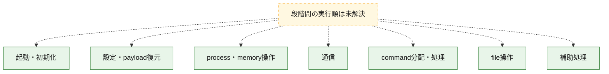
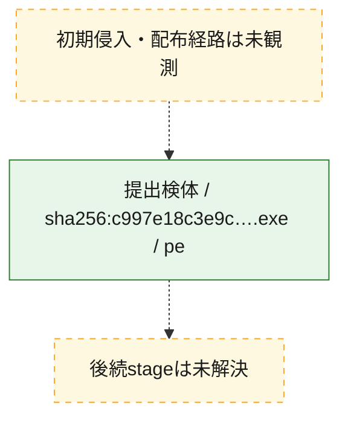
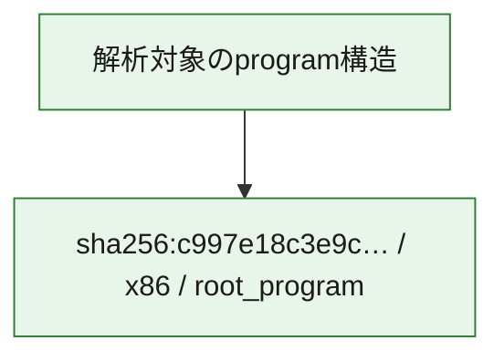

# 全体ロジック：c997e18c3e9c189ae52362454c7cc1c676a8102d54323df12120cb08f8860c6e

代表関数の静的証跡から、起動・初期化、設定・payload復元、process・memory操作、通信、command分配・処理、file操作の処理群を確認しました。

## 読み方

- phaseの掲載順は解析上の整理順です。observed_call_edgesがない段階間の実行順を断定しません。
- 図の実線は静的に観測した関係、点線と黄色のノードは未観測・未解決の関係を示します。
- 図は静的な要約であり、動的実行を再現するものではありません。
- 詳細な関数解説とfingerprintは[STATIC-LOGIC.md](STATIC-LOGIC.md)を参照してください。

## 静的可視化

### 実行フロー

### 感染チェーン

### モジュール関係

## 処理段階

### 1. 起動・初期化

entry pointから初期化と後続処理への移行を確認します。
確度: `confirmed_static_function_evidence`

- `c997e18c3e9c189ae52362454c7cc1c676a8102d54323df12120cb08f8860c6e:ghidra:1e5d8dd20` — 初期化と主要処理への分岐を行う入口関数です。 状態: `succeeded`、選定理由: `entry_point`, `meaningful_symbol_name`, `probable_go_main_user_code`, `reviewed_call_centrality:3`, `role:entrypoint`
- `c997e18c3e9c189ae52362454c7cc1c676a8102d54323df12120cb08f8860c6e:ghidra:1e5d8dd60` — 初期化と主要処理への分岐を行う入口関数です。 状態: `succeeded`、選定理由: `entry_point`, `meaningful_symbol_name`, `probable_go_main_user_code`, `reviewed_call_centrality:19`, `role:entrypoint`
- `c997e18c3e9c189ae52362454c7cc1c676a8102d54323df12120cb08f8860c6e:ghidra:1e5d99a60` — 初期化と主要処理への分岐を行う入口関数です。 状態: `succeeded`、選定理由: `entry_point`, `meaningful_symbol_name`, `probable_go_main_user_code`, `reviewed_call_centrality:20`, `role:entrypoint`
- `c997e18c3e9c189ae52362454c7cc1c676a8102d54323df12120cb08f8860c6e:ghidra:1e5da22c0` — 初期化と主要処理への分岐を行う入口関数です。 状態: `succeeded`、選定理由: `entry_point`, `meaningful_symbol_name`, `probable_go_main_user_code`, `reviewed_call_centrality:20`, `role:entrypoint`
- `c997e18c3e9c189ae52362454c7cc1c676a8102d54323df12120cb08f8860c6e:ghidra:1e5dae1c0` — 初期化と主要処理への分岐を行う入口関数です。 状態: `succeeded`、選定理由: `entry_point`, `meaningful_symbol_name`, `probable_go_main_user_code`, `reviewed_call_centrality:19`, `role:entrypoint`
- `c997e18c3e9c189ae52362454c7cc1c676a8102d54323df12120cb08f8860c6e:ghidra:1e5db3660` — 初期化と主要処理への分岐を行う入口関数です。 状態: `succeeded`、選定理由: `entry_point`, `meaningful_symbol_name`, `probable_go_main_user_code`, `reviewed_call_centrality:23`, `role:entrypoint`
- `c997e18c3e9c189ae52362454c7cc1c676a8102d54323df12120cb08f8860c6e:ghidra:1e5db60e0` — 初期化と主要処理への分岐を行う入口関数です。 状態: `succeeded`、選定理由: `entry_point`, `meaningful_symbol_name`, `probable_go_main_user_code`, `reviewed_call_centrality:23`, `role:entrypoint`
- `c997e18c3e9c189ae52362454c7cc1c676a8102d54323df12120cb08f8860c6e:ghidra:1e5dc54c0` — 初期化と主要処理への分岐を行う入口関数です。 状態: `succeeded`、選定理由: `entry_point`, `meaningful_symbol_name`, `probable_go_main_user_code`, `reviewed_call_centrality:20`, `role:entrypoint`
- `c997e18c3e9c189ae52362454c7cc1c676a8102d54323df12120cb08f8860c6e:ghidra:1e5dc7fc0` — 初期化と主要処理への分岐を行う入口関数です。 状態: `succeeded`、選定理由: `entry_point`, `meaningful_symbol_name`, `probable_go_main_user_code`, `reviewed_call_centrality:17`, `role:entrypoint`
- `c997e18c3e9c189ae52362454c7cc1c676a8102d54323df12120cb08f8860c6e:ghidra:1e5dc94a0` — 初期化と主要処理への分岐を行う入口関数です。 状態: `succeeded`、選定理由: `entry_point`, `meaningful_symbol_name`, `probable_go_main_user_code`, `reviewed_call_centrality:17`, `role:entrypoint`
- `c997e18c3e9c189ae52362454c7cc1c676a8102d54323df12120cb08f8860c6e:ghidra:1e5dca980` — 初期化と主要処理への分岐を行う入口関数です。 状態: `succeeded`、選定理由: `entry_point`, `meaningful_symbol_name`, `probable_go_main_user_code`, `reviewed_call_centrality:6`, `role:entrypoint`
- `c997e18c3e9c189ae52362454c7cc1c676a8102d54323df12120cb08f8860c6e:ghidra:1e5dcac60` — 初期化と主要処理への分岐を行う入口関数です。 状態: `succeeded`、選定理由: `entry_point`, `meaningful_symbol_name`, `probable_go_main_user_code`, `reviewed_call_centrality:4`, `role:entrypoint`
- `c997e18c3e9c189ae52362454c7cc1c676a8102d54323df12120cb08f8860c6e:ghidra:1e5dcae80` — 初期化と主要処理への分岐を行う入口関数です。 状態: `succeeded`、選定理由: `entry_point`, `meaningful_symbol_name`, `probable_go_main_user_code`, `reviewed_call_centrality:1`, `role:entrypoint`
- `c997e18c3e9c189ae52362454c7cc1c676a8102d54323df12120cb08f8860c6e:ghidra:1e5dcafa0` — 初期化と主要処理への分岐を行う入口関数です。 状態: `succeeded`、選定理由: `entry_point`, `meaningful_symbol_name`, `probable_go_main_user_code`, `reviewed_call_centrality:10`, `role:entrypoint`
- `c997e18c3e9c189ae52362454c7cc1c676a8102d54323df12120cb08f8860c6e:ghidra:1e5dcb320` — 初期化と主要処理への分岐を行う入口関数です。 状態: `succeeded`、選定理由: `entry_point`, `meaningful_symbol_name`, `probable_go_main_user_code`, `reviewed_call_centrality:5`, `role:entrypoint`
- `c997e18c3e9c189ae52362454c7cc1c676a8102d54323df12120cb08f8860c6e:ghidra:1e5dcb400` — 初期化と主要処理への分岐を行う入口関数です。 状態: `succeeded`、選定理由: `entry_point`, `meaningful_symbol_name`, `probable_go_main_user_code`, `reviewed_call_centrality:3`, `role:entrypoint`
- `c997e18c3e9c189ae52362454c7cc1c676a8102d54323df12120cb08f8860c6e:ghidra:1e5dcb480` — 初期化と主要処理への分岐を行う入口関数です。 状態: `succeeded`、選定理由: `entry_point`, `meaningful_symbol_name`, `probable_go_main_user_code`, `reviewed_call_centrality:7`, `role:entrypoint`
- `c997e18c3e9c189ae52362454c7cc1c676a8102d54323df12120cb08f8860c6e:ghidra:1e5dcb700` — 初期化と主要処理への分岐を行う入口関数です。 状態: `succeeded`、選定理由: `entry_point`, `meaningful_symbol_name`, `probable_go_main_user_code`, `reviewed_call_centrality:4`, `role:entrypoint`
- `c997e18c3e9c189ae52362454c7cc1c676a8102d54323df12120cb08f8860c6e:ghidra:1e5dcb7e0` — 初期化と主要処理への分岐を行う入口関数です。 状態: `succeeded`、選定理由: `entry_point`, `meaningful_symbol_name`, `probable_go_main_user_code`, `reviewed_call_centrality:53`, `role:entrypoint`
- `c997e18c3e9c189ae52362454c7cc1c676a8102d54323df12120cb08f8860c6e:ghidra:1e5dd8a20` — 初期化と主要処理への分岐を行う入口関数です。 状態: `succeeded`、選定理由: `entry_point`, `meaningful_symbol_name`, `probable_go_main_user_code`, `reviewed_call_centrality:3`, `role:entrypoint`

### 2. 設定・payload復元

設定、resource、payload、暗号化データの復元・変換を確認します。
確度: `confirmed_static_function_evidence`

- `c997e18c3e9c189ae52362454c7cc1c676a8102d54323df12120cb08f8860c6e:ghidra:1e5e76de0` — 設定、resource、payloadなどの解析・変換を行う関数です。 状態: `succeeded`、選定理由: `entry_point`, `meaningful_symbol_name`, `reviewed_call_centrality:3`, `role:config_or_data_transform`
- `c997e18c3e9c189ae52362454c7cc1c676a8102d54323df12120cb08f8860c6e:ghidra:1e5e76ee0` — 設定、resource、payloadなどの解析・変換を行う関数です。 状態: `succeeded`、選定理由: `entry_point`, `meaningful_symbol_name`, `reviewed_call_centrality:3`, `role:config_or_data_transform`
- `c997e18c3e9c189ae52362454c7cc1c676a8102d54323df12120cb08f8860c6e:ghidra:1e5e76f20` — 設定、resource、payloadなどの解析・変換を行う関数です。 状態: `succeeded`、選定理由: `entry_point`, `meaningful_symbol_name`, `reviewed_call_centrality:3`, `role:config_or_data_transform`
- `c997e18c3e9c189ae52362454c7cc1c676a8102d54323df12120cb08f8860c6e:ghidra:1e5e76f60` — 設定、resource、payloadなどの解析・変換を行う関数です。 状態: `succeeded`、選定理由: `entry_point`, `meaningful_symbol_name`, `reviewed_call_centrality:3`, `role:config_or_data_transform`
- `c997e18c3e9c189ae52362454c7cc1c676a8102d54323df12120cb08f8860c6e:ghidra:1e5e76fa0` — 設定、resource、payloadなどの解析・変換を行う関数です。 状態: `succeeded`、選定理由: `entry_point`, `meaningful_symbol_name`, `reviewed_call_centrality:3`, `role:config_or_data_transform`
- `c997e18c3e9c189ae52362454c7cc1c676a8102d54323df12120cb08f8860c6e:ghidra:1e5e76fe0` — 設定、resource、payloadなどの解析・変換を行う関数です。 状態: `succeeded`、選定理由: `entry_point`, `meaningful_symbol_name`, `reviewed_call_centrality:3`, `role:config_or_data_transform`

### 3. process・memory操作

process、thread、module、memory操作と実行移行を確認します。
確度: `confirmed_static_function_evidence`

- `c997e18c3e9c189ae52362454c7cc1c676a8102d54323df12120cb08f8860c6e:ghidra:1e5d4eb20` — process、thread、module、またはmemory操作に関係する関数です。 状態: `succeeded`、選定理由: `meaningful_symbol_name`, `reviewed_call_centrality:3`, `role:process_or_memory_operation`

### 4. 通信

通信初期化、endpoint処理、送受信の役割を確認します。
確度: `confirmed_static_function_evidence`

- `c997e18c3e9c189ae52362454c7cc1c676a8102d54323df12120cb08f8860c6e:ghidra:1e5d61e60` — 通信初期化、送受信、またはendpoint処理に関係する関数です。 状態: `succeeded`、選定理由: `meaningful_symbol_name`, `reviewed_call_centrality:6`, `role:network_communication`

### 5. command分配・処理

受信commandやtaskの解釈、分配、個別handlerへの移行を確認します。
確度: `confirmed_static_function_evidence`

- `c997e18c3e9c189ae52362454c7cc1c676a8102d54323df12120cb08f8860c6e:ghidra:1e5d610a0` — commandの解釈、分配、または個別処理を担当する関数です。 状態: `succeeded`、選定理由: `meaningful_symbol_name`, `reviewed_call_centrality:5`, `role:command_dispatch_or_handler`

### 6. file操作

fileやdirectoryの作成、読書き、削除を確認します。
確度: `confirmed_static_function_evidence`

- `c997e18c3e9c189ae52362454c7cc1c676a8102d54323df12120cb08f8860c6e:ghidra:1e5d61ac0` — fileまたはdirectoryの読書き・管理に関係する関数です。 状態: `succeeded`、選定理由: `meaningful_symbol_name`, `reviewed_call_centrality:6`, `role:file_operation`

### 7. 補助処理

主要処理を支える一般内部関数またはlibrary処理を確認します。
確度: `confirmed_static_function_evidence`

- `c997e18c3e9c189ae52362454c7cc1c676a8102d54323df12120cb08f8860c6e:ghidra:1e5ce1350` — 検体内部の一般処理を実装する関数です。 状態: `succeeded`、選定理由: `entry_point`, `meaningful_symbol_name`, `reviewed_call_centrality:5`
- `c997e18c3e9c189ae52362454c7cc1c676a8102d54323df12120cb08f8860c6e:ghidra:1e5e7c540` — compiler生成処理または汎用library処理とみられる関数です。 状態: `succeeded`、選定理由: `entry_point`, `meaningful_symbol_name`, `reviewed_call_centrality:1`

## 観測したcall関係

- `ghidra-function:04fdf19e18ff23da2d9f4ec3` → `ghidra-external:1199334fe04f6f99cf163d86` （`unclassified` → `unclassified`）
- `ghidra-function:04fdf19e18ff23da2d9f4ec3` → `ghidra-external:2aad08f2a64b96b1f7c1c9ff` （`unclassified` → `unclassified`）
- `ghidra-function:04fdf19e18ff23da2d9f4ec3` → `ghidra-external:709bd709e07e24df8b8fcfaf` （`unclassified` → `unclassified`）
- `ghidra-function:04fdf19e18ff23da2d9f4ec3` → `ghidra-external:d4e1f838134c1775da290eaa` （`unclassified` → `unclassified`）
- `ghidra-function:04fdf19e18ff23da2d9f4ec3` → `ghidra-external:e7a47d3d2f7e21e70165d2ab` （`unclassified` → `unclassified`）
- `ghidra-function:04fdf19e18ff23da2d9f4ec3` → `ghidra-external:edcae86be334a13371ff8fb5` （`unclassified` → `unclassified`）
- `ghidra-function:05a6f040d71bc379bff6767c` → `ghidra-external:cdfeb24dd537b4f03ba7c098` （`unclassified` → `unclassified`）
- `ghidra-function:05a6f040d71bc379bff6767c` → `ghidra-function:89425c91279ddde006afab03` （`unclassified` → `unclassified`）
- `ghidra-function:05a6f040d71bc379bff6767c` → `ghidra-function:a659de9591171e3fec91a3f9` （`unclassified` → `unclassified`）
- `ghidra-function:085e821b0c0bbefba5f6a087` → `ghidra-external:038f02f17bdd9adc52508ee1` （`unclassified` → `unclassified`）
- `ghidra-function:085e821b0c0bbefba5f6a087` → `ghidra-external:27bd98db68cdf0f8a4389d58` （`unclassified` → `unclassified`）
- `ghidra-function:085e821b0c0bbefba5f6a087` → `ghidra-external:3cb03deb627441c2560fd8b3` （`unclassified` → `unclassified`）
- `ghidra-function:085e821b0c0bbefba5f6a087` → `ghidra-external:595f43eff80a6eaef82faf22` （`unclassified` → `unclassified`）
- `ghidra-function:085e821b0c0bbefba5f6a087` → `ghidra-external:751cc2bd81eff719e44a34df` （`unclassified` → `unclassified`）
- `ghidra-function:085e821b0c0bbefba5f6a087` → `ghidra-external:e7a47d3d2f7e21e70165d2ab` （`unclassified` → `unclassified`）
- `ghidra-function:085e821b0c0bbefba5f6a087` → `ghidra-external:f8b0aa16ee9cb2cde5506114` （`unclassified` → `unclassified`）
- `ghidra-function:302b658cef1071066f4f1eb2` → `ghidra-external:01b34693a1344ee724da9683` （`unclassified` → `unclassified`）
- `ghidra-function:302b658cef1071066f4f1eb2` → `ghidra-external:10185d0f6d0fd9a89aae8085` （`unclassified` → `unclassified`）
- `ghidra-function:302b658cef1071066f4f1eb2` → `ghidra-external:22f988823ea608fbade3b5c1` （`unclassified` → `unclassified`）
- `ghidra-function:302b658cef1071066f4f1eb2` → `ghidra-external:2aee32a05cb16604a7be68ad` （`unclassified` → `unclassified`）
- `ghidra-function:302b658cef1071066f4f1eb2` → `ghidra-external:4b597139fe26a543f6b8e01b` （`unclassified` → `unclassified`）
- `ghidra-function:302b658cef1071066f4f1eb2` → `ghidra-external:5fda60c9bf3c12a57780ea2a` （`unclassified` → `unclassified`）
- `ghidra-function:302b658cef1071066f4f1eb2` → `ghidra-external:64b950100fafaa39b30f0ed2` （`unclassified` → `unclassified`）
- `ghidra-function:302b658cef1071066f4f1eb2` → `ghidra-external:71937628a1542166eb0250ee` （`unclassified` → `unclassified`）
- `ghidra-function:302b658cef1071066f4f1eb2` → `ghidra-external:7a20fb91fe099c60d1dcfe35` （`unclassified` → `unclassified`）
- `ghidra-function:302b658cef1071066f4f1eb2` → `ghidra-external:935cf874eda30ff9845188c1` （`unclassified` → `unclassified`）
- `ghidra-function:302b658cef1071066f4f1eb2` → `ghidra-external:b6927390a45f4b08e4dabcf4` （`unclassified` → `unclassified`）
- `ghidra-function:302b658cef1071066f4f1eb2` → `ghidra-external:bded770ab4f50259d7dcc0da` （`unclassified` → `unclassified`）
- `ghidra-function:302b658cef1071066f4f1eb2` → `ghidra-external:c48128ea97c436cf0a065014` （`unclassified` → `unclassified`）
- `ghidra-function:302b658cef1071066f4f1eb2` → `ghidra-external:ceb6529f96a15b63206ac336` （`unclassified` → `unclassified`）
- `ghidra-function:302b658cef1071066f4f1eb2` → `ghidra-external:d628ab790143e656b04a7bc6` （`unclassified` → `unclassified`）
- `ghidra-function:302b658cef1071066f4f1eb2` → `ghidra-external:dcea566c99712782dba69100` （`unclassified` → `unclassified`）
- `ghidra-function:302b658cef1071066f4f1eb2` → `ghidra-external:e1246823d352fd7ccb1998cf` （`unclassified` → `unclassified`）
- `ghidra-function:302b658cef1071066f4f1eb2` → `ghidra-external:e4ca61161e43712ee53288ac` （`unclassified` → `unclassified`）
- `ghidra-function:302b658cef1071066f4f1eb2` → `ghidra-external:e7a47d3d2f7e21e70165d2ab` （`unclassified` → `unclassified`）
- `ghidra-function:302b658cef1071066f4f1eb2` → `ghidra-external:e7fce0b561a237b53f710937` （`unclassified` → `unclassified`）
- `ghidra-function:302b658cef1071066f4f1eb2` → `ghidra-external:ec492ab9b1250d8df059119a` （`unclassified` → `unclassified`）
- `ghidra-function:302b658cef1071066f4f1eb2` → `ghidra-external:ee93121b0973bdd2c089a9c4` （`unclassified` → `unclassified`）
- `ghidra-function:302b658cef1071066f4f1eb2` → `ghidra-external:fc3c77c5144a3d5248ee3068` （`unclassified` → `unclassified`）
- `ghidra-function:3db83c3258b2169ceeeb6522` → `ghidra-external:22f988823ea608fbade3b5c1` （`unclassified` → `unclassified`）
- `ghidra-function:3db83c3258b2169ceeeb6522` → `ghidra-external:2aee32a05cb16604a7be68ad` （`unclassified` → `unclassified`）
- `ghidra-function:3db83c3258b2169ceeeb6522` → `ghidra-external:4b597139fe26a543f6b8e01b` （`unclassified` → `unclassified`）
- `ghidra-function:3db83c3258b2169ceeeb6522` → `ghidra-external:7a20fb91fe099c60d1dcfe35` （`unclassified` → `unclassified`）
- `ghidra-function:3db83c3258b2169ceeeb6522` → `ghidra-external:7e80af1feeaccbbb4d3db7d9` （`unclassified` → `unclassified`）
- `ghidra-function:3db83c3258b2169ceeeb6522` → `ghidra-external:8ccb2e72361bee574b6cb003` （`unclassified` → `unclassified`）
- `ghidra-function:3db83c3258b2169ceeeb6522` → `ghidra-external:935cf874eda30ff9845188c1` （`unclassified` → `unclassified`）
- `ghidra-function:3db83c3258b2169ceeeb6522` → `ghidra-external:9825d11a417c557dfbcd54f5` （`unclassified` → `unclassified`）
- `ghidra-function:3db83c3258b2169ceeeb6522` → `ghidra-external:b6927390a45f4b08e4dabcf4` （`unclassified` → `unclassified`）
- `ghidra-function:3db83c3258b2169ceeeb6522` → `ghidra-external:bded770ab4f50259d7dcc0da` （`unclassified` → `unclassified`）
- `ghidra-function:3db83c3258b2169ceeeb6522` → `ghidra-external:c48128ea97c436cf0a065014` （`unclassified` → `unclassified`）
- `ghidra-function:3db83c3258b2169ceeeb6522` → `ghidra-external:ceb6529f96a15b63206ac336` （`unclassified` → `unclassified`）
- `ghidra-function:3db83c3258b2169ceeeb6522` → `ghidra-external:d03f4f8540a2e24b6e6ecd63` （`unclassified` → `unclassified`）
- `ghidra-function:3db83c3258b2169ceeeb6522` → `ghidra-external:d628ab790143e656b04a7bc6` （`unclassified` → `unclassified`）
- `ghidra-function:3db83c3258b2169ceeeb6522` → `ghidra-external:dcea566c99712782dba69100` （`unclassified` → `unclassified`）
- `ghidra-function:3db83c3258b2169ceeeb6522` → `ghidra-external:e1246823d352fd7ccb1998cf` （`unclassified` → `unclassified`）
- `ghidra-function:3db83c3258b2169ceeeb6522` → `ghidra-external:e4ca61161e43712ee53288ac` （`unclassified` → `unclassified`）
- `ghidra-function:3db83c3258b2169ceeeb6522` → `ghidra-external:e7a47d3d2f7e21e70165d2ab` （`unclassified` → `unclassified`）
- `ghidra-function:3db83c3258b2169ceeeb6522` → `ghidra-external:e7fce0b561a237b53f710937` （`unclassified` → `unclassified`）
- `ghidra-function:3fe112eb16dd37f0ce3c846a` → `ghidra-external:cdfeb24dd537b4f03ba7c098` （`unclassified` → `unclassified`）
- `ghidra-function:3fe112eb16dd37f0ce3c846a` → `ghidra-function:89425c91279ddde006afab03` （`unclassified` → `unclassified`）
- `ghidra-function:3fe112eb16dd37f0ce3c846a` → `ghidra-function:a659de9591171e3fec91a3f9` （`unclassified` → `unclassified`）
- `ghidra-function:40a9f6b10273a05c73b65bb0` → `ghidra-function:f3bccd89795ff2a423553855` （`unclassified` → `unclassified`）
- `ghidra-function:40f24f27c9e768731657e282` → `ghidra-external:0331238d17a246605472b85c` （`unclassified` → `unclassified`）
- `ghidra-function:40f24f27c9e768731657e282` → `ghidra-external:10185d0f6d0fd9a89aae8085` （`unclassified` → `unclassified`）
- `ghidra-function:40f24f27c9e768731657e282` → `ghidra-external:2c480d03a1ddd290d3e226c9` （`unclassified` → `unclassified`）
- `ghidra-function:40f24f27c9e768731657e282` → `ghidra-external:e7a47d3d2f7e21e70165d2ab` （`unclassified` → `unclassified`）
- `ghidra-function:40f24f27c9e768731657e282` → `ghidra-external:ee93121b0973bdd2c089a9c4` （`unclassified` → `unclassified`）
- `ghidra-function:40f24f27c9e768731657e282` → `ghidra-external:fc3c77c5144a3d5248ee3068` （`unclassified` → `unclassified`）
- `ghidra-function:49db7fa89b1e6bf3a2b52b0e` → `ghidra-external:2aee32a05cb16604a7be68ad` （`unclassified` → `unclassified`）
- `ghidra-function:49db7fa89b1e6bf3a2b52b0e` → `ghidra-external:31893ecaf4c990d28eae73aa` （`unclassified` → `unclassified`）
- `ghidra-function:49db7fa89b1e6bf3a2b52b0e` → `ghidra-external:a77be38656f831732a1ee56c` （`unclassified` → `unclassified`）
- `ghidra-function:58a2979f0c7f5dad60014b50` → `ghidra-external:10185d0f6d0fd9a89aae8085` （`unclassified` → `unclassified`）
- `ghidra-function:58a2979f0c7f5dad60014b50` → `ghidra-external:98026b24ae80883946e590ec` （`unclassified` → `unclassified`）
- `ghidra-function:58a2979f0c7f5dad60014b50` → `ghidra-external:e0c051be8bd4e8c340911d57` （`unclassified` → `unclassified`）
- `ghidra-function:58a2979f0c7f5dad60014b50` → `ghidra-external:e7a47d3d2f7e21e70165d2ab` （`unclassified` → `unclassified`）
- `ghidra-function:58a2979f0c7f5dad60014b50` → `ghidra-external:ee93121b0973bdd2c089a9c4` （`unclassified` → `unclassified`）
- `ghidra-function:58a2979f0c7f5dad60014b50` → `ghidra-external:fc3c77c5144a3d5248ee3068` （`unclassified` → `unclassified`）
- `ghidra-function:59805d515fb4c5be19e200f7` → `ghidra-external:22f988823ea608fbade3b5c1` （`unclassified` → `unclassified`）
- `ghidra-function:59805d515fb4c5be19e200f7` → `ghidra-external:2aee32a05cb16604a7be68ad` （`unclassified` → `unclassified`）
- `ghidra-function:59805d515fb4c5be19e200f7` → `ghidra-external:4b597139fe26a543f6b8e01b` （`unclassified` → `unclassified`）
- `ghidra-function:59805d515fb4c5be19e200f7` → `ghidra-external:64b950100fafaa39b30f0ed2` （`unclassified` → `unclassified`）
- `ghidra-function:59805d515fb4c5be19e200f7` → `ghidra-external:7a20fb91fe099c60d1dcfe35` （`unclassified` → `unclassified`）
- `ghidra-function:59805d515fb4c5be19e200f7` → `ghidra-external:8852522936363af388dcc333` （`unclassified` → `unclassified`）
- `ghidra-function:59805d515fb4c5be19e200f7` → `ghidra-external:935cf874eda30ff9845188c1` （`unclassified` → `unclassified`）
- `ghidra-function:59805d515fb4c5be19e200f7` → `ghidra-external:b6927390a45f4b08e4dabcf4` （`unclassified` → `unclassified`）
- `ghidra-function:59805d515fb4c5be19e200f7` → `ghidra-external:bded770ab4f50259d7dcc0da` （`unclassified` → `unclassified`）
- `ghidra-function:59805d515fb4c5be19e200f7` → `ghidra-external:c48128ea97c436cf0a065014` （`unclassified` → `unclassified`）
- `ghidra-function:59805d515fb4c5be19e200f7` → `ghidra-external:ceb6529f96a15b63206ac336` （`unclassified` → `unclassified`）
- `ghidra-function:59805d515fb4c5be19e200f7` → `ghidra-external:d628ab790143e656b04a7bc6` （`unclassified` → `unclassified`）
- `ghidra-function:59805d515fb4c5be19e200f7` → `ghidra-external:dcea566c99712782dba69100` （`unclassified` → `unclassified`）
- `ghidra-function:59805d515fb4c5be19e200f7` → `ghidra-external:e1246823d352fd7ccb1998cf` （`unclassified` → `unclassified`）
- `ghidra-function:59805d515fb4c5be19e200f7` → `ghidra-external:e4ca61161e43712ee53288ac` （`unclassified` → `unclassified`）
- `ghidra-function:59805d515fb4c5be19e200f7` → `ghidra-external:e7a47d3d2f7e21e70165d2ab` （`unclassified` → `unclassified`）
- `ghidra-function:59805d515fb4c5be19e200f7` → `ghidra-external:e7fce0b561a237b53f710937` （`unclassified` → `unclassified`）
- `ghidra-function:5a85bc63d0b885055f7c8194` → `ghidra-external:22f988823ea608fbade3b5c1` （`unclassified` → `unclassified`）
- `ghidra-function:5a85bc63d0b885055f7c8194` → `ghidra-external:2aee32a05cb16604a7be68ad` （`unclassified` → `unclassified`）
- `ghidra-function:5a85bc63d0b885055f7c8194` → `ghidra-external:4b597139fe26a543f6b8e01b` （`unclassified` → `unclassified`）
- `ghidra-function:5a85bc63d0b885055f7c8194` → `ghidra-external:640f34829113286f931ad1b8` （`unclassified` → `unclassified`）
- `ghidra-function:5a85bc63d0b885055f7c8194` → `ghidra-external:71937628a1542166eb0250ee` （`unclassified` → `unclassified`）
- `ghidra-function:5a85bc63d0b885055f7c8194` → `ghidra-external:7a20fb91fe099c60d1dcfe35` （`unclassified` → `unclassified`）
- `ghidra-function:5a85bc63d0b885055f7c8194` → `ghidra-external:935cf874eda30ff9845188c1` （`unclassified` → `unclassified`）
- `ghidra-function:5a85bc63d0b885055f7c8194` → `ghidra-external:b6927390a45f4b08e4dabcf4` （`unclassified` → `unclassified`）
- `ghidra-function:5a85bc63d0b885055f7c8194` → `ghidra-external:ba3f77aaa982bbd95520478e` （`unclassified` → `unclassified`）
- `ghidra-function:5a85bc63d0b885055f7c8194` → `ghidra-external:bded770ab4f50259d7dcc0da` （`unclassified` → `unclassified`）
- `ghidra-function:5a85bc63d0b885055f7c8194` → `ghidra-external:c48128ea97c436cf0a065014` （`unclassified` → `unclassified`）
- `ghidra-function:5a85bc63d0b885055f7c8194` → `ghidra-external:ceb6529f96a15b63206ac336` （`unclassified` → `unclassified`）
- `ghidra-function:5a85bc63d0b885055f7c8194` → `ghidra-external:d628ab790143e656b04a7bc6` （`unclassified` → `unclassified`）
- `ghidra-function:5a85bc63d0b885055f7c8194` → `ghidra-external:dcea566c99712782dba69100` （`unclassified` → `unclassified`）
- `ghidra-function:5a85bc63d0b885055f7c8194` → `ghidra-external:e1246823d352fd7ccb1998cf` （`unclassified` → `unclassified`）
- `ghidra-function:5a85bc63d0b885055f7c8194` → `ghidra-external:e4ca61161e43712ee53288ac` （`unclassified` → `unclassified`）
- `ghidra-function:5a85bc63d0b885055f7c8194` → `ghidra-external:e7a47d3d2f7e21e70165d2ab` （`unclassified` → `unclassified`）
- `ghidra-function:5a85bc63d0b885055f7c8194` → `ghidra-external:e7fce0b561a237b53f710937` （`unclassified` → `unclassified`）
- `ghidra-function:5a85bc63d0b885055f7c8194` → `ghidra-external:edcae86be334a13371ff8fb5` （`unclassified` → `unclassified`）
- `ghidra-function:5ce33a952d9b4dc7a5633a28` → `ghidra-external:0b012ac385dd4397bb01af8a` （`unclassified` → `unclassified`）
- `ghidra-function:5ce33a952d9b4dc7a5633a28` → `ghidra-external:2aee32a05cb16604a7be68ad` （`unclassified` → `unclassified`）
- `ghidra-function:5ce33a952d9b4dc7a5633a28` → `ghidra-external:31893ecaf4c990d28eae73aa` （`unclassified` → `unclassified`）
- `ghidra-function:61ec107ea09ca86fa1673f9c` → `ghidra-external:07058dd462d1e7231b529aa7` （`unclassified` → `unclassified`）
- `ghidra-function:61ec107ea09ca86fa1673f9c` → `ghidra-external:095a77f3fb9eea9400c81273` （`unclassified` → `unclassified`）
- `ghidra-function:61ec107ea09ca86fa1673f9c` → `ghidra-external:e7a47d3d2f7e21e70165d2ab` （`unclassified` → `unclassified`）
- `ghidra-function:63df485b6f5ff0305d92c928` → `ghidra-external:22f988823ea608fbade3b5c1` （`unclassified` → `unclassified`）
- `ghidra-function:63df485b6f5ff0305d92c928` → `ghidra-external:2aee32a05cb16604a7be68ad` （`unclassified` → `unclassified`）
- `ghidra-function:63df485b6f5ff0305d92c928` → `ghidra-external:2d8a5ba4e1afe423eb68c118` （`unclassified` → `unclassified`）
- `ghidra-function:63df485b6f5ff0305d92c928` → `ghidra-external:3cb03deb627441c2560fd8b3` （`unclassified` → `unclassified`）
- `ghidra-function:63df485b6f5ff0305d92c928` → `ghidra-external:4b597139fe26a543f6b8e01b` （`unclassified` → `unclassified`）
- `ghidra-function:63df485b6f5ff0305d92c928` → `ghidra-external:5b45bfa44eafa7a384940490` （`unclassified` → `unclassified`）
- `ghidra-function:63df485b6f5ff0305d92c928` → `ghidra-external:7a20fb91fe099c60d1dcfe35` （`unclassified` → `unclassified`）
- `ghidra-function:63df485b6f5ff0305d92c928` → `ghidra-external:935cf874eda30ff9845188c1` （`unclassified` → `unclassified`）
- `ghidra-function:63df485b6f5ff0305d92c928` → `ghidra-external:b6927390a45f4b08e4dabcf4` （`unclassified` → `unclassified`）
- `ghidra-function:63df485b6f5ff0305d92c928` → `ghidra-external:bded770ab4f50259d7dcc0da` （`unclassified` → `unclassified`）
- `ghidra-function:63df485b6f5ff0305d92c928` → `ghidra-external:c48128ea97c436cf0a065014` （`unclassified` → `unclassified`）
- `ghidra-function:63df485b6f5ff0305d92c928` → `ghidra-external:ceb6529f96a15b63206ac336` （`unclassified` → `unclassified`）
- `ghidra-function:63df485b6f5ff0305d92c928` → `ghidra-external:d0fbc6a758f84311f9cf1aba` （`unclassified` → `unclassified`）
- `ghidra-function:63df485b6f5ff0305d92c928` → `ghidra-external:d628ab790143e656b04a7bc6` （`unclassified` → `unclassified`）
- `ghidra-function:63df485b6f5ff0305d92c928` → `ghidra-external:dcea566c99712782dba69100` （`unclassified` → `unclassified`）
- `ghidra-function:63df485b6f5ff0305d92c928` → `ghidra-external:e1246823d352fd7ccb1998cf` （`unclassified` → `unclassified`）
- `ghidra-function:63df485b6f5ff0305d92c928` → `ghidra-external:e4ca61161e43712ee53288ac` （`unclassified` → `unclassified`）
- `ghidra-function:63df485b6f5ff0305d92c928` → `ghidra-external:e7a47d3d2f7e21e70165d2ab` （`unclassified` → `unclassified`）
- `ghidra-function:63df485b6f5ff0305d92c928` → `ghidra-external:e7fce0b561a237b53f710937` （`unclassified` → `unclassified`）
- `ghidra-function:63df485b6f5ff0305d92c928` → `ghidra-external:ec492ab9b1250d8df059119a` （`unclassified` → `unclassified`）
- `ghidra-function:640df4af2ad3fa1c5e9443a1` → `ghidra-external:cdfeb24dd537b4f03ba7c098` （`unclassified` → `unclassified`）
- `ghidra-function:640df4af2ad3fa1c5e9443a1` → `ghidra-function:89425c91279ddde006afab03` （`unclassified` → `unclassified`）
- `ghidra-function:640df4af2ad3fa1c5e9443a1` → `ghidra-function:a659de9591171e3fec91a3f9` （`unclassified` → `unclassified`）
- `ghidra-function:6acba55994e523059f60faa1` → `ghidra-external:01b34693a1344ee724da9683` （`unclassified` → `unclassified`）
- `ghidra-function:6acba55994e523059f60faa1` → `ghidra-external:22f988823ea608fbade3b5c1` （`unclassified` → `unclassified`）
- `ghidra-function:6acba55994e523059f60faa1` → `ghidra-external:2aee32a05cb16604a7be68ad` （`unclassified` → `unclassified`）
- `ghidra-function:6acba55994e523059f60faa1` → `ghidra-external:4b597139fe26a543f6b8e01b` （`unclassified` → `unclassified`）
- `ghidra-function:6acba55994e523059f60faa1` → `ghidra-external:58cde741f45f75355500ac30` （`unclassified` → `unclassified`）
- `ghidra-function:6acba55994e523059f60faa1` → `ghidra-external:73652fae6c52385f45b261be` （`unclassified` → `unclassified`）
- `ghidra-function:6acba55994e523059f60faa1` → `ghidra-external:7a20fb91fe099c60d1dcfe35` （`unclassified` → `unclassified`）
- `ghidra-function:6acba55994e523059f60faa1` → `ghidra-external:7e80af1feeaccbbb4d3db7d9` （`unclassified` → `unclassified`）
- `ghidra-function:6acba55994e523059f60faa1` → `ghidra-external:935cf874eda30ff9845188c1` （`unclassified` → `unclassified`）
- `ghidra-function:6acba55994e523059f60faa1` → `ghidra-external:a0e22a3035407fba0cd0d95d` （`unclassified` → `unclassified`）
- `ghidra-function:6acba55994e523059f60faa1` → `ghidra-external:b6927390a45f4b08e4dabcf4` （`unclassified` → `unclassified`）
- `ghidra-function:6acba55994e523059f60faa1` → `ghidra-external:bded770ab4f50259d7dcc0da` （`unclassified` → `unclassified`）
- `ghidra-function:6acba55994e523059f60faa1` → `ghidra-external:c48128ea97c436cf0a065014` （`unclassified` → `unclassified`）
- `ghidra-function:6acba55994e523059f60faa1` → `ghidra-external:ceb6529f96a15b63206ac336` （`unclassified` → `unclassified`）
- `ghidra-function:6acba55994e523059f60faa1` → `ghidra-external:d628ab790143e656b04a7bc6` （`unclassified` → `unclassified`）
- `ghidra-function:6acba55994e523059f60faa1` → `ghidra-external:dcea566c99712782dba69100` （`unclassified` → `unclassified`）
- `ghidra-function:6acba55994e523059f60faa1` → `ghidra-external:e1246823d352fd7ccb1998cf` （`unclassified` → `unclassified`）
- `ghidra-function:6acba55994e523059f60faa1` → `ghidra-external:e4ca61161e43712ee53288ac` （`unclassified` → `unclassified`）
- `ghidra-function:6acba55994e523059f60faa1` → `ghidra-external:e7a47d3d2f7e21e70165d2ab` （`unclassified` → `unclassified`）
- `ghidra-function:6acba55994e523059f60faa1` → `ghidra-external:e7fce0b561a237b53f710937` （`unclassified` → `unclassified`）
- `ghidra-function:6ec0c08174b81582f85d671a` → `ghidra-external:cdfeb24dd537b4f03ba7c098` （`unclassified` → `unclassified`）
- `ghidra-function:6ec0c08174b81582f85d671a` → `ghidra-function:89425c91279ddde006afab03` （`unclassified` → `unclassified`）
- `ghidra-function:6ec0c08174b81582f85d671a` → `ghidra-function:a659de9591171e3fec91a3f9` （`unclassified` → `unclassified`）
- `ghidra-function:6ee218dbaa0233a858f94fc6` → `ghidra-external:8c89dc0e735f0f6e054d83c5` （`unclassified` → `unclassified`）
- `ghidra-function:6ee218dbaa0233a858f94fc6` → `ghidra-external:e7a47d3d2f7e21e70165d2ab` （`unclassified` → `unclassified`）
- `ghidra-function:6ee218dbaa0233a858f94fc6` → `ghidra-external:fa87acf6c0dc24149197b42e` （`unclassified` → `unclassified`）
- `ghidra-function:77b561356fe2317d83c03485` → `ghidra-external:c6c969769cf37ddb64e8d844` （`unclassified` → `unclassified`）
- `ghidra-function:785d83a88d7f593e7427873e` → `ghidra-external:cdfeb24dd537b4f03ba7c098` （`unclassified` → `unclassified`）
- `ghidra-function:785d83a88d7f593e7427873e` → `ghidra-function:89425c91279ddde006afab03` （`unclassified` → `unclassified`）
- `ghidra-function:785d83a88d7f593e7427873e` → `ghidra-function:a659de9591171e3fec91a3f9` （`unclassified` → `unclassified`）
- `ghidra-function:823095d6f6c9fc190eff5752` → `ghidra-external:1fe58d8d7ac916f7167f1537` （`unclassified` → `unclassified`）
- `ghidra-function:823095d6f6c9fc190eff5752` → `ghidra-external:355397947aa50dfb909a4a26` （`unclassified` → `unclassified`）
- `ghidra-function:823095d6f6c9fc190eff5752` → `ghidra-external:3cb03deb627441c2560fd8b3` （`unclassified` → `unclassified`）
- `ghidra-function:823095d6f6c9fc190eff5752` → `ghidra-external:5b45bfa44eafa7a384940490` （`unclassified` → `unclassified`）
- `ghidra-function:823095d6f6c9fc190eff5752` → `ghidra-external:60e0f779f3e96d5c305c57d0` （`unclassified` → `unclassified`）
- `ghidra-function:823095d6f6c9fc190eff5752` → `ghidra-external:a8ca3794ec1c5f723913a99e` （`unclassified` → `unclassified`）
- `ghidra-function:823095d6f6c9fc190eff5752` → `ghidra-external:c87033710fde36516ce2aebe` （`unclassified` → `unclassified`）
- `ghidra-function:823095d6f6c9fc190eff5752` → `ghidra-external:e7a47d3d2f7e21e70165d2ab` （`unclassified` → `unclassified`）
- `ghidra-function:823095d6f6c9fc190eff5752` → `ghidra-external:eea552aa6f491d86bd47cfdd` （`unclassified` → `unclassified`）
- `ghidra-function:823095d6f6c9fc190eff5752` → `ghidra-external:ff4a16cd9347e66c3ec9640c` （`unclassified` → `unclassified`）
- `ghidra-function:a1b602a84bc89a3f63f53b85` → `ghidra-function:00d52967057ed9e1889f2ba9` （`unclassified` → `unclassified`）
- `ghidra-function:a1b602a84bc89a3f63f53b85` → `ghidra-function:220230a7d22bcc3224e3bb00` （`unclassified` → `unclassified`）
- `ghidra-function:a1b602a84bc89a3f63f53b85` → `ghidra-function:730386afe3552d5d9ffffbc3` （`unclassified` → `unclassified`）
- `ghidra-function:a1b602a84bc89a3f63f53b85` → `ghidra-function:d34ee8ea50dd7a5907e836af` （`unclassified` → `unclassified`）
- `ghidra-function:a1b602a84bc89a3f63f53b85` → `ghidra-function:d985f05921b5e860fe16ea09` （`unclassified` → `unclassified`）
- `ghidra-function:af9b5318b300d17b7e089e2e` → `ghidra-external:0331238d17a246605472b85c` （`unclassified` → `unclassified`）
- `ghidra-function:af9b5318b300d17b7e089e2e` → `ghidra-external:10185d0f6d0fd9a89aae8085` （`unclassified` → `unclassified`）
- `ghidra-function:af9b5318b300d17b7e089e2e` → `ghidra-external:420a82ea7aea98a38446c6be` （`unclassified` → `unclassified`）
- `ghidra-function:af9b5318b300d17b7e089e2e` → `ghidra-external:e7a47d3d2f7e21e70165d2ab` （`unclassified` → `unclassified`）
- `ghidra-function:af9b5318b300d17b7e089e2e` → `ghidra-external:ee93121b0973bdd2c089a9c4` （`unclassified` → `unclassified`）
- `ghidra-function:b0230c7f24472c233117e732` → `ghidra-external:10c0bdc0033c16ccd7b291eb` （`unclassified` → `unclassified`）
- `ghidra-function:b0230c7f24472c233117e732` → `ghidra-external:50851041bdf6cafa99ad036b` （`unclassified` → `unclassified`）
- `ghidra-function:b0230c7f24472c233117e732` → `ghidra-external:e7a47d3d2f7e21e70165d2ab` （`unclassified` → `unclassified`）
- `ghidra-function:b0230c7f24472c233117e732` → `ghidra-external:f7e358f05147b1db16b1bbbb` （`unclassified` → `unclassified`）
- `ghidra-function:c0731f7bf32713283ed75748` → `ghidra-external:22f988823ea608fbade3b5c1` （`unclassified` → `unclassified`）
- `ghidra-function:c0731f7bf32713283ed75748` → `ghidra-external:2aee32a05cb16604a7be68ad` （`unclassified` → `unclassified`）
- `ghidra-function:c0731f7bf32713283ed75748` → `ghidra-external:4b597139fe26a543f6b8e01b` （`unclassified` → `unclassified`）
- `ghidra-function:c0731f7bf32713283ed75748` → `ghidra-external:64b950100fafaa39b30f0ed2` （`unclassified` → `unclassified`）
- 残り121件は`static-logic.json`に記録しています。

## 解析範囲と制約

- 選定外関数は全体inventoryへ残しますが、関数本体の個別解説対象にはしていません。
- indirect call、難読化、packer、VM、壊れたcontrol flowによりcall関係が欠落する場合があります。
- 文書は静的解析に基づき、検体実行や外部通信による動的確認は行っていません。
