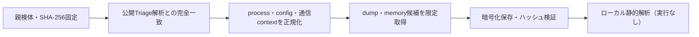

# Triage公開解析・後段取得証跡

## 完全ハッシュ一致

- [260924-pa23matzg1](https://tria.ge/260924-pa23matzg1): ファミリー候補 `vidar`、評価score `10`
- [260924-k86q9axx2l](https://tria.ge/260924-k86q9axx2l): ファミリー候補 `vidar`、評価score `10`
- [260919-ch7lvswsbs](https://tria.ge/260919-ch7lvswsbs): ファミリー候補 `未確定`、評価score `9`

## プロセス・通信

- 観測process: `2026-09-19_72dec8437cc14e1358f6d96d063e41f5_frostygoop_hive_luca-stealer_salatstealer_sliver.exe, c9a4c3acae0e45754ff60bc9014cd39cab19a0824910226f51390b128ef54a38.bin.exe, c9a4c3acae0e45754ff60bc9014cd39cab19a0824910226f51390b128ef54a38.exe, svchost.exe`
- raw commandは保存せず、command SHA-256と処理patternだけをJSONへ保持します。
- sandbox background trafficは`context_only`であり、C2へ自動昇格しません。

- `https://2.29.59.97/`（sandbox config候補）
- `https://steamcommunity.com/profiles/76561198641923678`（sandbox config候補）
- `https://t.me/<redacted>`（sandbox config候補）

## 後段取得物

- `237f5af24b773166dcb7dc6c7abef27cfa196710af78b19a1677b37a62490d7a` / `memory_image` / 2719744 bytes / 親と同一: `false` / 静的解析: `未実施`

## 判定境界

Triage由来のfamily、process、config、通信は外部sandbox証跡です。Config extractorが返したendpointはC2候補として扱いますが、静的設定復元またはprocess帰属とprotocol応答が揃うまでは確認済みC2とはしません。取得成果物と検体は実行していません。
