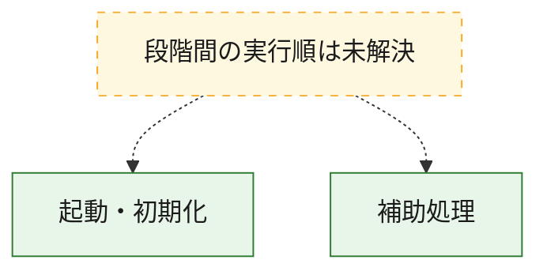
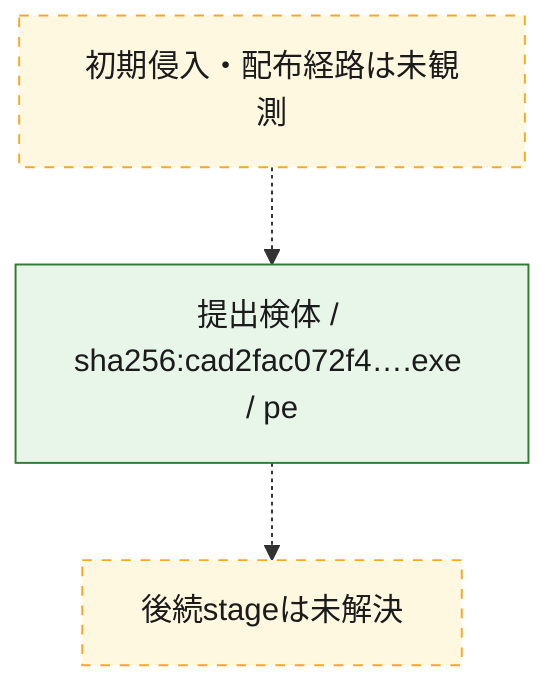
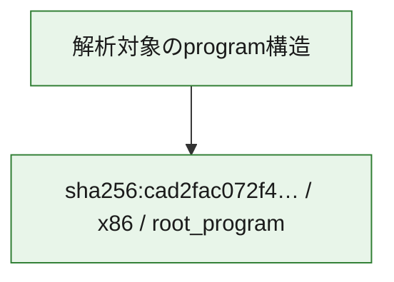

# 全体ロジック：cad2fac072f40774247e90a9c3acc96fc85a57abf833e6d214975884060ff864

代表関数の静的証跡から、起動・初期化の処理群を確認しました。

## 読み方

- phaseの掲載順は解析上の整理順です。observed_call_edgesがない段階間の実行順を断定しません。
- 図の実線は静的に観測した関係、点線と黄色のノードは未観測・未解決の関係を示します。
- 図は静的な要約であり、動的実行を再現するものではありません。
- 詳細な関数解説とfingerprintは[STATIC-LOGIC.md](STATIC-LOGIC.md)を参照してください。

## 静的可視化

### 実行フロー

### 感染チェーン

### モジュール関係

## 処理段階

### 1. 起動・初期化

entry pointから初期化と後続処理への移行を確認します。
確度: `confirmed_static_function_evidence`

- `cad2fac072f40774247e90a9c3acc96fc85a57abf833e6d214975884060ff864:ghidra:1e0032e40` — 初期化と主要処理への分岐を行う入口関数です。 状態: `succeeded`、選定理由: `entry_point`, `meaningful_symbol_name`, `reviewed_call_centrality:4`, `role:entrypoint`

### 2. 補助処理

主要処理を支える一般内部関数またはlibrary処理を確認します。
確度: `confirmed_static_function_evidence_with_limits`

- `cad2fac072f40774247e90a9c3acc96fc85a57abf833e6d214975884060ff864:ghidra:1e0001048` — 検体内部の一般処理を実装する関数です。 状態: `succeeded`、選定理由: `context_representative`, `reviewed_call_centrality:2`
- `cad2fac072f40774247e90a9c3acc96fc85a57abf833e6d214975884060ff864:ghidra:1e0001130` — 検体内部の一般処理を実装する関数です。 状態: `succeeded`、選定理由: `context_representative`, `reviewed_call_centrality:11`
- `cad2fac072f40774247e90a9c3acc96fc85a57abf833e6d214975884060ff864:ghidra:1e0001630` — 検体内部の一般処理を実装する関数です。 状態: `succeeded`、選定理由: `context_representative`, `reviewed_call_centrality:17`
- `cad2fac072f40774247e90a9c3acc96fc85a57abf833e6d214975884060ff864:ghidra:1e0002010` — 検体内部の一般処理を実装する関数です。 状態: `succeeded`、選定理由: `context_representative`, `reviewed_call_centrality:2`
- `cad2fac072f40774247e90a9c3acc96fc85a57abf833e6d214975884060ff864:ghidra:1e0002130` — 検体内部の一般処理を実装する関数です。 状態: `succeeded`、選定理由: `context_representative`, `reviewed_call_centrality:16`
- `cad2fac072f40774247e90a9c3acc96fc85a57abf833e6d214975884060ff864:ghidra:1e0002bc0` — 検体内部の一般処理を実装する関数です。 状態: `succeeded`、選定理由: `context_representative`, `reviewed_call_centrality:9`
- `cad2fac072f40774247e90a9c3acc96fc85a57abf833e6d214975884060ff864:ghidra:1e0002d4c` — 検体内部の一般処理を実装する関数です。 状態: `succeeded`、選定理由: `context_representative`, `reviewed_call_centrality:3`
- `cad2fac072f40774247e90a9c3acc96fc85a57abf833e6d214975884060ff864:ghidra:1e0002dd8` — 検体内部の一般処理を実装する関数です。 状態: `succeeded`、選定理由: `context_representative`, `reviewed_call_centrality:21`
- `cad2fac072f40774247e90a9c3acc96fc85a57abf833e6d214975884060ff864:ghidra:1e0003464` — 検体内部の一般処理を実装する関数です。 状態: `succeeded`、選定理由: `context_representative`, `reviewed_call_centrality:10`
- `cad2fac072f40774247e90a9c3acc96fc85a57abf833e6d214975884060ff864:ghidra:1e00039e0` — 検体内部の一般処理を実装する関数です。 状態: `succeeded`、選定理由: `context_representative`, `reviewed_call_centrality:4`
- `cad2fac072f40774247e90a9c3acc96fc85a57abf833e6d214975884060ff864:ghidra:1e0003ca4` — 検体内部の一般処理を実装する関数です。 状態: `succeeded`、選定理由: `context_representative`, `reviewed_call_centrality:1`
- `cad2fac072f40774247e90a9c3acc96fc85a57abf833e6d214975884060ff864:ghidra:1e0003da8` — 検体内部の一般処理を実装する関数です。 状態: `succeeded`、選定理由: `context_representative`
- `cad2fac072f40774247e90a9c3acc96fc85a57abf833e6d214975884060ff864:ghidra:1e0003de0` — 検体内部の一般処理を実装する関数です。 状態: `succeeded`、選定理由: `context_representative`, `reviewed_call_centrality:4`
- `cad2fac072f40774247e90a9c3acc96fc85a57abf833e6d214975884060ff864:ghidra:1e0003ef0` — 検体内部の一般処理を実装する関数です。 状態: `succeeded`、選定理由: `context_representative`, `reviewed_call_centrality:7`
- `cad2fac072f40774247e90a9c3acc96fc85a57abf833e6d214975884060ff864:ghidra:1e00045c0` — 検体内部の一般処理を実装する関数です。 状態: `succeeded`、選定理由: `context_representative`
- `cad2fac072f40774247e90a9c3acc96fc85a57abf833e6d214975884060ff864:ghidra:1e0004650` — 検体内部の一般処理を実装する関数です。 状態: `succeeded`、選定理由: `context_representative`, `reviewed_call_centrality:14`
- `cad2fac072f40774247e90a9c3acc96fc85a57abf833e6d214975884060ff864:ghidra:1e0004e90` — 検体内部の一般処理を実装する関数です。 状態: `succeeded`、選定理由: `context_representative`, `reviewed_call_centrality:12`
- `cad2fac072f40774247e90a9c3acc96fc85a57abf833e6d214975884060ff864:ghidra:1e00051a0` — 検体内部の一般処理を実装する関数です。 状態: `succeeded`、選定理由: `context_representative`, `reviewed_call_centrality:12`
- `cad2fac072f40774247e90a9c3acc96fc85a57abf833e6d214975884060ff864:ghidra:1e0005438` — 検体内部の一般処理を実装する関数です。 状態: `succeeded`、選定理由: `context_representative`, `reviewed_call_centrality:5`
- `cad2fac072f40774247e90a9c3acc96fc85a57abf833e6d214975884060ff864:ghidra:1e00055c0` — 検体内部の一般処理を実装する関数です。 状態: `limited_bad_instruction_or_flow`、選定理由: `context_representative`, `reviewed_call_centrality:2`
- `cad2fac072f40774247e90a9c3acc96fc85a57abf833e6d214975884060ff864:ghidra:1e0005614` — 検体内部の一般処理を実装する関数です。 状態: `succeeded`、選定理由: `context_representative`, `reviewed_call_centrality:3`
- `cad2fac072f40774247e90a9c3acc96fc85a57abf833e6d214975884060ff864:ghidra:1e0005650` — 検体内部の一般処理を実装する関数です。 状態: `succeeded`、選定理由: `context_representative`, `reviewed_call_centrality:2`
- `cad2fac072f40774247e90a9c3acc96fc85a57abf833e6d214975884060ff864:ghidra:1e00056e0` — 検体内部の一般処理を実装する関数です。 状態: `succeeded`、選定理由: `context_representative`, `reviewed_call_centrality:2`
- `cad2fac072f40774247e90a9c3acc96fc85a57abf833e6d214975884060ff864:ghidra:1e000596c` — 検体内部の一般処理を実装する関数です。 状態: `succeeded`、選定理由: `context_representative`, `reviewed_call_centrality:4`
- `cad2fac072f40774247e90a9c3acc96fc85a57abf833e6d214975884060ff864:ghidra:1e0005ca0` — 検体内部の一般処理を実装する関数です。 状態: `succeeded`、選定理由: `context_representative`, `reviewed_call_centrality:1`
- `cad2fac072f40774247e90a9c3acc96fc85a57abf833e6d214975884060ff864:ghidra:1e0005e2c` — 検体内部の一般処理を実装する関数です。 状態: `succeeded`、選定理由: `context_representative`, `reviewed_call_centrality:3`
- `cad2fac072f40774247e90a9c3acc96fc85a57abf833e6d214975884060ff864:ghidra:1e0005f20` — 検体内部の一般処理を実装する関数です。 状態: `succeeded`、選定理由: `context_representative`, `reviewed_call_centrality:6`
- `cad2fac072f40774247e90a9c3acc96fc85a57abf833e6d214975884060ff864:ghidra:1e00063e0` — 検体内部の一般処理を実装する関数です。 状態: `succeeded`、選定理由: `context_representative`, `reviewed_call_centrality:25`
- `cad2fac072f40774247e90a9c3acc96fc85a57abf833e6d214975884060ff864:ghidra:1e00068a0` — 検体内部の一般処理を実装する関数です。 状態: `succeeded`、選定理由: `context_representative`
- `cad2fac072f40774247e90a9c3acc96fc85a57abf833e6d214975884060ff864:ghidra:1e000694c` — 検体内部の一般処理を実装する関数です。 状態: `limited_bad_instruction_or_flow`、選定理由: `context_representative`, `reviewed_call_centrality:4`
- `cad2fac072f40774247e90a9c3acc96fc85a57abf833e6d214975884060ff864:ghidra:1e0006a50` — 検体内部の一般処理を実装する関数です。 状態: `succeeded`、選定理由: `context_representative`, `reviewed_call_centrality:10`

## 観測したcall関係

- 代表関数間で直接解決できた呼出関係はありません。

## 解析範囲と制約

- 選定外関数は全体inventoryへ残しますが、関数本体の個別解説対象にはしていません。
- indirect call、難読化、packer、VM、壊れたcontrol flowによりcall関係が欠落する場合があります。
- 文書は静的解析に基づき、検体実行や外部通信による動的確認は行っていません。
