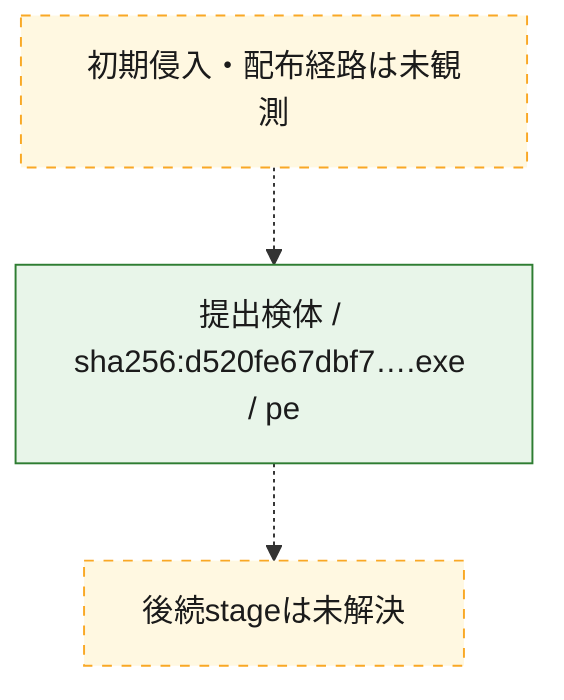
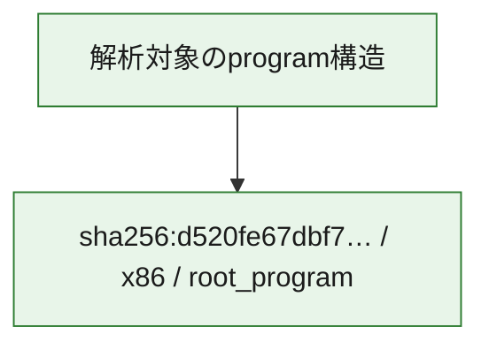

# 全体ロジック：d520fe67dbf76530fe2cd90cb205607ff38cc3621dc849e44080663cdc9f6f87

代表関数の静的証跡から、起動・初期化の処理群を確認しました。

## 読み方

- phaseの掲載順は解析上の整理順です。observed_call_edgesがない段階間の実行順を断定しません。
- 図の実線は静的に観測した関係、点線と黄色のノードは未観測・未解決の関係を示します。
- 図は静的な要約であり、動的実行を再現するものではありません。
- 詳細な関数解説とfingerprintは[STATIC-LOGIC.md](STATIC-LOGIC.md)を参照してください。

## 静的可視化

### 実行フロー

```mermaid
flowchart TD
  exec_01["起動・初期化"]
  exec_02["補助処理"]
  exec_unknown["段階間の実行順は未解決"]
  exec_unknown -.-> exec_01
  exec_unknown -.-> exec_02
  class exec_unknown unresolved
  class exec_01,exec_02 confirmed
  classDef confirmed fill:#e8f5e9,stroke:#2e7d32,color:#1b1b1b
  classDef unresolved fill:#fff8e1,stroke:#f9a825,color:#1b1b1b,stroke-dasharray:5 5
```

### 感染チェーン

### モジュール関係

## 処理段階

### 1. 起動・初期化

entry pointから初期化と後続処理への移行を確認します。
確度: `confirmed_static_function_evidence`

- `d520fe67dbf76530fe2cd90cb205607ff38cc3621dc849e44080663cdc9f6f87:ghidra:1101446f0` — 初期化と主要処理への分岐を行う入口関数です。 状態: `succeeded`、選定理由: `entry_point`, `meaningful_symbol_name`, `reviewed_call_centrality:10`, `role:entrypoint`

### 2. 補助処理

主要処理を支える一般内部関数またはlibrary処理を確認します。
確度: `confirmed_static_function_evidence`

- `d520fe67dbf76530fe2cd90cb205607ff38cc3621dc849e44080663cdc9f6f87:ghidra:110001050` — 検体内部の一般処理を実装する関数です。 状態: `succeeded`、選定理由: `context_representative`, `reviewed_call_centrality:12`
- `d520fe67dbf76530fe2cd90cb205607ff38cc3621dc849e44080663cdc9f6f87:ghidra:1100014b8` — 検体内部の一般処理を実装する関数です。 状態: `succeeded`、選定理由: `context_representative`, `reviewed_call_centrality:1`
- `d520fe67dbf76530fe2cd90cb205607ff38cc3621dc849e44080663cdc9f6f87:ghidra:110001550` — 検体内部の一般処理を実装する関数です。 状態: `succeeded`、選定理由: `context_representative`, `reviewed_call_centrality:16`
- `d520fe67dbf76530fe2cd90cb205607ff38cc3621dc849e44080663cdc9f6f87:ghidra:110001ba0` — 検体内部の一般処理を実装する関数です。 状態: `succeeded`、選定理由: `context_representative`, `reviewed_call_centrality:31`
- `d520fe67dbf76530fe2cd90cb205607ff38cc3621dc849e44080663cdc9f6f87:ghidra:110002424` — 検体内部の一般処理を実装する関数です。 状態: `succeeded`、選定理由: `context_representative`, `reviewed_call_centrality:3`
- `d520fe67dbf76530fe2cd90cb205607ff38cc3621dc849e44080663cdc9f6f87:ghidra:1100024a8` — 検体内部の一般処理を実装する関数です。 状態: `succeeded`、選定理由: `context_representative`, `reviewed_call_centrality:4`
- `d520fe67dbf76530fe2cd90cb205607ff38cc3621dc849e44080663cdc9f6f87:ghidra:1100028c0` — 検体内部の一般処理を実装する関数です。 状態: `succeeded`、選定理由: `context_representative`, `reviewed_call_centrality:25`
- `d520fe67dbf76530fe2cd90cb205607ff38cc3621dc849e44080663cdc9f6f87:ghidra:110002d2c` — 検体内部の一般処理を実装する関数です。 状態: `succeeded`、選定理由: `context_representative`, `reviewed_call_centrality:11`
- `d520fe67dbf76530fe2cd90cb205607ff38cc3621dc849e44080663cdc9f6f87:ghidra:110003080` — 検体内部の一般処理を実装する関数です。 状態: `succeeded`、選定理由: `context_representative`, `reviewed_call_centrality:1`
- `d520fe67dbf76530fe2cd90cb205607ff38cc3621dc849e44080663cdc9f6f87:ghidra:110003220` — 検体内部の一般処理を実装する関数です。 状態: `succeeded`、選定理由: `context_representative`, `reviewed_call_centrality:37`
- `d520fe67dbf76530fe2cd90cb205607ff38cc3621dc849e44080663cdc9f6f87:ghidra:110003e10` — 検体内部の一般処理を実装する関数です。 状態: `succeeded`、選定理由: `context_representative`, `reviewed_call_centrality:2`
- `d520fe67dbf76530fe2cd90cb205607ff38cc3621dc849e44080663cdc9f6f87:ghidra:110004080` — 検体内部の一般処理を実装する関数です。 状態: `succeeded`、選定理由: `context_representative`, `reviewed_call_centrality:3`
- `d520fe67dbf76530fe2cd90cb205607ff38cc3621dc849e44080663cdc9f6f87:ghidra:110004300` — 検体内部の一般処理を実装する関数です。 状態: `succeeded`、選定理由: `context_representative`, `reviewed_call_centrality:2`
- `d520fe67dbf76530fe2cd90cb205607ff38cc3621dc849e44080663cdc9f6f87:ghidra:1100043b8` — 検体内部の一般処理を実装する関数です。 状態: `succeeded`、選定理由: `context_representative`, `reviewed_call_centrality:2`
- `d520fe67dbf76530fe2cd90cb205607ff38cc3621dc849e44080663cdc9f6f87:ghidra:11000447c` — 検体内部の一般処理を実装する関数です。 状態: `succeeded`、選定理由: `context_representative`, `reviewed_call_centrality:2`
- `d520fe67dbf76530fe2cd90cb205607ff38cc3621dc849e44080663cdc9f6f87:ghidra:110004548` — 検体内部の一般処理を実装する関数です。 状態: `succeeded`、選定理由: `context_representative`, `reviewed_call_centrality:15`
- `d520fe67dbf76530fe2cd90cb205607ff38cc3621dc849e44080663cdc9f6f87:ghidra:110005270` — 検体内部の一般処理を実装する関数です。 状態: `succeeded`、選定理由: `context_representative`, `reviewed_call_centrality:2`
- `d520fe67dbf76530fe2cd90cb205607ff38cc3621dc849e44080663cdc9f6f87:ghidra:110005390` — 検体内部の一般処理を実装する関数です。 状態: `succeeded`、選定理由: `context_representative`, `reviewed_call_centrality:1`
- `d520fe67dbf76530fe2cd90cb205607ff38cc3621dc849e44080663cdc9f6f87:ghidra:1100053d0` — 検体内部の一般処理を実装する関数です。 状態: `succeeded`、選定理由: `context_representative`
- `d520fe67dbf76530fe2cd90cb205607ff38cc3621dc849e44080663cdc9f6f87:ghidra:110005450` — 検体内部の一般処理を実装する関数です。 状態: `succeeded`、選定理由: `context_representative`, `reviewed_call_centrality:6`
- `d520fe67dbf76530fe2cd90cb205607ff38cc3621dc849e44080663cdc9f6f87:ghidra:11000568c` — 検体内部の一般処理を実装する関数です。 状態: `succeeded`、選定理由: `context_representative`
- `d520fe67dbf76530fe2cd90cb205607ff38cc3621dc849e44080663cdc9f6f87:ghidra:1100056b0` — 検体内部の一般処理を実装する関数です。 状態: `succeeded`、選定理由: `context_representative`, `reviewed_call_centrality:2`
- `d520fe67dbf76530fe2cd90cb205607ff38cc3621dc849e44080663cdc9f6f87:ghidra:110005900` — 検体内部の一般処理を実装する関数です。 状態: `succeeded`、選定理由: `context_representative`, `reviewed_call_centrality:24`
- `d520fe67dbf76530fe2cd90cb205607ff38cc3621dc849e44080663cdc9f6f87:ghidra:110006490` — 検体内部の一般処理を実装する関数です。 状態: `succeeded`、選定理由: `context_representative`
- `d520fe67dbf76530fe2cd90cb205607ff38cc3621dc849e44080663cdc9f6f87:ghidra:11000656c` — 検体内部の一般処理を実装する関数です。 状態: `succeeded`、選定理由: `context_representative`
- `d520fe67dbf76530fe2cd90cb205607ff38cc3621dc849e44080663cdc9f6f87:ghidra:110006630` — 検体内部の一般処理を実装する関数です。 状態: `succeeded`、選定理由: `context_representative`, `reviewed_call_centrality:1`
- `d520fe67dbf76530fe2cd90cb205607ff38cc3621dc849e44080663cdc9f6f87:ghidra:1100067c0` — 検体内部の一般処理を実装する関数です。 状態: `succeeded`、選定理由: `context_representative`, `reviewed_call_centrality:21`
- `d520fe67dbf76530fe2cd90cb205607ff38cc3621dc849e44080663cdc9f6f87:ghidra:110006f88` — 検体内部の一般処理を実装する関数です。 状態: `succeeded`、選定理由: `context_representative`, `reviewed_call_centrality:8`
- `d520fe67dbf76530fe2cd90cb205607ff38cc3621dc849e44080663cdc9f6f87:ghidra:110007100` — 検体内部の一般処理を実装する関数です。 状態: `succeeded`、選定理由: `context_representative`, `reviewed_call_centrality:13`
- `d520fe67dbf76530fe2cd90cb205607ff38cc3621dc849e44080663cdc9f6f87:ghidra:110007378` — 検体内部の一般処理を実装する関数です。 状態: `succeeded`、選定理由: `context_representative`, `reviewed_call_centrality:11`
- `d520fe67dbf76530fe2cd90cb205607ff38cc3621dc849e44080663cdc9f6f87:ghidra:110007780` — 検体内部の一般処理を実装する関数です。 状態: `succeeded`、選定理由: `context_representative`, `reviewed_call_centrality:4`

## 観測したcall関係

- `d520fe67dbf76530fe2cd90cb205607ff38cc3621dc849e44080663cdc9f6f87:ghidra:110001050` → `d520fe67dbf76530fe2cd90cb205607ff38cc3621dc849e44080663cdc9f6f87:ghidra:1100014b8` （`support` → `support`）
- `d520fe67dbf76530fe2cd90cb205607ff38cc3621dc849e44080663cdc9f6f87:ghidra:110001550` → `d520fe67dbf76530fe2cd90cb205607ff38cc3621dc849e44080663cdc9f6f87:ghidra:110005900` （`support` → `support`）
- `d520fe67dbf76530fe2cd90cb205607ff38cc3621dc849e44080663cdc9f6f87:ghidra:110001ba0` → `d520fe67dbf76530fe2cd90cb205607ff38cc3621dc849e44080663cdc9f6f87:ghidra:110001050` （`support` → `support`）
- `d520fe67dbf76530fe2cd90cb205607ff38cc3621dc849e44080663cdc9f6f87:ghidra:110001ba0` → `d520fe67dbf76530fe2cd90cb205607ff38cc3621dc849e44080663cdc9f6f87:ghidra:110001550` （`support` → `support`）
- `d520fe67dbf76530fe2cd90cb205607ff38cc3621dc849e44080663cdc9f6f87:ghidra:110001ba0` → `d520fe67dbf76530fe2cd90cb205607ff38cc3621dc849e44080663cdc9f6f87:ghidra:110005900` （`support` → `support`）
- `d520fe67dbf76530fe2cd90cb205607ff38cc3621dc849e44080663cdc9f6f87:ghidra:1100024a8` → `d520fe67dbf76530fe2cd90cb205607ff38cc3621dc849e44080663cdc9f6f87:ghidra:110002424` （`support` → `support`）
- `d520fe67dbf76530fe2cd90cb205607ff38cc3621dc849e44080663cdc9f6f87:ghidra:1100028c0` → `d520fe67dbf76530fe2cd90cb205607ff38cc3621dc849e44080663cdc9f6f87:ghidra:1100024a8` （`support` → `support`）
- `d520fe67dbf76530fe2cd90cb205607ff38cc3621dc849e44080663cdc9f6f87:ghidra:1100028c0` → `d520fe67dbf76530fe2cd90cb205607ff38cc3621dc849e44080663cdc9f6f87:ghidra:110005900` （`support` → `support`）
- `d520fe67dbf76530fe2cd90cb205607ff38cc3621dc849e44080663cdc9f6f87:ghidra:110002d2c` → `d520fe67dbf76530fe2cd90cb205607ff38cc3621dc849e44080663cdc9f6f87:ghidra:110005900` （`support` → `support`）
- `d520fe67dbf76530fe2cd90cb205607ff38cc3621dc849e44080663cdc9f6f87:ghidra:110003220` → `d520fe67dbf76530fe2cd90cb205607ff38cc3621dc849e44080663cdc9f6f87:ghidra:110005900` （`support` → `support`）
- `d520fe67dbf76530fe2cd90cb205607ff38cc3621dc849e44080663cdc9f6f87:ghidra:110004548` → `d520fe67dbf76530fe2cd90cb205607ff38cc3621dc849e44080663cdc9f6f87:ghidra:110005900` （`support` → `support`）
- `d520fe67dbf76530fe2cd90cb205607ff38cc3621dc849e44080663cdc9f6f87:ghidra:110005390` → `d520fe67dbf76530fe2cd90cb205607ff38cc3621dc849e44080663cdc9f6f87:ghidra:110005270` （`support` → `support`）
- `d520fe67dbf76530fe2cd90cb205607ff38cc3621dc849e44080663cdc9f6f87:ghidra:110005900` → `d520fe67dbf76530fe2cd90cb205607ff38cc3621dc849e44080663cdc9f6f87:ghidra:110005270` （`support` → `support`）
- `d520fe67dbf76530fe2cd90cb205607ff38cc3621dc849e44080663cdc9f6f87:ghidra:110005900` → `d520fe67dbf76530fe2cd90cb205607ff38cc3621dc849e44080663cdc9f6f87:ghidra:110005450` （`support` → `support`）
- `d520fe67dbf76530fe2cd90cb205607ff38cc3621dc849e44080663cdc9f6f87:ghidra:1100067c0` → `d520fe67dbf76530fe2cd90cb205607ff38cc3621dc849e44080663cdc9f6f87:ghidra:110004300` （`support` → `support`）
- `d520fe67dbf76530fe2cd90cb205607ff38cc3621dc849e44080663cdc9f6f87:ghidra:1100067c0` → `d520fe67dbf76530fe2cd90cb205607ff38cc3621dc849e44080663cdc9f6f87:ghidra:1100043b8` （`support` → `support`）
- `d520fe67dbf76530fe2cd90cb205607ff38cc3621dc849e44080663cdc9f6f87:ghidra:1100067c0` → `d520fe67dbf76530fe2cd90cb205607ff38cc3621dc849e44080663cdc9f6f87:ghidra:11000447c` （`support` → `support`）
- `d520fe67dbf76530fe2cd90cb205607ff38cc3621dc849e44080663cdc9f6f87:ghidra:1100067c0` → `d520fe67dbf76530fe2cd90cb205607ff38cc3621dc849e44080663cdc9f6f87:ghidra:110005900` （`support` → `support`）
- `d520fe67dbf76530fe2cd90cb205607ff38cc3621dc849e44080663cdc9f6f87:ghidra:1100067c0` → `d520fe67dbf76530fe2cd90cb205607ff38cc3621dc849e44080663cdc9f6f87:ghidra:110007100` （`support` → `support`）
- `d520fe67dbf76530fe2cd90cb205607ff38cc3621dc849e44080663cdc9f6f87:ghidra:110006f88` → `d520fe67dbf76530fe2cd90cb205607ff38cc3621dc849e44080663cdc9f6f87:ghidra:110004080` （`support` → `support`）
- `d520fe67dbf76530fe2cd90cb205607ff38cc3621dc849e44080663cdc9f6f87:ghidra:110007378` → `d520fe67dbf76530fe2cd90cb205607ff38cc3621dc849e44080663cdc9f6f87:ghidra:110001ba0` （`support` → `support`）
- `d520fe67dbf76530fe2cd90cb205607ff38cc3621dc849e44080663cdc9f6f87:ghidra:110007378` → `d520fe67dbf76530fe2cd90cb205607ff38cc3621dc849e44080663cdc9f6f87:ghidra:110005900` （`support` → `support`）
- `d520fe67dbf76530fe2cd90cb205607ff38cc3621dc849e44080663cdc9f6f87:ghidra:110007780` → `d520fe67dbf76530fe2cd90cb205607ff38cc3621dc849e44080663cdc9f6f87:ghidra:1100043b8` （`support` → `support`）
- `ghidra-function:00d5bee7cc9e4579b36882ae` → `ghidra-external:499c138236c368d77e99051e` （`unclassified` → `unclassified`）
- `ghidra-function:00d5bee7cc9e4579b36882ae` → `ghidra-function:05468d19559e726a99060688` （`unclassified` → `unclassified`）
- `ghidra-function:00d5bee7cc9e4579b36882ae` → `ghidra-function:0d3a463da6e6556a178a0a46` （`unclassified` → `unclassified`）
- `ghidra-function:00d5bee7cc9e4579b36882ae` → `ghidra-function:1714354947ad9f0ce75887eb` （`unclassified` → `unclassified`）
- `ghidra-function:00d5bee7cc9e4579b36882ae` → `ghidra-function:2c7f8e0dae37a09411955bbe` （`unclassified` → `unclassified`）
- `ghidra-function:00d5bee7cc9e4579b36882ae` → `ghidra-function:69ba85dc19b58fecdb16e0b8` （`unclassified` → `unclassified`）
- `ghidra-function:00d5bee7cc9e4579b36882ae` → `ghidra-function:6bc303ca17bf8923a4172d07` （`unclassified` → `unclassified`）
- `ghidra-function:00d5bee7cc9e4579b36882ae` → `ghidra-function:6cd05490d2936ceb73a5e4b3` （`unclassified` → `unclassified`）
- `ghidra-function:00d5bee7cc9e4579b36882ae` → `ghidra-function:792c83bbd9bd20c6c825dacb` （`unclassified` → `unclassified`）
- `ghidra-function:00d5bee7cc9e4579b36882ae` → `ghidra-function:7f650e236597769392ce1940` （`unclassified` → `unclassified`）
- `ghidra-function:00d5bee7cc9e4579b36882ae` → `ghidra-function:8b99a8ebaa3c64b15b2e2530` （`unclassified` → `unclassified`）
- `ghidra-function:00d5bee7cc9e4579b36882ae` → `ghidra-function:a12f98897e1da891b6547f60` （`unclassified` → `unclassified`）
- `ghidra-function:00d5bee7cc9e4579b36882ae` → `ghidra-function:a56211cede76ecbc011ce123` （`unclassified` → `unclassified`）
- `ghidra-function:00d5bee7cc9e4579b36882ae` → `ghidra-function:ab56fb98251582e1972c2a4a` （`unclassified` → `unclassified`）
- `ghidra-function:00d5bee7cc9e4579b36882ae` → `ghidra-function:bac05e8a73409ec0e2cb50dd` （`unclassified` → `unclassified`）
- `ghidra-function:0dee9ed5025a35e0fcff22d1` → `ghidra-external:14cb828815af7470d7a7e8c4` （`unclassified` → `unclassified`）
- `ghidra-function:0dee9ed5025a35e0fcff22d1` → `ghidra-function:6cd05490d2936ceb73a5e4b3` （`unclassified` → `unclassified`）
- `ghidra-function:0dee9ed5025a35e0fcff22d1` → `ghidra-function:88b12e4d8f8bc40858bfe0da` （`unclassified` → `unclassified`）
- `ghidra-function:31830f88ee92653865d91595` → `ghidra-external:14cb828815af7470d7a7e8c4` （`unclassified` → `unclassified`）
- `ghidra-function:31830f88ee92653865d91595` → `ghidra-external:2be9e283db444b0f2f6a89ad` （`unclassified` → `unclassified`）
- `ghidra-function:31830f88ee92653865d91595` → `ghidra-function:026c071a43cd171aee5bd9ae` （`unclassified` → `unclassified`）
- `ghidra-function:31830f88ee92653865d91595` → `ghidra-function:1cf5e659f1ceed8ad574913b` （`unclassified` → `unclassified`）
- `ghidra-function:31830f88ee92653865d91595` → `ghidra-function:69ba85dc19b58fecdb16e0b8` （`unclassified` → `unclassified`）
- `ghidra-function:31830f88ee92653865d91595` → `ghidra-function:7f650e236597769392ce1940` （`unclassified` → `unclassified`）
- `ghidra-function:31830f88ee92653865d91595` → `ghidra-function:8b99a8ebaa3c64b15b2e2530` （`unclassified` → `unclassified`）
- `ghidra-function:31830f88ee92653865d91595` → `ghidra-function:9811c9cda20883c2e3d64e10` （`unclassified` → `unclassified`）
- `ghidra-function:31830f88ee92653865d91595` → `ghidra-function:acd4c29e518b1410bf0b5654` （`unclassified` → `unclassified`）
- `ghidra-function:31830f88ee92653865d91595` → `ghidra-function:b1bf10322da348a01d342a1e` （`unclassified` → `unclassified`）
- `ghidra-function:31830f88ee92653865d91595` → `ghidra-function:fe8c47091fbfc81bae2bd80c` （`unclassified` → `unclassified`）
- `ghidra-function:330fe604064b50d97b32f831` → `ghidra-external:499c138236c368d77e99051e` （`unclassified` → `unclassified`）
- `ghidra-function:369d78da9471ac0c2bb0c758` → `ghidra-external:499c138236c368d77e99051e` （`unclassified` → `unclassified`）
- `ghidra-function:369d78da9471ac0c2bb0c758` → `ghidra-external:b95e2c3d65fa3ec3b0d038f9` （`unclassified` → `unclassified`）
- `ghidra-function:369d78da9471ac0c2bb0c758` → `ghidra-function:0357f205e5e087aadf13c8f9` （`unclassified` → `unclassified`）
- `ghidra-function:369d78da9471ac0c2bb0c758` → `ghidra-function:05468d19559e726a99060688` （`unclassified` → `unclassified`）
- `ghidra-function:369d78da9471ac0c2bb0c758` → `ghidra-function:1b27e5e5b506879c4fecbebd` （`unclassified` → `unclassified`）
- `ghidra-function:369d78da9471ac0c2bb0c758` → `ghidra-function:1bc33db124410f4596c4fa1b` （`unclassified` → `unclassified`）
- `ghidra-function:369d78da9471ac0c2bb0c758` → `ghidra-function:80fdfe7083d50ae8d4f20158` （`unclassified` → `unclassified`）
- `ghidra-function:369d78da9471ac0c2bb0c758` → `ghidra-function:9147bca61272d69cb052dc72` （`unclassified` → `unclassified`）
- `ghidra-function:369d78da9471ac0c2bb0c758` → `ghidra-function:a75b6f74715cbcf0a41575d8` （`unclassified` → `unclassified`）
- `ghidra-function:369d78da9471ac0c2bb0c758` → `ghidra-function:d22633b5f0ebb651c270c6e6` （`unclassified` → `unclassified`）
- `ghidra-function:44e9f637ae717efdfc4987d6` → `ghidra-function:0d3a463da6e6556a178a0a46` （`unclassified` → `unclassified`）
- `ghidra-function:44e9f637ae717efdfc4987d6` → `ghidra-function:e51b70026056e3ea0a1a35ce` （`unclassified` → `unclassified`）
- `ghidra-function:4b2e173d467e9ed6bac77d2e` → `ghidra-external:14cb828815af7470d7a7e8c4` （`unclassified` → `unclassified`）
- `ghidra-function:4b2e173d467e9ed6bac77d2e` → `ghidra-external:499c138236c368d77e99051e` （`unclassified` → `unclassified`）
- `ghidra-function:4b2e173d467e9ed6bac77d2e` → `ghidra-function:074924fe25b307f8b9e5278a` （`unclassified` → `unclassified`）
- `ghidra-function:4b2e173d467e9ed6bac77d2e` → `ghidra-function:075eb2a232c79e45906078f9` （`unclassified` → `unclassified`）
- `ghidra-function:4b2e173d467e9ed6bac77d2e` → `ghidra-function:09c10289e1376580fb087ee9` （`unclassified` → `unclassified`）
- `ghidra-function:4b2e173d467e9ed6bac77d2e` → `ghidra-function:0d411edc5954440dff58e7e5` （`unclassified` → `unclassified`）
- `ghidra-function:4b2e173d467e9ed6bac77d2e` → `ghidra-function:29d7f34a65147f4f5bf19fa4` （`unclassified` → `unclassified`）
- `ghidra-function:4b2e173d467e9ed6bac77d2e` → `ghidra-function:330fe604064b50d97b32f831` （`unclassified` → `unclassified`）
- `ghidra-function:4b2e173d467e9ed6bac77d2e` → `ghidra-function:40908dff22126dbfcf07634c` （`unclassified` → `unclassified`）
- `ghidra-function:4b2e173d467e9ed6bac77d2e` → `ghidra-function:49e792a20ccab0e6fffe102d` （`unclassified` → `unclassified`）
- `ghidra-function:4b2e173d467e9ed6bac77d2e` → `ghidra-function:6cd05490d2936ceb73a5e4b3` （`unclassified` → `unclassified`）
- `ghidra-function:4b2e173d467e9ed6bac77d2e` → `ghidra-function:716189b64982c4d35356a8d9` （`unclassified` → `unclassified`）
- `ghidra-function:4b2e173d467e9ed6bac77d2e` → `ghidra-function:778426f643009cf0a0707157` （`unclassified` → `unclassified`）
- `ghidra-function:4b2e173d467e9ed6bac77d2e` → `ghidra-function:7f650e236597769392ce1940` （`unclassified` → `unclassified`）
- `ghidra-function:4b2e173d467e9ed6bac77d2e` → `ghidra-function:8c630a2645f0ca2df45c1860` （`unclassified` → `unclassified`）
- `ghidra-function:4b2e173d467e9ed6bac77d2e` → `ghidra-function:9848f2a73406a6e451004dd3` （`unclassified` → `unclassified`）
- `ghidra-function:4b2e173d467e9ed6bac77d2e` → `ghidra-function:b13166e3ea34789a836ab6ab` （`unclassified` → `unclassified`）
- `ghidra-function:4b2e173d467e9ed6bac77d2e` → `ghidra-function:b755eecc9ec5c4aed9159011` （`unclassified` → `unclassified`）
- `ghidra-function:4b2e173d467e9ed6bac77d2e` → `ghidra-function:c12ab7f879440d1fb9b62dc8` （`unclassified` → `unclassified`）
- `ghidra-function:4b2e173d467e9ed6bac77d2e` → `ghidra-function:cd71a07557fc2b4a0d46a80a` （`unclassified` → `unclassified`）
- `ghidra-function:4b2e173d467e9ed6bac77d2e` → `ghidra-function:faf8316ecc75c194c893a56e` （`unclassified` → `unclassified`）
- `ghidra-function:5955f27b8616279fcbb58e0a` → `ghidra-external:499c138236c368d77e99051e` （`unclassified` → `unclassified`）
- `ghidra-function:5c7e0e3f0642d90d77faee6a` → `ghidra-external:499c138236c368d77e99051e` （`unclassified` → `unclassified`）
- `ghidra-function:5c7e0e3f0642d90d77faee6a` → `ghidra-function:1714354947ad9f0ce75887eb` （`unclassified` → `unclassified`）
- `ghidra-function:5c7e0e3f0642d90d77faee6a` → `ghidra-function:2c7f8e0dae37a09411955bbe` （`unclassified` → `unclassified`）
- `ghidra-function:5c7e0e3f0642d90d77faee6a` → `ghidra-function:383f39a407d4c085f65cb4b2` （`unclassified` → `unclassified`）
- `ghidra-function:5c7e0e3f0642d90d77faee6a` → `ghidra-function:6504e3750b8e16bcb8a6652d` （`unclassified` → `unclassified`）
- `ghidra-function:5da1e755a0dd3e6ac3d500f2` → `ghidra-external:35e0ca2f63eb742ade610593` （`unclassified` → `unclassified`）
- `ghidra-function:5da1e755a0dd3e6ac3d500f2` → `ghidra-function:07f33d7a713f2a0bfc5f4194` （`unclassified` → `unclassified`）
- `ghidra-function:5da1e755a0dd3e6ac3d500f2` → `ghidra-function:0dee9ed5025a35e0fcff22d1` （`unclassified` → `unclassified`）
- `ghidra-function:5da1e755a0dd3e6ac3d500f2` → `ghidra-function:144a6ac6d72bc17d4aba4b03` （`unclassified` → `unclassified`）
- `ghidra-function:5da1e755a0dd3e6ac3d500f2` → `ghidra-function:167bf564f04bf44eaa97b65c` （`unclassified` → `unclassified`）
- `ghidra-function:5da1e755a0dd3e6ac3d500f2` → `ghidra-function:29d7f34a65147f4f5bf19fa4` （`unclassified` → `unclassified`）
- `ghidra-function:5da1e755a0dd3e6ac3d500f2` → `ghidra-function:2f5f8c5603fb677730d50a5d` （`unclassified` → `unclassified`）
- `ghidra-function:5da1e755a0dd3e6ac3d500f2` → `ghidra-function:2fbc346467bf6ea0df174fb0` （`unclassified` → `unclassified`）
- `ghidra-function:5da1e755a0dd3e6ac3d500f2` → `ghidra-function:34408f1419436c4249169e83` （`unclassified` → `unclassified`）
- `ghidra-function:5da1e755a0dd3e6ac3d500f2` → `ghidra-function:37285c950baf3017c1f9e85a` （`unclassified` → `unclassified`）
- `ghidra-function:5da1e755a0dd3e6ac3d500f2` → `ghidra-function:3a160176e94c8252aeb2c8f7` （`unclassified` → `unclassified`）
- `ghidra-function:5da1e755a0dd3e6ac3d500f2` → `ghidra-function:3e81a557d3f4dd1d5f9f232e` （`unclassified` → `unclassified`）
- `ghidra-function:5da1e755a0dd3e6ac3d500f2` → `ghidra-function:6bc303ca17bf8923a4172d07` （`unclassified` → `unclassified`）
- `ghidra-function:5da1e755a0dd3e6ac3d500f2` → `ghidra-function:6cd05490d2936ceb73a5e4b3` （`unclassified` → `unclassified`）
- `ghidra-function:5da1e755a0dd3e6ac3d500f2` → `ghidra-function:7f650e236597769392ce1940` （`unclassified` → `unclassified`）
- `ghidra-function:5da1e755a0dd3e6ac3d500f2` → `ghidra-function:85b2598d0cc9160137d5339b` （`unclassified` → `unclassified`）
- `ghidra-function:5da1e755a0dd3e6ac3d500f2` → `ghidra-function:8bd3f681bed0b2a4d9aa5cc8` （`unclassified` → `unclassified`）
- `ghidra-function:5da1e755a0dd3e6ac3d500f2` → `ghidra-function:9ae81af8d2502dca27eef6dc` （`unclassified` → `unclassified`）
- `ghidra-function:5da1e755a0dd3e6ac3d500f2` → `ghidra-function:af00c7a945fda85f34721d28` （`unclassified` → `unclassified`）
- `ghidra-function:5da1e755a0dd3e6ac3d500f2` → `ghidra-function:b443ee109c1cffa439b3c12a` （`unclassified` → `unclassified`）
- `ghidra-function:5da1e755a0dd3e6ac3d500f2` → `ghidra-function:b4571f775f578131e664c6a7` （`unclassified` → `unclassified`）
- `ghidra-function:5da1e755a0dd3e6ac3d500f2` → `ghidra-function:b9544493e1f740e3f65a1bd8` （`unclassified` → `unclassified`）
- `ghidra-function:5da1e755a0dd3e6ac3d500f2` → `ghidra-function:bbc16c60757f5b926103bd44` （`unclassified` → `unclassified`）
- `ghidra-function:5da1e755a0dd3e6ac3d500f2` → `ghidra-function:d63f54173d8026cee8e8fc59` （`unclassified` → `unclassified`）
- `ghidra-function:5da1e755a0dd3e6ac3d500f2` → `ghidra-function:eb04c31eff9ffa3d3fb2c7d9` （`unclassified` → `unclassified`）
- `ghidra-function:5fb95f8f7726b0f96e3066f3` → `ghidra-external:35e0ca2f63eb742ade610593` （`unclassified` → `unclassified`）
- `ghidra-function:5fb95f8f7726b0f96e3066f3` → `ghidra-external:499c138236c368d77e99051e` （`unclassified` → `unclassified`）
- `ghidra-function:5fb95f8f7726b0f96e3066f3` → `ghidra-function:00d5bee7cc9e4579b36882ae` （`unclassified` → `unclassified`）
- `ghidra-function:5fb95f8f7726b0f96e3066f3` → `ghidra-function:030bf0d1df3bc4af28af5d2d` （`unclassified` → `unclassified`）
- `ghidra-function:5fb95f8f7726b0f96e3066f3` → `ghidra-function:03a4b546edf9d252de0ff642` （`unclassified` → `unclassified`）
- `ghidra-function:5fb95f8f7726b0f96e3066f3` → `ghidra-function:0d411edc5954440dff58e7e5` （`unclassified` → `unclassified`）
- `ghidra-function:5fb95f8f7726b0f96e3066f3` → `ghidra-function:1a71c49de624f07751395e31` （`unclassified` → `unclassified`）
- `ghidra-function:5fb95f8f7726b0f96e3066f3` → `ghidra-function:2499ccefb7657a6bfb435c1d` （`unclassified` → `unclassified`）
- `ghidra-function:5fb95f8f7726b0f96e3066f3` → `ghidra-function:26a8671dc96683b98d21be8b` （`unclassified` → `unclassified`）
- `ghidra-function:5fb95f8f7726b0f96e3066f3` → `ghidra-function:272e256b3632cf12654fca60` （`unclassified` → `unclassified`）
- `ghidra-function:5fb95f8f7726b0f96e3066f3` → `ghidra-function:2777ee3b764757f64bd628b7` （`unclassified` → `unclassified`）
- `ghidra-function:5fb95f8f7726b0f96e3066f3` → `ghidra-function:278547f2880ea6cb0d04c7ad` （`unclassified` → `unclassified`）
- `ghidra-function:5fb95f8f7726b0f96e3066f3` → `ghidra-function:39103ea23150291b61a6c861` （`unclassified` → `unclassified`）
- `ghidra-function:5fb95f8f7726b0f96e3066f3` → `ghidra-function:4a93643d889cf874de63832b` （`unclassified` → `unclassified`）
- `ghidra-function:5fb95f8f7726b0f96e3066f3` → `ghidra-function:56fb2fe66aa826b89411adf4` （`unclassified` → `unclassified`）
- `ghidra-function:5fb95f8f7726b0f96e3066f3` → `ghidra-function:57afec16eee5794ca35f5ba7` （`unclassified` → `unclassified`）
- `ghidra-function:5fb95f8f7726b0f96e3066f3` → `ghidra-function:6cd05490d2936ceb73a5e4b3` （`unclassified` → `unclassified`）
- `ghidra-function:5fb95f8f7726b0f96e3066f3` → `ghidra-function:7538aeb3ae7ed39dc577f470` （`unclassified` → `unclassified`）
- `ghidra-function:5fb95f8f7726b0f96e3066f3` → `ghidra-function:780aed7087cca9efa2c2e222` （`unclassified` → `unclassified`）
- `ghidra-function:5fb95f8f7726b0f96e3066f3` → `ghidra-function:7f650e236597769392ce1940` （`unclassified` → `unclassified`）
- `ghidra-function:5fb95f8f7726b0f96e3066f3` → `ghidra-function:8a7d36131d838d36cc85ca2f` （`unclassified` → `unclassified`）
- `ghidra-function:5fb95f8f7726b0f96e3066f3` → `ghidra-function:9de83cd7eda46fbdea2c5a95` （`unclassified` → `unclassified`）
- `ghidra-function:5fb95f8f7726b0f96e3066f3` → `ghidra-function:a8c22b142e03983e58155a65` （`unclassified` → `unclassified`）
- `ghidra-function:5fb95f8f7726b0f96e3066f3` → `ghidra-function:c17ea0c2c2e0754a1e88e6d2` （`unclassified` → `unclassified`）
- `ghidra-function:5fb95f8f7726b0f96e3066f3` → `ghidra-function:d8617aea139bd322f51f1c52` （`unclassified` → `unclassified`）
- `ghidra-function:5fb95f8f7726b0f96e3066f3` → `ghidra-function:e59f387141aa41d20487c269` （`unclassified` → `unclassified`）
- `ghidra-function:5fb95f8f7726b0f96e3066f3` → `ghidra-function:e65c4a656f9d2ef6c55fb8af` （`unclassified` → `unclassified`）
- `ghidra-function:5fb95f8f7726b0f96e3066f3` → `ghidra-function:e8dde864c76726d6c82685c5` （`unclassified` → `unclassified`）
- `ghidra-function:5fb95f8f7726b0f96e3066f3` → `ghidra-function:eb221f99072ba79dec18a03c` （`unclassified` → `unclassified`）
- `ghidra-function:5fb95f8f7726b0f96e3066f3` → `ghidra-function:fded48f65347f8aa4711130d` （`unclassified` → `unclassified`）
- `ghidra-function:6313659ca148d2b69134e95d` → `ghidra-external:499c138236c368d77e99051e` （`unclassified` → `unclassified`）
- `ghidra-function:6313659ca148d2b69134e95d` → `ghidra-function:9811c9cda20883c2e3d64e10` （`unclassified` → `unclassified`）
- `ghidra-function:696b3dd36b4d21fe3ab06e09` → `ghidra-external:499c138236c368d77e99051e` （`unclassified` → `unclassified`）
- `ghidra-function:696b3dd36b4d21fe3ab06e09` → `ghidra-function:c17ea0c2c2e0754a1e88e6d2` （`unclassified` → `unclassified`）
- `ghidra-function:696b3dd36b4d21fe3ab06e09` → `ghidra-function:cd71a07557fc2b4a0d46a80a` （`unclassified` → `unclassified`）
- `ghidra-function:696b3dd36b4d21fe3ab06e09` → `ghidra-function:f62eeac512dcb481a93f718b` （`unclassified` → `unclassified`）
- `ghidra-function:6f2289ec45bb949e0dda7a57` → `ghidra-external:499c138236c368d77e99051e` （`unclassified` → `unclassified`）
- `ghidra-function:716189b64982c4d35356a8d9` → `ghidra-function:0d411edc5954440dff58e7e5` （`unclassified` → `unclassified`）
- `ghidra-function:716189b64982c4d35356a8d9` → `ghidra-function:182a5501e06e6b1df34c0f96` （`unclassified` → `unclassified`）
- `ghidra-function:716189b64982c4d35356a8d9` → `ghidra-function:29d7f34a65147f4f5bf19fa4` （`unclassified` → `unclassified`）
- `ghidra-function:716189b64982c4d35356a8d9` → `ghidra-function:6cd05490d2936ceb73a5e4b3` （`unclassified` → `unclassified`）
- `ghidra-function:716189b64982c4d35356a8d9` → `ghidra-function:9de83cd7eda46fbdea2c5a95` （`unclassified` → `unclassified`）
- `ghidra-function:716189b64982c4d35356a8d9` → `ghidra-function:a04459ee9f7334b297e517f5` （`unclassified` → `unclassified`）
- `ghidra-function:716189b64982c4d35356a8d9` → `ghidra-function:b5f3f8f2fb420732307111f5` （`unclassified` → `unclassified`）
- `ghidra-function:716189b64982c4d35356a8d9` → `ghidra-function:bffd6a75ec8b2f2e2f18f1ff` （`unclassified` → `unclassified`）
- `ghidra-function:716189b64982c4d35356a8d9` → `ghidra-function:c17ea0c2c2e0754a1e88e6d2` （`unclassified` → `unclassified`）
- `ghidra-function:716189b64982c4d35356a8d9` → `ghidra-function:cfe8c89de7a649a18b9fd1ee` （`unclassified` → `unclassified`）
- `ghidra-function:716189b64982c4d35356a8d9` → `ghidra-function:e41a4948e84c62e298ea14df` （`unclassified` → `unclassified`）
- `ghidra-function:716189b64982c4d35356a8d9` → `ghidra-function:eb04c31eff9ffa3d3fb2c7d9` （`unclassified` → `unclassified`）
- `ghidra-function:7538aeb3ae7ed39dc577f470` → `ghidra-external:14cb828815af7470d7a7e8c4` （`unclassified` → `unclassified`）
- `ghidra-function:7538aeb3ae7ed39dc577f470` → `ghidra-function:1acd27bf4b5e1d9c9c248833` （`unclassified` → `unclassified`）
- `ghidra-function:7538aeb3ae7ed39dc577f470` → `ghidra-function:29d7f34a65147f4f5bf19fa4` （`unclassified` → `unclassified`）
- `ghidra-function:7538aeb3ae7ed39dc577f470` → `ghidra-function:69ba85dc19b58fecdb16e0b8` （`unclassified` → `unclassified`）
- `ghidra-function:7538aeb3ae7ed39dc577f470` → `ghidra-function:6cd05490d2936ceb73a5e4b3` （`unclassified` → `unclassified`）
- `ghidra-function:7538aeb3ae7ed39dc577f470` → `ghidra-function:8b99a8ebaa3c64b15b2e2530` （`unclassified` → `unclassified`）
- `ghidra-function:7538aeb3ae7ed39dc577f470` → `ghidra-function:8da71626a41b4c486847b5d7` （`unclassified` → `unclassified`）
- `ghidra-function:7538aeb3ae7ed39dc577f470` → `ghidra-function:9147bca61272d69cb052dc72` （`unclassified` → `unclassified`）
- `ghidra-function:7538aeb3ae7ed39dc577f470` → `ghidra-function:a12f98897e1da891b6547f60` （`unclassified` → `unclassified`）
- `ghidra-function:7538aeb3ae7ed39dc577f470` → `ghidra-function:a231b044c68510cc0781d986` （`unclassified` → `unclassified`）
- `ghidra-function:7538aeb3ae7ed39dc577f470` → `ghidra-function:acd4c29e518b1410bf0b5654` （`unclassified` → `unclassified`）
- `ghidra-function:778426f643009cf0a0707157` → `ghidra-function:69ba85dc19b58fecdb16e0b8` （`unclassified` → `unclassified`）
- `ghidra-function:7f650e236597769392ce1940` → `ghidra-external:14cb828815af7470d7a7e8c4` （`unclassified` → `unclassified`）
- `ghidra-function:7f650e236597769392ce1940` → `ghidra-external:2c3887e2c5aa8e1c39a34655` （`unclassified` → `unclassified`）
- `ghidra-function:7f650e236597769392ce1940` → `ghidra-external:499c138236c368d77e99051e` （`unclassified` → `unclassified`）
- `ghidra-function:7f650e236597769392ce1940` → `ghidra-external:e42d82199a028ef95fefc55f` （`unclassified` → `unclassified`）
- `ghidra-function:7f650e236597769392ce1940` → `ghidra-function:05468d19559e726a99060688` （`unclassified` → `unclassified`）
- `ghidra-function:7f650e236597769392ce1940` → `ghidra-function:1cd23edfc3a64e2a2a3a9ee6` （`unclassified` → `unclassified`）
- `ghidra-function:7f650e236597769392ce1940` → `ghidra-function:20b88fbe6222907177c0c342` （`unclassified` → `unclassified`）
- `ghidra-function:7f650e236597769392ce1940` → `ghidra-function:2b893d3821212bd18c04b44d` （`unclassified` → `unclassified`）
- `ghidra-function:7f650e236597769392ce1940` → `ghidra-function:2f357adad33d0d8ed44a1a9b` （`unclassified` → `unclassified`）
- `ghidra-function:7f650e236597769392ce1940` → `ghidra-function:53d290d235ae9d1971aad142` （`unclassified` → `unclassified`）
- `ghidra-function:7f650e236597769392ce1940` → `ghidra-function:593d00e4ea24abfd8881c667` （`unclassified` → `unclassified`）
- `ghidra-function:7f650e236597769392ce1940` → `ghidra-function:5c7e0e3f0642d90d77faee6a` （`unclassified` → `unclassified`）
- `ghidra-function:7f650e236597769392ce1940` → `ghidra-function:5e8de204698e23df2b5172aa` （`unclassified` → `unclassified`）
- `ghidra-function:7f650e236597769392ce1940` → `ghidra-function:6c61cba43c6e3ccf53438302` （`unclassified` → `unclassified`）
- `ghidra-function:7f650e236597769392ce1940` → `ghidra-function:7f93062772d2820d3a1c05a1` （`unclassified` → `unclassified`）
- `ghidra-function:7f650e236597769392ce1940` → `ghidra-function:a32e3a8c1f95709eae3544c8` （`unclassified` → `unclassified`）
- `ghidra-function:88b12e4d8f8bc40858bfe0da` → `ghidra-external:665abe7d5441c542e67b2273` （`unclassified` → `unclassified`）
- `ghidra-function:88b12e4d8f8bc40858bfe0da` → `ghidra-function:10516094f49dcaca5635fa75` （`unclassified` → `unclassified`）
- `ghidra-function:af88ca960339228dca6c2fc0` → `ghidra-function:5e8de204698e23df2b5172aa` （`unclassified` → `unclassified`）
- `ghidra-function:b5e3d67b3340097f22a293a1` → `ghidra-external:10b15161fdcc02ce9ecce804` （`unclassified` → `unclassified`）
- `ghidra-function:b5e3d67b3340097f22a293a1` → `ghidra-external:14cb828815af7470d7a7e8c4` （`unclassified` → `unclassified`）
- `ghidra-function:b5e3d67b3340097f22a293a1` → `ghidra-external:499c138236c368d77e99051e` （`unclassified` → `unclassified`）
- 残り70件は`static-logic.json`に記録しています。

## 解析範囲と制約

- 選定外関数は全体inventoryへ残しますが、関数本体の個別解説対象にはしていません。
- indirect call、難読化、packer、VM、壊れたcontrol flowによりcall関係が欠落する場合があります。
- 文書は静的解析に基づき、検体実行や外部通信による動的確認は行っていません。
