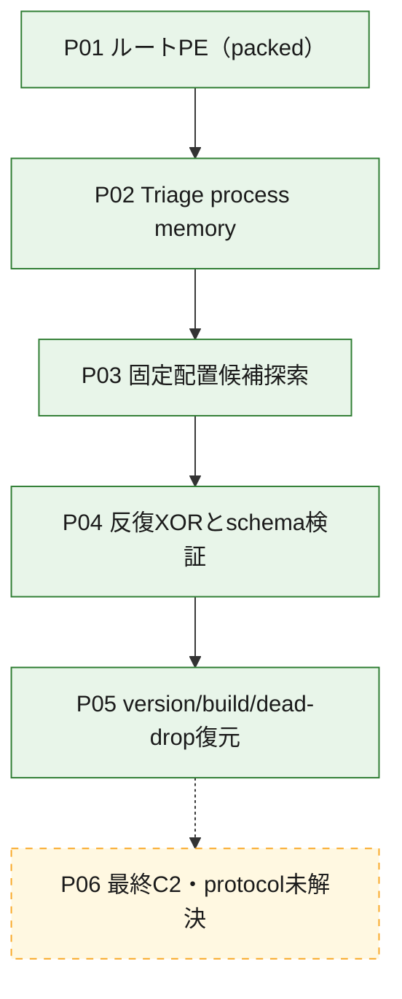
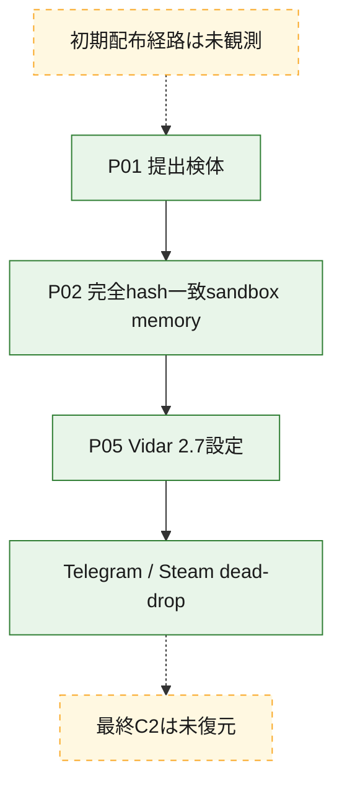
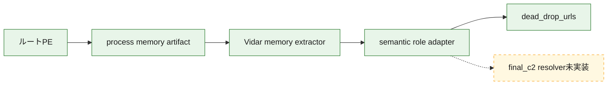

# 全体ロジック：e270275233eb28d9d60555913bd7653c1267106a7d7e4b19bcd10c1f14afa2d6

完全SHA-256一致の公開sandboxから得たprocess memoryを静的に処理し、Vidar 2.7の設定とdead-dropを復元しました。最終C2とprotocolは未復元です。

## 読み方

- 実線は復元済みartifact、設定schema、静的に確認したデータ関係です。
- 点線は配布経路、dead-dropから先の最終C2、protocolの未解決関係です。
- 詳細は[静的追加解析](STATIC-DEEP-DIVE.md)と[復元設定](config.json)を参照してください。

## 静的可視化

### 実行フロー

### 感染チェーン

### モジュール関係

## 処理段階

1. ルート検体の表層設定は復元できませんでした。
2. Triage memoryの固定配置候補を境界付きで探索しました。
3. version、build、URL schemaが同時に成立する候補だけを採用しました。
4. URLをdead-dropと最終C2候補へ意味分類しました。

## 比較プロファイルと他ケースとの比較

- `version/build schema`と`Telegram/Steam dead-dropの組合せ`の2軸がVidar v2系と整合します。
- dead-dropだけではcampaign、actor、現在の最終C2を同一視しません。
- ルートPEの関数解析は未完了であり、今回の完了範囲はterminal memoryの設定復元です。
