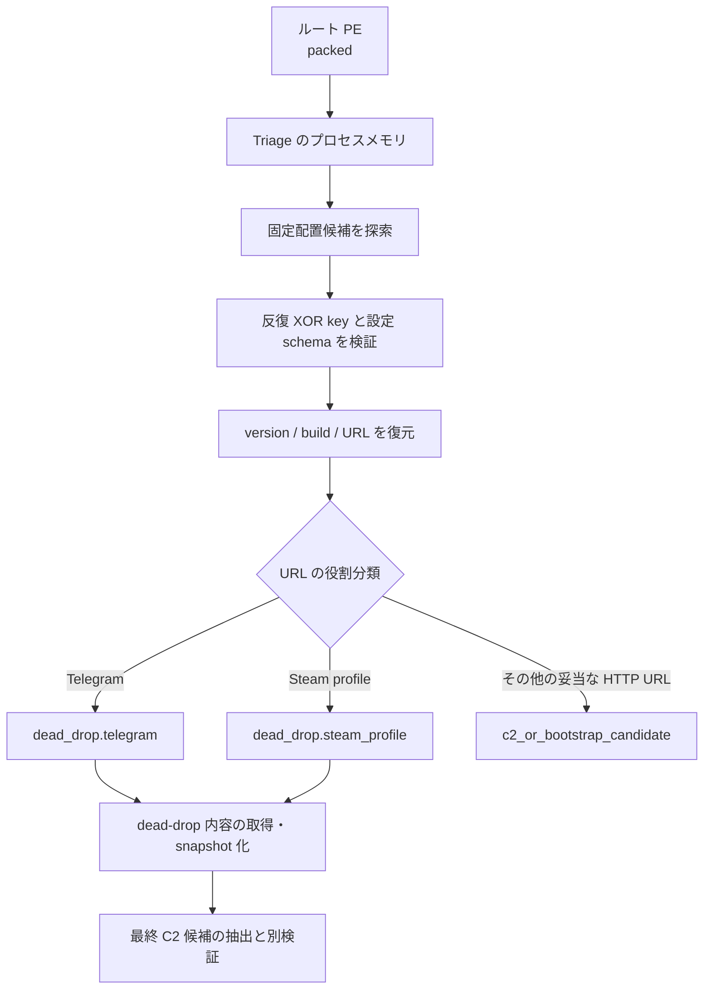

# Vidar 静的追加解析

## 結論

ルート検体だけでは設定を復元できなかったが、Triage で取得済みのプロセスメモリを静的に処理することで、Vidar 2.7 の設定レコードを復元できた。設定内の2 URLは最終 C2 ではなく、最終 C2 を間接解決する Telegram と Steam の dead-drop/bootstrap である。このため、本検体は「設定復元済み」だが「最終 C2 未復元」と評価する。

| 項目 | 値 |
|---|---|
| ルート SHA-256 | `e270275233eb28d9d60555913bd7653c1267106a7d7e4b19bcd10c1f14afa2d6` |
| メモリ SHA-256 | `54189d0fd09ec7165d041d0dbdce5de0152b505b9eeb859e72a26bdcfea29f73` |
| バージョン | `2.7` |
| Build ID | `0eb2d770231b5ce92eb8be6247f2ccfa` |
| XOR key SHA-256 | `00189da6a42c2e5bcfc1f6ad31f426d096a50a343ab8e9588a12251670815ada` |
| 設定オフセット | `1056784` |
| 最終 C2 | 未復元 |

## 未完了だった理由と解消内容

1. ルート検体はパックされた状態で、平文設定を持たない。
2. 取得済みメモリは別 artifact として処理され、親検体の `Vidar` family hint が継承されていなかった。
3. 既存 detector は、固定配置の復号設定が成立していても `information.txt`、`passwords.txt`、`wallets` のうち2個以上の平文 marker を追加で要求していた。この条件は再構築メモリに対して過剰である。
4. 既存 extractor は設定内 URL を一律 `c2` として出力し、dead-drop と最終 C2 を区別していなかった。

今回、取得済みメモリに対する反復 XOR 設定復元を実検証し、URL の意味分類 adapter を追加した。固定オフセット schema、完全な version/build、妥当な URL の組み合わせを独立に検証できる場合は、artifact marker を補助証拠へ下げるべきである。

## 復元したエンドポイント

| URL | 役割 | 根拠 | 判定 |
|---|---|---|---|
| `https://t.me/gk6p2s` | `dead_drop.telegram` | Telegram profile/channel を使う Vidar の間接 C2 解決レコード | 設定から確認 |
| `https://steamcommunity.com/profiles/76561198667588759` | `dead_drop.steam_profile` | Steam community profile を使う間接 C2 解決レコード | 設定から確認 |

両 URL を `c2_urls` に含めてはいけない。`dead_drop_urls` に分離し、`final_c2_recovered=false`、`requires_dead_drop_resolution=true` として扱う。

## 静的処理フロー

## 自動化

- `extractors/vidar/semantic.py`: URL を dead-drop と最終 C2 候補へ意味分類する。
- `extractors/vidar/integrated.py`: 既存 extractor の復元結果を保持しながら、`c2_urls`、`dead_drop_urls`、finding role、未解決状態を修正する。
- 親検体からメモリ artifact へ family lineage を継承し、既存 Vidar handler を優先適用する。

## C2 判定と安全な emulator

現時点で復元できたのは bootstrap のみであり、最終 C2 の能動チェックインは実施できない。dead-drop 内容を取得しても、その応答を即 C2 と断定せず、snapshot の hash、取得時刻、構文、抽出した候補を保存して独立に検証する。

安全な状態機械は次の順序とする。

`LOADED -> DEAD_DROP_SNAPSHOT_VERIFIED -> FINAL_ENDPOINT_EXTRACTED -> ENDPOINT_PINNED -> PROTOCOL_VERIFIED -> ONE_SYNTHETIC_REQUEST -> CLOSED`

次を禁止する。

- dead-drop から得た payload の取得・実行
- 任意 redirect の追従
- 実ユーザー、実ホスト、実ブラウザー情報の送信
- task の実行、窃取データの送信、無制限 retry/poll
- 静的に裏付けられていない endpoint への POST

## 残課題

- dead-drop の取得時点を固定した snapshot から、最終 C2 の値とエンコード規則を復元する。
- 最終 C2 の request body schema、暗号、応答形式を静的に復元する。
- family detector では、再構築メモリの強い設定 schema を主要証拠とし、窃取 artifact 名を必須条件にしない。
