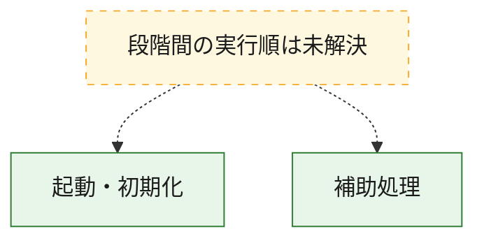
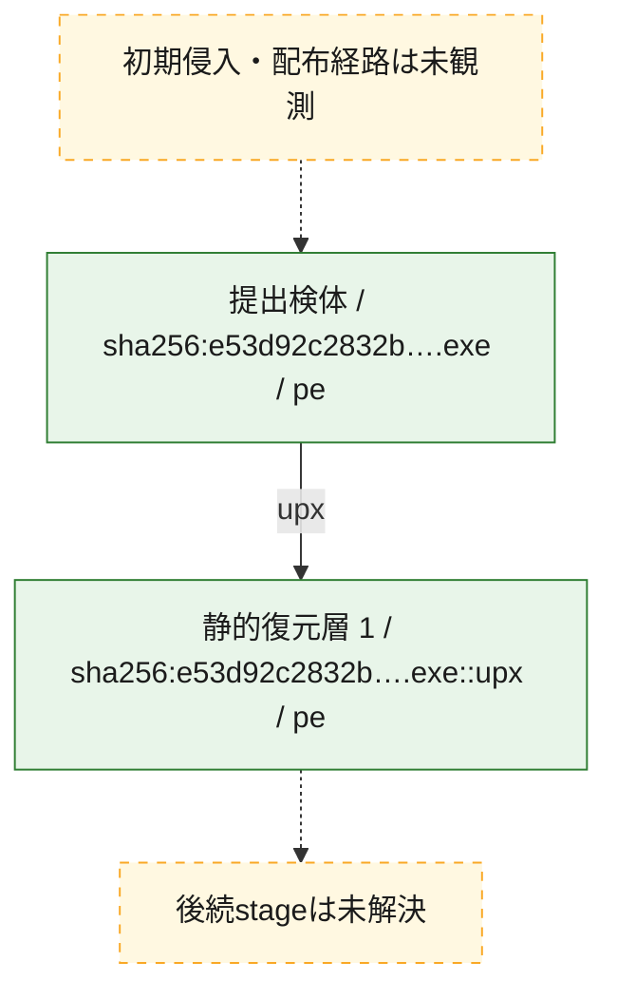
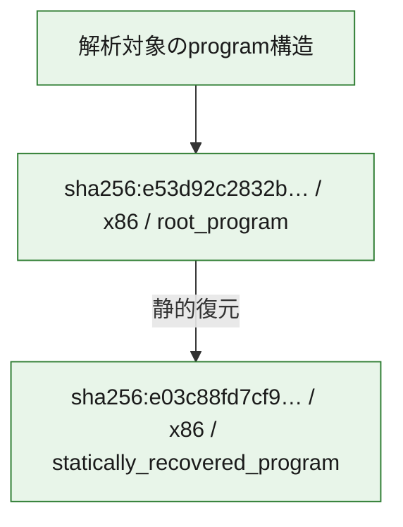

# 全体ロジック：e53d92c2832ba73f7febe440727c27804af4b67eb2d4712c21676d1597eceb65

代表関数の静的証跡から、起動・初期化の処理群を確認しました。

## 読み方

- phaseの掲載順は解析上の整理順です。observed_call_edgesがない段階間の実行順を断定しません。
- 図の実線は静的に観測した関係、点線と黄色のノードは未観測・未解決の関係を示します。
- 図は静的な要約であり、動的実行を再現するものではありません。
- 詳細な関数解説とfingerprintは[STATIC-LOGIC.md](STATIC-LOGIC.md)を参照してください。

## 静的可視化

### 実行フロー

### 感染チェーン

### モジュール関係

## 処理段階

### 1. 起動・初期化

entry pointから初期化と後続処理への移行を確認します。
確度: `confirmed_static_function_evidence`

- `e53d92c2832ba73f7febe440727c27804af4b67eb2d4712c21676d1597eceb65:ghidra:48029ade0` — 初期化と主要処理への分岐を行う入口関数です。 状態: `succeeded`、選定理由: `entry_point`, `meaningful_symbol_name`, `reviewed_call_centrality:2`, `role:entrypoint`, `small_program_complete_context`
- `e03c88fd7cf901d8cc8e5f1e98e39bd60fbecfd9bff5fcd3e4f273f176dfe3d4:ghidra:48013dbd0` — 初期化と主要処理への分岐を行う入口関数です。 状態: `succeeded`、選定理由: `entry_point`, `meaningful_symbol_name`, `reviewed_call_centrality:9`, `role:entrypoint`

### 2. 補助処理

主要処理を支える一般内部関数またはlibrary処理を確認します。
確度: `confirmed_static_function_evidence`

- `e03c88fd7cf901d8cc8e5f1e98e39bd60fbecfd9bff5fcd3e4f273f176dfe3d4:ghidra:480001048` — 検体内部の一般処理を実装する関数です。 状態: `succeeded`、選定理由: `context_representative`
- `e03c88fd7cf901d8cc8e5f1e98e39bd60fbecfd9bff5fcd3e4f273f176dfe3d4:ghidra:4800010a4` — 検体内部の一般処理を実装する関数です。 状態: `succeeded`、選定理由: `context_representative`
- `e03c88fd7cf901d8cc8e5f1e98e39bd60fbecfd9bff5fcd3e4f273f176dfe3d4:ghidra:480001104` — 検体内部の一般処理を実装する関数です。 状態: `succeeded`、選定理由: `context_representative`, `reviewed_call_centrality:9`
- `e03c88fd7cf901d8cc8e5f1e98e39bd60fbecfd9bff5fcd3e4f273f176dfe3d4:ghidra:4800011ec` — 検体内部の一般処理を実装する関数です。 状態: `succeeded`、選定理由: `context_representative`
- `e03c88fd7cf901d8cc8e5f1e98e39bd60fbecfd9bff5fcd3e4f273f176dfe3d4:ghidra:480001318` — 検体内部の一般処理を実装する関数です。 状態: `succeeded`、選定理由: `context_representative`, `reviewed_call_centrality:4`
- `e03c88fd7cf901d8cc8e5f1e98e39bd60fbecfd9bff5fcd3e4f273f176dfe3d4:ghidra:4800014ac` — 検体内部の一般処理を実装する関数です。 状態: `succeeded`、選定理由: `context_representative`, `reviewed_call_centrality:10`
- `e03c88fd7cf901d8cc8e5f1e98e39bd60fbecfd9bff5fcd3e4f273f176dfe3d4:ghidra:48000164c` — 検体内部の一般処理を実装する関数です。 状態: `succeeded`、選定理由: `context_representative`, `reviewed_call_centrality:2`
- `e03c88fd7cf901d8cc8e5f1e98e39bd60fbecfd9bff5fcd3e4f273f176dfe3d4:ghidra:48000181c` — 検体内部の一般処理を実装する関数です。 状態: `succeeded`、選定理由: `context_representative`, `reviewed_call_centrality:6`
- `e03c88fd7cf901d8cc8e5f1e98e39bd60fbecfd9bff5fcd3e4f273f176dfe3d4:ghidra:480001984` — 検体内部の一般処理を実装する関数です。 状態: `succeeded`、選定理由: `context_representative`, `reviewed_call_centrality:10`
- `e03c88fd7cf901d8cc8e5f1e98e39bd60fbecfd9bff5fcd3e4f273f176dfe3d4:ghidra:480001c74` — 検体内部の一般処理を実装する関数です。 状態: `succeeded`、選定理由: `context_representative`, `reviewed_call_centrality:3`
- `e03c88fd7cf901d8cc8e5f1e98e39bd60fbecfd9bff5fcd3e4f273f176dfe3d4:ghidra:480001d9c` — 検体内部の一般処理を実装する関数です。 状態: `succeeded`、選定理由: `context_representative`, `reviewed_call_centrality:3`
- `e03c88fd7cf901d8cc8e5f1e98e39bd60fbecfd9bff5fcd3e4f273f176dfe3d4:ghidra:480001ff4` — 検体内部の一般処理を実装する関数です。 状態: `succeeded`、選定理由: `context_representative`, `reviewed_call_centrality:11`
- `e03c88fd7cf901d8cc8e5f1e98e39bd60fbecfd9bff5fcd3e4f273f176dfe3d4:ghidra:48000238c` — 検体内部の一般処理を実装する関数です。 状態: `succeeded`、選定理由: `context_representative`, `reviewed_call_centrality:6`
- `e03c88fd7cf901d8cc8e5f1e98e39bd60fbecfd9bff5fcd3e4f273f176dfe3d4:ghidra:4800025a8` — 検体内部の一般処理を実装する関数です。 状態: `succeeded`、選定理由: `context_representative`, `reviewed_call_centrality:3`
- `e03c88fd7cf901d8cc8e5f1e98e39bd60fbecfd9bff5fcd3e4f273f176dfe3d4:ghidra:48000276c` — 検体内部の一般処理を実装する関数です。 状態: `succeeded`、選定理由: `context_representative`, `reviewed_call_centrality:12`
- `e03c88fd7cf901d8cc8e5f1e98e39bd60fbecfd9bff5fcd3e4f273f176dfe3d4:ghidra:480002900` — 検体内部の一般処理を実装する関数です。 状態: `succeeded`、選定理由: `context_representative`, `reviewed_call_centrality:3`
- `e03c88fd7cf901d8cc8e5f1e98e39bd60fbecfd9bff5fcd3e4f273f176dfe3d4:ghidra:4800029c0` — 検体内部の一般処理を実装する関数です。 状態: `succeeded`、選定理由: `context_representative`, `reviewed_call_centrality:2`
- `e03c88fd7cf901d8cc8e5f1e98e39bd60fbecfd9bff5fcd3e4f273f176dfe3d4:ghidra:480002a30` — 検体内部の一般処理を実装する関数です。 状態: `succeeded`、選定理由: `context_representative`
- `e03c88fd7cf901d8cc8e5f1e98e39bd60fbecfd9bff5fcd3e4f273f176dfe3d4:ghidra:480002a58` — 検体内部の一般処理を実装する関数です。 状態: `succeeded`、選定理由: `context_representative`
- `e03c88fd7cf901d8cc8e5f1e98e39bd60fbecfd9bff5fcd3e4f273f176dfe3d4:ghidra:480002b00` — 検体内部の一般処理を実装する関数です。 状態: `succeeded`、選定理由: `context_representative`, `reviewed_call_centrality:4`
- `e03c88fd7cf901d8cc8e5f1e98e39bd60fbecfd9bff5fcd3e4f273f176dfe3d4:ghidra:480002cd0` — 検体内部の一般処理を実装する関数です。 状態: `succeeded`、選定理由: `context_representative`, `reviewed_call_centrality:3`
- `e03c88fd7cf901d8cc8e5f1e98e39bd60fbecfd9bff5fcd3e4f273f176dfe3d4:ghidra:480002d88` — 検体内部の一般処理を実装する関数です。 状態: `succeeded`、選定理由: `context_representative`, `reviewed_call_centrality:2`
- `e03c88fd7cf901d8cc8e5f1e98e39bd60fbecfd9bff5fcd3e4f273f176dfe3d4:ghidra:480002e18` — 検体内部の一般処理を実装する関数です。 状態: `succeeded`、選定理由: `context_representative`, `reviewed_call_centrality:2`
- `e03c88fd7cf901d8cc8e5f1e98e39bd60fbecfd9bff5fcd3e4f273f176dfe3d4:ghidra:480002ec0` — 検体内部の一般処理を実装する関数です。 状態: `succeeded`、選定理由: `context_representative`, `reviewed_call_centrality:2`
- `e03c88fd7cf901d8cc8e5f1e98e39bd60fbecfd9bff5fcd3e4f273f176dfe3d4:ghidra:480002f90` — 検体内部の一般処理を実装する関数です。 状態: `succeeded`、選定理由: `context_representative`, `reviewed_call_centrality:2`
- `e03c88fd7cf901d8cc8e5f1e98e39bd60fbecfd9bff5fcd3e4f273f176dfe3d4:ghidra:480003098` — 検体内部の一般処理を実装する関数です。 状態: `succeeded`、選定理由: `context_representative`, `reviewed_call_centrality:11`
- `e03c88fd7cf901d8cc8e5f1e98e39bd60fbecfd9bff5fcd3e4f273f176dfe3d4:ghidra:4800034f0` — 検体内部の一般処理を実装する関数です。 状態: `succeeded`、選定理由: `context_representative`, `reviewed_call_centrality:12`
- `e03c88fd7cf901d8cc8e5f1e98e39bd60fbecfd9bff5fcd3e4f273f176dfe3d4:ghidra:480003908` — 検体内部の一般処理を実装する関数です。 状態: `succeeded`、選定理由: `context_representative`, `reviewed_call_centrality:3`
- `e03c88fd7cf901d8cc8e5f1e98e39bd60fbecfd9bff5fcd3e4f273f176dfe3d4:ghidra:480003970` — 検体内部の一般処理を実装する関数です。 状態: `succeeded`、選定理由: `context_representative`, `reviewed_call_centrality:2`
- `e03c88fd7cf901d8cc8e5f1e98e39bd60fbecfd9bff5fcd3e4f273f176dfe3d4:ghidra:480003a90` — 検体内部の一般処理を実装する関数です。 状態: `succeeded`、選定理由: `context_representative`, `reviewed_call_centrality:17`
- `e03c88fd7cf901d8cc8e5f1e98e39bd60fbecfd9bff5fcd3e4f273f176dfe3d4:ghidra:480003fd4` — 検体内部の一般処理を実装する関数です。 状態: `succeeded`、選定理由: `context_representative`, `reviewed_call_centrality:16`

## 観測したcall関係

- `e03c88fd7cf901d8cc8e5f1e98e39bd60fbecfd9bff5fcd3e4f273f176dfe3d4:ghidra:48000164c` → `e03c88fd7cf901d8cc8e5f1e98e39bd60fbecfd9bff5fcd3e4f273f176dfe3d4:ghidra:480001104` （`support` → `support`）
- `e03c88fd7cf901d8cc8e5f1e98e39bd60fbecfd9bff5fcd3e4f273f176dfe3d4:ghidra:480001984` → `e03c88fd7cf901d8cc8e5f1e98e39bd60fbecfd9bff5fcd3e4f273f176dfe3d4:ghidra:480001104` （`support` → `support`）
- `e03c88fd7cf901d8cc8e5f1e98e39bd60fbecfd9bff5fcd3e4f273f176dfe3d4:ghidra:480001984` → `e03c88fd7cf901d8cc8e5f1e98e39bd60fbecfd9bff5fcd3e4f273f176dfe3d4:ghidra:480001318` （`support` → `support`）
- `e03c88fd7cf901d8cc8e5f1e98e39bd60fbecfd9bff5fcd3e4f273f176dfe3d4:ghidra:480001984` → `e03c88fd7cf901d8cc8e5f1e98e39bd60fbecfd9bff5fcd3e4f273f176dfe3d4:ghidra:4800014ac` （`support` → `support`）
- `e03c88fd7cf901d8cc8e5f1e98e39bd60fbecfd9bff5fcd3e4f273f176dfe3d4:ghidra:480001984` → `e03c88fd7cf901d8cc8e5f1e98e39bd60fbecfd9bff5fcd3e4f273f176dfe3d4:ghidra:48000181c` （`support` → `support`）
- `e03c88fd7cf901d8cc8e5f1e98e39bd60fbecfd9bff5fcd3e4f273f176dfe3d4:ghidra:480001984` → `e03c88fd7cf901d8cc8e5f1e98e39bd60fbecfd9bff5fcd3e4f273f176dfe3d4:ghidra:48000276c` （`support` → `support`）
- `e03c88fd7cf901d8cc8e5f1e98e39bd60fbecfd9bff5fcd3e4f273f176dfe3d4:ghidra:480001984` → `e03c88fd7cf901d8cc8e5f1e98e39bd60fbecfd9bff5fcd3e4f273f176dfe3d4:ghidra:480002900` （`support` → `support`）
- `e03c88fd7cf901d8cc8e5f1e98e39bd60fbecfd9bff5fcd3e4f273f176dfe3d4:ghidra:480001984` → `e03c88fd7cf901d8cc8e5f1e98e39bd60fbecfd9bff5fcd3e4f273f176dfe3d4:ghidra:4800029c0` （`support` → `support`）
- `e03c88fd7cf901d8cc8e5f1e98e39bd60fbecfd9bff5fcd3e4f273f176dfe3d4:ghidra:480001984` → `e03c88fd7cf901d8cc8e5f1e98e39bd60fbecfd9bff5fcd3e4f273f176dfe3d4:ghidra:480002b00` （`support` → `support`）
- `e03c88fd7cf901d8cc8e5f1e98e39bd60fbecfd9bff5fcd3e4f273f176dfe3d4:ghidra:480001c74` → `e03c88fd7cf901d8cc8e5f1e98e39bd60fbecfd9bff5fcd3e4f273f176dfe3d4:ghidra:480001104` （`support` → `support`）
- `e03c88fd7cf901d8cc8e5f1e98e39bd60fbecfd9bff5fcd3e4f273f176dfe3d4:ghidra:480001c74` → `e03c88fd7cf901d8cc8e5f1e98e39bd60fbecfd9bff5fcd3e4f273f176dfe3d4:ghidra:48000181c` （`support` → `support`）
- `e03c88fd7cf901d8cc8e5f1e98e39bd60fbecfd9bff5fcd3e4f273f176dfe3d4:ghidra:480001d9c` → `e03c88fd7cf901d8cc8e5f1e98e39bd60fbecfd9bff5fcd3e4f273f176dfe3d4:ghidra:480001104` （`support` → `support`）
- `e03c88fd7cf901d8cc8e5f1e98e39bd60fbecfd9bff5fcd3e4f273f176dfe3d4:ghidra:480001d9c` → `e03c88fd7cf901d8cc8e5f1e98e39bd60fbecfd9bff5fcd3e4f273f176dfe3d4:ghidra:48000181c` （`support` → `support`）
- `e03c88fd7cf901d8cc8e5f1e98e39bd60fbecfd9bff5fcd3e4f273f176dfe3d4:ghidra:480001ff4` → `e03c88fd7cf901d8cc8e5f1e98e39bd60fbecfd9bff5fcd3e4f273f176dfe3d4:ghidra:480001104` （`support` → `support`）
- `e03c88fd7cf901d8cc8e5f1e98e39bd60fbecfd9bff5fcd3e4f273f176dfe3d4:ghidra:480001ff4` → `e03c88fd7cf901d8cc8e5f1e98e39bd60fbecfd9bff5fcd3e4f273f176dfe3d4:ghidra:480001318` （`support` → `support`）
- `e03c88fd7cf901d8cc8e5f1e98e39bd60fbecfd9bff5fcd3e4f273f176dfe3d4:ghidra:480001ff4` → `e03c88fd7cf901d8cc8e5f1e98e39bd60fbecfd9bff5fcd3e4f273f176dfe3d4:ghidra:4800014ac` （`support` → `support`）
- `e03c88fd7cf901d8cc8e5f1e98e39bd60fbecfd9bff5fcd3e4f273f176dfe3d4:ghidra:480001ff4` → `e03c88fd7cf901d8cc8e5f1e98e39bd60fbecfd9bff5fcd3e4f273f176dfe3d4:ghidra:48000181c` （`support` → `support`）
- `e03c88fd7cf901d8cc8e5f1e98e39bd60fbecfd9bff5fcd3e4f273f176dfe3d4:ghidra:480001ff4` → `e03c88fd7cf901d8cc8e5f1e98e39bd60fbecfd9bff5fcd3e4f273f176dfe3d4:ghidra:4800025a8` （`support` → `support`）
- `e03c88fd7cf901d8cc8e5f1e98e39bd60fbecfd9bff5fcd3e4f273f176dfe3d4:ghidra:480001ff4` → `e03c88fd7cf901d8cc8e5f1e98e39bd60fbecfd9bff5fcd3e4f273f176dfe3d4:ghidra:48000276c` （`support` → `support`）
- `e03c88fd7cf901d8cc8e5f1e98e39bd60fbecfd9bff5fcd3e4f273f176dfe3d4:ghidra:480001ff4` → `e03c88fd7cf901d8cc8e5f1e98e39bd60fbecfd9bff5fcd3e4f273f176dfe3d4:ghidra:480002900` （`support` → `support`）
- `e03c88fd7cf901d8cc8e5f1e98e39bd60fbecfd9bff5fcd3e4f273f176dfe3d4:ghidra:480001ff4` → `e03c88fd7cf901d8cc8e5f1e98e39bd60fbecfd9bff5fcd3e4f273f176dfe3d4:ghidra:4800029c0` （`support` → `support`）
- `e03c88fd7cf901d8cc8e5f1e98e39bd60fbecfd9bff5fcd3e4f273f176dfe3d4:ghidra:480001ff4` → `e03c88fd7cf901d8cc8e5f1e98e39bd60fbecfd9bff5fcd3e4f273f176dfe3d4:ghidra:480002b00` （`support` → `support`）
- `e03c88fd7cf901d8cc8e5f1e98e39bd60fbecfd9bff5fcd3e4f273f176dfe3d4:ghidra:48000238c` → `e03c88fd7cf901d8cc8e5f1e98e39bd60fbecfd9bff5fcd3e4f273f176dfe3d4:ghidra:480001104` （`support` → `support`）
- `e03c88fd7cf901d8cc8e5f1e98e39bd60fbecfd9bff5fcd3e4f273f176dfe3d4:ghidra:48000238c` → `e03c88fd7cf901d8cc8e5f1e98e39bd60fbecfd9bff5fcd3e4f273f176dfe3d4:ghidra:4800014ac` （`support` → `support`）
- `e03c88fd7cf901d8cc8e5f1e98e39bd60fbecfd9bff5fcd3e4f273f176dfe3d4:ghidra:48000238c` → `e03c88fd7cf901d8cc8e5f1e98e39bd60fbecfd9bff5fcd3e4f273f176dfe3d4:ghidra:48000181c` （`support` → `support`）
- `e03c88fd7cf901d8cc8e5f1e98e39bd60fbecfd9bff5fcd3e4f273f176dfe3d4:ghidra:48000238c` → `e03c88fd7cf901d8cc8e5f1e98e39bd60fbecfd9bff5fcd3e4f273f176dfe3d4:ghidra:4800025a8` （`support` → `support`）
- `e03c88fd7cf901d8cc8e5f1e98e39bd60fbecfd9bff5fcd3e4f273f176dfe3d4:ghidra:4800025a8` → `e03c88fd7cf901d8cc8e5f1e98e39bd60fbecfd9bff5fcd3e4f273f176dfe3d4:ghidra:480001104` （`support` → `support`）
- `e03c88fd7cf901d8cc8e5f1e98e39bd60fbecfd9bff5fcd3e4f273f176dfe3d4:ghidra:48000276c` → `e03c88fd7cf901d8cc8e5f1e98e39bd60fbecfd9bff5fcd3e4f273f176dfe3d4:ghidra:480001984` （`support` → `support`）
- `e03c88fd7cf901d8cc8e5f1e98e39bd60fbecfd9bff5fcd3e4f273f176dfe3d4:ghidra:48000276c` → `e03c88fd7cf901d8cc8e5f1e98e39bd60fbecfd9bff5fcd3e4f273f176dfe3d4:ghidra:480001c74` （`support` → `support`）
- `e03c88fd7cf901d8cc8e5f1e98e39bd60fbecfd9bff5fcd3e4f273f176dfe3d4:ghidra:48000276c` → `e03c88fd7cf901d8cc8e5f1e98e39bd60fbecfd9bff5fcd3e4f273f176dfe3d4:ghidra:480001d9c` （`support` → `support`）
- `e03c88fd7cf901d8cc8e5f1e98e39bd60fbecfd9bff5fcd3e4f273f176dfe3d4:ghidra:48000276c` → `e03c88fd7cf901d8cc8e5f1e98e39bd60fbecfd9bff5fcd3e4f273f176dfe3d4:ghidra:480001ff4` （`support` → `support`）
- `e03c88fd7cf901d8cc8e5f1e98e39bd60fbecfd9bff5fcd3e4f273f176dfe3d4:ghidra:48000276c` → `e03c88fd7cf901d8cc8e5f1e98e39bd60fbecfd9bff5fcd3e4f273f176dfe3d4:ghidra:48000238c` （`support` → `support`）
- `e03c88fd7cf901d8cc8e5f1e98e39bd60fbecfd9bff5fcd3e4f273f176dfe3d4:ghidra:48000276c` → `e03c88fd7cf901d8cc8e5f1e98e39bd60fbecfd9bff5fcd3e4f273f176dfe3d4:ghidra:480002900` （`support` → `support`）
- `e03c88fd7cf901d8cc8e5f1e98e39bd60fbecfd9bff5fcd3e4f273f176dfe3d4:ghidra:480002b00` → `e03c88fd7cf901d8cc8e5f1e98e39bd60fbecfd9bff5fcd3e4f273f176dfe3d4:ghidra:4800014ac` （`support` → `support`）
- `e03c88fd7cf901d8cc8e5f1e98e39bd60fbecfd9bff5fcd3e4f273f176dfe3d4:ghidra:480002d88` → `e03c88fd7cf901d8cc8e5f1e98e39bd60fbecfd9bff5fcd3e4f273f176dfe3d4:ghidra:480002cd0` （`support` → `support`）
- `e03c88fd7cf901d8cc8e5f1e98e39bd60fbecfd9bff5fcd3e4f273f176dfe3d4:ghidra:480002e18` → `e03c88fd7cf901d8cc8e5f1e98e39bd60fbecfd9bff5fcd3e4f273f176dfe3d4:ghidra:480002cd0` （`support` → `support`）
- `e03c88fd7cf901d8cc8e5f1e98e39bd60fbecfd9bff5fcd3e4f273f176dfe3d4:ghidra:480002ec0` → `e03c88fd7cf901d8cc8e5f1e98e39bd60fbecfd9bff5fcd3e4f273f176dfe3d4:ghidra:480002e18` （`support` → `support`）
- `e03c88fd7cf901d8cc8e5f1e98e39bd60fbecfd9bff5fcd3e4f273f176dfe3d4:ghidra:480002f90` → `e03c88fd7cf901d8cc8e5f1e98e39bd60fbecfd9bff5fcd3e4f273f176dfe3d4:ghidra:48000276c` （`support` → `support`）
- `e03c88fd7cf901d8cc8e5f1e98e39bd60fbecfd9bff5fcd3e4f273f176dfe3d4:ghidra:480003098` → `e03c88fd7cf901d8cc8e5f1e98e39bd60fbecfd9bff5fcd3e4f273f176dfe3d4:ghidra:4800014ac` （`support` → `support`）
- `e03c88fd7cf901d8cc8e5f1e98e39bd60fbecfd9bff5fcd3e4f273f176dfe3d4:ghidra:480003098` → `e03c88fd7cf901d8cc8e5f1e98e39bd60fbecfd9bff5fcd3e4f273f176dfe3d4:ghidra:480003908` （`support` → `support`）
- `e03c88fd7cf901d8cc8e5f1e98e39bd60fbecfd9bff5fcd3e4f273f176dfe3d4:ghidra:480003098` → `e03c88fd7cf901d8cc8e5f1e98e39bd60fbecfd9bff5fcd3e4f273f176dfe3d4:ghidra:480003970` （`support` → `support`）
- `e03c88fd7cf901d8cc8e5f1e98e39bd60fbecfd9bff5fcd3e4f273f176dfe3d4:ghidra:4800034f0` → `e03c88fd7cf901d8cc8e5f1e98e39bd60fbecfd9bff5fcd3e4f273f176dfe3d4:ghidra:480001104` （`support` → `support`）
- `e03c88fd7cf901d8cc8e5f1e98e39bd60fbecfd9bff5fcd3e4f273f176dfe3d4:ghidra:4800034f0` → `e03c88fd7cf901d8cc8e5f1e98e39bd60fbecfd9bff5fcd3e4f273f176dfe3d4:ghidra:4800014ac` （`support` → `support`）
- `e03c88fd7cf901d8cc8e5f1e98e39bd60fbecfd9bff5fcd3e4f273f176dfe3d4:ghidra:4800034f0` → `e03c88fd7cf901d8cc8e5f1e98e39bd60fbecfd9bff5fcd3e4f273f176dfe3d4:ghidra:480003908` （`support` → `support`）
- `e03c88fd7cf901d8cc8e5f1e98e39bd60fbecfd9bff5fcd3e4f273f176dfe3d4:ghidra:480003970` → `e03c88fd7cf901d8cc8e5f1e98e39bd60fbecfd9bff5fcd3e4f273f176dfe3d4:ghidra:480003908` （`support` → `support`）
- `e03c88fd7cf901d8cc8e5f1e98e39bd60fbecfd9bff5fcd3e4f273f176dfe3d4:ghidra:480003a90` → `e03c88fd7cf901d8cc8e5f1e98e39bd60fbecfd9bff5fcd3e4f273f176dfe3d4:ghidra:480001318` （`support` → `support`）
- `e03c88fd7cf901d8cc8e5f1e98e39bd60fbecfd9bff5fcd3e4f273f176dfe3d4:ghidra:480003a90` → `e03c88fd7cf901d8cc8e5f1e98e39bd60fbecfd9bff5fcd3e4f273f176dfe3d4:ghidra:4800014ac` （`support` → `support`）
- `e03c88fd7cf901d8cc8e5f1e98e39bd60fbecfd9bff5fcd3e4f273f176dfe3d4:ghidra:480003fd4` → `e03c88fd7cf901d8cc8e5f1e98e39bd60fbecfd9bff5fcd3e4f273f176dfe3d4:ghidra:480003098` （`support` → `support`）
- `ghidra-function:122894d93e6aafe93575de3f` → `ghidra-function:c09930637e98581529e22a56` （`unclassified` → `unclassified`）
- `ghidra-function:122894d93e6aafe93575de3f` → `ghidra-function:efa1ea4eb5c90a0b9f5c5269` （`unclassified` → `unclassified`）
- `ghidra-function:2a2268aefacf1f263500fe07` → `ghidra-external:fa766352f0211c43f275f711` （`unclassified` → `unclassified`）
- `ghidra-function:2a2268aefacf1f263500fe07` → `ghidra-function:6c66e502ffa37c5b39c82755` （`unclassified` → `unclassified`）
- `ghidra-function:2a2268aefacf1f263500fe07` → `ghidra-function:92eff80ff9369f815881a30a` （`unclassified` → `unclassified`）
- `ghidra-function:2a2268aefacf1f263500fe07` → `ghidra-function:abf10b05bf36a82f20086160` （`unclassified` → `unclassified`）
- `ghidra-function:2a2268aefacf1f263500fe07` → `ghidra-function:fd4a7701a72b14b6f9015d02` （`unclassified` → `unclassified`）
- `ghidra-function:50cd7ff5533c895ded6af793` → `ghidra-external:166fe8fb2a78c27d3599547e` （`unclassified` → `unclassified`）
- `ghidra-function:50cd7ff5533c895ded6af793` → `ghidra-external:fa766352f0211c43f275f711` （`unclassified` → `unclassified`）
- `ghidra-function:50cd7ff5533c895ded6af793` → `ghidra-external:fd11a1d509b860cd7c806eb8` （`unclassified` → `unclassified`）
- `ghidra-function:50cd7ff5533c895ded6af793` → `ghidra-function:23420d97ac86efe6ceffe447` （`unclassified` → `unclassified`）
- `ghidra-function:50cd7ff5533c895ded6af793` → `ghidra-function:32d35e279d2e53274153934d` （`unclassified` → `unclassified`）
- `ghidra-function:50cd7ff5533c895ded6af793` → `ghidra-function:556c16030e361dfef4c2fde2` （`unclassified` → `unclassified`）
- `ghidra-function:50cd7ff5533c895ded6af793` → `ghidra-function:57d135bc469c2e4da3485b95` （`unclassified` → `unclassified`）
- `ghidra-function:50cd7ff5533c895ded6af793` → `ghidra-function:5d427b9d52f6d9289212bdee` （`unclassified` → `unclassified`）
- `ghidra-function:50cd7ff5533c895ded6af793` → `ghidra-function:5f2f52d19420885ed955a986` （`unclassified` → `unclassified`）
- `ghidra-function:50cd7ff5533c895ded6af793` → `ghidra-function:6c66e502ffa37c5b39c82755` （`unclassified` → `unclassified`）
- `ghidra-function:50cd7ff5533c895ded6af793` → `ghidra-function:7580355d55c35bd9d9b25a3e` （`unclassified` → `unclassified`）
- `ghidra-function:50cd7ff5533c895ded6af793` → `ghidra-function:a8f63439b84ceae3d74837e5` （`unclassified` → `unclassified`）
- `ghidra-function:50cd7ff5533c895ded6af793` → `ghidra-function:c97e3ecbf4a118e03096f578` （`unclassified` → `unclassified`）
- `ghidra-function:50cd7ff5533c895ded6af793` → `ghidra-function:d1ff44d9f0fe602ed014fa92` （`unclassified` → `unclassified`）
- `ghidra-function:50cd7ff5533c895ded6af793` → `ghidra-function:e0e319b82a882758613d6a4a` （`unclassified` → `unclassified`）
- `ghidra-function:50cd7ff5533c895ded6af793` → `ghidra-function:e2d42496d3f830e497830cbd` （`unclassified` → `unclassified`）
- `ghidra-function:50cd7ff5533c895ded6af793` → `ghidra-function:f0c8c29c9313e7f0234b21ee` （`unclassified` → `unclassified`）
- `ghidra-function:57d135bc469c2e4da3485b95` → `ghidra-external:fa766352f0211c43f275f711` （`unclassified` → `unclassified`）
- `ghidra-function:58da1c328bf5dc9e39861d50` → `ghidra-external:fa766352f0211c43f275f711` （`unclassified` → `unclassified`）
- `ghidra-function:58da1c328bf5dc9e39861d50` → `ghidra-function:18d8652ad866d040541c5bf6` （`unclassified` → `unclassified`）
- `ghidra-function:58da1c328bf5dc9e39861d50` → `ghidra-function:2264da93bca6df5ec4a74b8a` （`unclassified` → `unclassified`）
- `ghidra-function:58da1c328bf5dc9e39861d50` → `ghidra-function:57d135bc469c2e4da3485b95` （`unclassified` → `unclassified`）
- `ghidra-function:58da1c328bf5dc9e39861d50` → `ghidra-function:6c66e502ffa37c5b39c82755` （`unclassified` → `unclassified`）
- `ghidra-function:58da1c328bf5dc9e39861d50` → `ghidra-function:8bbd1b41c1a96db5ba0cd315` （`unclassified` → `unclassified`）
- `ghidra-function:58da1c328bf5dc9e39861d50` → `ghidra-function:92eff80ff9369f815881a30a` （`unclassified` → `unclassified`）
- `ghidra-function:58da1c328bf5dc9e39861d50` → `ghidra-function:aadad4054ebb5ba975219b90` （`unclassified` → `unclassified`）
- `ghidra-function:58da1c328bf5dc9e39861d50` → `ghidra-function:abf10b05bf36a82f20086160` （`unclassified` → `unclassified`）
- `ghidra-function:58da1c328bf5dc9e39861d50` → `ghidra-function:fd4a7701a72b14b6f9015d02` （`unclassified` → `unclassified`）
- `ghidra-function:6aac170f14ca23e01c94c190` → `ghidra-function:92eff80ff9369f815881a30a` （`unclassified` → `unclassified`）
- `ghidra-function:6aac170f14ca23e01c94c190` → `ghidra-function:fd4a7701a72b14b6f9015d02` （`unclassified` → `unclassified`）
- `ghidra-function:6c66e502ffa37c5b39c82755` → `ghidra-external:f9127ecd5db35bf606a89445` （`unclassified` → `unclassified`）
- `ghidra-function:6c66e502ffa37c5b39c82755` → `ghidra-external:fa766352f0211c43f275f711` （`unclassified` → `unclassified`）
- `ghidra-function:6c66e502ffa37c5b39c82755` → `ghidra-external:ff3095167ffe66b4bd38bfbe` （`unclassified` → `unclassified`）
- `ghidra-function:8bbd1b41c1a96db5ba0cd315` → `ghidra-external:fd11a1d509b860cd7c806eb8` （`unclassified` → `unclassified`）
- `ghidra-function:8bbd1b41c1a96db5ba0cd315` → `ghidra-function:6c66e502ffa37c5b39c82755` （`unclassified` → `unclassified`）
- `ghidra-function:92eff80ff9369f815881a30a` → `ghidra-external:fa766352f0211c43f275f711` （`unclassified` → `unclassified`）
- `ghidra-function:96c0c13e29758fda6631740d` → `ghidra-function:15fa6c2096405cadc5b153ba` （`unclassified` → `unclassified`）
- `ghidra-function:96c0c13e29758fda6631740d` → `ghidra-function:1c95cc76950538c0d39a234e` （`unclassified` → `unclassified`）
- `ghidra-function:96c0c13e29758fda6631740d` → `ghidra-function:1ca7e78b2c2fcbaf8503bc8a` （`unclassified` → `unclassified`）
- `ghidra-function:96c0c13e29758fda6631740d` → `ghidra-function:422b329487cb8077a50a3104` （`unclassified` → `unclassified`）
- `ghidra-function:96c0c13e29758fda6631740d` → `ghidra-function:4b5c3439c189cb5c4d26cf9b` （`unclassified` → `unclassified`）
- `ghidra-function:96c0c13e29758fda6631740d` → `ghidra-function:51e37f3caedd3d6b7843320e` （`unclassified` → `unclassified`）
- `ghidra-function:96c0c13e29758fda6631740d` → `ghidra-function:5adfb595f686d2a061fe168d` （`unclassified` → `unclassified`）
- `ghidra-function:96c0c13e29758fda6631740d` → `ghidra-function:6070cb87ef4b8d4e7d66ec82` （`unclassified` → `unclassified`）
- `ghidra-function:96c0c13e29758fda6631740d` → `ghidra-function:760563f0d983d8b2439ce604` （`unclassified` → `unclassified`）
- `ghidra-function:96c0c13e29758fda6631740d` → `ghidra-function:886cdbe046e0ba73173600dc` （`unclassified` → `unclassified`）
- `ghidra-function:96c0c13e29758fda6631740d` → `ghidra-function:9db24c07ffc22f2435b1416a` （`unclassified` → `unclassified`）
- `ghidra-function:96c0c13e29758fda6631740d` → `ghidra-function:b3e46e994bfb96fa9c5d6866` （`unclassified` → `unclassified`）
- `ghidra-function:96c0c13e29758fda6631740d` → `ghidra-function:c0bd206e8ba62c23929060c4` （`unclassified` → `unclassified`）
- `ghidra-function:96c0c13e29758fda6631740d` → `ghidra-function:c97e3ecbf4a118e03096f578` （`unclassified` → `unclassified`）
- `ghidra-function:96c0c13e29758fda6631740d` → `ghidra-function:ef3f3dcd31cc0725d180a481` （`unclassified` → `unclassified`）
- `ghidra-function:96c0c13e29758fda6631740d` → `ghidra-function:f4f80ef7f6a4870fcd032e86` （`unclassified` → `unclassified`）
- `ghidra-function:9b15b39b842323352d6584b5` → `ghidra-function:6bd4ab98cdd1459a82cff9b3` （`unclassified` → `unclassified`）
- `ghidra-function:9b15b39b842323352d6584b5` → `ghidra-function:fcb048350e7a8897ba561aa3` （`unclassified` → `unclassified`）
- `ghidra-function:a9a9824050110a9baf543525` → `ghidra-function:35fb42cfc438c26dc1b9dd2b` （`unclassified` → `unclassified`）
- `ghidra-function:a9beecfdc6b0e43ec632265a` → `ghidra-function:92eff80ff9369f815881a30a` （`unclassified` → `unclassified`）
- `ghidra-function:a9beecfdc6b0e43ec632265a` → `ghidra-function:fd4a7701a72b14b6f9015d02` （`unclassified` → `unclassified`）
- `ghidra-function:aadad4054ebb5ba975219b90` → `ghidra-function:18d8652ad866d040541c5bf6` （`unclassified` → `unclassified`）
- `ghidra-function:aadad4054ebb5ba975219b90` → `ghidra-function:291c1d8825bd06dfecdea829` （`unclassified` → `unclassified`）
- `ghidra-function:aadad4054ebb5ba975219b90` → `ghidra-function:2a2268aefacf1f263500fe07` （`unclassified` → `unclassified`）
- `ghidra-function:aadad4054ebb5ba975219b90` → `ghidra-function:58da1c328bf5dc9e39861d50` （`unclassified` → `unclassified`）
- `ghidra-function:aadad4054ebb5ba975219b90` → `ghidra-function:6aac170f14ca23e01c94c190` （`unclassified` → `unclassified`）
- `ghidra-function:aadad4054ebb5ba975219b90` → `ghidra-function:a9beecfdc6b0e43ec632265a` （`unclassified` → `unclassified`）
- `ghidra-function:aadad4054ebb5ba975219b90` → `ghidra-function:abea8db4867bbbfa1474dca5` （`unclassified` → `unclassified`）
- `ghidra-function:aadad4054ebb5ba975219b90` → `ghidra-function:b356d178aceb612f6e7287ad` （`unclassified` → `unclassified`）
- `ghidra-function:aadad4054ebb5ba975219b90` → `ghidra-function:d135ebf718b76b1182a6e5fc` （`unclassified` → `unclassified`）
- `ghidra-function:abf10b05bf36a82f20086160` → `ghidra-function:fd4a7701a72b14b6f9015d02` （`unclassified` → `unclassified`）
- `ghidra-function:b3e46e994bfb96fa9c5d6866` → `ghidra-external:8627fc5863c6479bed1b4f67` （`unclassified` → `unclassified`）
- `ghidra-function:b3e46e994bfb96fa9c5d6866` → `ghidra-external:fa766352f0211c43f275f711` （`unclassified` → `unclassified`）
- `ghidra-function:b3e46e994bfb96fa9c5d6866` → `ghidra-function:338eeda15d2fde8c2f940fcf` （`unclassified` → `unclassified`）
- `ghidra-function:b3e46e994bfb96fa9c5d6866` → `ghidra-function:35fb42cfc438c26dc1b9dd2b` （`unclassified` → `unclassified`）
- `ghidra-function:b3e46e994bfb96fa9c5d6866` → `ghidra-function:6c66e502ffa37c5b39c82755` （`unclassified` → `unclassified`）
- `ghidra-function:b3e46e994bfb96fa9c5d6866` → `ghidra-function:9b1e5f8efeeaacf641b40b1b` （`unclassified` → `unclassified`）
- `ghidra-function:b3e46e994bfb96fa9c5d6866` → `ghidra-function:a8f63439b84ceae3d74837e5` （`unclassified` → `unclassified`）
- `ghidra-function:b3e46e994bfb96fa9c5d6866` → `ghidra-function:a9a9824050110a9baf543525` （`unclassified` → `unclassified`）
- `ghidra-function:b3e46e994bfb96fa9c5d6866` → `ghidra-function:e2d42496d3f830e497830cbd` （`unclassified` → `unclassified`）
- `ghidra-function:b3e46e994bfb96fa9c5d6866` → `ghidra-function:fe350cfa3997ecd1f901e933` （`unclassified` → `unclassified`）
- `ghidra-function:c09930637e98581529e22a56` → `ghidra-function:2e8a901cc0293de76011d718` （`unclassified` → `unclassified`）
- `ghidra-function:c16c2758eadf0747d647b2f1` → `ghidra-external:41f462e44a15e8c35461aba8` （`unclassified` → `unclassified`）
- `ghidra-function:c16c2758eadf0747d647b2f1` → `ghidra-external:a488617e33c81471be0659d2` （`unclassified` → `unclassified`）
- `ghidra-function:c8a53969113b92ffea6e5683` → `ghidra-function:aadad4054ebb5ba975219b90` （`unclassified` → `unclassified`）
- `ghidra-function:c8a53969113b92ffea6e5683` → `ghidra-function:e2d42496d3f830e497830cbd` （`unclassified` → `unclassified`）
- `ghidra-function:d135ebf718b76b1182a6e5fc` → `ghidra-external:fa766352f0211c43f275f711` （`unclassified` → `unclassified`）
- `ghidra-function:d135ebf718b76b1182a6e5fc` → `ghidra-function:18d8652ad866d040541c5bf6` （`unclassified` → `unclassified`）
- `ghidra-function:d135ebf718b76b1182a6e5fc` → `ghidra-function:2264da93bca6df5ec4a74b8a` （`unclassified` → `unclassified`）
- `ghidra-function:d135ebf718b76b1182a6e5fc` → `ghidra-function:57d135bc469c2e4da3485b95` （`unclassified` → `unclassified`）
- `ghidra-function:d135ebf718b76b1182a6e5fc` → `ghidra-function:6c66e502ffa37c5b39c82755` （`unclassified` → `unclassified`）
- `ghidra-function:d135ebf718b76b1182a6e5fc` → `ghidra-function:8bbd1b41c1a96db5ba0cd315` （`unclassified` → `unclassified`）
- `ghidra-function:d135ebf718b76b1182a6e5fc` → `ghidra-function:92eff80ff9369f815881a30a` （`unclassified` → `unclassified`）
- `ghidra-function:d135ebf718b76b1182a6e5fc` → `ghidra-function:aadad4054ebb5ba975219b90` （`unclassified` → `unclassified`）
- `ghidra-function:d135ebf718b76b1182a6e5fc` → `ghidra-function:fd4a7701a72b14b6f9015d02` （`unclassified` → `unclassified`）
- `ghidra-function:da59cfc322e1dc5be95622d4` → `ghidra-external:0932b4b5d628a397ae7129d6` （`unclassified` → `unclassified`）
- `ghidra-function:da59cfc322e1dc5be95622d4` → `ghidra-external:8627fc5863c6479bed1b4f67` （`unclassified` → `unclassified`）
- `ghidra-function:da59cfc322e1dc5be95622d4` → `ghidra-function:338eeda15d2fde8c2f940fcf` （`unclassified` → `unclassified`）
- `ghidra-function:da59cfc322e1dc5be95622d4` → `ghidra-function:35fb42cfc438c26dc1b9dd2b` （`unclassified` → `unclassified`）
- `ghidra-function:da59cfc322e1dc5be95622d4` → `ghidra-function:6c66e502ffa37c5b39c82755` （`unclassified` → `unclassified`）
- `ghidra-function:da59cfc322e1dc5be95622d4` → `ghidra-function:7580355d55c35bd9d9b25a3e` （`unclassified` → `unclassified`）
- `ghidra-function:da59cfc322e1dc5be95622d4` → `ghidra-function:884ca46eb4a0c1daed290342` （`unclassified` → `unclassified`）
- `ghidra-function:da59cfc322e1dc5be95622d4` → `ghidra-function:9b1e5f8efeeaacf641b40b1b` （`unclassified` → `unclassified`）
- `ghidra-function:da59cfc322e1dc5be95622d4` → `ghidra-function:a8f63439b84ceae3d74837e5` （`unclassified` → `unclassified`）
- `ghidra-function:da59cfc322e1dc5be95622d4` → `ghidra-function:dc65bab40e651eebf05c3ff0` （`unclassified` → `unclassified`）
- `ghidra-function:da59cfc322e1dc5be95622d4` → `ghidra-function:e2d42496d3f830e497830cbd` （`unclassified` → `unclassified`）
- `ghidra-function:da59cfc322e1dc5be95622d4` → `ghidra-function:fd4a7701a72b14b6f9015d02` （`unclassified` → `unclassified`）
- `ghidra-function:e915ac8624225fbd1633338a` → `ghidra-external:ff3095167ffe66b4bd38bfbe` （`unclassified` → `unclassified`）
- `ghidra-function:e915ac8624225fbd1633338a` → `ghidra-function:fd4a7701a72b14b6f9015d02` （`unclassified` → `unclassified`）
- `ghidra-function:fb424e422afd3f6116a6b067` → `ghidra-external:47e29b511e85960894505b72` （`unclassified` → `unclassified`）
- `ghidra-function:fb424e422afd3f6116a6b067` → `ghidra-external:fa766352f0211c43f275f711` （`unclassified` → `unclassified`）
- `ghidra-function:fb424e422afd3f6116a6b067` → `ghidra-function:23420d97ac86efe6ceffe447` （`unclassified` → `unclassified`）
- `ghidra-function:fb424e422afd3f6116a6b067` → `ghidra-function:4d009564d94e66ab555551ee` （`unclassified` → `unclassified`）
- `ghidra-function:fb424e422afd3f6116a6b067` → `ghidra-function:59c527f978139b0a2bf6a651` （`unclassified` → `unclassified`）
- `ghidra-function:fb424e422afd3f6116a6b067` → `ghidra-function:9b1e5f8efeeaacf641b40b1b` （`unclassified` → `unclassified`）
- `ghidra-function:fb424e422afd3f6116a6b067` → `ghidra-function:d26459e31f77e51fc1d770bf` （`unclassified` → `unclassified`）
- `ghidra-function:fb424e422afd3f6116a6b067` → `ghidra-function:edfdbe71b52972d573821bfd` （`unclassified` → `unclassified`）
- `ghidra-function:fb424e422afd3f6116a6b067` → `ghidra-function:fc235145f3a986cf4cb7a15e` （`unclassified` → `unclassified`）
- `ghidra-function:fcb048350e7a8897ba561aa3` → `ghidra-function:c09930637e98581529e22a56` （`unclassified` → `unclassified`）
- `ghidra-function:fd4a7701a72b14b6f9015d02` → `ghidra-external:ff3095167ffe66b4bd38bfbe` （`unclassified` → `unclassified`）

## 解析範囲と制約

- 選定外関数は全体inventoryへ残しますが、関数本体の個別解説対象にはしていません。
- indirect call、難読化、packer、VM、壊れたcontrol flowによりcall関係が欠落する場合があります。
- 文書は静的解析に基づき、検体実行や外部通信による動的確認は行っていません。
