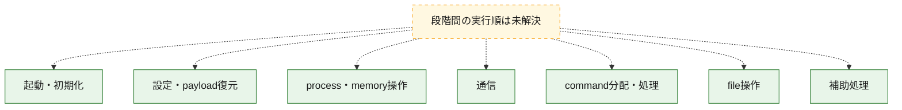
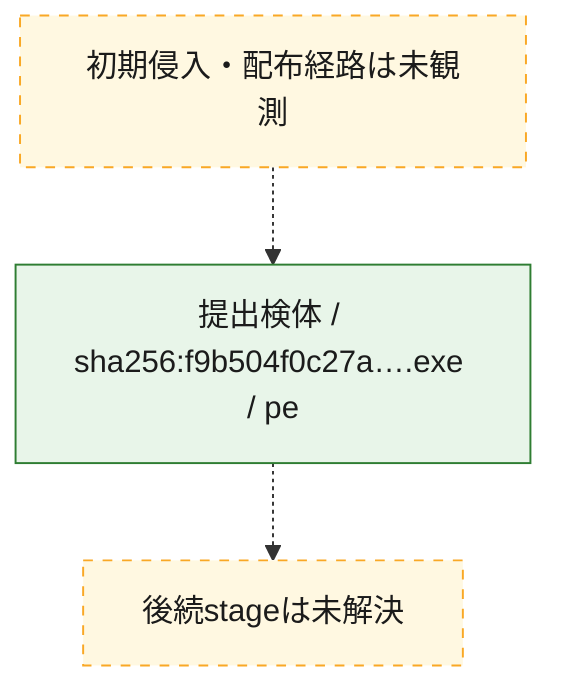
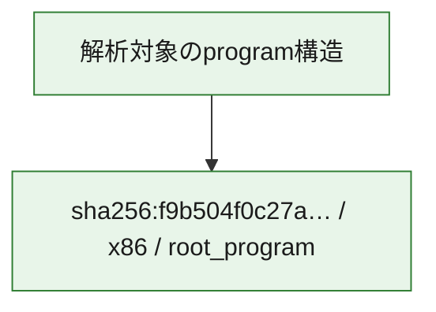

# 全体ロジック：f9b504f0c27ae366d420f81dbcb0a7042ec52c43ac0a025da6d76aa9eb0fa2f5

代表関数の静的証跡から、起動・初期化、設定・payload復元、process・memory操作、通信、command分配・処理、file操作の処理群を確認しました。

## 読み方

- phaseの掲載順は解析上の整理順です。observed_call_edgesがない段階間の実行順を断定しません。
- 図の実線は静的に観測した関係、点線と黄色のノードは未観測・未解決の関係を示します。
- 図は静的な要約であり、動的実行を再現するものではありません。
- 詳細な関数解説とfingerprintは[STATIC-LOGIC.md](STATIC-LOGIC.md)を参照してください。

## 静的可視化

### 実行フロー

### 感染チェーン

### モジュール関係

## 処理段階

### 1. 起動・初期化

entry pointから初期化と後続処理への移行を確認します。
確度: `confirmed_static_function_evidence_with_limits`

- `f9b504f0c27ae366d420f81dbcb0a7042ec52c43ac0a025da6d76aa9eb0fa2f5:ghidra:1400af340` — 初期化と主要処理への分岐を行う入口関数です。 状態: `succeeded`、選定理由: `entry_point`, `meaningful_symbol_name`, `probable_go_main_user_code`, `reviewed_call_centrality:4`, `role:entrypoint`
- `f9b504f0c27ae366d420f81dbcb0a7042ec52c43ac0a025da6d76aa9eb0fa2f5:ghidra:1400af6c0` — 初期化と主要処理への分岐を行う入口関数です。 状態: `succeeded`、選定理由: `entry_point`, `meaningful_symbol_name`, `probable_go_main_user_code`, `reviewed_call_centrality:4`, `role:entrypoint`
- `f9b504f0c27ae366d420f81dbcb0a7042ec52c43ac0a025da6d76aa9eb0fa2f5:ghidra:1400af760` — 初期化と主要処理への分岐を行う入口関数です。 状態: `failed`、選定理由: `entry_point`, `meaningful_symbol_name`, `probable_go_main_user_code`, `role:entrypoint`
- `f9b504f0c27ae366d420f81dbcb0a7042ec52c43ac0a025da6d76aa9eb0fa2f5:ghidra:14010f9e0` — 初期化と主要処理への分岐を行う入口関数です。 状態: `succeeded`、選定理由: `entry_point`, `meaningful_symbol_name`, `probable_go_main_user_code`, `reviewed_call_centrality:16`, `role:entrypoint`
- `f9b504f0c27ae366d420f81dbcb0a7042ec52c43ac0a025da6d76aa9eb0fa2f5:ghidra:140113660` — 初期化と主要処理への分岐を行う入口関数です。 状態: `succeeded`、選定理由: `entry_point`, `meaningful_symbol_name`, `probable_go_main_user_code`, `reviewed_call_centrality:16`, `role:entrypoint`
- `f9b504f0c27ae366d420f81dbcb0a7042ec52c43ac0a025da6d76aa9eb0fa2f5:ghidra:14011b080` — 初期化と主要処理への分岐を行う入口関数です。 状態: `succeeded`、選定理由: `entry_point`, `meaningful_symbol_name`, `probable_go_main_user_code`, `reviewed_call_centrality:16`, `role:entrypoint`
- `f9b504f0c27ae366d420f81dbcb0a7042ec52c43ac0a025da6d76aa9eb0fa2f5:ghidra:14011bca0` — 初期化と主要処理への分岐を行う入口関数です。 状態: `succeeded`、選定理由: `entry_point`, `meaningful_symbol_name`, `probable_go_main_user_code`, `reviewed_call_centrality:16`, `role:entrypoint`
- `f9b504f0c27ae366d420f81dbcb0a7042ec52c43ac0a025da6d76aa9eb0fa2f5:ghidra:1401205a0` — 初期化と主要処理への分岐を行う入口関数です。 状態: `succeeded`、選定理由: `entry_point`, `meaningful_symbol_name`, `probable_go_main_user_code`, `reviewed_call_centrality:17`, `role:entrypoint`
- `f9b504f0c27ae366d420f81dbcb0a7042ec52c43ac0a025da6d76aa9eb0fa2f5:ghidra:140122a40` — 初期化と主要処理への分岐を行う入口関数です。 状態: `succeeded`、選定理由: `entry_point`, `meaningful_symbol_name`, `probable_go_main_user_code`, `reviewed_call_centrality:18`, `role:entrypoint`
- `f9b504f0c27ae366d420f81dbcb0a7042ec52c43ac0a025da6d76aa9eb0fa2f5:ghidra:1401273c0` — 初期化と主要処理への分岐を行う入口関数です。 状態: `succeeded`、選定理由: `entry_point`, `meaningful_symbol_name`, `probable_go_main_user_code`, `reviewed_call_centrality:16`, `role:entrypoint`
- `f9b504f0c27ae366d420f81dbcb0a7042ec52c43ac0a025da6d76aa9eb0fa2f5:ghidra:14012b0e0` — 初期化と主要処理への分岐を行う入口関数です。 状態: `succeeded`、選定理由: `entry_point`, `meaningful_symbol_name`, `probable_go_main_user_code`, `reviewed_call_centrality:16`, `role:entrypoint`
- `f9b504f0c27ae366d420f81dbcb0a7042ec52c43ac0a025da6d76aa9eb0fa2f5:ghidra:14012d560` — 初期化と主要処理への分岐を行う入口関数です。 状態: `succeeded`、選定理由: `entry_point`, `meaningful_symbol_name`, `probable_go_main_user_code`, `reviewed_call_centrality:18`, `role:entrypoint`
- `f9b504f0c27ae366d420f81dbcb0a7042ec52c43ac0a025da6d76aa9eb0fa2f5:ghidra:140131ea0` — 初期化と主要処理への分岐を行う入口関数です。 状態: `succeeded`、選定理由: `entry_point`, `meaningful_symbol_name`, `probable_go_main_user_code`, `reviewed_call_centrality:23`, `role:entrypoint`
- `f9b504f0c27ae366d420f81dbcb0a7042ec52c43ac0a025da6d76aa9eb0fa2f5:ghidra:140136820` — 初期化と主要処理への分岐を行う入口関数です。 状態: `succeeded`、選定理由: `entry_point`, `meaningful_symbol_name`, `probable_go_main_user_code`, `reviewed_call_centrality:17`, `role:entrypoint`
- `f9b504f0c27ae366d420f81dbcb0a7042ec52c43ac0a025da6d76aa9eb0fa2f5:ghidra:14013bd20` — 初期化と主要処理への分岐を行う入口関数です。 状態: `succeeded`、選定理由: `entry_point`, `meaningful_symbol_name`, `probable_go_main_user_code`, `reviewed_call_centrality:17`, `role:entrypoint`
- `f9b504f0c27ae366d420f81dbcb0a7042ec52c43ac0a025da6d76aa9eb0fa2f5:ghidra:14013eda0` — 初期化と主要処理への分岐を行う入口関数です。 状態: `succeeded`、選定理由: `entry_point`, `meaningful_symbol_name`, `probable_go_main_user_code`, `reviewed_call_centrality:21`, `role:entrypoint`
- `f9b504f0c27ae366d420f81dbcb0a7042ec52c43ac0a025da6d76aa9eb0fa2f5:ghidra:14014f940` — 初期化と主要処理への分岐を行う入口関数です。 状態: `succeeded`、選定理由: `entry_point`, `meaningful_symbol_name`, `probable_go_main_user_code`, `reviewed_call_centrality:18`, `role:entrypoint`
- `f9b504f0c27ae366d420f81dbcb0a7042ec52c43ac0a025da6d76aa9eb0fa2f5:ghidra:1401572a0` — 初期化と主要処理への分岐を行う入口関数です。 状態: `succeeded`、選定理由: `entry_point`, `meaningful_symbol_name`, `probable_go_main_user_code`, `reviewed_call_centrality:16`, `role:entrypoint`
- `f9b504f0c27ae366d420f81dbcb0a7042ec52c43ac0a025da6d76aa9eb0fa2f5:ghidra:14015e0e0` — 初期化と主要処理への分岐を行う入口関数です。 状態: `succeeded`、選定理由: `entry_point`, `meaningful_symbol_name`, `probable_go_main_user_code`, `reviewed_call_centrality:17`, `role:entrypoint`
- `f9b504f0c27ae366d420f81dbcb0a7042ec52c43ac0a025da6d76aa9eb0fa2f5:ghidra:1401643e0` — 初期化と主要処理への分岐を行う入口関数です。 状態: `succeeded`、選定理由: `entry_point`, `meaningful_symbol_name`, `probable_go_main_user_code`, `reviewed_call_centrality:19`, `role:entrypoint`
- `f9b504f0c27ae366d420f81dbcb0a7042ec52c43ac0a025da6d76aa9eb0fa2f5:ghidra:14016c9c0` — 初期化と主要処理への分岐を行う入口関数です。 状態: `succeeded`、選定理由: `entry_point`, `meaningful_symbol_name`, `probable_go_main_user_code`, `reviewed_call_centrality:17`, `role:entrypoint`
- `f9b504f0c27ae366d420f81dbcb0a7042ec52c43ac0a025da6d76aa9eb0fa2f5:ghidra:140178c60` — 初期化と主要処理への分岐を行う入口関数です。 状態: `succeeded`、選定理由: `entry_point`, `meaningful_symbol_name`, `probable_go_main_user_code`, `reviewed_call_centrality:17`, `role:entrypoint`
- `f9b504f0c27ae366d420f81dbcb0a7042ec52c43ac0a025da6d76aa9eb0fa2f5:ghidra:1401805a0` — 初期化と主要処理への分岐を行う入口関数です。 状態: `succeeded`、選定理由: `entry_point`, `meaningful_symbol_name`, `probable_go_main_user_code`, `reviewed_call_centrality:16`, `role:entrypoint`
- `f9b504f0c27ae366d420f81dbcb0a7042ec52c43ac0a025da6d76aa9eb0fa2f5:ghidra:140185a60` — 初期化と主要処理への分岐を行う入口関数です。 状態: `failed`、選定理由: `entry_point`, `meaningful_symbol_name`, `probable_go_main_user_code`, `role:entrypoint`
- `f9b504f0c27ae366d420f81dbcb0a7042ec52c43ac0a025da6d76aa9eb0fa2f5:ghidra:1401a2820` — 初期化と主要処理への分岐を行う入口関数です。 状態: `succeeded`、選定理由: `entry_point`, `meaningful_symbol_name`, `probable_go_main_user_code`, `reviewed_call_centrality:17`, `role:entrypoint`

### 2. 設定・payload復元

設定、resource、payload、暗号化データの復元・変換を確認します。
確度: `confirmed_static_function_evidence`

- `f9b504f0c27ae366d420f81dbcb0a7042ec52c43ac0a025da6d76aa9eb0fa2f5:ghidra:140085520` — 設定、resource、payloadなどの解析・変換を行う関数です。 状態: `succeeded`、選定理由: `meaningful_symbol_name`, `reviewed_call_centrality:4`, `role:config_or_data_transform`

### 3. process・memory操作

process、thread、module、memory操作と実行移行を確認します。
確度: `confirmed_static_function_evidence`

- `f9b504f0c27ae366d420f81dbcb0a7042ec52c43ac0a025da6d76aa9eb0fa2f5:ghidra:14009c500` — process、thread、module、またはmemory操作に関係する関数です。 状態: `succeeded`、選定理由: `meaningful_symbol_name`, `reviewed_call_centrality:6`, `role:process_or_memory_operation`

### 4. 通信

通信初期化、endpoint処理、送受信の役割を確認します。
確度: `confirmed_static_function_evidence`

- `f9b504f0c27ae366d420f81dbcb0a7042ec52c43ac0a025da6d76aa9eb0fa2f5:ghidra:14009d2c0` — 通信初期化、送受信、またはendpoint処理に関係する関数です。 状態: `succeeded`、選定理由: `meaningful_symbol_name`, `reviewed_call_centrality:6`, `role:network_communication`

### 5. command分配・処理

受信commandやtaskの解釈、分配、個別handlerへの移行を確認します。
確度: `confirmed_static_function_evidence`

- `f9b504f0c27ae366d420f81dbcb0a7042ec52c43ac0a025da6d76aa9eb0fa2f5:ghidra:14009c020` — commandの解釈、分配、または個別処理を担当する関数です。 状態: `succeeded`、選定理由: `meaningful_symbol_name`, `reviewed_call_centrality:5`, `role:command_dispatch_or_handler`

### 6. file操作

fileやdirectoryの作成、読書き、削除を確認します。
確度: `confirmed_static_function_evidence`

- `f9b504f0c27ae366d420f81dbcb0a7042ec52c43ac0a025da6d76aa9eb0fa2f5:ghidra:14009c7e0` — fileまたはdirectoryの読書き・管理に関係する関数です。 状態: `succeeded`、選定理由: `meaningful_symbol_name`, `reviewed_call_centrality:6`, `role:file_operation`

### 7. 補助処理

主要処理を支える一般内部関数またはlibrary処理を確認します。
確度: `confirmed_static_function_evidence`

- `f9b504f0c27ae366d420f81dbcb0a7042ec52c43ac0a025da6d76aa9eb0fa2f5:ghidra:140001080` — compiler生成処理または汎用library処理とみられる関数です。 状態: `succeeded`、選定理由: `meaningful_symbol_name`, `reviewed_call_centrality:5`
- `f9b504f0c27ae366d420f81dbcb0a7042ec52c43ac0a025da6d76aa9eb0fa2f5:ghidra:140074780` — 検体内部の一般処理を実装する関数です。 状態: `succeeded`、選定理由: `meaningful_symbol_name`, `reviewed_call_centrality:3`

## 観測したcall関係

- `ghidra-function:08c71e5d691071f03d0aa6c4` → `ghidra-external:25f5e0cf0867b9b01d8f8d72` （`unclassified` → `unclassified`）
- `ghidra-function:08c71e5d691071f03d0aa6c4` → `ghidra-external:3062c88efde2f294d1efb15a` （`unclassified` → `unclassified`）
- `ghidra-function:08c71e5d691071f03d0aa6c4` → `ghidra-external:3c3ef25f14b5f879dd95adaa` （`unclassified` → `unclassified`）
- `ghidra-function:08c71e5d691071f03d0aa6c4` → `ghidra-external:4087120a3a7f0d5eb831c1f7` （`unclassified` → `unclassified`）
- `ghidra-function:08c71e5d691071f03d0aa6c4` → `ghidra-external:46ff6fbbc940d115c8246d11` （`unclassified` → `unclassified`）
- `ghidra-function:08c71e5d691071f03d0aa6c4` → `ghidra-external:4c82b0fee76a0852173f8275` （`unclassified` → `unclassified`）
- `ghidra-function:08c71e5d691071f03d0aa6c4` → `ghidra-external:4e4802147f9f6ece87837990` （`unclassified` → `unclassified`）
- `ghidra-function:08c71e5d691071f03d0aa6c4` → `ghidra-external:639b5e480571fcca0a1a5e2c` （`unclassified` → `unclassified`）
- `ghidra-function:08c71e5d691071f03d0aa6c4` → `ghidra-external:67222b905d3ce44f31c25b08` （`unclassified` → `unclassified`）
- `ghidra-function:08c71e5d691071f03d0aa6c4` → `ghidra-external:7e0baf40884ecda7888eac50` （`unclassified` → `unclassified`）
- `ghidra-function:08c71e5d691071f03d0aa6c4` → `ghidra-external:7eee565c8d03046d6e76c4be` （`unclassified` → `unclassified`）
- `ghidra-function:08c71e5d691071f03d0aa6c4` → `ghidra-external:8291b14bd0880f1993e04e63` （`unclassified` → `unclassified`）
- `ghidra-function:08c71e5d691071f03d0aa6c4` → `ghidra-external:88b654432a630c62f2a11ad3` （`unclassified` → `unclassified`）
- `ghidra-function:08c71e5d691071f03d0aa6c4` → `ghidra-external:9de1728db1c960e41e6a1f9c` （`unclassified` → `unclassified`）
- `ghidra-function:08c71e5d691071f03d0aa6c4` → `ghidra-external:d8aa1e2e14835191ed725361` （`unclassified` → `unclassified`）
- `ghidra-function:08c71e5d691071f03d0aa6c4` → `ghidra-external:eaab8d13238f2b4048a216d2` （`unclassified` → `unclassified`）
- `ghidra-function:09dac01d87bca8c85de44f4a` → `ghidra-external:19c4a2a2cae5d6a7f2b2b54f` （`unclassified` → `unclassified`）
- `ghidra-function:09dac01d87bca8c85de44f4a` → `ghidra-external:25f5e0cf0867b9b01d8f8d72` （`unclassified` → `unclassified`）
- `ghidra-function:09dac01d87bca8c85de44f4a` → `ghidra-external:3c3ef25f14b5f879dd95adaa` （`unclassified` → `unclassified`）
- `ghidra-function:09dac01d87bca8c85de44f4a` → `ghidra-external:4087120a3a7f0d5eb831c1f7` （`unclassified` → `unclassified`）
- `ghidra-function:09dac01d87bca8c85de44f4a` → `ghidra-external:46ff6fbbc940d115c8246d11` （`unclassified` → `unclassified`）
- `ghidra-function:09dac01d87bca8c85de44f4a` → `ghidra-external:4c82b0fee76a0852173f8275` （`unclassified` → `unclassified`）
- `ghidra-function:09dac01d87bca8c85de44f4a` → `ghidra-external:4e4802147f9f6ece87837990` （`unclassified` → `unclassified`）
- `ghidra-function:09dac01d87bca8c85de44f4a` → `ghidra-external:639b5e480571fcca0a1a5e2c` （`unclassified` → `unclassified`）
- `ghidra-function:09dac01d87bca8c85de44f4a` → `ghidra-external:67222b905d3ce44f31c25b08` （`unclassified` → `unclassified`）
- `ghidra-function:09dac01d87bca8c85de44f4a` → `ghidra-external:726204d6988c1542a73825f7` （`unclassified` → `unclassified`）
- `ghidra-function:09dac01d87bca8c85de44f4a` → `ghidra-external:7e0baf40884ecda7888eac50` （`unclassified` → `unclassified`）
- `ghidra-function:09dac01d87bca8c85de44f4a` → `ghidra-external:7eee565c8d03046d6e76c4be` （`unclassified` → `unclassified`）
- `ghidra-function:09dac01d87bca8c85de44f4a` → `ghidra-external:8291b14bd0880f1993e04e63` （`unclassified` → `unclassified`）
- `ghidra-function:09dac01d87bca8c85de44f4a` → `ghidra-external:88b654432a630c62f2a11ad3` （`unclassified` → `unclassified`）
- `ghidra-function:09dac01d87bca8c85de44f4a` → `ghidra-external:9b82c9e49e25d14cadfe5862` （`unclassified` → `unclassified`）
- `ghidra-function:09dac01d87bca8c85de44f4a` → `ghidra-external:9de1728db1c960e41e6a1f9c` （`unclassified` → `unclassified`）
- `ghidra-function:09dac01d87bca8c85de44f4a` → `ghidra-external:adec0445a17233534379ec44` （`unclassified` → `unclassified`）
- `ghidra-function:09dac01d87bca8c85de44f4a` → `ghidra-external:d8aa1e2e14835191ed725361` （`unclassified` → `unclassified`）
- `ghidra-function:09dac01d87bca8c85de44f4a` → `ghidra-external:eaab8d13238f2b4048a216d2` （`unclassified` → `unclassified`）
- `ghidra-function:26d660cba67017b86b67cb34` → `ghidra-external:25f5e0cf0867b9b01d8f8d72` （`unclassified` → `unclassified`）
- `ghidra-function:26d660cba67017b86b67cb34` → `ghidra-external:3c3ef25f14b5f879dd95adaa` （`unclassified` → `unclassified`）
- `ghidra-function:26d660cba67017b86b67cb34` → `ghidra-external:4087120a3a7f0d5eb831c1f7` （`unclassified` → `unclassified`）
- `ghidra-function:26d660cba67017b86b67cb34` → `ghidra-external:46ff6fbbc940d115c8246d11` （`unclassified` → `unclassified`）
- `ghidra-function:26d660cba67017b86b67cb34` → `ghidra-external:4c82b0fee76a0852173f8275` （`unclassified` → `unclassified`）
- `ghidra-function:26d660cba67017b86b67cb34` → `ghidra-external:4e4802147f9f6ece87837990` （`unclassified` → `unclassified`）
- `ghidra-function:26d660cba67017b86b67cb34` → `ghidra-external:639b5e480571fcca0a1a5e2c` （`unclassified` → `unclassified`）
- `ghidra-function:26d660cba67017b86b67cb34` → `ghidra-external:67222b905d3ce44f31c25b08` （`unclassified` → `unclassified`）
- `ghidra-function:26d660cba67017b86b67cb34` → `ghidra-external:6dbcf8a2b3a9b796e2babb98` （`unclassified` → `unclassified`）
- `ghidra-function:26d660cba67017b86b67cb34` → `ghidra-external:7e0baf40884ecda7888eac50` （`unclassified` → `unclassified`）
- `ghidra-function:26d660cba67017b86b67cb34` → `ghidra-external:7eee565c8d03046d6e76c4be` （`unclassified` → `unclassified`）
- `ghidra-function:26d660cba67017b86b67cb34` → `ghidra-external:8291b14bd0880f1993e04e63` （`unclassified` → `unclassified`）
- `ghidra-function:26d660cba67017b86b67cb34` → `ghidra-external:88b654432a630c62f2a11ad3` （`unclassified` → `unclassified`）
- `ghidra-function:26d660cba67017b86b67cb34` → `ghidra-external:9de1728db1c960e41e6a1f9c` （`unclassified` → `unclassified`）
- `ghidra-function:26d660cba67017b86b67cb34` → `ghidra-external:d8aa1e2e14835191ed725361` （`unclassified` → `unclassified`）
- `ghidra-function:26d660cba67017b86b67cb34` → `ghidra-external:eaab8d13238f2b4048a216d2` （`unclassified` → `unclassified`）
- `ghidra-function:26d660cba67017b86b67cb34` → `ghidra-external:fb432ebc309a2d14c208ce97` （`unclassified` → `unclassified`）
- `ghidra-function:2f83997b08e0b9aed071c889` → `ghidra-external:25f5e0cf0867b9b01d8f8d72` （`unclassified` → `unclassified`）
- `ghidra-function:2f83997b08e0b9aed071c889` → `ghidra-external:3c3ef25f14b5f879dd95adaa` （`unclassified` → `unclassified`）
- `ghidra-function:2f83997b08e0b9aed071c889` → `ghidra-external:4087120a3a7f0d5eb831c1f7` （`unclassified` → `unclassified`）
- `ghidra-function:2f83997b08e0b9aed071c889` → `ghidra-external:46ff6fbbc940d115c8246d11` （`unclassified` → `unclassified`）
- `ghidra-function:2f83997b08e0b9aed071c889` → `ghidra-external:4c82b0fee76a0852173f8275` （`unclassified` → `unclassified`）
- `ghidra-function:2f83997b08e0b9aed071c889` → `ghidra-external:4e4802147f9f6ece87837990` （`unclassified` → `unclassified`）
- `ghidra-function:2f83997b08e0b9aed071c889` → `ghidra-external:639b5e480571fcca0a1a5e2c` （`unclassified` → `unclassified`）
- `ghidra-function:2f83997b08e0b9aed071c889` → `ghidra-external:67222b905d3ce44f31c25b08` （`unclassified` → `unclassified`）
- `ghidra-function:2f83997b08e0b9aed071c889` → `ghidra-external:6dbcf8a2b3a9b796e2babb98` （`unclassified` → `unclassified`）
- `ghidra-function:2f83997b08e0b9aed071c889` → `ghidra-external:7e0baf40884ecda7888eac50` （`unclassified` → `unclassified`）
- `ghidra-function:2f83997b08e0b9aed071c889` → `ghidra-external:7eee565c8d03046d6e76c4be` （`unclassified` → `unclassified`）
- `ghidra-function:2f83997b08e0b9aed071c889` → `ghidra-external:8291b14bd0880f1993e04e63` （`unclassified` → `unclassified`）
- `ghidra-function:2f83997b08e0b9aed071c889` → `ghidra-external:88b654432a630c62f2a11ad3` （`unclassified` → `unclassified`）
- `ghidra-function:2f83997b08e0b9aed071c889` → `ghidra-external:9de1728db1c960e41e6a1f9c` （`unclassified` → `unclassified`）
- `ghidra-function:2f83997b08e0b9aed071c889` → `ghidra-external:a45aa9e0ae9eff2affec2aaf` （`unclassified` → `unclassified`）
- `ghidra-function:2f83997b08e0b9aed071c889` → `ghidra-external:d8aa1e2e14835191ed725361` （`unclassified` → `unclassified`）
- `ghidra-function:2f83997b08e0b9aed071c889` → `ghidra-external:eaab8d13238f2b4048a216d2` （`unclassified` → `unclassified`）
- `ghidra-function:40337a9075bd47b2e7258678` → `ghidra-external:008443ec197aa2809fd237bf` （`unclassified` → `unclassified`）
- `ghidra-function:40337a9075bd47b2e7258678` → `ghidra-external:25f5e0cf0867b9b01d8f8d72` （`unclassified` → `unclassified`）
- `ghidra-function:40337a9075bd47b2e7258678` → `ghidra-external:3c3ef25f14b5f879dd95adaa` （`unclassified` → `unclassified`）
- `ghidra-function:40337a9075bd47b2e7258678` → `ghidra-external:4087120a3a7f0d5eb831c1f7` （`unclassified` → `unclassified`）
- `ghidra-function:40337a9075bd47b2e7258678` → `ghidra-external:46ff6fbbc940d115c8246d11` （`unclassified` → `unclassified`）
- `ghidra-function:40337a9075bd47b2e7258678` → `ghidra-external:4c82b0fee76a0852173f8275` （`unclassified` → `unclassified`）
- `ghidra-function:40337a9075bd47b2e7258678` → `ghidra-external:4e4802147f9f6ece87837990` （`unclassified` → `unclassified`）
- `ghidra-function:40337a9075bd47b2e7258678` → `ghidra-external:639b5e480571fcca0a1a5e2c` （`unclassified` → `unclassified`）
- `ghidra-function:40337a9075bd47b2e7258678` → `ghidra-external:67222b905d3ce44f31c25b08` （`unclassified` → `unclassified`）
- `ghidra-function:40337a9075bd47b2e7258678` → `ghidra-external:7e0baf40884ecda7888eac50` （`unclassified` → `unclassified`）
- `ghidra-function:40337a9075bd47b2e7258678` → `ghidra-external:7eee565c8d03046d6e76c4be` （`unclassified` → `unclassified`）
- `ghidra-function:40337a9075bd47b2e7258678` → `ghidra-external:8291b14bd0880f1993e04e63` （`unclassified` → `unclassified`）
- `ghidra-function:40337a9075bd47b2e7258678` → `ghidra-external:88b654432a630c62f2a11ad3` （`unclassified` → `unclassified`）
- `ghidra-function:40337a9075bd47b2e7258678` → `ghidra-external:9de1728db1c960e41e6a1f9c` （`unclassified` → `unclassified`）
- `ghidra-function:40337a9075bd47b2e7258678` → `ghidra-external:d8aa1e2e14835191ed725361` （`unclassified` → `unclassified`）
- `ghidra-function:40337a9075bd47b2e7258678` → `ghidra-external:eaab8d13238f2b4048a216d2` （`unclassified` → `unclassified`）
- `ghidra-function:41fceb1c0c329c9656f8e553` → `ghidra-external:25f5e0cf0867b9b01d8f8d72` （`unclassified` → `unclassified`）
- `ghidra-function:41fceb1c0c329c9656f8e553` → `ghidra-external:308eebdc9d6d028e5fe4db26` （`unclassified` → `unclassified`）
- `ghidra-function:41fceb1c0c329c9656f8e553` → `ghidra-external:3c3ef25f14b5f879dd95adaa` （`unclassified` → `unclassified`）
- `ghidra-function:41fceb1c0c329c9656f8e553` → `ghidra-external:4087120a3a7f0d5eb831c1f7` （`unclassified` → `unclassified`）
- `ghidra-function:41fceb1c0c329c9656f8e553` → `ghidra-external:46ff6fbbc940d115c8246d11` （`unclassified` → `unclassified`）
- `ghidra-function:41fceb1c0c329c9656f8e553` → `ghidra-external:4c82b0fee76a0852173f8275` （`unclassified` → `unclassified`）
- `ghidra-function:41fceb1c0c329c9656f8e553` → `ghidra-external:4e4802147f9f6ece87837990` （`unclassified` → `unclassified`）
- `ghidra-function:41fceb1c0c329c9656f8e553` → `ghidra-external:639b5e480571fcca0a1a5e2c` （`unclassified` → `unclassified`）
- `ghidra-function:41fceb1c0c329c9656f8e553` → `ghidra-external:67222b905d3ce44f31c25b08` （`unclassified` → `unclassified`）
- `ghidra-function:41fceb1c0c329c9656f8e553` → `ghidra-external:7e0baf40884ecda7888eac50` （`unclassified` → `unclassified`）
- `ghidra-function:41fceb1c0c329c9656f8e553` → `ghidra-external:7eee565c8d03046d6e76c4be` （`unclassified` → `unclassified`）
- `ghidra-function:41fceb1c0c329c9656f8e553` → `ghidra-external:8291b14bd0880f1993e04e63` （`unclassified` → `unclassified`）
- `ghidra-function:41fceb1c0c329c9656f8e553` → `ghidra-external:88b654432a630c62f2a11ad3` （`unclassified` → `unclassified`）
- `ghidra-function:41fceb1c0c329c9656f8e553` → `ghidra-external:9de1728db1c960e41e6a1f9c` （`unclassified` → `unclassified`）
- `ghidra-function:41fceb1c0c329c9656f8e553` → `ghidra-external:d8aa1e2e14835191ed725361` （`unclassified` → `unclassified`）
- `ghidra-function:41fceb1c0c329c9656f8e553` → `ghidra-external:eaab8d13238f2b4048a216d2` （`unclassified` → `unclassified`）
- `ghidra-function:44ac829feca74a81facc753f` → `ghidra-external:19c4a2a2cae5d6a7f2b2b54f` （`unclassified` → `unclassified`）
- `ghidra-function:44ac829feca74a81facc753f` → `ghidra-external:25f5e0cf0867b9b01d8f8d72` （`unclassified` → `unclassified`）
- `ghidra-function:44ac829feca74a81facc753f` → `ghidra-external:3c3ef25f14b5f879dd95adaa` （`unclassified` → `unclassified`）
- `ghidra-function:44ac829feca74a81facc753f` → `ghidra-external:4087120a3a7f0d5eb831c1f7` （`unclassified` → `unclassified`）
- `ghidra-function:44ac829feca74a81facc753f` → `ghidra-external:46ff6fbbc940d115c8246d11` （`unclassified` → `unclassified`）
- `ghidra-function:44ac829feca74a81facc753f` → `ghidra-external:4c82b0fee76a0852173f8275` （`unclassified` → `unclassified`）
- `ghidra-function:44ac829feca74a81facc753f` → `ghidra-external:4e4802147f9f6ece87837990` （`unclassified` → `unclassified`）
- `ghidra-function:44ac829feca74a81facc753f` → `ghidra-external:639b5e480571fcca0a1a5e2c` （`unclassified` → `unclassified`）
- `ghidra-function:44ac829feca74a81facc753f` → `ghidra-external:67222b905d3ce44f31c25b08` （`unclassified` → `unclassified`）
- `ghidra-function:44ac829feca74a81facc753f` → `ghidra-external:7e0baf40884ecda7888eac50` （`unclassified` → `unclassified`）
- `ghidra-function:44ac829feca74a81facc753f` → `ghidra-external:7eee565c8d03046d6e76c4be` （`unclassified` → `unclassified`）
- `ghidra-function:44ac829feca74a81facc753f` → `ghidra-external:8291b14bd0880f1993e04e63` （`unclassified` → `unclassified`）
- `ghidra-function:44ac829feca74a81facc753f` → `ghidra-external:88b654432a630c62f2a11ad3` （`unclassified` → `unclassified`）
- `ghidra-function:44ac829feca74a81facc753f` → `ghidra-external:9de1728db1c960e41e6a1f9c` （`unclassified` → `unclassified`）
- `ghidra-function:44ac829feca74a81facc753f` → `ghidra-external:cabd1b1bb7ffbd8f70ec0dc1` （`unclassified` → `unclassified`）
- `ghidra-function:44ac829feca74a81facc753f` → `ghidra-external:d8aa1e2e14835191ed725361` （`unclassified` → `unclassified`）
- `ghidra-function:44ac829feca74a81facc753f` → `ghidra-external:eaab8d13238f2b4048a216d2` （`unclassified` → `unclassified`）
- `ghidra-function:44ac829feca74a81facc753f` → `ghidra-external:ed41268ed93ed6ef6dc215a6` （`unclassified` → `unclassified`）
- `ghidra-function:4586e7fe4f193848d37b9db5` → `ghidra-external:25f5e0cf0867b9b01d8f8d72` （`unclassified` → `unclassified`）
- `ghidra-function:4586e7fe4f193848d37b9db5` → `ghidra-external:3c3ef25f14b5f879dd95adaa` （`unclassified` → `unclassified`）
- `ghidra-function:4586e7fe4f193848d37b9db5` → `ghidra-external:4087120a3a7f0d5eb831c1f7` （`unclassified` → `unclassified`）
- `ghidra-function:4586e7fe4f193848d37b9db5` → `ghidra-external:46ff6fbbc940d115c8246d11` （`unclassified` → `unclassified`）
- `ghidra-function:4586e7fe4f193848d37b9db5` → `ghidra-external:4c82b0fee76a0852173f8275` （`unclassified` → `unclassified`）
- `ghidra-function:4586e7fe4f193848d37b9db5` → `ghidra-external:4e4802147f9f6ece87837990` （`unclassified` → `unclassified`）
- `ghidra-function:4586e7fe4f193848d37b9db5` → `ghidra-external:639b5e480571fcca0a1a5e2c` （`unclassified` → `unclassified`）
- `ghidra-function:4586e7fe4f193848d37b9db5` → `ghidra-external:67222b905d3ce44f31c25b08` （`unclassified` → `unclassified`）
- `ghidra-function:4586e7fe4f193848d37b9db5` → `ghidra-external:7e0baf40884ecda7888eac50` （`unclassified` → `unclassified`）
- `ghidra-function:4586e7fe4f193848d37b9db5` → `ghidra-external:7eee565c8d03046d6e76c4be` （`unclassified` → `unclassified`）
- `ghidra-function:4586e7fe4f193848d37b9db5` → `ghidra-external:8291b14bd0880f1993e04e63` （`unclassified` → `unclassified`）
- `ghidra-function:4586e7fe4f193848d37b9db5` → `ghidra-external:88b654432a630c62f2a11ad3` （`unclassified` → `unclassified`）
- `ghidra-function:4586e7fe4f193848d37b9db5` → `ghidra-external:9de1728db1c960e41e6a1f9c` （`unclassified` → `unclassified`）
- `ghidra-function:4586e7fe4f193848d37b9db5` → `ghidra-external:d3e9085336c0ed64253f65db` （`unclassified` → `unclassified`）
- `ghidra-function:4586e7fe4f193848d37b9db5` → `ghidra-external:d8aa1e2e14835191ed725361` （`unclassified` → `unclassified`）
- `ghidra-function:4586e7fe4f193848d37b9db5` → `ghidra-external:eaab8d13238f2b4048a216d2` （`unclassified` → `unclassified`）
- `ghidra-function:5044e5f09de118628c3e1257` → `ghidra-external:25f5e0cf0867b9b01d8f8d72` （`unclassified` → `unclassified`）
- `ghidra-function:5044e5f09de118628c3e1257` → `ghidra-external:3c3ef25f14b5f879dd95adaa` （`unclassified` → `unclassified`）
- `ghidra-function:5044e5f09de118628c3e1257` → `ghidra-external:4087120a3a7f0d5eb831c1f7` （`unclassified` → `unclassified`）
- `ghidra-function:5044e5f09de118628c3e1257` → `ghidra-external:46ff6fbbc940d115c8246d11` （`unclassified` → `unclassified`）
- `ghidra-function:5044e5f09de118628c3e1257` → `ghidra-external:4c82b0fee76a0852173f8275` （`unclassified` → `unclassified`）
- `ghidra-function:5044e5f09de118628c3e1257` → `ghidra-external:4e4802147f9f6ece87837990` （`unclassified` → `unclassified`）
- `ghidra-function:5044e5f09de118628c3e1257` → `ghidra-external:639b5e480571fcca0a1a5e2c` （`unclassified` → `unclassified`）
- `ghidra-function:5044e5f09de118628c3e1257` → `ghidra-external:67222b905d3ce44f31c25b08` （`unclassified` → `unclassified`）
- `ghidra-function:5044e5f09de118628c3e1257` → `ghidra-external:787026e0edec7f8e49027e70` （`unclassified` → `unclassified`）
- `ghidra-function:5044e5f09de118628c3e1257` → `ghidra-external:7e0baf40884ecda7888eac50` （`unclassified` → `unclassified`）
- `ghidra-function:5044e5f09de118628c3e1257` → `ghidra-external:7eee565c8d03046d6e76c4be` （`unclassified` → `unclassified`）
- `ghidra-function:5044e5f09de118628c3e1257` → `ghidra-external:8291b14bd0880f1993e04e63` （`unclassified` → `unclassified`）
- `ghidra-function:5044e5f09de118628c3e1257` → `ghidra-external:88b654432a630c62f2a11ad3` （`unclassified` → `unclassified`）
- `ghidra-function:5044e5f09de118628c3e1257` → `ghidra-external:9de1728db1c960e41e6a1f9c` （`unclassified` → `unclassified`）
- `ghidra-function:5044e5f09de118628c3e1257` → `ghidra-external:d8aa1e2e14835191ed725361` （`unclassified` → `unclassified`）
- `ghidra-function:5044e5f09de118628c3e1257` → `ghidra-external:eaab8d13238f2b4048a216d2` （`unclassified` → `unclassified`）
- `ghidra-function:52c41ad00ae9c459928cfd70` → `ghidra-external:19c4a2a2cae5d6a7f2b2b54f` （`unclassified` → `unclassified`）
- `ghidra-function:52c41ad00ae9c459928cfd70` → `ghidra-external:25f5e0cf0867b9b01d8f8d72` （`unclassified` → `unclassified`）
- `ghidra-function:52c41ad00ae9c459928cfd70` → `ghidra-external:3c3ef25f14b5f879dd95adaa` （`unclassified` → `unclassified`）
- `ghidra-function:52c41ad00ae9c459928cfd70` → `ghidra-external:4087120a3a7f0d5eb831c1f7` （`unclassified` → `unclassified`）
- `ghidra-function:52c41ad00ae9c459928cfd70` → `ghidra-external:41105bd9b5a8bb5063e5e698` （`unclassified` → `unclassified`）
- `ghidra-function:52c41ad00ae9c459928cfd70` → `ghidra-external:46ff6fbbc940d115c8246d11` （`unclassified` → `unclassified`）
- `ghidra-function:52c41ad00ae9c459928cfd70` → `ghidra-external:4c82b0fee76a0852173f8275` （`unclassified` → `unclassified`）
- `ghidra-function:52c41ad00ae9c459928cfd70` → `ghidra-external:4e4802147f9f6ece87837990` （`unclassified` → `unclassified`）
- `ghidra-function:52c41ad00ae9c459928cfd70` → `ghidra-external:639b5e480571fcca0a1a5e2c` （`unclassified` → `unclassified`）
- `ghidra-function:52c41ad00ae9c459928cfd70` → `ghidra-external:67222b905d3ce44f31c25b08` （`unclassified` → `unclassified`）
- `ghidra-function:52c41ad00ae9c459928cfd70` → `ghidra-external:7e0baf40884ecda7888eac50` （`unclassified` → `unclassified`）
- `ghidra-function:52c41ad00ae9c459928cfd70` → `ghidra-external:7eee565c8d03046d6e76c4be` （`unclassified` → `unclassified`）
- `ghidra-function:52c41ad00ae9c459928cfd70` → `ghidra-external:8291b14bd0880f1993e04e63` （`unclassified` → `unclassified`）
- `ghidra-function:52c41ad00ae9c459928cfd70` → `ghidra-external:88b654432a630c62f2a11ad3` （`unclassified` → `unclassified`）
- `ghidra-function:52c41ad00ae9c459928cfd70` → `ghidra-external:9de1728db1c960e41e6a1f9c` （`unclassified` → `unclassified`）
- `ghidra-function:52c41ad00ae9c459928cfd70` → `ghidra-external:d8aa1e2e14835191ed725361` （`unclassified` → `unclassified`）
- `ghidra-function:52c41ad00ae9c459928cfd70` → `ghidra-external:eaab8d13238f2b4048a216d2` （`unclassified` → `unclassified`）
- `ghidra-function:638767c7d67bb9e410c20aa7` → `ghidra-external:25f5e0cf0867b9b01d8f8d72` （`unclassified` → `unclassified`）
- `ghidra-function:638767c7d67bb9e410c20aa7` → `ghidra-external:3c3ef25f14b5f879dd95adaa` （`unclassified` → `unclassified`）
- `ghidra-function:638767c7d67bb9e410c20aa7` → `ghidra-external:4087120a3a7f0d5eb831c1f7` （`unclassified` → `unclassified`）
- `ghidra-function:638767c7d67bb9e410c20aa7` → `ghidra-external:46ff6fbbc940d115c8246d11` （`unclassified` → `unclassified`）
- `ghidra-function:638767c7d67bb9e410c20aa7` → `ghidra-external:4c82b0fee76a0852173f8275` （`unclassified` → `unclassified`）
- `ghidra-function:638767c7d67bb9e410c20aa7` → `ghidra-external:4e4802147f9f6ece87837990` （`unclassified` → `unclassified`）
- `ghidra-function:638767c7d67bb9e410c20aa7` → `ghidra-external:639b5e480571fcca0a1a5e2c` （`unclassified` → `unclassified`）
- `ghidra-function:638767c7d67bb9e410c20aa7` → `ghidra-external:67222b905d3ce44f31c25b08` （`unclassified` → `unclassified`）
- `ghidra-function:638767c7d67bb9e410c20aa7` → `ghidra-external:7e0baf40884ecda7888eac50` （`unclassified` → `unclassified`）
- `ghidra-function:638767c7d67bb9e410c20aa7` → `ghidra-external:7eee565c8d03046d6e76c4be` （`unclassified` → `unclassified`）
- `ghidra-function:638767c7d67bb9e410c20aa7` → `ghidra-external:8291b14bd0880f1993e04e63` （`unclassified` → `unclassified`）
- `ghidra-function:638767c7d67bb9e410c20aa7` → `ghidra-external:88b654432a630c62f2a11ad3` （`unclassified` → `unclassified`）
- `ghidra-function:638767c7d67bb9e410c20aa7` → `ghidra-external:9de1728db1c960e41e6a1f9c` （`unclassified` → `unclassified`）
- `ghidra-function:638767c7d67bb9e410c20aa7` → `ghidra-external:d8aa1e2e14835191ed725361` （`unclassified` → `unclassified`）
- `ghidra-function:638767c7d67bb9e410c20aa7` → `ghidra-external:e445cec3afea51e0b4f5799a` （`unclassified` → `unclassified`）
- `ghidra-function:638767c7d67bb9e410c20aa7` → `ghidra-external:eaab8d13238f2b4048a216d2` （`unclassified` → `unclassified`）
- `ghidra-function:6c91e05bbb6f1b400a5ef777` → `ghidra-external:05cbf9d930cb5acb95da51f2` （`unclassified` → `unclassified`）
- `ghidra-function:6c91e05bbb6f1b400a5ef777` → `ghidra-external:25f5e0cf0867b9b01d8f8d72` （`unclassified` → `unclassified`）
- `ghidra-function:6c91e05bbb6f1b400a5ef777` → `ghidra-external:3c3ef25f14b5f879dd95adaa` （`unclassified` → `unclassified`）
- `ghidra-function:6c91e05bbb6f1b400a5ef777` → `ghidra-external:4087120a3a7f0d5eb831c1f7` （`unclassified` → `unclassified`）
- `ghidra-function:6c91e05bbb6f1b400a5ef777` → `ghidra-external:46ff6fbbc940d115c8246d11` （`unclassified` → `unclassified`）
- `ghidra-function:6c91e05bbb6f1b400a5ef777` → `ghidra-external:4c82b0fee76a0852173f8275` （`unclassified` → `unclassified`）
- `ghidra-function:6c91e05bbb6f1b400a5ef777` → `ghidra-external:4e4802147f9f6ece87837990` （`unclassified` → `unclassified`）
- `ghidra-function:6c91e05bbb6f1b400a5ef777` → `ghidra-external:638006f8392a87a47c318ed7` （`unclassified` → `unclassified`）
- `ghidra-function:6c91e05bbb6f1b400a5ef777` → `ghidra-external:639b5e480571fcca0a1a5e2c` （`unclassified` → `unclassified`）
- `ghidra-function:6c91e05bbb6f1b400a5ef777` → `ghidra-external:666601531fd632d16e002fde` （`unclassified` → `unclassified`）
- `ghidra-function:6c91e05bbb6f1b400a5ef777` → `ghidra-external:67222b905d3ce44f31c25b08` （`unclassified` → `unclassified`）
- `ghidra-function:6c91e05bbb6f1b400a5ef777` → `ghidra-external:6dbcf8a2b3a9b796e2babb98` （`unclassified` → `unclassified`）
- `ghidra-function:6c91e05bbb6f1b400a5ef777` → `ghidra-external:7d0cb457f1228b0df6285cd7` （`unclassified` → `unclassified`）
- `ghidra-function:6c91e05bbb6f1b400a5ef777` → `ghidra-external:7e0baf40884ecda7888eac50` （`unclassified` → `unclassified`）
- `ghidra-function:6c91e05bbb6f1b400a5ef777` → `ghidra-external:7eee565c8d03046d6e76c4be` （`unclassified` → `unclassified`）
- `ghidra-function:6c91e05bbb6f1b400a5ef777` → `ghidra-external:8291b14bd0880f1993e04e63` （`unclassified` → `unclassified`）
- 残り207件は`static-logic.json`に記録しています。

## 解析範囲と制約

- 選定外関数は全体inventoryへ残しますが、関数本体の個別解説対象にはしていません。
- indirect call、難読化、packer、VM、壊れたcontrol flowによりcall関係が欠落する場合があります。
- 文書は静的解析に基づき、検体実行や外部通信による動的確認は行っていません。
