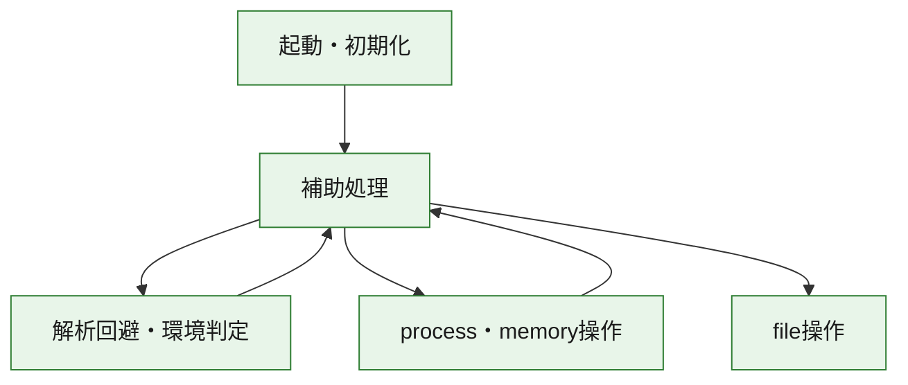
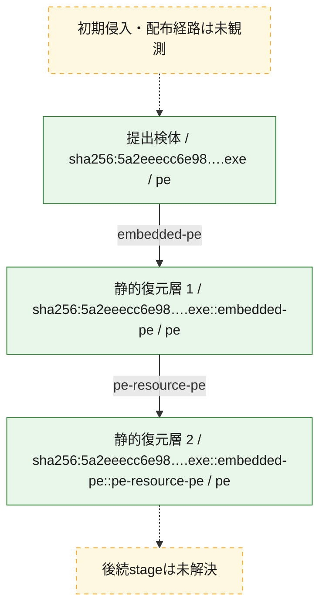
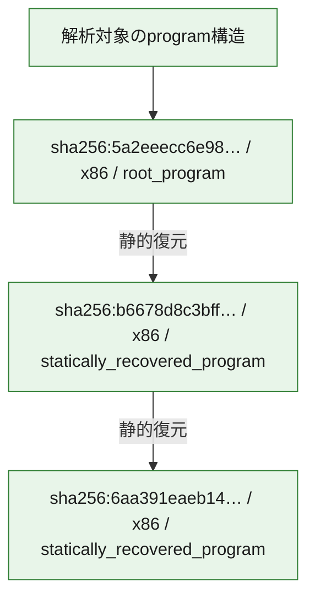

# 全体ロジック：5a2eeecc6e9890ba62bdae25a8ea1451d800f347f69e0edc60814511d481ce96

代表関数の静的証跡から、起動・初期化、解析回避・環境判定、process・memory操作、file操作の処理群を確認しました。

## 読み方

- phaseの掲載順は解析上の整理順です。observed_call_edgesがない段階間の実行順を断定しません。
- 図の実線は静的に観測した関係、点線と黄色のノードは未観測・未解決の関係を示します。
- 図は静的な要約であり、動的実行を再現するものではありません。
- 詳細な関数解説とfingerprintは[STATIC-LOGIC.md](STATIC-LOGIC.md)を参照してください。

## 静的可視化

### 実行フロー

### 感染チェーン

### モジュール関係

## 処理段階

### 1. 起動・初期化

entry pointから初期化と後続処理への移行を確認します。
確度: `confirmed_static_function_evidence`

- `6aa391eaeb14237e961f5d8a0a5ee9cc9acbf9c1055f813df1dd408356e0f973:ghidra:004077ba` — 初期化と主要処理への分岐を行う入口関数です。 状態: `succeeded`、選定理由: `entry_point`, `large_function:instructions=111`, `meaningful_symbol_name`, `reviewed_call_centrality:21`, `role:entrypoint`, `small_program_complete_context`
- `b6678d8c3bffce346d112ee91fe2628df8bce7d92a83944129bbe8c2b51bbcc2:ghidra:00409a16` — 初期化と主要処理への分岐を行う入口関数です。 状態: `succeeded`、選定理由: `call_graph_centrality:in=0,out=2`, `entry_point`, `large_function:instructions=111`, `meaningful_symbol_name`, `reviewed_call_centrality:22`, `reviewed_call_centrality:4`, `role:entrypoint`, `small_program_complete_context`
- `5a2eeecc6e9890ba62bdae25a8ea1451d800f347f69e0edc60814511d481ce96:ghidra:1800015ec` — 初期化と主要処理への分岐を行う入口関数です。 状態: `succeeded`、選定理由: `entry_point`, `meaningful_symbol_name`, `reviewed_call_centrality:4`, `role:entrypoint`

### 2. 解析回避・環境判定

debugger、sandbox、仮想環境、時間差などの判定を確認します。
確度: `confirmed_static_function_evidence`

- `5a2eeecc6e9890ba62bdae25a8ea1451d800f347f69e0edc60814511d481ce96:ghidra:180002448` — debugger、仮想環境、sandbox、または時間差の確認に関係する関数です。 状態: `succeeded`、選定理由: `context_representative`, `reviewed_call_centrality:14`, `role:anti_analysis`

### 3. process・memory操作

process、thread、module、memory操作と実行移行を確認します。
確度: `confirmed_static_function_evidence`

- `5a2eeecc6e9890ba62bdae25a8ea1451d800f347f69e0edc60814511d481ce96:ghidra:1800010f8` — process、thread、module、またはmemory操作に関係する関数です。 状態: `succeeded`、選定理由: `context_representative`, `reviewed_call_centrality:6`, `role:process_or_memory_operation`

### 4. file操作

fileやdirectoryの作成、読書き、削除を確認します。
確度: `confirmed_static_function_evidence`

- `5a2eeecc6e9890ba62bdae25a8ea1451d800f347f69e0edc60814511d481ce96:ghidra:180001014` — fileまたはdirectoryの読書き・管理に関係する関数です。 状態: `succeeded`、選定理由: `context_representative`, `reviewed_call_centrality:16`, `role:file_operation`

### 5. 補助処理

主要処理を支える一般内部関数またはlibrary処理を確認します。
確度: `confirmed_static_function_evidence_with_limits`

- `5a2eeecc6e9890ba62bdae25a8ea1451d800f347f69e0edc60814511d481ce96:ghidra:1800011a4` — 検体内部の一般処理を実装する関数です。 状態: `succeeded`、選定理由: `entry_point`, `meaningful_symbol_name`, `reviewed_call_centrality:3`
- `5a2eeecc6e9890ba62bdae25a8ea1451d800f347f69e0edc60814511d481ce96:ghidra:1800011f0` — 検体内部の一般処理を実装する関数です。 状態: `succeeded`、選定理由: `context_representative`, `reviewed_call_centrality:5`
- `5a2eeecc6e9890ba62bdae25a8ea1451d800f347f69e0edc60814511d481ce96:ghidra:1800012dc` — 検体内部の一般処理を実装する関数です。 状態: `succeeded`、選定理由: `context_representative`, `reviewed_call_centrality:6`
- `5a2eeecc6e9890ba62bdae25a8ea1451d800f347f69e0edc60814511d481ce96:ghidra:18000137c` — 検体内部の一般処理を実装する関数です。 状態: `succeeded`、選定理由: `context_representative`, `reviewed_call_centrality:25`
- `5a2eeecc6e9890ba62bdae25a8ea1451d800f347f69e0edc60814511d481ce96:ghidra:1800014d0` — 検体内部の一般処理を実装する関数です。 状態: `succeeded`、選定理由: `context_representative`, `reviewed_call_centrality:3`
- `5a2eeecc6e9890ba62bdae25a8ea1451d800f347f69e0edc60814511d481ce96:ghidra:18000162c` — 検体内部の一般処理を実装する関数です。 状態: `succeeded`、選定理由: `context_representative`, `reviewed_call_centrality:9`
- `5a2eeecc6e9890ba62bdae25a8ea1451d800f347f69e0edc60814511d481ce96:ghidra:1800017bc` — 検体内部の一般処理を実装する関数です。 状態: `succeeded`、選定理由: `context_representative`, `reviewed_call_centrality:4`
- `5a2eeecc6e9890ba62bdae25a8ea1451d800f347f69e0edc60814511d481ce96:ghidra:180001860` — 検体内部の一般処理を実装する関数です。 状態: `succeeded`、選定理由: `context_representative`, `reviewed_call_centrality:4`
- `5a2eeecc6e9890ba62bdae25a8ea1451d800f347f69e0edc60814511d481ce96:ghidra:1800018a8` — 検体内部の一般処理を実装する関数です。 状態: `succeeded`、選定理由: `context_representative`, `reviewed_call_centrality:2`
- `5a2eeecc6e9890ba62bdae25a8ea1451d800f347f69e0edc60814511d481ce96:ghidra:1800018fc` — 検体内部の一般処理を実装する関数です。 状態: `succeeded`、選定理由: `context_representative`, `reviewed_call_centrality:2`
- `5a2eeecc6e9890ba62bdae25a8ea1451d800f347f69e0edc60814511d481ce96:ghidra:180001994` — 検体内部の一般処理を実装する関数です。 状態: `succeeded`、選定理由: `context_representative`, `reviewed_call_centrality:19`
- `5a2eeecc6e9890ba62bdae25a8ea1451d800f347f69e0edc60814511d481ce96:ghidra:180002594` — 検体内部の一般処理を実装する関数です。 状態: `limited_bad_instruction_or_flow`、選定理由: `context_representative`, `reviewed_call_centrality:6`
- `5a2eeecc6e9890ba62bdae25a8ea1451d800f347f69e0edc60814511d481ce96:ghidra:1800025c8` — 検体内部の一般処理を実装する関数です。 状態: `succeeded`、選定理由: `context_representative`, `reviewed_call_centrality:5`
- `5a2eeecc6e9890ba62bdae25a8ea1451d800f347f69e0edc60814511d481ce96:ghidra:180002638` — 検体内部の一般処理を実装する関数です。 状態: `succeeded`、選定理由: `context_representative`, `reviewed_call_centrality:3`
- `5a2eeecc6e9890ba62bdae25a8ea1451d800f347f69e0edc60814511d481ce96:ghidra:1800026a0` — 検体内部の一般処理を実装する関数です。 状態: `succeeded`、選定理由: `context_representative`, `reviewed_call_centrality:5`
- `5a2eeecc6e9890ba62bdae25a8ea1451d800f347f69e0edc60814511d481ce96:ghidra:1800026c0` — 検体内部の一般処理を実装する関数です。 状態: `succeeded`、選定理由: `context_representative`, `reviewed_call_centrality:1`
- `5a2eeecc6e9890ba62bdae25a8ea1451d800f347f69e0edc60814511d481ce96:ghidra:1800026e0` — 検体内部の一般処理を実装する関数です。 状態: `succeeded`、選定理由: `context_representative`, `reviewed_call_centrality:2`
- `5a2eeecc6e9890ba62bdae25a8ea1451d800f347f69e0edc60814511d481ce96:ghidra:180002728` — 検体内部の一般処理を実装する関数です。 状態: `succeeded`、選定理由: `context_representative`, `reviewed_call_centrality:5`
- `5a2eeecc6e9890ba62bdae25a8ea1451d800f347f69e0edc60814511d481ce96:ghidra:180002938` — 検体内部の一般処理を実装する関数です。 状態: `succeeded`、選定理由: `context_representative`, `reviewed_call_centrality:7`
- `5a2eeecc6e9890ba62bdae25a8ea1451d800f347f69e0edc60814511d481ce96:ghidra:180002960` — 検体内部の一般処理を実装する関数です。 状態: `succeeded`、選定理由: `context_representative`, `reviewed_call_centrality:8`
- `5a2eeecc6e9890ba62bdae25a8ea1451d800f347f69e0edc60814511d481ce96:ghidra:180002a18` — 検体内部の一般処理を実装する関数です。 状態: `succeeded`、選定理由: `context_representative`, `reviewed_call_centrality:17`
- `5a2eeecc6e9890ba62bdae25a8ea1451d800f347f69e0edc60814511d481ce96:ghidra:180002a9c` — 検体内部の一般処理を実装する関数です。 状態: `succeeded`、選定理由: `context_representative`, `reviewed_call_centrality:3`
- `5a2eeecc6e9890ba62bdae25a8ea1451d800f347f69e0edc60814511d481ce96:ghidra:180002ac0` — 検体内部の一般処理を実装する関数です。 状態: `succeeded`、選定理由: `context_representative`, `reviewed_call_centrality:8`
- `5a2eeecc6e9890ba62bdae25a8ea1451d800f347f69e0edc60814511d481ce96:ghidra:180002bf4` — 検体内部の一般処理を実装する関数です。 状態: `succeeded`、選定理由: `context_representative`, `reviewed_call_centrality:6`
- `5a2eeecc6e9890ba62bdae25a8ea1451d800f347f69e0edc60814511d481ce96:ghidra:180002c34` — 検体内部の一般処理を実装する関数です。 状態: `succeeded`、選定理由: `context_representative`, `reviewed_call_centrality:12`
- `5a2eeecc6e9890ba62bdae25a8ea1451d800f347f69e0edc60814511d481ce96:ghidra:180002cb8` — 検体内部の一般処理を実装する関数です。 状態: `succeeded`、選定理由: `context_representative`, `reviewed_call_centrality:11`
- `5a2eeecc6e9890ba62bdae25a8ea1451d800f347f69e0edc60814511d481ce96:ghidra:180002cf8` — 検体内部の一般処理を実装する関数です。 状態: `succeeded`、選定理由: `context_representative`, `reviewed_call_centrality:4`
- `5a2eeecc6e9890ba62bdae25a8ea1451d800f347f69e0edc60814511d481ce96:ghidra:180002d78` — 検体内部の一般処理を実装する関数です。 状態: `succeeded`、選定理由: `context_representative`, `reviewed_call_centrality:6`

## 観測したcall関係

- `5a2eeecc6e9890ba62bdae25a8ea1451d800f347f69e0edc60814511d481ce96:ghidra:1800010f8` → `5a2eeecc6e9890ba62bdae25a8ea1451d800f347f69e0edc60814511d481ce96:ghidra:1800011f0` （`execution` → `support`）
- `5a2eeecc6e9890ba62bdae25a8ea1451d800f347f69e0edc60814511d481ce96:ghidra:1800011a4` → `5a2eeecc6e9890ba62bdae25a8ea1451d800f347f69e0edc60814511d481ce96:ghidra:180001014` （`support` → `file_activity`）
- `5a2eeecc6e9890ba62bdae25a8ea1451d800f347f69e0edc60814511d481ce96:ghidra:1800011a4` → `5a2eeecc6e9890ba62bdae25a8ea1451d800f347f69e0edc60814511d481ce96:ghidra:1800010f8` （`support` → `execution`）
- `5a2eeecc6e9890ba62bdae25a8ea1451d800f347f69e0edc60814511d481ce96:ghidra:1800011a4` → `5a2eeecc6e9890ba62bdae25a8ea1451d800f347f69e0edc60814511d481ce96:ghidra:1800012dc` （`support` → `support`）
- `5a2eeecc6e9890ba62bdae25a8ea1451d800f347f69e0edc60814511d481ce96:ghidra:1800012dc` → `5a2eeecc6e9890ba62bdae25a8ea1451d800f347f69e0edc60814511d481ce96:ghidra:1800011f0` （`support` → `support`）
- `5a2eeecc6e9890ba62bdae25a8ea1451d800f347f69e0edc60814511d481ce96:ghidra:1800012dc` → `5a2eeecc6e9890ba62bdae25a8ea1451d800f347f69e0edc60814511d481ce96:ghidra:18000162c` （`support` → `support`）
- `5a2eeecc6e9890ba62bdae25a8ea1451d800f347f69e0edc60814511d481ce96:ghidra:1800012dc` → `5a2eeecc6e9890ba62bdae25a8ea1451d800f347f69e0edc60814511d481ce96:ghidra:180001994` （`support` → `support`）
- `5a2eeecc6e9890ba62bdae25a8ea1451d800f347f69e0edc60814511d481ce96:ghidra:1800012dc` → `5a2eeecc6e9890ba62bdae25a8ea1451d800f347f69e0edc60814511d481ce96:ghidra:180002638` （`support` → `support`）
- `5a2eeecc6e9890ba62bdae25a8ea1451d800f347f69e0edc60814511d481ce96:ghidra:1800012dc` → `5a2eeecc6e9890ba62bdae25a8ea1451d800f347f69e0edc60814511d481ce96:ghidra:1800026a0` （`support` → `support`）
- `5a2eeecc6e9890ba62bdae25a8ea1451d800f347f69e0edc60814511d481ce96:ghidra:18000137c` → `5a2eeecc6e9890ba62bdae25a8ea1451d800f347f69e0edc60814511d481ce96:ghidra:180002938` （`support` → `support`）
- `5a2eeecc6e9890ba62bdae25a8ea1451d800f347f69e0edc60814511d481ce96:ghidra:18000137c` → `5a2eeecc6e9890ba62bdae25a8ea1451d800f347f69e0edc60814511d481ce96:ghidra:180002960` （`support` → `support`）
- `5a2eeecc6e9890ba62bdae25a8ea1451d800f347f69e0edc60814511d481ce96:ghidra:18000137c` → `5a2eeecc6e9890ba62bdae25a8ea1451d800f347f69e0edc60814511d481ce96:ghidra:180002bf4` （`support` → `support`）
- `5a2eeecc6e9890ba62bdae25a8ea1451d800f347f69e0edc60814511d481ce96:ghidra:18000137c` → `5a2eeecc6e9890ba62bdae25a8ea1451d800f347f69e0edc60814511d481ce96:ghidra:180002c34` （`support` → `support`）
- `5a2eeecc6e9890ba62bdae25a8ea1451d800f347f69e0edc60814511d481ce96:ghidra:18000137c` → `5a2eeecc6e9890ba62bdae25a8ea1451d800f347f69e0edc60814511d481ce96:ghidra:180002cb8` （`support` → `support`）
- `5a2eeecc6e9890ba62bdae25a8ea1451d800f347f69e0edc60814511d481ce96:ghidra:18000137c` → `5a2eeecc6e9890ba62bdae25a8ea1451d800f347f69e0edc60814511d481ce96:ghidra:180002d78` （`support` → `support`）
- `5a2eeecc6e9890ba62bdae25a8ea1451d800f347f69e0edc60814511d481ce96:ghidra:1800014d0` → `5a2eeecc6e9890ba62bdae25a8ea1451d800f347f69e0edc60814511d481ce96:ghidra:18000137c` （`support` → `support`）
- `5a2eeecc6e9890ba62bdae25a8ea1451d800f347f69e0edc60814511d481ce96:ghidra:1800015ec` → `5a2eeecc6e9890ba62bdae25a8ea1451d800f347f69e0edc60814511d481ce96:ghidra:18000137c` （`startup` → `support`）
- `5a2eeecc6e9890ba62bdae25a8ea1451d800f347f69e0edc60814511d481ce96:ghidra:18000162c` → `5a2eeecc6e9890ba62bdae25a8ea1451d800f347f69e0edc60814511d481ce96:ghidra:1800026a0` （`support` → `support`）
- `5a2eeecc6e9890ba62bdae25a8ea1451d800f347f69e0edc60814511d481ce96:ghidra:1800017bc` → `5a2eeecc6e9890ba62bdae25a8ea1451d800f347f69e0edc60814511d481ce96:ghidra:180002a9c` （`support` → `support`）
- `5a2eeecc6e9890ba62bdae25a8ea1451d800f347f69e0edc60814511d481ce96:ghidra:180001860` → `5a2eeecc6e9890ba62bdae25a8ea1451d800f347f69e0edc60814511d481ce96:ghidra:18000162c` （`support` → `support`）
- `5a2eeecc6e9890ba62bdae25a8ea1451d800f347f69e0edc60814511d481ce96:ghidra:1800018a8` → `5a2eeecc6e9890ba62bdae25a8ea1451d800f347f69e0edc60814511d481ce96:ghidra:180001860` （`support` → `support`）
- `5a2eeecc6e9890ba62bdae25a8ea1451d800f347f69e0edc60814511d481ce96:ghidra:1800018fc` → `5a2eeecc6e9890ba62bdae25a8ea1451d800f347f69e0edc60814511d481ce96:ghidra:180001860` （`support` → `support`）
- `5a2eeecc6e9890ba62bdae25a8ea1451d800f347f69e0edc60814511d481ce96:ghidra:180001994` → `5a2eeecc6e9890ba62bdae25a8ea1451d800f347f69e0edc60814511d481ce96:ghidra:1800017bc` （`support` → `support`）
- `5a2eeecc6e9890ba62bdae25a8ea1451d800f347f69e0edc60814511d481ce96:ghidra:180001994` → `5a2eeecc6e9890ba62bdae25a8ea1451d800f347f69e0edc60814511d481ce96:ghidra:180001860` （`support` → `support`）
- `5a2eeecc6e9890ba62bdae25a8ea1451d800f347f69e0edc60814511d481ce96:ghidra:180001994` → `5a2eeecc6e9890ba62bdae25a8ea1451d800f347f69e0edc60814511d481ce96:ghidra:1800018a8` （`support` → `support`）
- `5a2eeecc6e9890ba62bdae25a8ea1451d800f347f69e0edc60814511d481ce96:ghidra:180001994` → `5a2eeecc6e9890ba62bdae25a8ea1451d800f347f69e0edc60814511d481ce96:ghidra:1800018fc` （`support` → `support`）
- `5a2eeecc6e9890ba62bdae25a8ea1451d800f347f69e0edc60814511d481ce96:ghidra:180001994` → `5a2eeecc6e9890ba62bdae25a8ea1451d800f347f69e0edc60814511d481ce96:ghidra:180002638` （`support` → `support`）
- `5a2eeecc6e9890ba62bdae25a8ea1451d800f347f69e0edc60814511d481ce96:ghidra:180001994` → `5a2eeecc6e9890ba62bdae25a8ea1451d800f347f69e0edc60814511d481ce96:ghidra:1800026a0` （`support` → `support`）
- `5a2eeecc6e9890ba62bdae25a8ea1451d800f347f69e0edc60814511d481ce96:ghidra:180001994` → `5a2eeecc6e9890ba62bdae25a8ea1451d800f347f69e0edc60814511d481ce96:ghidra:180002cb8` （`support` → `support`）
- `5a2eeecc6e9890ba62bdae25a8ea1451d800f347f69e0edc60814511d481ce96:ghidra:180001994` → `5a2eeecc6e9890ba62bdae25a8ea1451d800f347f69e0edc60814511d481ce96:ghidra:180002cf8` （`support` → `support`）
- `5a2eeecc6e9890ba62bdae25a8ea1451d800f347f69e0edc60814511d481ce96:ghidra:180002448` → `5a2eeecc6e9890ba62bdae25a8ea1451d800f347f69e0edc60814511d481ce96:ghidra:1800011f0` （`evasion` → `support`）
- `5a2eeecc6e9890ba62bdae25a8ea1451d800f347f69e0edc60814511d481ce96:ghidra:180002594` → `5a2eeecc6e9890ba62bdae25a8ea1451d800f347f69e0edc60814511d481ce96:ghidra:180002448` （`support` → `evasion`）
- `5a2eeecc6e9890ba62bdae25a8ea1451d800f347f69e0edc60814511d481ce96:ghidra:1800025c8` → `5a2eeecc6e9890ba62bdae25a8ea1451d800f347f69e0edc60814511d481ce96:ghidra:180002594` （`support` → `support`）
- `5a2eeecc6e9890ba62bdae25a8ea1451d800f347f69e0edc60814511d481ce96:ghidra:180002638` → `5a2eeecc6e9890ba62bdae25a8ea1451d800f347f69e0edc60814511d481ce96:ghidra:1800025c8` （`support` → `support`）
- `5a2eeecc6e9890ba62bdae25a8ea1451d800f347f69e0edc60814511d481ce96:ghidra:1800026a0` → `5a2eeecc6e9890ba62bdae25a8ea1451d800f347f69e0edc60814511d481ce96:ghidra:180002a18` （`support` → `support`）
- `5a2eeecc6e9890ba62bdae25a8ea1451d800f347f69e0edc60814511d481ce96:ghidra:1800026c0` → `5a2eeecc6e9890ba62bdae25a8ea1451d800f347f69e0edc60814511d481ce96:ghidra:180002a18` （`support` → `support`）
- `5a2eeecc6e9890ba62bdae25a8ea1451d800f347f69e0edc60814511d481ce96:ghidra:1800026e0` → `5a2eeecc6e9890ba62bdae25a8ea1451d800f347f69e0edc60814511d481ce96:ghidra:180002a18` （`support` → `support`）
- `5a2eeecc6e9890ba62bdae25a8ea1451d800f347f69e0edc60814511d481ce96:ghidra:180002938` → `5a2eeecc6e9890ba62bdae25a8ea1451d800f347f69e0edc60814511d481ce96:ghidra:180002cb8` （`support` → `support`）
- `5a2eeecc6e9890ba62bdae25a8ea1451d800f347f69e0edc60814511d481ce96:ghidra:180002a18` → `5a2eeecc6e9890ba62bdae25a8ea1451d800f347f69e0edc60814511d481ce96:ghidra:180002960` （`support` → `support`）
- `5a2eeecc6e9890ba62bdae25a8ea1451d800f347f69e0edc60814511d481ce96:ghidra:180002a18` → `5a2eeecc6e9890ba62bdae25a8ea1451d800f347f69e0edc60814511d481ce96:ghidra:180002cb8` （`support` → `support`）
- `5a2eeecc6e9890ba62bdae25a8ea1451d800f347f69e0edc60814511d481ce96:ghidra:180002a18` → `5a2eeecc6e9890ba62bdae25a8ea1451d800f347f69e0edc60814511d481ce96:ghidra:180002d78` （`support` → `support`）
- `5a2eeecc6e9890ba62bdae25a8ea1451d800f347f69e0edc60814511d481ce96:ghidra:180002a9c` → `5a2eeecc6e9890ba62bdae25a8ea1451d800f347f69e0edc60814511d481ce96:ghidra:180002a18` （`support` → `support`）
- `5a2eeecc6e9890ba62bdae25a8ea1451d800f347f69e0edc60814511d481ce96:ghidra:180002ac0` → `5a2eeecc6e9890ba62bdae25a8ea1451d800f347f69e0edc60814511d481ce96:ghidra:180002cb8` （`support` → `support`）
- `5a2eeecc6e9890ba62bdae25a8ea1451d800f347f69e0edc60814511d481ce96:ghidra:180002bf4` → `5a2eeecc6e9890ba62bdae25a8ea1451d800f347f69e0edc60814511d481ce96:ghidra:180002ac0` （`support` → `support`）
- `5a2eeecc6e9890ba62bdae25a8ea1451d800f347f69e0edc60814511d481ce96:ghidra:180002c34` → `5a2eeecc6e9890ba62bdae25a8ea1451d800f347f69e0edc60814511d481ce96:ghidra:180002938` （`support` → `support`）
- `5a2eeecc6e9890ba62bdae25a8ea1451d800f347f69e0edc60814511d481ce96:ghidra:180002c34` → `5a2eeecc6e9890ba62bdae25a8ea1451d800f347f69e0edc60814511d481ce96:ghidra:180002960` （`support` → `support`）
- `5a2eeecc6e9890ba62bdae25a8ea1451d800f347f69e0edc60814511d481ce96:ghidra:180002c34` → `5a2eeecc6e9890ba62bdae25a8ea1451d800f347f69e0edc60814511d481ce96:ghidra:180002d78` （`support` → `support`）
- `5a2eeecc6e9890ba62bdae25a8ea1451d800f347f69e0edc60814511d481ce96:ghidra:180002cb8` → `5a2eeecc6e9890ba62bdae25a8ea1451d800f347f69e0edc60814511d481ce96:ghidra:1800026a0` （`support` → `support`）
- `ghidra-function:05a23865139f6e98cb63bbfd` → `ghidra-function:6085ad6923f8de3c2b8ab497` （`unclassified` → `unclassified`）
- `ghidra-function:05a23865139f6e98cb63bbfd` → `ghidra-function:8764d19eb2b9e2a38162c12c` （`unclassified` → `unclassified`）
- `ghidra-function:05a23865139f6e98cb63bbfd` → `ghidra-function:b7f8c893ead6e413108f26e2` （`unclassified` → `unclassified`）
- `ghidra-function:1a83744a3bd9b4acc4706f8f` → `ghidra-external:96b8cb39a7c197ddd46714c8` （`unclassified` → `unclassified`）
- `ghidra-function:1a83744a3bd9b4acc4706f8f` → `ghidra-function:004af61a8ac34146027ef7da` （`unclassified` → `unclassified`）
- `ghidra-function:1a83744a3bd9b4acc4706f8f` → `ghidra-function:071d6c3d54b88c6acca33c6f` （`unclassified` → `unclassified`）
- `ghidra-function:1a83744a3bd9b4acc4706f8f` → `ghidra-function:222db9318d381cf985e92db9` （`unclassified` → `unclassified`）
- `ghidra-function:1a83744a3bd9b4acc4706f8f` → `ghidra-function:5c41f94814a24bae0b3f72c4` （`unclassified` → `unclassified`）
- `ghidra-function:1a83744a3bd9b4acc4706f8f` → `ghidra-function:84e724b5b7cb0dc1778dca89` （`unclassified` → `unclassified`）
- `ghidra-function:1a83744a3bd9b4acc4706f8f` → `ghidra-function:ef96d5f6bf966d232bc1dda8` （`unclassified` → `unclassified`）
- `ghidra-function:1cdb834b5b687767f1160d68` → `ghidra-function:4479509d4b45409da01d06dc` （`unclassified` → `unclassified`）
- `ghidra-function:1cdb834b5b687767f1160d68` → `ghidra-function:83725e1f05a2f68a21781e3f` （`unclassified` → `unclassified`）
- `ghidra-function:222db9318d381cf985e92db9` → `ghidra-function:83725e1f05a2f68a21781e3f` （`unclassified` → `unclassified`）
- `ghidra-function:238356c8620a5140159ba90c` → `ghidra-function:50838eafd1706da0cf3f45f3` （`unclassified` → `unclassified`）
- `ghidra-function:23d0983409bce4f493099681` → `ghidra-external:4dd9f98f0d46a71ae8349264` （`unclassified` → `unclassified`）
- `ghidra-function:23d0983409bce4f493099681` → `ghidra-external:d3c1d8678b08d7fe7e624561` （`unclassified` → `unclassified`）
- `ghidra-function:37092aacef1d137a7bdc7dfc` → `ghidra-function:8e7bcdb16ae213a7e575b2ae` （`unclassified` → `unclassified`）
- `ghidra-function:3c87d2866d986937d5576222` → `ghidra-function:0b90647092a5156958e33b85` （`unclassified` → `unclassified`）
- `ghidra-function:3c87d2866d986937d5576222` → `ghidra-function:24f6c3408ba6ff4ddf6c0a12` （`unclassified` → `unclassified`）
- `ghidra-function:3c87d2866d986937d5576222` → `ghidra-function:35a353894c39e19de9088b25` （`unclassified` → `unclassified`）
- `ghidra-function:3c87d2866d986937d5576222` → `ghidra-function:85d596fb8f40d04f5da97a61` （`unclassified` → `unclassified`）
- `ghidra-function:3c87d2866d986937d5576222` → `ghidra-function:8d1c9f2ac8ea4eabbacf4079` （`unclassified` → `unclassified`）
- `ghidra-function:3c87d2866d986937d5576222` → `ghidra-function:a257b930c2344ee9805a9c30` （`unclassified` → `unclassified`）
- `ghidra-function:3c87d2866d986937d5576222` → `ghidra-function:acdcc3a3e339c417de91b98f` （`unclassified` → `unclassified`）
- `ghidra-function:3c87d2866d986937d5576222` → `ghidra-function:f41c287b8c30c8d78c43ead3` （`unclassified` → `unclassified`）
- `ghidra-function:3ceea90ed73ab207f85537b2` → `ghidra-function:8e7bcdb16ae213a7e575b2ae` （`unclassified` → `unclassified`）
- `ghidra-function:4013a64b1dd81a2acaef0eb6` → `ghidra-external:4dd9f98f0d46a71ae8349264` （`unclassified` → `unclassified`）
- `ghidra-function:4013a64b1dd81a2acaef0eb6` → `ghidra-external:56b6741bb3a9f912b4af4f28` （`unclassified` → `unclassified`）
- `ghidra-function:4013a64b1dd81a2acaef0eb6` → `ghidra-external:b7a2a1300c562e0c584846e3` （`unclassified` → `unclassified`）
- `ghidra-function:4013a64b1dd81a2acaef0eb6` → `ghidra-external:d3c1d8678b08d7fe7e624561` （`unclassified` → `unclassified`）
- `ghidra-function:4013a64b1dd81a2acaef0eb6` → `ghidra-function:397eac1d8dc5ddfb1b60e3d1` （`unclassified` → `unclassified`）
- `ghidra-function:4013a64b1dd81a2acaef0eb6` → `ghidra-function:4d83efad534a22c6da228b2c` （`unclassified` → `unclassified`）
- `ghidra-function:4013a64b1dd81a2acaef0eb6` → `ghidra-function:cd2ae4721f017ddde8523a3c` （`unclassified` → `unclassified`）
- `ghidra-function:402dbd566c12c1a1717712a2` → `ghidra-function:2f9d6ff3fb556fcbe43d0f1f` （`unclassified` → `unclassified`）
- `ghidra-function:402dbd566c12c1a1717712a2` → `ghidra-function:bdb9c3eb5e6052d9a18189d9` （`unclassified` → `unclassified`）
- `ghidra-function:402dbd566c12c1a1717712a2` → `ghidra-function:f3767083bca810bb40a497ad` （`unclassified` → `unclassified`）
- `ghidra-function:50838eafd1706da0cf3f45f3` → `ghidra-external:c6cc268ec736f0c08ec0471e` （`unclassified` → `unclassified`）
- `ghidra-function:50838eafd1706da0cf3f45f3` → `ghidra-function:402dbd566c12c1a1717712a2` （`unclassified` → `unclassified`）
- `ghidra-function:50838eafd1706da0cf3f45f3` → `ghidra-function:cfb93e2deaea0bfa94effaf4` （`unclassified` → `unclassified`）
- `ghidra-function:5d84e46100ac912f44ecf684` → `ghidra-external:9aa54515c7444b07e9ffeed0` （`unclassified` → `unclassified`）
- `ghidra-function:5d84e46100ac912f44ecf684` → `ghidra-function:83725e1f05a2f68a21781e3f` （`unclassified` → `unclassified`）
- `ghidra-function:60404c8d70e726161bad1893` → `ghidra-external:2f08a4d288c5a0daa73c1fb5` （`unclassified` → `unclassified`）
- `ghidra-function:60404c8d70e726161bad1893` → `ghidra-external:e3888a2ca604e00832f9acfe` （`unclassified` → `unclassified`）
- `ghidra-function:60404c8d70e726161bad1893` → `ghidra-function:cc6740499c4dd74fc7b57b18` （`unclassified` → `unclassified`）
- `ghidra-function:6085ad6923f8de3c2b8ab497` → `ghidra-external:3c0c99d31421293f5f3bc474` （`unclassified` → `unclassified`）
- `ghidra-function:6085ad6923f8de3c2b8ab497` → `ghidra-function:3eecc5d2a0599fd8c85744cb` （`unclassified` → `unclassified`）
- `ghidra-function:6085ad6923f8de3c2b8ab497` → `ghidra-function:76478e06b86239ffd98871a1` （`unclassified` → `unclassified`）
- `ghidra-function:6085ad6923f8de3c2b8ab497` → `ghidra-function:b11f70b47d45d2288d3b34b4` （`unclassified` → `unclassified`）
- `ghidra-function:6085ad6923f8de3c2b8ab497` → `ghidra-function:c354797ab49db741496d2de0` （`unclassified` → `unclassified`）
- `ghidra-function:6085ad6923f8de3c2b8ab497` → `ghidra-function:df717a72d58569738c23183e` （`unclassified` → `unclassified`）
- `ghidra-function:6085ad6923f8de3c2b8ab497` → `ghidra-function:e290bb09e541334f066a96b3` （`unclassified` → `unclassified`）
- `ghidra-function:6085ad6923f8de3c2b8ab497` → `ghidra-function:e7abdbb4865efd52b2dfe5f7` （`unclassified` → `unclassified`）
- `ghidra-function:6938fd973dfeae75dfff1432` → `ghidra-function:3abfaac3c9daeb3df8fbed11` （`unclassified` → `unclassified`）
- `ghidra-function:6938fd973dfeae75dfff1432` → `ghidra-function:5c1fc9e3faadbc7c805de454` （`unclassified` → `unclassified`）
- `ghidra-function:6938fd973dfeae75dfff1432` → `ghidra-function:b52c3c86511db7ed0bcf851f` （`unclassified` → `unclassified`）
- `ghidra-function:6938fd973dfeae75dfff1432` → `ghidra-function:de19e1fdaeba5aa6bdadf1a5` （`unclassified` → `unclassified`）
- `ghidra-function:83725e1f05a2f68a21781e3f` → `ghidra-function:85d596fb8f40d04f5da97a61` （`unclassified` → `unclassified`）
- `ghidra-function:83725e1f05a2f68a21781e3f` → `ghidra-function:a257b930c2344ee9805a9c30` （`unclassified` → `unclassified`）
- `ghidra-function:83725e1f05a2f68a21781e3f` → `ghidra-function:acdcc3a3e339c417de91b98f` （`unclassified` → `unclassified`）
- `ghidra-function:83725e1f05a2f68a21781e3f` → `ghidra-function:cd2ae4721f017ddde8523a3c` （`unclassified` → `unclassified`）
- `ghidra-function:83725e1f05a2f68a21781e3f` → `ghidra-function:d3707a162fce2e675f4bc239` （`unclassified` → `unclassified`）
- `ghidra-function:83725e1f05a2f68a21781e3f` → `ghidra-function:f07fd4837e635c6b062ef069` （`unclassified` → `unclassified`）
- `ghidra-function:83725e1f05a2f68a21781e3f` → `ghidra-function:f41c287b8c30c8d78c43ead3` （`unclassified` → `unclassified`）
- `ghidra-function:83725e1f05a2f68a21781e3f` → `ghidra-function:f81b4b618fb30c2d798521dc` （`unclassified` → `unclassified`）
- `ghidra-function:84f35d5c935cae705a939812` → `ghidra-external:2f08a4d288c5a0daa73c1fb5` （`unclassified` → `unclassified`）
- `ghidra-function:84f35d5c935cae705a939812` → `ghidra-external:3c0c99d31421293f5f3bc474` （`unclassified` → `unclassified`）
- `ghidra-function:84f35d5c935cae705a939812` → `ghidra-external:fc03893dfd1d0443de7aa03c` （`unclassified` → `unclassified`）
- `ghidra-function:84f35d5c935cae705a939812` → `ghidra-function:004af61a8ac34146027ef7da` （`unclassified` → `unclassified`）
- `ghidra-function:84f35d5c935cae705a939812` → `ghidra-function:0c1ac2470681a953c9b0fa32` （`unclassified` → `unclassified`）
- `ghidra-function:84f35d5c935cae705a939812` → `ghidra-function:222db9318d381cf985e92db9` （`unclassified` → `unclassified`）
- `ghidra-function:84f35d5c935cae705a939812` → `ghidra-function:238356c8620a5140159ba90c` （`unclassified` → `unclassified`）
- `ghidra-function:84f35d5c935cae705a939812` → `ghidra-function:37092aacef1d137a7bdc7dfc` （`unclassified` → `unclassified`）
- `ghidra-function:84f35d5c935cae705a939812` → `ghidra-function:3ceea90ed73ab207f85537b2` （`unclassified` → `unclassified`）
- `ghidra-function:84f35d5c935cae705a939812` → `ghidra-function:66ec9540b1eaf8e8c68bec24` （`unclassified` → `unclassified`）
- `ghidra-function:84f35d5c935cae705a939812` → `ghidra-function:72b8b851ac78cd86c6f8c7b6` （`unclassified` → `unclassified`）
- `ghidra-function:84f35d5c935cae705a939812` → `ghidra-function:8e7bcdb16ae213a7e575b2ae` （`unclassified` → `unclassified`）
- `ghidra-function:84f35d5c935cae705a939812` → `ghidra-function:95f8d0f8b3797b91f0b9391e` （`unclassified` → `unclassified`）
- `ghidra-function:84f35d5c935cae705a939812` → `ghidra-function:ac4ec9277951758302b6ca87` （`unclassified` → `unclassified`）
- `ghidra-function:84f35d5c935cae705a939812` → `ghidra-function:cd2ae4721f017ddde8523a3c` （`unclassified` → `unclassified`）
- `ghidra-function:84f35d5c935cae705a939812` → `ghidra-function:cfb93e2deaea0bfa94effaf4` （`unclassified` → `unclassified`）
- `ghidra-function:84f35d5c935cae705a939812` → `ghidra-function:fbf9511ab920a234002781ff` （`unclassified` → `unclassified`）
- `ghidra-function:85d596fb8f40d04f5da97a61` → `ghidra-external:4dd9f98f0d46a71ae8349264` （`unclassified` → `unclassified`）
- `ghidra-function:85d596fb8f40d04f5da97a61` → `ghidra-external:8974b0123a614103bcf246c1` （`unclassified` → `unclassified`）
- `ghidra-function:85d596fb8f40d04f5da97a61` → `ghidra-external:b7a2a1300c562e0c584846e3` （`unclassified` → `unclassified`）
- `ghidra-function:85d596fb8f40d04f5da97a61` → `ghidra-external:d3c1d8678b08d7fe7e624561` （`unclassified` → `unclassified`）
- `ghidra-function:85d596fb8f40d04f5da97a61` → `ghidra-function:4d83efad534a22c6da228b2c` （`unclassified` → `unclassified`）
- `ghidra-function:8764d19eb2b9e2a38162c12c` → `ghidra-function:23d0983409bce4f493099681` （`unclassified` → `unclassified`）
- `ghidra-function:8764d19eb2b9e2a38162c12c` → `ghidra-function:76478e06b86239ffd98871a1` （`unclassified` → `unclassified`）
- `ghidra-function:8764d19eb2b9e2a38162c12c` → `ghidra-function:7e9502e31ba63e5ecdef923a` （`unclassified` → `unclassified`）
- `ghidra-function:8d1c9f2ac8ea4eabbacf4079` → `ghidra-function:2d230b9a39446f37bdef9b06` （`unclassified` → `unclassified`）
- `ghidra-function:8d1c9f2ac8ea4eabbacf4079` → `ghidra-function:8c0a40fec038851f713eb200` （`unclassified` → `unclassified`）
- `ghidra-function:8d1c9f2ac8ea4eabbacf4079` → `ghidra-function:cd2ae4721f017ddde8523a3c` （`unclassified` → `unclassified`）
- `ghidra-function:8e7bcdb16ae213a7e575b2ae` → `ghidra-function:1a83744a3bd9b4acc4706f8f` （`unclassified` → `unclassified`）
- `ghidra-function:93f8fb380d468f4ccf7628ea` → `ghidra-function:83725e1f05a2f68a21781e3f` （`unclassified` → `unclassified`）
- `ghidra-function:ac4ec9277951758302b6ca87` → `ghidra-function:09cb5dbc043d1ef7b38e06f2` （`unclassified` → `unclassified`）
- `ghidra-function:ac4ec9277951758302b6ca87` → `ghidra-function:bf610aa47fa05c16b6197c24` （`unclassified` → `unclassified`）
- `ghidra-function:acdcc3a3e339c417de91b98f` → `ghidra-function:bf610aa47fa05c16b6197c24` （`unclassified` → `unclassified`）
- `ghidra-function:acdcc3a3e339c417de91b98f` → `ghidra-function:c07bbf3b7346f07aea713276` （`unclassified` → `unclassified`）
- `ghidra-function:b7f8c893ead6e413108f26e2` → `ghidra-function:1a83744a3bd9b4acc4706f8f` （`unclassified` → `unclassified`）
- `ghidra-function:b7f8c893ead6e413108f26e2` → `ghidra-function:222db9318d381cf985e92db9` （`unclassified` → `unclassified`）
- `ghidra-function:b7f8c893ead6e413108f26e2` → `ghidra-function:238356c8620a5140159ba90c` （`unclassified` → `unclassified`）
- `ghidra-function:b7f8c893ead6e413108f26e2` → `ghidra-function:23d0983409bce4f493099681` （`unclassified` → `unclassified`）
- `ghidra-function:b7f8c893ead6e413108f26e2` → `ghidra-function:84f35d5c935cae705a939812` （`unclassified` → `unclassified`）
- `ghidra-function:baccb39f76082c9bd107ce6b` → `ghidra-external:07b7ee1837ba59ceb0ed27f8` （`unclassified` → `unclassified`）
- `ghidra-function:baccb39f76082c9bd107ce6b` → `ghidra-external:3e0196afad43f9804e328a15` （`unclassified` → `unclassified`）
- `ghidra-function:baccb39f76082c9bd107ce6b` → `ghidra-external:9f8b5e6942e0077d45af3cd6` （`unclassified` → `unclassified`）
- `ghidra-function:baccb39f76082c9bd107ce6b` → `ghidra-function:1a132fd2823ddd9a92fb9cce` （`unclassified` → `unclassified`）
- `ghidra-function:baccb39f76082c9bd107ce6b` → `ghidra-function:1c53268087c2d544dd4eadaa` （`unclassified` → `unclassified`）
- `ghidra-function:baccb39f76082c9bd107ce6b` → `ghidra-function:2d28844aa801cae83ce618c0` （`unclassified` → `unclassified`）
- `ghidra-function:baccb39f76082c9bd107ce6b` → `ghidra-function:2d44b3b52b28acaf45e77580` （`unclassified` → `unclassified`）
- `ghidra-function:baccb39f76082c9bd107ce6b` → `ghidra-function:5c14c74a790dfd149ca05818` （`unclassified` → `unclassified`）
- `ghidra-function:baccb39f76082c9bd107ce6b` → `ghidra-function:6a5efa83545623a466c05e87` （`unclassified` → `unclassified`）
- `ghidra-function:baccb39f76082c9bd107ce6b` → `ghidra-function:8a7066ae9e0fa931682d3a42` （`unclassified` → `unclassified`）
- `ghidra-function:baccb39f76082c9bd107ce6b` → `ghidra-function:b2b8fd1a25684506e2fcf213` （`unclassified` → `unclassified`）
- `ghidra-function:baccb39f76082c9bd107ce6b` → `ghidra-function:c18ae61d4b4c4b0ba5c9b4a6` （`unclassified` → `unclassified`）
- `ghidra-function:baccb39f76082c9bd107ce6b` → `ghidra-function:c6f06092b5f57de6622aa2bc` （`unclassified` → `unclassified`）
- `ghidra-function:baccb39f76082c9bd107ce6b` → `ghidra-function:d02594bf57d30260d855ca72` （`unclassified` → `unclassified`）
- `ghidra-function:bdb9c3eb5e6052d9a18189d9` → `ghidra-external:202ab56b3b836b4df67a4ab5` （`unclassified` → `unclassified`）
- `ghidra-function:bdb9c3eb5e6052d9a18189d9` → `ghidra-external:4dc57a680e69a2a160efaf95` （`unclassified` → `unclassified`）
- `ghidra-function:bdb9c3eb5e6052d9a18189d9` → `ghidra-external:68c6566f83b3256cca8f0291` （`unclassified` → `unclassified`）
- `ghidra-function:bdb9c3eb5e6052d9a18189d9` → `ghidra-function:0c1ac2470681a953c9b0fa32` （`unclassified` → `unclassified`）
- `ghidra-function:bdb9c3eb5e6052d9a18189d9` → `ghidra-function:23d0983409bce4f493099681` （`unclassified` → `unclassified`）
- `ghidra-function:bdb9c3eb5e6052d9a18189d9` → `ghidra-function:3c169899ed41ae28c51521f2` （`unclassified` → `unclassified`）
- `ghidra-function:bdb9c3eb5e6052d9a18189d9` → `ghidra-function:3ee7252184634c9ebad6c398` （`unclassified` → `unclassified`）
- `ghidra-function:bdb9c3eb5e6052d9a18189d9` → `ghidra-function:be0ff8b8975caf0c1a4bd34e` （`unclassified` → `unclassified`）
- `ghidra-function:bdb9c3eb5e6052d9a18189d9` → `ghidra-function:d1ee76c9b2aa1682131e3ded` （`unclassified` → `unclassified`）
- `ghidra-function:cc6740499c4dd74fc7b57b18` → `ghidra-external:0ae84810e1d96982f90a0298` （`unclassified` → `unclassified`）
- `ghidra-function:cc6740499c4dd74fc7b57b18` → `ghidra-external:3213643a2389946dabcc9032` （`unclassified` → `unclassified`）
- `ghidra-function:cc6740499c4dd74fc7b57b18` → `ghidra-function:07c36c7bebf3e4d7b3e4d688` （`unclassified` → `unclassified`）
- `ghidra-function:cc6740499c4dd74fc7b57b18` → `ghidra-function:3b567bd2489101ce358cf510` （`unclassified` → `unclassified`）
- `ghidra-function:cc6740499c4dd74fc7b57b18` → `ghidra-function:3c87d2866d986937d5576222` （`unclassified` → `unclassified`）
- `ghidra-function:cc6740499c4dd74fc7b57b18` → `ghidra-function:3cc6fc0851f8d52717242a49` （`unclassified` → `unclassified`）
- `ghidra-function:cc6740499c4dd74fc7b57b18` → `ghidra-function:4135b973e00f5203b10d572a` （`unclassified` → `unclassified`）
- `ghidra-function:cc6740499c4dd74fc7b57b18` → `ghidra-function:85d596fb8f40d04f5da97a61` （`unclassified` → `unclassified`）
- `ghidra-function:cc6740499c4dd74fc7b57b18` → `ghidra-function:8d1c9f2ac8ea4eabbacf4079` （`unclassified` → `unclassified`）
- `ghidra-function:cc6740499c4dd74fc7b57b18` → `ghidra-function:a257b930c2344ee9805a9c30` （`unclassified` → `unclassified`）
- `ghidra-function:cc6740499c4dd74fc7b57b18` → `ghidra-function:acdcc3a3e339c417de91b98f` （`unclassified` → `unclassified`）
- `ghidra-function:cc6740499c4dd74fc7b57b18` → `ghidra-function:af1069c3560b0e492f6c13dd` （`unclassified` → `unclassified`）
- `ghidra-function:cc6740499c4dd74fc7b57b18` → `ghidra-function:c7b99cb71c77481f9dda2dea` （`unclassified` → `unclassified`）
- `ghidra-function:cc6740499c4dd74fc7b57b18` → `ghidra-function:cd2ae4721f017ddde8523a3c` （`unclassified` → `unclassified`）
- `ghidra-function:cc6740499c4dd74fc7b57b18` → `ghidra-function:d4c6d0b0de4849c9ed500778` （`unclassified` → `unclassified`）
- `ghidra-function:cc6740499c4dd74fc7b57b18` → `ghidra-function:e95932dd870cfc2f4c16b640` （`unclassified` → `unclassified`）
- `ghidra-function:cc6740499c4dd74fc7b57b18` → `ghidra-function:f1c80eb13e37e75735e538a1` （`unclassified` → `unclassified`）
- `ghidra-function:cc6740499c4dd74fc7b57b18` → `ghidra-function:f41c287b8c30c8d78c43ead3` （`unclassified` → `unclassified`）
- `ghidra-function:cc6740499c4dd74fc7b57b18` → `ghidra-function:f49571a6365981600d32b6a1` （`unclassified` → `unclassified`）
- `ghidra-function:cc6740499c4dd74fc7b57b18` → `ghidra-function:fdfa9199cf6d97d3032d99ff` （`unclassified` → `unclassified`）
- `ghidra-function:cd2ae4721f017ddde8523a3c` → `ghidra-external:9aa54515c7444b07e9ffeed0` （`unclassified` → `unclassified`）
- `ghidra-function:cd2ae4721f017ddde8523a3c` → `ghidra-function:222db9318d381cf985e92db9` （`unclassified` → `unclassified`）
- `ghidra-function:cd2ae4721f017ddde8523a3c` → `ghidra-function:d890e9b4ea0bbb2e0ea03cfd` （`unclassified` → `unclassified`）
- `ghidra-function:cd2ae4721f017ddde8523a3c` → `ghidra-function:f81b4b618fb30c2d798521dc` （`unclassified` → `unclassified`）
- `ghidra-function:d25af7ef52f543ce1e5e28c5` → `ghidra-external:19b2104375b7a37face84f78` （`unclassified` → `unclassified`）
- `ghidra-function:d25af7ef52f543ce1e5e28c5` → `ghidra-external:82bd52201733adb0f822c672` （`unclassified` → `unclassified`）
- 残り20件は`static-logic.json`に記録しています。

## 解析範囲と制約

- 選定外関数は全体inventoryへ残しますが、関数本体の個別解説対象にはしていません。
- indirect call、難読化、packer、VM、壊れたcontrol flowによりcall関係が欠落する場合があります。
- 文書は静的解析に基づき、検体実行や外部通信による動的確認は行っていません。
