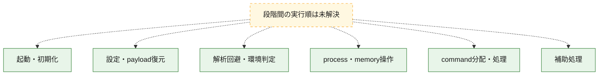
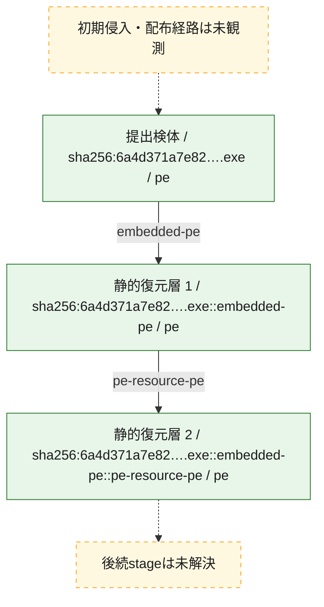
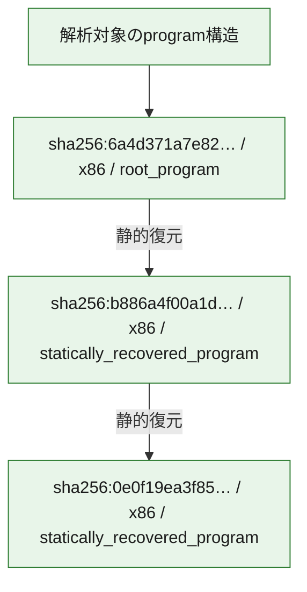

# 全体ロジック：6a4d371a7e82215799f79944204cf1ae4586a5a1cb6bdd5f6fb55e811e2154f2

代表関数の静的証跡から、起動・初期化、設定・payload復元、解析回避・環境判定、process・memory操作、command分配・処理の処理群を確認しました。

## 読み方

- phaseの掲載順は解析上の整理順です。observed_call_edgesがない段階間の実行順を断定しません。
- 図の実線は静的に観測した関係、点線と黄色のノードは未観測・未解決の関係を示します。
- 図は静的な要約であり、動的実行を再現するものではありません。
- 詳細な関数解説とfingerprintは[STATIC-LOGIC.md](STATIC-LOGIC.md)を参照してください。

## 静的可視化

### 実行フロー

### 感染チェーン

### モジュール関係

## 処理段階

### 1. 起動・初期化

entry pointから初期化と後続処理への移行を確認します。
確度: `confirmed_static_function_evidence`

- `6a4d371a7e82215799f79944204cf1ae4586a5a1cb6bdd5f6fb55e811e2154f2:ghidra:1800015ec` — 初期化と主要処理への分岐を行う入口関数です。 状態: `succeeded`、選定理由: `entry_point`, `meaningful_symbol_name`, `reviewed_call_centrality:4`, `role:entrypoint`

### 2. 設定・payload復元

設定、resource、payload、暗号化データの復元・変換を確認します。
確度: `confirmed_static_function_evidence`

- `6a4d371a7e82215799f79944204cf1ae4586a5a1cb6bdd5f6fb55e811e2154f2:ghidra:180001014` — 設定、resource、payloadなどの解析・変換を行う関数です。 状態: `succeeded`、選定理由: `context_representative`, `reviewed_call_centrality:16`, `role:config_or_data_transform`
- `6a4d371a7e82215799f79944204cf1ae4586a5a1cb6bdd5f6fb55e811e2154f2:ghidra:180001994` — 設定、resource、payloadなどの解析・変換を行う関数です。 状態: `succeeded`、選定理由: `context_representative`, `reviewed_call_centrality:19`, `role:config_or_data_transform`
- `6a4d371a7e82215799f79944204cf1ae4586a5a1cb6bdd5f6fb55e811e2154f2:ghidra:1800025c8` — 設定、resource、payloadなどの解析・変換を行う関数です。 状態: `succeeded`、選定理由: `context_representative`, `reviewed_call_centrality:5`, `role:config_or_data_transform`

### 3. 解析回避・環境判定

debugger、sandbox、仮想環境、時間差などの判定を確認します。
確度: `confirmed_static_function_evidence`

- `6a4d371a7e82215799f79944204cf1ae4586a5a1cb6bdd5f6fb55e811e2154f2:ghidra:180002448` — debugger、仮想環境、sandbox、または時間差の確認に関係する関数です。 状態: `succeeded`、選定理由: `context_representative`, `reviewed_call_centrality:14`, `role:anti_analysis`
- `6a4d371a7e82215799f79944204cf1ae4586a5a1cb6bdd5f6fb55e811e2154f2:ghidra:180002cf8` — debugger、仮想環境、sandbox、または時間差の確認に関係する関数です。 状態: `succeeded`、選定理由: `context_representative`, `reviewed_call_centrality:4`, `role:anti_analysis`
- `6a4d371a7e82215799f79944204cf1ae4586a5a1cb6bdd5f6fb55e811e2154f2:ghidra:180002d78` — debugger、仮想環境、sandbox、または時間差の確認に関係する関数です。 状態: `succeeded`、選定理由: `context_representative`, `reviewed_call_centrality:6`, `role:anti_analysis`

### 4. process・memory操作

process、thread、module、memory操作と実行移行を確認します。
確度: `confirmed_static_function_evidence_with_limits`

- `6a4d371a7e82215799f79944204cf1ae4586a5a1cb6bdd5f6fb55e811e2154f2:ghidra:1800010f8` — process、thread、module、またはmemory操作に関係する関数です。 状態: `succeeded`、選定理由: `context_representative`, `reviewed_call_centrality:6`, `role:process_or_memory_operation`
- `6a4d371a7e82215799f79944204cf1ae4586a5a1cb6bdd5f6fb55e811e2154f2:ghidra:180002594` — process、thread、module、またはmemory操作に関係する関数です。 状態: `limited_bad_instruction_or_flow`、選定理由: `context_representative`, `reviewed_call_centrality:6`, `role:process_or_memory_operation`
- `6a4d371a7e82215799f79944204cf1ae4586a5a1cb6bdd5f6fb55e811e2154f2:ghidra:180002a18` — process、thread、module、またはmemory操作に関係する関数です。 状態: `succeeded`、選定理由: `context_representative`, `reviewed_call_centrality:17`, `role:process_or_memory_operation`
- `6a4d371a7e82215799f79944204cf1ae4586a5a1cb6bdd5f6fb55e811e2154f2:ghidra:180002c34` — process、thread、module、またはmemory操作に関係する関数です。 状態: `succeeded`、選定理由: `context_representative`, `reviewed_call_centrality:12`, `role:process_or_memory_operation`

### 5. command分配・処理

受信commandやtaskの解釈、分配、個別handlerへの移行を確認します。
確度: `confirmed_static_function_evidence`

- `6a4d371a7e82215799f79944204cf1ae4586a5a1cb6bdd5f6fb55e811e2154f2:ghidra:18000137c` — commandの解釈、分配、または個別処理を担当する関数です。 状態: `succeeded`、選定理由: `context_representative`, `reviewed_call_centrality:25`, `role:command_dispatch_or_handler`

### 6. 補助処理

主要処理を支える一般内部関数またはlibrary処理を確認します。
確度: `confirmed_static_function_evidence`

- `6a4d371a7e82215799f79944204cf1ae4586a5a1cb6bdd5f6fb55e811e2154f2:ghidra:1800011a4` — 検体内部の一般処理を実装する関数です。 状態: `succeeded`、選定理由: `entry_point`, `meaningful_symbol_name`, `reviewed_call_centrality:3`
- `6a4d371a7e82215799f79944204cf1ae4586a5a1cb6bdd5f6fb55e811e2154f2:ghidra:1800011f0` — 検体内部の一般処理を実装する関数です。 状態: `succeeded`、選定理由: `context_representative`, `reviewed_call_centrality:5`
- `6a4d371a7e82215799f79944204cf1ae4586a5a1cb6bdd5f6fb55e811e2154f2:ghidra:1800012dc` — 検体内部の一般処理を実装する関数です。 状態: `succeeded`、選定理由: `context_representative`, `reviewed_call_centrality:6`
- `6a4d371a7e82215799f79944204cf1ae4586a5a1cb6bdd5f6fb55e811e2154f2:ghidra:1800014d0` — 検体内部の一般処理を実装する関数です。 状態: `succeeded`、選定理由: `context_representative`, `reviewed_call_centrality:3`
- `6a4d371a7e82215799f79944204cf1ae4586a5a1cb6bdd5f6fb55e811e2154f2:ghidra:18000162c` — 検体内部の一般処理を実装する関数です。 状態: `succeeded`、選定理由: `context_representative`, `reviewed_call_centrality:9`
- `6a4d371a7e82215799f79944204cf1ae4586a5a1cb6bdd5f6fb55e811e2154f2:ghidra:1800017bc` — 検体内部の一般処理を実装する関数です。 状態: `succeeded`、選定理由: `context_representative`, `reviewed_call_centrality:4`
- `6a4d371a7e82215799f79944204cf1ae4586a5a1cb6bdd5f6fb55e811e2154f2:ghidra:180001860` — 検体内部の一般処理を実装する関数です。 状態: `succeeded`、選定理由: `context_representative`, `reviewed_call_centrality:4`
- `6a4d371a7e82215799f79944204cf1ae4586a5a1cb6bdd5f6fb55e811e2154f2:ghidra:1800018a8` — 検体内部の一般処理を実装する関数です。 状態: `succeeded`、選定理由: `context_representative`, `reviewed_call_centrality:2`
- `6a4d371a7e82215799f79944204cf1ae4586a5a1cb6bdd5f6fb55e811e2154f2:ghidra:1800018fc` — 検体内部の一般処理を実装する関数です。 状態: `succeeded`、選定理由: `context_representative`, `reviewed_call_centrality:2`
- `6a4d371a7e82215799f79944204cf1ae4586a5a1cb6bdd5f6fb55e811e2154f2:ghidra:180002638` — 検体内部の一般処理を実装する関数です。 状態: `succeeded`、選定理由: `context_representative`, `reviewed_call_centrality:3`
- `6a4d371a7e82215799f79944204cf1ae4586a5a1cb6bdd5f6fb55e811e2154f2:ghidra:1800026a0` — 検体内部の一般処理を実装する関数です。 状態: `succeeded`、選定理由: `context_representative`, `reviewed_call_centrality:5`
- `6a4d371a7e82215799f79944204cf1ae4586a5a1cb6bdd5f6fb55e811e2154f2:ghidra:1800026c0` — 検体内部の一般処理を実装する関数です。 状態: `succeeded`、選定理由: `context_representative`, `reviewed_call_centrality:1`
- `6a4d371a7e82215799f79944204cf1ae4586a5a1cb6bdd5f6fb55e811e2154f2:ghidra:1800026e0` — 検体内部の一般処理を実装する関数です。 状態: `succeeded`、選定理由: `context_representative`, `reviewed_call_centrality:2`
- `6a4d371a7e82215799f79944204cf1ae4586a5a1cb6bdd5f6fb55e811e2154f2:ghidra:180002728` — 検体内部の一般処理を実装する関数です。 状態: `succeeded`、選定理由: `context_representative`, `reviewed_call_centrality:5`
- `6a4d371a7e82215799f79944204cf1ae4586a5a1cb6bdd5f6fb55e811e2154f2:ghidra:180002938` — 検体内部の一般処理を実装する関数です。 状態: `succeeded`、選定理由: `context_representative`, `reviewed_call_centrality:7`
- `6a4d371a7e82215799f79944204cf1ae4586a5a1cb6bdd5f6fb55e811e2154f2:ghidra:180002960` — 検体内部の一般処理を実装する関数です。 状態: `succeeded`、選定理由: `context_representative`, `reviewed_call_centrality:8`
- `6a4d371a7e82215799f79944204cf1ae4586a5a1cb6bdd5f6fb55e811e2154f2:ghidra:180002a9c` — 検体内部の一般処理を実装する関数です。 状態: `succeeded`、選定理由: `context_representative`, `reviewed_call_centrality:3`
- `6a4d371a7e82215799f79944204cf1ae4586a5a1cb6bdd5f6fb55e811e2154f2:ghidra:180002ac0` — 検体内部の一般処理を実装する関数です。 状態: `succeeded`、選定理由: `context_representative`, `reviewed_call_centrality:8`
- `6a4d371a7e82215799f79944204cf1ae4586a5a1cb6bdd5f6fb55e811e2154f2:ghidra:180002bf4` — 検体内部の一般処理を実装する関数です。 状態: `succeeded`、選定理由: `context_representative`, `reviewed_call_centrality:6`
- `6a4d371a7e82215799f79944204cf1ae4586a5a1cb6bdd5f6fb55e811e2154f2:ghidra:180002cb8` — 検体内部の一般処理を実装する関数です。 状態: `succeeded`、選定理由: `context_representative`, `reviewed_call_centrality:11`

## 観測したcall関係

- 代表関数間で直接解決できた呼出関係はありません。

## 解析範囲と制約

- 選定外関数は全体inventoryへ残しますが、関数本体の個別解説対象にはしていません。
- indirect call、難読化、packer、VM、壊れたcontrol flowによりcall関係が欠落する場合があります。
- 文書は静的解析に基づき、検体実行や外部通信による動的確認は行っていません。
