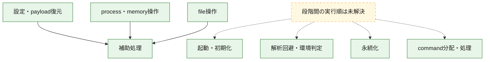
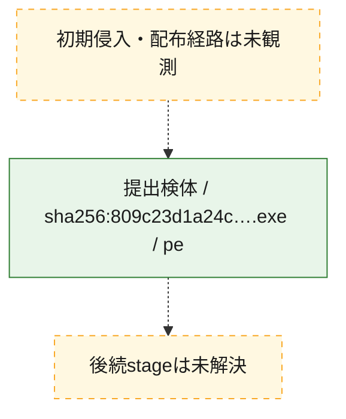
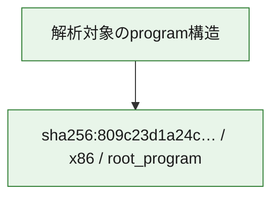

# 全体ロジック：809c23d1a24c9ee596c8aae7645d4939645128a48343609817bbbcca245ebc9f

代表関数の静的証跡から、起動・初期化、設定・payload復元、解析回避・環境判定、永続化、process・memory操作、command分配・処理、file操作の処理群を確認しました。

## 読み方

- phaseの掲載順は解析上の整理順です。observed_call_edgesがない段階間の実行順を断定しません。
- 図の実線は静的に観測した関係、点線と黄色のノードは未観測・未解決の関係を示します。
- 図は静的な要約であり、動的実行を再現するものではありません。
- 詳細な関数解説とfingerprintは[STATIC-LOGIC.md](STATIC-LOGIC.md)を参照してください。

## 静的可視化

### 実行フロー

### 感染チェーン

### モジュール関係

## 処理段階

### 1. 起動・初期化

entry pointから初期化と後続処理への移行を確認します。
確度: `confirmed_static_function_evidence`

- `809c23d1a24c9ee596c8aae7645d4939645128a48343609817bbbcca245ebc9f:ghidra:1800015ec` — 初期化と主要処理への分岐を行う入口関数です。 状態: `succeeded`、選定理由: `call_graph_centrality:in=0,out=2`, `entry_point`, `meaningful_symbol_name`, `reviewed_call_centrality:2`, `role:entrypoint`

### 2. 設定・payload復元

設定、resource、payload、暗号化データの復元・変換を確認します。
確度: `confirmed_static_function_evidence`

- `809c23d1a24c9ee596c8aae7645d4939645128a48343609817bbbcca245ebc9f:ghidra:180001994` — 設定、resource、payloadなどの解析・変換を行う関数です。 状態: `succeeded`、選定理由: `call_graph_centrality:in=1,out=15`, `large_function:instructions=723`, `reviewed_call_centrality:17`, `reviewed_call_centrality:20`, `role:config_or_data_transform`
- `809c23d1a24c9ee596c8aae7645d4939645128a48343609817bbbcca245ebc9f:ghidra:180003054` — 設定、resource、payloadなどの解析・変換を行う関数です。 状態: `succeeded`、選定理由: `call_graph_centrality:in=3,out=7`, `large_function:instructions=99`, `meaningful_symbol_name`, `reviewed_call_centrality:11`, `reviewed_call_centrality:12`, `role:config_or_data_transform`
- `809c23d1a24c9ee596c8aae7645d4939645128a48343609817bbbcca245ebc9f:ghidra:1800036a0` — 設定、resource、payloadなどの解析・変換を行う関数です。 状態: `succeeded`、選定理由: `call_graph_centrality:in=1,out=1`, `large_function:instructions=163`, `meaningful_symbol_name`, `reviewed_call_centrality:2`, `role:config_or_data_transform`
- `809c23d1a24c9ee596c8aae7645d4939645128a48343609817bbbcca245ebc9f:ghidra:180003870` — 設定、resource、payloadなどの解析・変換を行う関数です。 状態: `succeeded`、選定理由: `call_graph_centrality:in=1,out=4`, `meaningful_symbol_name`, `reviewed_call_centrality:5`, `reviewed_call_centrality:6`, `role:config_or_data_transform`
- `809c23d1a24c9ee596c8aae7645d4939645128a48343609817bbbcca245ebc9f:ghidra:1800060c0` — 設定、resource、payloadなどの解析・変換を行う関数です。 状態: `succeeded`、選定理由: `call_graph_centrality:in=1,out=8`, `large_function:instructions=159`, `meaningful_symbol_name`, `reviewed_call_centrality:10`, `reviewed_call_centrality:11`, `role:config_or_data_transform`
- `809c23d1a24c9ee596c8aae7645d4939645128a48343609817bbbcca245ebc9f:ghidra:18000630c` — 設定、resource、payloadなどの解析・変換を行う関数です。 状態: `succeeded`、選定理由: `call_graph_centrality:in=3,out=1`, `meaningful_symbol_name`, `reviewed_call_centrality:4`, `reviewed_call_centrality:5`, `role:config_or_data_transform`
- `809c23d1a24c9ee596c8aae7645d4939645128a48343609817bbbcca245ebc9f:ghidra:180006384` — 設定、resource、payloadなどの解析・変換を行う関数です。 状態: `succeeded`、選定理由: `call_graph_centrality:in=1,out=6`, `large_function:instructions=72`, `meaningful_symbol_name`, `reviewed_call_centrality:7`, `reviewed_call_centrality:9`, `role:config_or_data_transform`
- `809c23d1a24c9ee596c8aae7645d4939645128a48343609817bbbcca245ebc9f:ghidra:180007ed0` — 設定、resource、payloadなどの解析・変換を行う関数です。 状態: `succeeded`、選定理由: `call_graph_centrality:in=1,out=6`, `large_function:instructions=136`, `meaningful_symbol_name`, `reviewed_call_centrality:11`, `reviewed_call_centrality:8`, `role:config_or_data_transform`

### 3. 解析回避・環境判定

debugger、sandbox、仮想環境、時間差などの判定を確認します。
確度: `confirmed_static_function_evidence`

- `809c23d1a24c9ee596c8aae7645d4939645128a48343609817bbbcca245ebc9f:ghidra:180002cf8` — debugger、仮想環境、sandbox、または時間差の確認に関係する関数です。 状態: `succeeded`、選定理由: `call_graph_centrality:in=6,out=2`, `meaningful_symbol_name`, `reviewed_call_centrality:8`, `reviewed_call_centrality:9`, `role:anti_analysis`
- `809c23d1a24c9ee596c8aae7645d4939645128a48343609817bbbcca245ebc9f:ghidra:180002d78` — debugger、仮想環境、sandbox、または時間差の確認に関係する関数です。 状態: `succeeded`、選定理由: `call_graph_centrality:in=7,out=2`, `meaningful_symbol_name`, `reviewed_call_centrality:10`, `reviewed_call_centrality:9`, `role:anti_analysis`

### 4. 永続化

自動起動や永続化に関係する設定変更を確認します。
確度: `confirmed_static_function_evidence`

- `809c23d1a24c9ee596c8aae7645d4939645128a48343609817bbbcca245ebc9f:ghidra:180003228` — 自動起動または永続化に関係する処理を含む関数です。 状態: `succeeded`、選定理由: `call_graph_centrality:in=1,out=6`, `large_function:instructions=184`, `meaningful_symbol_name`, `reviewed_call_centrality:12`, `reviewed_call_centrality:7`, `role:persistence`

### 5. process・memory操作

process、thread、module、memory操作と実行移行を確認します。
確度: `confirmed_static_function_evidence_with_limits`

- `809c23d1a24c9ee596c8aae7645d4939645128a48343609817bbbcca245ebc9f:ghidra:180002448` — process、thread、module、またはmemory操作に関係する関数です。 状態: `succeeded`、選定理由: `call_graph_centrality:in=2,out=9`, `large_function:instructions=80`, `meaningful_symbol_name`, `reviewed_call_centrality:11`, `reviewed_call_centrality:15`, `role:anti_analysis`, `role:process_or_memory_operation`
- `809c23d1a24c9ee596c8aae7645d4939645128a48343609817bbbcca245ebc9f:ghidra:180002594` — process、thread、module、またはmemory操作に関係する関数です。 状態: `limited_bad_instruction_or_flow`、選定理由: `call_graph_centrality:in=3,out=2`, `meaningful_symbol_name`, `reviewed_call_centrality:6`, `reviewed_call_centrality:7`, `role:process_or_memory_operation`
- `809c23d1a24c9ee596c8aae7645d4939645128a48343609817bbbcca245ebc9f:ghidra:180002a18` — process、thread、module、またはmemory操作に関係する関数です。 状態: `succeeded`、選定理由: `call_graph_centrality:in=6,out=8`, `meaningful_symbol_name`, `reviewed_call_centrality:14`, `reviewed_call_centrality:19`, `role:process_or_memory_operation`
- `809c23d1a24c9ee596c8aae7645d4939645128a48343609817bbbcca245ebc9f:ghidra:180002c34` — process、thread、module、またはmemory操作に関係する関数です。 状態: `succeeded`、選定理由: `call_graph_centrality:in=1,out=8`, `meaningful_symbol_name`, `reviewed_call_centrality:12`, `reviewed_call_centrality:9`, `role:process_or_memory_operation`
- `809c23d1a24c9ee596c8aae7645d4939645128a48343609817bbbcca245ebc9f:ghidra:180003f58` — process、thread、module、またはmemory操作に関係する関数です。 状態: `succeeded`、選定理由: `call_graph_centrality:in=1,out=17`, `large_function:instructions=465`, `meaningful_symbol_name`, `reviewed_call_centrality:21`, `reviewed_call_centrality:23`, `role:file_operation`, `role:process_or_memory_operation`
- `809c23d1a24c9ee596c8aae7645d4939645128a48343609817bbbcca245ebc9f:ghidra:180005cf8` — process、thread、module、またはmemory操作に関係する関数です。 状態: `succeeded`、選定理由: `call_graph_centrality:in=1,out=9`, `meaningful_symbol_name`, `reviewed_call_centrality:11`, `reviewed_call_centrality:12`, `role:process_or_memory_operation`
- `809c23d1a24c9ee596c8aae7645d4939645128a48343609817bbbcca245ebc9f:ghidra:180005e24` — process、thread、module、またはmemory操作に関係する関数です。 状態: `succeeded`、選定理由: `call_graph_centrality:in=4,out=6`, `meaningful_symbol_name`, `reviewed_call_centrality:11`, `role:process_or_memory_operation`
- `809c23d1a24c9ee596c8aae7645d4939645128a48343609817bbbcca245ebc9f:ghidra:1800064d4` — process、thread、module、またはmemory操作に関係する関数です。 状態: `succeeded`、選定理由: `call_graph_centrality:in=4,out=13`, `large_function:instructions=154`, `reviewed_call_centrality:18`, `reviewed_call_centrality:20`, `role:file_operation`, `role:process_or_memory_operation`

### 6. command分配・処理

受信commandやtaskの解釈、分配、個別handlerへの移行を確認します。
確度: `confirmed_static_function_evidence`

- `809c23d1a24c9ee596c8aae7645d4939645128a48343609817bbbcca245ebc9f:ghidra:18000137c` — commandの解釈、分配、または個別処理を担当する関数です。 状態: `succeeded`、選定理由: `call_graph_centrality:in=1,out=20`, `large_function:instructions=93`, `meaningful_symbol_name`, `reviewed_call_centrality:21`, `reviewed_call_centrality:24`, `role:command_dispatch_or_handler`

### 7. file操作

fileやdirectoryの作成、読書き、削除を確認します。
確度: `confirmed_static_function_evidence`

- `809c23d1a24c9ee596c8aae7645d4939645128a48343609817bbbcca245ebc9f:ghidra:18000162c` — fileまたはdirectoryの読書き・管理に関係する関数です。 状態: `succeeded`、選定理由: `call_graph_centrality:in=2,out=7`, `large_function:instructions=115`, `meaningful_symbol_name`, `reviewed_call_centrality:10`, `reviewed_call_centrality:9`, `role:file_operation`
- `809c23d1a24c9ee596c8aae7645d4939645128a48343609817bbbcca245ebc9f:ghidra:180003ddc` — fileまたはdirectoryの読書き・管理に関係する関数です。 状態: `succeeded`、選定理由: `call_graph_centrality:in=2,out=5`, `meaningful_symbol_name`, `reviewed_call_centrality:9`, `role:file_operation`
- `809c23d1a24c9ee596c8aae7645d4939645128a48343609817bbbcca245ebc9f:ghidra:180004a60` — fileまたはdirectoryの読書き・管理に関係する関数です。 状態: `succeeded`、選定理由: `call_graph_centrality:in=5,out=2`, `meaningful_symbol_name`, `reviewed_call_centrality:7`, `reviewed_call_centrality:8`, `role:file_operation`
- `809c23d1a24c9ee596c8aae7645d4939645128a48343609817bbbcca245ebc9f:ghidra:180006d4c` — fileまたはdirectoryの読書き・管理に関係する関数です。 状態: `succeeded`、選定理由: `call_graph_centrality:in=2,out=2`, `meaningful_symbol_name`, `reviewed_call_centrality:4`, `role:file_operation`
- `809c23d1a24c9ee596c8aae7645d4939645128a48343609817bbbcca245ebc9f:ghidra:180006dc8` — fileまたはdirectoryの読書き・管理に関係する関数です。 状態: `succeeded`、選定理由: `call_graph_centrality:in=1,out=4`, `meaningful_symbol_name`, `reviewed_call_centrality:5`, `role:file_operation`
- `809c23d1a24c9ee596c8aae7645d4939645128a48343609817bbbcca245ebc9f:ghidra:180006e14` — fileまたはdirectoryの読書き・管理に関係する関数です。 状態: `succeeded`、選定理由: `call_graph_centrality:in=2,out=5`, `large_function:instructions=67`, `meaningful_symbol_name`, `reviewed_call_centrality:7`, `role:file_operation`
- `809c23d1a24c9ee596c8aae7645d4939645128a48343609817bbbcca245ebc9f:ghidra:180008358` — fileまたはdirectoryの読書き・管理に関係する関数です。 状態: `succeeded`、選定理由: `call_graph_centrality:in=1,out=7`, `meaningful_symbol_name`, `reviewed_call_centrality:8`, `reviewed_call_centrality:9`, `role:file_operation`
- `809c23d1a24c9ee596c8aae7645d4939645128a48343609817bbbcca245ebc9f:ghidra:1800083d4` — fileまたはdirectoryの読書き・管理に関係する関数です。 状態: `succeeded`、選定理由: `call_graph_centrality:in=1,out=5`, `meaningful_symbol_name`, `reviewed_call_centrality:6`, `reviewed_call_centrality:7`, `role:file_operation`
- `809c23d1a24c9ee596c8aae7645d4939645128a48343609817bbbcca245ebc9f:ghidra:18000843c` — fileまたはdirectoryの読書き・管理に関係する関数です。 状態: `succeeded`、選定理由: `call_graph_centrality:in=1,out=8`, `meaningful_symbol_name`, `reviewed_call_centrality:10`, `reviewed_call_centrality:11`, `role:file_operation`

### 8. 補助処理

主要処理を支える一般内部関数またはlibrary処理を確認します。
確度: `confirmed_static_function_evidence`

- `809c23d1a24c9ee596c8aae7645d4939645128a48343609817bbbcca245ebc9f:ghidra:1800011a4` — 検体内部の一般処理を実装する関数です。 状態: `succeeded`、選定理由: `call_graph_centrality:in=0,out=3`, `entry_point`, `meaningful_symbol_name`, `reviewed_call_centrality:3`
- `809c23d1a24c9ee596c8aae7645d4939645128a48343609817bbbcca245ebc9f:ghidra:1800026a0` — compiler生成処理または汎用library処理とみられる関数です。 状態: `succeeded`、選定理由: `call_graph_centrality:in=30,out=1`, `meaningful_symbol_name`, `reviewed_call_centrality:31`

## 観測したcall関係

- `809c23d1a24c9ee596c8aae7645d4939645128a48343609817bbbcca245ebc9f:ghidra:18000162c` → `809c23d1a24c9ee596c8aae7645d4939645128a48343609817bbbcca245ebc9f:ghidra:1800026a0` （`file_activity` → `support`）
- `809c23d1a24c9ee596c8aae7645d4939645128a48343609817bbbcca245ebc9f:ghidra:180001994` → `809c23d1a24c9ee596c8aae7645d4939645128a48343609817bbbcca245ebc9f:ghidra:1800026a0` （`configuration` → `support`）
- `809c23d1a24c9ee596c8aae7645d4939645128a48343609817bbbcca245ebc9f:ghidra:180003ddc` → `809c23d1a24c9ee596c8aae7645d4939645128a48343609817bbbcca245ebc9f:ghidra:1800026a0` （`file_activity` → `support`）
- `809c23d1a24c9ee596c8aae7645d4939645128a48343609817bbbcca245ebc9f:ghidra:180003f58` → `809c23d1a24c9ee596c8aae7645d4939645128a48343609817bbbcca245ebc9f:ghidra:1800026a0` （`execution` → `support`）
- `809c23d1a24c9ee596c8aae7645d4939645128a48343609817bbbcca245ebc9f:ghidra:180004a60` → `809c23d1a24c9ee596c8aae7645d4939645128a48343609817bbbcca245ebc9f:ghidra:1800026a0` （`file_activity` → `support`）
- `809c23d1a24c9ee596c8aae7645d4939645128a48343609817bbbcca245ebc9f:ghidra:180005cf8` → `809c23d1a24c9ee596c8aae7645d4939645128a48343609817bbbcca245ebc9f:ghidra:1800026a0` （`execution` → `support`）
- `809c23d1a24c9ee596c8aae7645d4939645128a48343609817bbbcca245ebc9f:ghidra:180005e24` → `809c23d1a24c9ee596c8aae7645d4939645128a48343609817bbbcca245ebc9f:ghidra:1800026a0` （`execution` → `support`）
- `809c23d1a24c9ee596c8aae7645d4939645128a48343609817bbbcca245ebc9f:ghidra:1800060c0` → `809c23d1a24c9ee596c8aae7645d4939645128a48343609817bbbcca245ebc9f:ghidra:1800026a0` （`configuration` → `support`）
- `809c23d1a24c9ee596c8aae7645d4939645128a48343609817bbbcca245ebc9f:ghidra:180008358` → `809c23d1a24c9ee596c8aae7645d4939645128a48343609817bbbcca245ebc9f:ghidra:1800026a0` （`file_activity` → `support`）
- `809c23d1a24c9ee596c8aae7645d4939645128a48343609817bbbcca245ebc9f:ghidra:1800083d4` → `809c23d1a24c9ee596c8aae7645d4939645128a48343609817bbbcca245ebc9f:ghidra:1800026a0` （`file_activity` → `support`）
- `809c23d1a24c9ee596c8aae7645d4939645128a48343609817bbbcca245ebc9f:ghidra:18000843c` → `809c23d1a24c9ee596c8aae7645d4939645128a48343609817bbbcca245ebc9f:ghidra:1800026a0` （`file_activity` → `support`）

## 解析範囲と制約

- 選定外関数は全体inventoryへ残しますが、関数本体の個別解説対象にはしていません。
- indirect call、難読化、packer、VM、壊れたcontrol flowによりcall関係が欠落する場合があります。
- 文書は静的解析に基づき、検体実行や外部通信による動的確認は行っていません。
