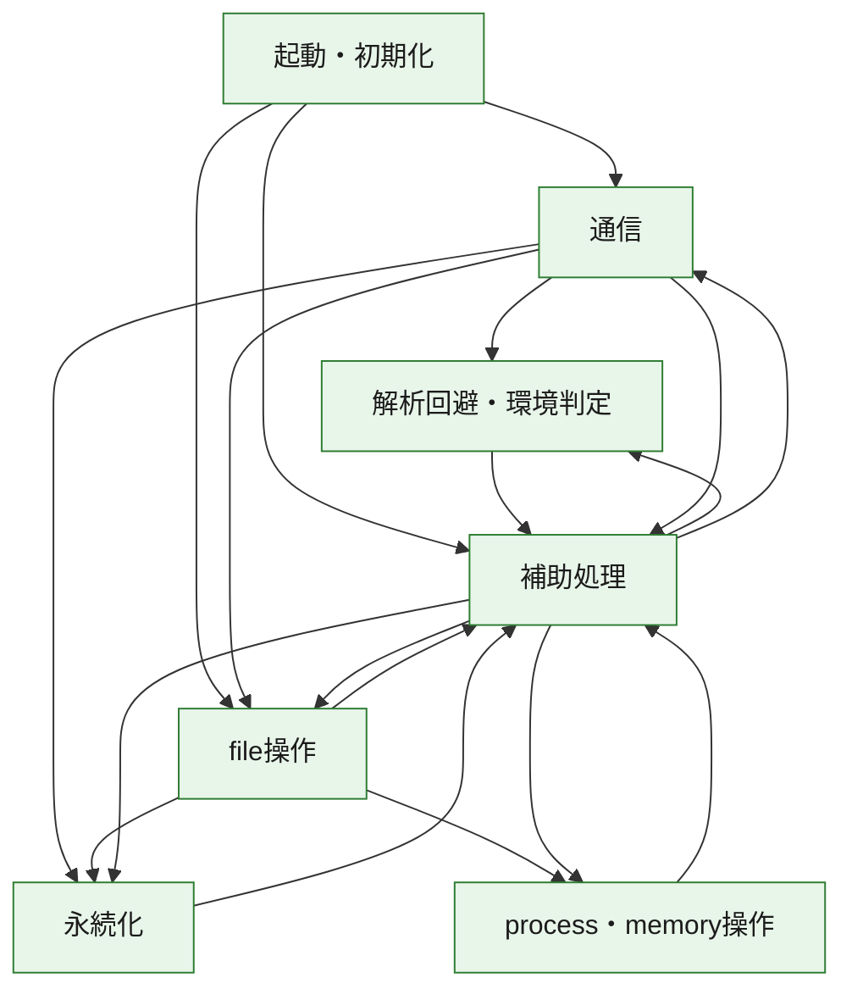
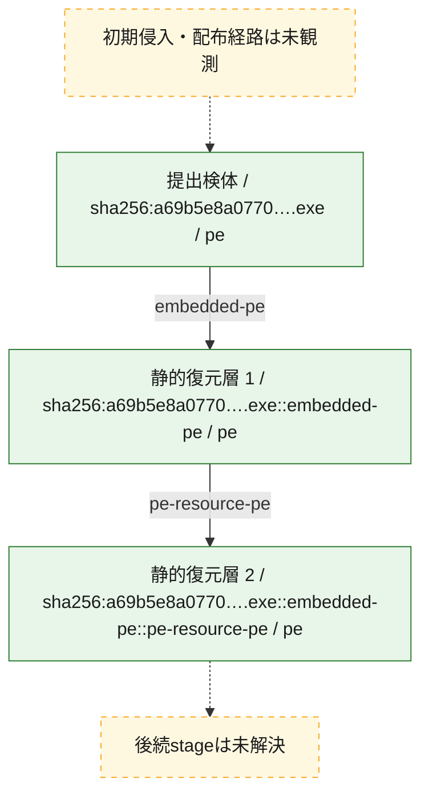
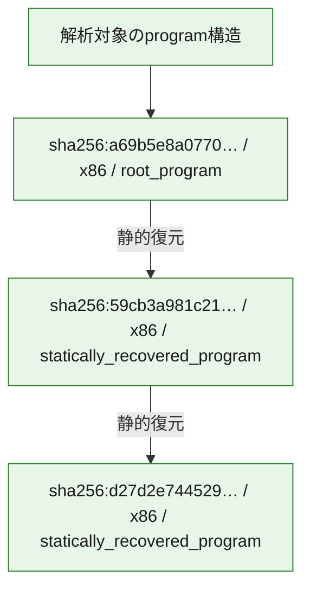

# 全体ロジック：a69b5e8a0770722ee01f07e72c5779dd5fa7e650de4d988f54f014661061eea7

代表関数の静的証跡から、起動・初期化、解析回避・環境判定、永続化、process・memory操作、通信、file操作の処理群を確認しました。

## 読み方

- phaseの掲載順は解析上の整理順です。observed_call_edgesがない段階間の実行順を断定しません。
- 図の実線は静的に観測した関係、点線と黄色のノードは未観測・未解決の関係を示します。
- 図は静的な要約であり、動的実行を再現するものではありません。
- 詳細な関数解説とfingerprintは[STATIC-LOGIC.md](STATIC-LOGIC.md)を参照してください。

## 静的可視化

### 実行フロー

### 感染チェーン

### モジュール関係

## 処理段階

### 1. 起動・初期化

entry pointから初期化と後続処理への移行を確認します。
確度: `confirmed_static_function_evidence`

- `d27d2e744529f25a07d87c96d713ac394bddd3090c335102cf39b7cbd500a262:ghidra:004077ba` — 初期化と主要処理への分岐を行う入口関数です。 状態: `succeeded`、選定理由: `call_graph_centrality:in=0,out=13`, `entry_point`, `large_function:instructions=111`, `meaningful_symbol_name`, `reviewed_call_centrality:13`, `reviewed_call_centrality:21`, `role:entrypoint`
- `59cb3a981c21f289f6492d8fa4d7ee96dc45daa08c51f1c87dd02b6055b07b81:ghidra:00409a16` — 初期化と主要処理への分岐を行う入口関数です。 状態: `succeeded`、選定理由: `call_graph_centrality:in=0,out=13`, `entry_point`, `large_function:instructions=111`, `meaningful_symbol_name`, `reviewed_call_centrality:13`, `reviewed_call_centrality:21`, `role:entrypoint`
- `a69b5e8a0770722ee01f07e72c5779dd5fa7e650de4d988f54f014661061eea7:ghidra:1800015ec` — 初期化と主要処理への分岐を行う入口関数です。 状態: `succeeded`、選定理由: `entry_point`, `meaningful_symbol_name`, `reviewed_call_centrality:4`, `role:entrypoint`

### 2. 解析回避・環境判定

debugger、sandbox、仮想環境、時間差などの判定を確認します。
確度: `confirmed_static_function_evidence`

- `59cb3a981c21f289f6492d8fa4d7ee96dc45daa08c51f1c87dd02b6055b07b81:ghidra:00401660` — debugger、仮想環境、sandbox、または時間差の確認に関係する関数です。 状態: `succeeded`、選定理由: `call_graph_centrality:in=1,out=6`, `large_function:instructions=118`, `reviewed_call_centrality:10`, `reviewed_call_centrality:9`, `role:anti_analysis`
- `a69b5e8a0770722ee01f07e72c5779dd5fa7e650de4d988f54f014661061eea7:ghidra:180002448` — debugger、仮想環境、sandbox、または時間差の確認に関係する関数です。 状態: `succeeded`、選定理由: `context_representative`, `reviewed_call_centrality:14`, `role:anti_analysis`

### 3. 永続化

自動起動や永続化に関係する設定変更を確認します。
確度: `confirmed_static_function_evidence`

- `d27d2e744529f25a07d87c96d713ac394bddd3090c335102cf39b7cbd500a262:ghidra:004010fd` — 自動起動または永続化に関係する処理を含む関数です。 状態: `succeeded`、選定理由: `call_graph_centrality:in=1,out=8`, `large_function:instructions=100`, `reviewed_call_centrality:16`, `reviewed_call_centrality:9`, `role:persistence`
- `d27d2e744529f25a07d87c96d713ac394bddd3090c335102cf39b7cbd500a262:ghidra:00401ce8` — 自動起動または永続化に関係する処理を含む関数です。 状態: `succeeded`、選定理由: `call_graph_centrality:in=1,out=6`, `large_function:instructions=75`, `reviewed_call_centrality:13`, `reviewed_call_centrality:7`, `role:persistence`
- `59cb3a981c21f289f6492d8fa4d7ee96dc45daa08c51f1c87dd02b6055b07b81:ghidra:00407c40` — 自動起動または永続化に関係する処理を含む関数です。 状態: `succeeded`、選定理由: `call_graph_centrality:in=1,out=5`, `reviewed_call_centrality:11`, `reviewed_call_centrality:6`, `role:persistence`
- `59cb3a981c21f289f6492d8fa4d7ee96dc45daa08c51f1c87dd02b6055b07b81:ghidra:00408090` — 自動起動または永続化に関係する処理を含む関数です。 状態: `succeeded`、選定理由: `call_graph_centrality:in=1,out=8`, `reviewed_call_centrality:15`, `reviewed_call_centrality:9`, `role:persistence`

### 4. process・memory操作

process、thread、module、memory操作と実行移行を確認します。
確度: `confirmed_static_function_evidence`

- `d27d2e744529f25a07d87c96d713ac394bddd3090c335102cf39b7cbd500a262:ghidra:00401064` — process、thread、module、またはmemory操作に関係する関数です。 状態: `succeeded`、選定理由: `call_graph_centrality:in=2,out=5`, `reviewed_call_centrality:12`, `reviewed_call_centrality:7`, `role:process_or_memory_operation`
- `d27d2e744529f25a07d87c96d713ac394bddd3090c335102cf39b7cbd500a262:ghidra:0040170a` — process、thread、module、またはmemory操作に関係する関数です。 状態: `succeeded`、選定理由: `call_graph_centrality:in=1,out=3`, `large_function:instructions=65`, `reviewed_call_centrality:4`, `reviewed_call_centrality:6`, `role:process_or_memory_operation`
- `d27d2e744529f25a07d87c96d713ac394bddd3090c335102cf39b7cbd500a262:ghidra:00401a45` — process、thread、module、またはmemory操作に関係する関数です。 状態: `succeeded`、選定理由: `call_graph_centrality:in=1,out=2`, `reviewed_call_centrality:3`, `reviewed_call_centrality:5`, `role:process_or_memory_operation`
- `d27d2e744529f25a07d87c96d713ac394bddd3090c335102cf39b7cbd500a262:ghidra:0040267b` — process、thread、module、またはmemory操作に関係する関数です。 状態: `succeeded`、選定理由: `call_graph_centrality:in=1,out=1`, `large_function:instructions=67`, `reviewed_call_centrality:2`, `reviewed_call_centrality:3`, `role:process_or_memory_operation`
- `a69b5e8a0770722ee01f07e72c5779dd5fa7e650de4d988f54f014661061eea7:ghidra:1800010f8` — process、thread、module、またはmemory操作に関係する関数です。 状態: `succeeded`、選定理由: `context_representative`, `reviewed_call_centrality:6`, `role:process_or_memory_operation`

### 5. 通信

通信初期化、endpoint処理、送受信の役割を確認します。
確度: `confirmed_static_function_evidence`

- `59cb3a981c21f289f6492d8fa4d7ee96dc45daa08c51f1c87dd02b6055b07b81:ghidra:00401370` — 通信初期化、送受信、またはendpoint処理に関係する関数です。 状態: `succeeded`、選定理由: `call_graph_centrality:in=0,out=18`, `large_function:instructions=218`, `reviewed_call_centrality:18`, `reviewed_call_centrality:21`, `role:network_communication`
- `59cb3a981c21f289f6492d8fa4d7ee96dc45daa08c51f1c87dd02b6055b07b81:ghidra:00401980` — 通信初期化、送受信、またはendpoint処理に関係する関数です。 状態: `succeeded`、選定理由: `call_graph_centrality:in=0,out=8`, `large_function:instructions=141`, `reviewed_call_centrality:8`, `role:network_communication`
- `59cb3a981c21f289f6492d8fa4d7ee96dc45daa08c51f1c87dd02b6055b07b81:ghidra:00401b70` — 通信初期化、送受信、またはendpoint処理に関係する関数です。 状態: `succeeded`、選定理由: `call_graph_centrality:in=0,out=7`, `large_function:instructions=148`, `reviewed_call_centrality:7`, `role:network_communication`
- `59cb3a981c21f289f6492d8fa4d7ee96dc45daa08c51f1c87dd02b6055b07b81:ghidra:004072a0` — 通信初期化、送受信、またはendpoint処理に関係する関数です。 状態: `succeeded`、選定理由: `call_graph_centrality:in=0,out=10`, `large_function:instructions=137`, `reviewed_call_centrality:10`, `role:network_communication`
- `59cb3a981c21f289f6492d8fa4d7ee96dc45daa08c51f1c87dd02b6055b07b81:ghidra:00407480` — 通信初期化、送受信、またはendpoint処理に関係する関数です。 状態: `succeeded`、選定理由: `call_graph_centrality:in=1,out=6`, `reviewed_call_centrality:7`, `role:network_communication`
- `59cb3a981c21f289f6492d8fa4d7ee96dc45daa08c51f1c87dd02b6055b07b81:ghidra:00407b90` — 通信初期化、送受信、またはendpoint処理に関係する関数です。 状態: `succeeded`、選定理由: `call_graph_centrality:in=1,out=3`, `reviewed_call_centrality:4`, `role:network_communication`
- `59cb3a981c21f289f6492d8fa4d7ee96dc45daa08c51f1c87dd02b6055b07b81:ghidra:00408140` — 通信初期化、送受信、またはendpoint処理に関係する関数です。 状態: `succeeded`、選定理由: `call_graph_centrality:in=1,out=4`, `reviewed_call_centrality:5`, `reviewed_call_centrality:8`, `role:network_communication`

### 6. file操作

fileやdirectoryの作成、読書き、削除を確認します。
確度: `confirmed_static_function_evidence`

- `d27d2e744529f25a07d87c96d713ac394bddd3090c335102cf39b7cbd500a262:ghidra:004014a6` — fileまたはdirectoryの読書き・管理に関係する関数です。 状態: `succeeded`、選定理由: `call_graph_centrality:in=1,out=8`, `large_function:instructions=178`, `reviewed_call_centrality:12`, `reviewed_call_centrality:9`, `role:file_operation`
- `d27d2e744529f25a07d87c96d713ac394bddd3090c335102cf39b7cbd500a262:ghidra:004018f9` — fileまたはdirectoryの読書き・管理に関係する関数です。 状態: `succeeded`、選定理由: `call_graph_centrality:in=1,out=5`, `large_function:instructions=79`, `reviewed_call_centrality:10`, `reviewed_call_centrality:6`, `role:file_operation`
- `d27d2e744529f25a07d87c96d713ac394bddd3090c335102cf39b7cbd500a262:ghidra:00401fe7` — fileまたはdirectoryの読書き・管理に関係する関数です。 状態: `succeeded`、選定理由: `call_graph_centrality:in=1,out=22`, `large_function:instructions=132`, `reviewed_call_centrality:23`, `reviewed_call_centrality:30`, `role:file_operation`
- `d27d2e744529f25a07d87c96d713ac394bddd3090c335102cf39b7cbd500a262:ghidra:00405bae` — fileまたはdirectoryの読書き・管理に関係する関数です。 状態: `succeeded`、選定理由: `call_graph_centrality:in=1,out=3`, `large_function:instructions=93`, `reviewed_call_centrality:5`, `reviewed_call_centrality:6`, `role:file_operation`
- `d27d2e744529f25a07d87c96d713ac394bddd3090c335102cf39b7cbd500a262:ghidra:00405d8a` — fileまたはdirectoryの読書き・管理に関係する関数です。 状態: `succeeded`、選定理由: `call_graph_centrality:in=5,out=2`, `reviewed_call_centrality:7`, `reviewed_call_centrality:8`, `role:file_operation`
- `d27d2e744529f25a07d87c96d713ac394bddd3090c335102cf39b7cbd500a262:ghidra:00407136` — fileまたはdirectoryの読書き・管理に関係する関数です。 状態: `succeeded`、選定理由: `call_graph_centrality:in=1,out=14`, `large_function:instructions=272`, `reviewed_call_centrality:16`, `reviewed_call_centrality:20`, `role:file_operation`
- `59cb3a981c21f289f6492d8fa4d7ee96dc45daa08c51f1c87dd02b6055b07b81:ghidra:00407a20` — fileまたはdirectoryの読書き・管理に関係する関数です。 状態: `succeeded`、選定理由: `call_graph_centrality:in=1,out=6`, `large_function:instructions=130`, `reviewed_call_centrality:13`, `reviewed_call_centrality:7`, `role:file_operation`
- `a69b5e8a0770722ee01f07e72c5779dd5fa7e650de4d988f54f014661061eea7:ghidra:180001014` — fileまたはdirectoryの読書き・管理に関係する関数です。 状態: `succeeded`、選定理由: `context_representative`, `reviewed_call_centrality:16`, `role:file_operation`

### 7. 補助処理

主要処理を支える一般内部関数またはlibrary処理を確認します。
確度: `confirmed_static_function_evidence_with_limits`

- `d27d2e744529f25a07d87c96d713ac394bddd3090c335102cf39b7cbd500a262:ghidra:00401b5f` — 検体内部の一般処理を実装する関数です。 状態: `succeeded`、選定理由: `call_graph_centrality:in=1,out=7`, `large_function:instructions=123`, `reviewed_call_centrality:14`, `reviewed_call_centrality:8`
- `d27d2e744529f25a07d87c96d713ac394bddd3090c335102cf39b7cbd500a262:ghidra:00401dab` — 検体内部の一般処理を実装する関数です。 状態: `succeeded`、選定理由: `call_graph_centrality:in=1,out=9`, `large_function:instructions=88`, `reviewed_call_centrality:12`, `reviewed_call_centrality:14`
- `d27d2e744529f25a07d87c96d713ac394bddd3090c335102cf39b7cbd500a262:ghidra:004021e9` — 検体内部の一般処理を実装する関数です。 状態: `succeeded`、選定理由: `call_graph_centrality:in=1,out=12`, `large_function:instructions=233`, `reviewed_call_centrality:13`, `reviewed_call_centrality:17`
- `d27d2e744529f25a07d87c96d713ac394bddd3090c335102cf39b7cbd500a262:ghidra:00402a76` — 検体内部の一般処理を実装する関数です。 状態: `succeeded`、選定理由: `call_graph_centrality:in=1,out=3`, `large_function:instructions=334`, `reviewed_call_centrality:5`, `reviewed_call_centrality:8`
- `d27d2e744529f25a07d87c96d713ac394bddd3090c335102cf39b7cbd500a262:ghidra:00402e7e` — 検体内部の一般処理を実装する関数です。 状態: `succeeded`、選定理由: `call_graph_centrality:in=1,out=2`, `large_function:instructions=272`, `reviewed_call_centrality:4`, `reviewed_call_centrality:5`
- `d27d2e744529f25a07d87c96d713ac394bddd3090c335102cf39b7cbd500a262:ghidra:004031bc` — 検体内部の一般処理を実装する関数です。 状態: `succeeded`、選定理由: `call_graph_centrality:in=1,out=2`, `large_function:instructions=271`, `reviewed_call_centrality:4`, `reviewed_call_centrality:5`
- `d27d2e744529f25a07d87c96d713ac394bddd3090c335102cf39b7cbd500a262:ghidra:0040350f` — 検体内部の一般処理を実装する関数です。 状態: `succeeded`、選定理由: `call_graph_centrality:in=1,out=4`, `large_function:instructions=214`, `reviewed_call_centrality:6`
- `d27d2e744529f25a07d87c96d713ac394bddd3090c335102cf39b7cbd500a262:ghidra:00403797` — 検体内部の一般処理を実装する関数です。 状態: `succeeded`、選定理由: `call_graph_centrality:in=1,out=4`, `large_function:instructions=214`, `reviewed_call_centrality:6`
- `d27d2e744529f25a07d87c96d713ac394bddd3090c335102cf39b7cbd500a262:ghidra:00403a77` — 検体内部の一般処理を実装する関数です。 状態: `succeeded`、選定理由: `call_graph_centrality:in=1,out=6`, `large_function:instructions=123`, `reviewed_call_centrality:8`
- `d27d2e744529f25a07d87c96d713ac394bddd3090c335102cf39b7cbd500a262:ghidra:00403cfc` — 検体内部の一般処理を実装する関数です。 状態: `succeeded`、選定理由: `call_graph_centrality:in=1,out=2`, `large_function:instructions=490`, `reviewed_call_centrality:3`
- `d27d2e744529f25a07d87c96d713ac394bddd3090c335102cf39b7cbd500a262:ghidra:004043b6` — 検体内部の一般処理を実装する関数です。 状態: `succeeded`、選定理由: `call_graph_centrality:in=1,out=8`, `large_function:instructions=683`, `reviewed_call_centrality:11`, `reviewed_call_centrality:9`
- `d27d2e744529f25a07d87c96d713ac394bddd3090c335102cf39b7cbd500a262:ghidra:00404c19` — 検体内部の一般処理を実装する関数です。 状態: `succeeded`、選定理由: `call_graph_centrality:in=2,out=0`, `large_function:instructions=331`, `reviewed_call_centrality:2`, `reviewed_call_centrality:5`
- `d27d2e744529f25a07d87c96d713ac394bddd3090c335102cf39b7cbd500a262:ghidra:0040583c` — 検体内部の一般処理を実装する関数です。 状態: `succeeded`、選定理由: `call_graph_centrality:in=1,out=2`, `large_function:instructions=276`, `reviewed_call_centrality:3`
- `d27d2e744529f25a07d87c96d713ac394bddd3090c335102cf39b7cbd500a262:ghidra:00405fe2` — 検体内部の一般処理を実装する関数です。 状態: `succeeded`、選定理由: `call_graph_centrality:in=1,out=7`, `large_function:instructions=152`, `reviewed_call_centrality:8`, `reviewed_call_centrality:9`
- `d27d2e744529f25a07d87c96d713ac394bddd3090c335102cf39b7cbd500a262:ghidra:004061e0` — 検体内部の一般処理を実装する関数です。 状態: `succeeded`、選定理由: `call_graph_centrality:in=3,out=5`, `large_function:instructions=302`, `reviewed_call_centrality:8`
- `d27d2e744529f25a07d87c96d713ac394bddd3090c335102cf39b7cbd500a262:ghidra:0040671d` — 検体内部の一般処理を実装する関数です。 状態: `succeeded`、選定理由: `call_graph_centrality:in=1,out=6`, `large_function:instructions=134`, `reviewed_call_centrality:7`, `reviewed_call_centrality:9`
- `d27d2e744529f25a07d87c96d713ac394bddd3090c335102cf39b7cbd500a262:ghidra:00406880` — 検体内部の一般処理を実装する関数です。 状態: `succeeded`、選定理由: `call_graph_centrality:in=1,out=5`, `large_function:instructions=197`, `reviewed_call_centrality:6`, `reviewed_call_centrality:7`
- `d27d2e744529f25a07d87c96d713ac394bddd3090c335102cf39b7cbd500a262:ghidra:00406c40` — 検体内部の一般処理を実装する関数です。 状態: `succeeded`、選定理由: `call_graph_centrality:in=2,out=16`, `large_function:instructions=365`, `reviewed_call_centrality:20`, `reviewed_call_centrality:24`
- `d27d2e744529f25a07d87c96d713ac394bddd3090c335102cf39b7cbd500a262:ghidra:00407070` — 検体内部の一般処理を実装する関数です。 状態: `succeeded`、選定理由: `call_graph_centrality:in=2,out=6`, `large_function:instructions=74`, `reviewed_call_centrality:10`, `reviewed_call_centrality:8`
- `59cb3a981c21f289f6492d8fa4d7ee96dc45daa08c51f1c87dd02b6055b07b81:ghidra:00401190` — 検体内部の一般処理を実装する関数です。 状態: `succeeded`、選定理由: `call_graph_centrality:in=1,out=1`, `large_function:instructions=147`, `reviewed_call_centrality:2`
- `59cb3a981c21f289f6492d8fa4d7ee96dc45daa08c51f1c87dd02b6055b07b81:ghidra:004017b0` — 検体内部の一般処理を実装する関数です。 状態: `succeeded`、選定理由: `call_graph_centrality:in=1,out=2`, `large_function:instructions=155`, `reviewed_call_centrality:3`, `reviewed_call_centrality:4`
- `59cb3a981c21f289f6492d8fa4d7ee96dc45daa08c51f1c87dd02b6055b07b81:ghidra:00401d80` — 検体内部の一般処理を実装する関数です。 状態: `succeeded`、選定理由: `call_graph_centrality:in=1,out=0`, `large_function:instructions=2922`, `reviewed_call_centrality:1`
- `59cb3a981c21f289f6492d8fa4d7ee96dc45daa08c51f1c87dd02b6055b07b81:ghidra:00406f50` — 検体内部の一般処理を実装する関数です。 状態: `failed`、選定理由: `call_graph_centrality:in=1,out=7`, `large_function:instructions=241`, `reviewed_call_centrality:10`, `reviewed_call_centrality:8`, `role:network_communication`
- `59cb3a981c21f289f6492d8fa4d7ee96dc45daa08c51f1c87dd02b6055b07b81:ghidra:00407620` — 検体内部の一般処理を実装する関数です。 状態: `succeeded`、選定理由: `call_graph_centrality:in=1,out=2`, `reviewed_call_centrality:3`, `reviewed_call_centrality:5`
- `59cb3a981c21f289f6492d8fa4d7ee96dc45daa08c51f1c87dd02b6055b07b81:ghidra:004076b0` — 検体内部の一般処理を実装する関数です。 状態: `succeeded`、選定理由: `call_graph_centrality:in=0,out=7`, `reviewed_call_centrality:13`, `reviewed_call_centrality:7`
- `59cb3a981c21f289f6492d8fa4d7ee96dc45daa08c51f1c87dd02b6055b07b81:ghidra:00407720` — 検体内部の一般処理を実装する関数です。 状態: `succeeded`、選定理由: `call_graph_centrality:in=0,out=7`, `large_function:instructions=91`, `reviewed_call_centrality:12`, `reviewed_call_centrality:7`
- `59cb3a981c21f289f6492d8fa4d7ee96dc45daa08c51f1c87dd02b6055b07b81:ghidra:00407bd0` — 検体内部の一般処理を実装する関数です。 状態: `succeeded`、選定理由: `call_graph_centrality:in=0,out=4`, `reviewed_call_centrality:4`, `reviewed_call_centrality:7`
- `59cb3a981c21f289f6492d8fa4d7ee96dc45daa08c51f1c87dd02b6055b07b81:ghidra:00407ce0` — 検体内部の一般処理を実装する関数です。 状態: `succeeded`、選定理由: `call_graph_centrality:in=1,out=8`, `large_function:instructions=175`, `reviewed_call_centrality:17`, `reviewed_call_centrality:9`
- `59cb3a981c21f289f6492d8fa4d7ee96dc45daa08c51f1c87dd02b6055b07b81:ghidra:00407f20` — 検体内部の一般処理を実装する関数です。 状態: `succeeded`、選定理由: `call_graph_centrality:in=1,out=2`, `reviewed_call_centrality:3`
- `59cb3a981c21f289f6492d8fa4d7ee96dc45daa08c51f1c87dd02b6055b07b81:ghidra:004082c0` — 検体内部の一般処理を実装する関数です。 状態: `succeeded`、選定理由: `call_graph_centrality:in=1,out=4`, `large_function:instructions=83`, `reviewed_call_centrality:5`
- `59cb3a981c21f289f6492d8fa4d7ee96dc45daa08c51f1c87dd02b6055b07b81:ghidra:00408390` — 検体内部の一般処理を実装する関数です。 状態: `succeeded`、選定理由: `call_graph_centrality:in=1,out=6`, `large_function:instructions=214`, `reviewed_call_centrality:7`
- `59cb3a981c21f289f6492d8fa4d7ee96dc45daa08c51f1c87dd02b6055b07b81:ghidra:004085d0` — 検体内部の一般処理を実装する関数です。 状態: `succeeded`、選定理由: `call_graph_centrality:in=1,out=4`, `large_function:instructions=364`, `reviewed_call_centrality:7`
- `59cb3a981c21f289f6492d8fa4d7ee96dc45daa08c51f1c87dd02b6055b07b81:ghidra:004089d0` — 検体内部の一般処理を実装する関数です。 状態: `succeeded`、選定理由: `call_graph_centrality:in=2,out=2`, `reviewed_call_centrality:4`
- `59cb3a981c21f289f6492d8fa4d7ee96dc45daa08c51f1c87dd02b6055b07b81:ghidra:00408a60` — 検体内部の一般処理を実装する関数です。 状態: `succeeded`、選定理由: `call_graph_centrality:in=1,out=2`, `large_function:instructions=210`, `reviewed_call_centrality:3`, `reviewed_call_centrality:4`
- `59cb3a981c21f289f6492d8fa4d7ee96dc45daa08c51f1c87dd02b6055b07b81:ghidra:00408e50` — 検体内部の一般処理を実装する関数です。 状態: `succeeded`、選定理由: `call_graph_centrality:in=1,out=8`, `large_function:instructions=180`, `reviewed_call_centrality:11`, `reviewed_call_centrality:9`
- `59cb3a981c21f289f6492d8fa4d7ee96dc45daa08c51f1c87dd02b6055b07b81:ghidra:00409160` — 検体内部の一般処理を実装する関数です。 状態: `succeeded`、選定理由: `call_graph_centrality:in=1,out=13`, `large_function:instructions=289`, `reviewed_call_centrality:14`, `reviewed_call_centrality:16`
- `59cb3a981c21f289f6492d8fa4d7ee96dc45daa08c51f1c87dd02b6055b07b81:ghidra:00409470` — 検体内部の一般処理を実装する関数です。 状態: `succeeded`、選定理由: `call_graph_centrality:in=1,out=2`, `large_function:instructions=216`, `reviewed_call_centrality:3`, `reviewed_call_centrality:4`
- `59cb3a981c21f289f6492d8fa4d7ee96dc45daa08c51f1c87dd02b6055b07b81:ghidra:00409680` — 検体内部の一般処理を実装する関数です。 状態: `succeeded`、選定理由: `call_graph_centrality:in=2,out=1`, `large_function:instructions=88`, `reviewed_call_centrality:3`
- `59cb3a981c21f289f6492d8fa4d7ee96dc45daa08c51f1c87dd02b6055b07b81:ghidra:004097fe` — 検体内部の一般処理を実装する関数です。 状態: `succeeded`、選定理由: `call_graph_centrality:in=6,out=1`, `reviewed_call_centrality:7`
- `a69b5e8a0770722ee01f07e72c5779dd5fa7e650de4d988f54f014661061eea7:ghidra:1800011a4` — 検体内部の一般処理を実装する関数です。 状態: `succeeded`、選定理由: `entry_point`, `meaningful_symbol_name`, `reviewed_call_centrality:3`
- `a69b5e8a0770722ee01f07e72c5779dd5fa7e650de4d988f54f014661061eea7:ghidra:1800011f0` — 検体内部の一般処理を実装する関数です。 状態: `succeeded`、選定理由: `context_representative`, `reviewed_call_centrality:5`
- `a69b5e8a0770722ee01f07e72c5779dd5fa7e650de4d988f54f014661061eea7:ghidra:1800012dc` — 検体内部の一般処理を実装する関数です。 状態: `succeeded`、選定理由: `context_representative`, `reviewed_call_centrality:6`
- `a69b5e8a0770722ee01f07e72c5779dd5fa7e650de4d988f54f014661061eea7:ghidra:18000137c` — 検体内部の一般処理を実装する関数です。 状態: `succeeded`、選定理由: `context_representative`, `reviewed_call_centrality:25`
- `a69b5e8a0770722ee01f07e72c5779dd5fa7e650de4d988f54f014661061eea7:ghidra:1800014d0` — 検体内部の一般処理を実装する関数です。 状態: `succeeded`、選定理由: `context_representative`, `reviewed_call_centrality:3`
- `a69b5e8a0770722ee01f07e72c5779dd5fa7e650de4d988f54f014661061eea7:ghidra:18000162c` — 検体内部の一般処理を実装する関数です。 状態: `succeeded`、選定理由: `context_representative`, `reviewed_call_centrality:9`
- `a69b5e8a0770722ee01f07e72c5779dd5fa7e650de4d988f54f014661061eea7:ghidra:1800017bc` — 検体内部の一般処理を実装する関数です。 状態: `succeeded`、選定理由: `context_representative`, `reviewed_call_centrality:4`
- `a69b5e8a0770722ee01f07e72c5779dd5fa7e650de4d988f54f014661061eea7:ghidra:180001860` — 検体内部の一般処理を実装する関数です。 状態: `succeeded`、選定理由: `context_representative`, `reviewed_call_centrality:4`
- `a69b5e8a0770722ee01f07e72c5779dd5fa7e650de4d988f54f014661061eea7:ghidra:1800018a8` — 検体内部の一般処理を実装する関数です。 状態: `succeeded`、選定理由: `context_representative`, `reviewed_call_centrality:2`
- `a69b5e8a0770722ee01f07e72c5779dd5fa7e650de4d988f54f014661061eea7:ghidra:1800018fc` — 検体内部の一般処理を実装する関数です。 状態: `succeeded`、選定理由: `context_representative`, `reviewed_call_centrality:2`
- `a69b5e8a0770722ee01f07e72c5779dd5fa7e650de4d988f54f014661061eea7:ghidra:180001994` — 検体内部の一般処理を実装する関数です。 状態: `succeeded`、選定理由: `context_representative`, `reviewed_call_centrality:19`
- `a69b5e8a0770722ee01f07e72c5779dd5fa7e650de4d988f54f014661061eea7:ghidra:180002594` — 検体内部の一般処理を実装する関数です。 状態: `limited_bad_instruction_or_flow`、選定理由: `context_representative`, `reviewed_call_centrality:6`
- `a69b5e8a0770722ee01f07e72c5779dd5fa7e650de4d988f54f014661061eea7:ghidra:1800025c8` — 検体内部の一般処理を実装する関数です。 状態: `succeeded`、選定理由: `context_representative`, `reviewed_call_centrality:5`
- `a69b5e8a0770722ee01f07e72c5779dd5fa7e650de4d988f54f014661061eea7:ghidra:180002638` — 検体内部の一般処理を実装する関数です。 状態: `succeeded`、選定理由: `context_representative`, `reviewed_call_centrality:3`
- `a69b5e8a0770722ee01f07e72c5779dd5fa7e650de4d988f54f014661061eea7:ghidra:1800026a0` — 検体内部の一般処理を実装する関数です。 状態: `succeeded`、選定理由: `context_representative`, `reviewed_call_centrality:5`
- `a69b5e8a0770722ee01f07e72c5779dd5fa7e650de4d988f54f014661061eea7:ghidra:1800026c0` — 検体内部の一般処理を実装する関数です。 状態: `succeeded`、選定理由: `context_representative`, `reviewed_call_centrality:1`
- `a69b5e8a0770722ee01f07e72c5779dd5fa7e650de4d988f54f014661061eea7:ghidra:1800026e0` — 検体内部の一般処理を実装する関数です。 状態: `succeeded`、選定理由: `context_representative`, `reviewed_call_centrality:2`
- `a69b5e8a0770722ee01f07e72c5779dd5fa7e650de4d988f54f014661061eea7:ghidra:180002728` — 検体内部の一般処理を実装する関数です。 状態: `succeeded`、選定理由: `context_representative`, `reviewed_call_centrality:5`
- `a69b5e8a0770722ee01f07e72c5779dd5fa7e650de4d988f54f014661061eea7:ghidra:180002938` — 検体内部の一般処理を実装する関数です。 状態: `succeeded`、選定理由: `context_representative`, `reviewed_call_centrality:7`
- `a69b5e8a0770722ee01f07e72c5779dd5fa7e650de4d988f54f014661061eea7:ghidra:180002960` — 検体内部の一般処理を実装する関数です。 状態: `succeeded`、選定理由: `context_representative`, `reviewed_call_centrality:8`
- `a69b5e8a0770722ee01f07e72c5779dd5fa7e650de4d988f54f014661061eea7:ghidra:180002a18` — 検体内部の一般処理を実装する関数です。 状態: `succeeded`、選定理由: `context_representative`, `reviewed_call_centrality:17`
- `a69b5e8a0770722ee01f07e72c5779dd5fa7e650de4d988f54f014661061eea7:ghidra:180002a9c` — 検体内部の一般処理を実装する関数です。 状態: `succeeded`、選定理由: `context_representative`, `reviewed_call_centrality:3`
- `a69b5e8a0770722ee01f07e72c5779dd5fa7e650de4d988f54f014661061eea7:ghidra:180002ac0` — 検体内部の一般処理を実装する関数です。 状態: `succeeded`、選定理由: `context_representative`, `reviewed_call_centrality:8`
- `a69b5e8a0770722ee01f07e72c5779dd5fa7e650de4d988f54f014661061eea7:ghidra:180002bf4` — 検体内部の一般処理を実装する関数です。 状態: `succeeded`、選定理由: `context_representative`, `reviewed_call_centrality:6`
- `a69b5e8a0770722ee01f07e72c5779dd5fa7e650de4d988f54f014661061eea7:ghidra:180002c34` — 検体内部の一般処理を実装する関数です。 状態: `succeeded`、選定理由: `context_representative`, `reviewed_call_centrality:12`
- `a69b5e8a0770722ee01f07e72c5779dd5fa7e650de4d988f54f014661061eea7:ghidra:180002cb8` — 検体内部の一般処理を実装する関数です。 状態: `succeeded`、選定理由: `context_representative`, `reviewed_call_centrality:11`
- `a69b5e8a0770722ee01f07e72c5779dd5fa7e650de4d988f54f014661061eea7:ghidra:180002cf8` — 検体内部の一般処理を実装する関数です。 状態: `succeeded`、選定理由: `context_representative`, `reviewed_call_centrality:4`
- `a69b5e8a0770722ee01f07e72c5779dd5fa7e650de4d988f54f014661061eea7:ghidra:180002d78` — 検体内部の一般処理を実装する関数です。 状態: `succeeded`、選定理由: `context_representative`, `reviewed_call_centrality:6`

## 観測したcall関係

- `59cb3a981c21f289f6492d8fa4d7ee96dc45daa08c51f1c87dd02b6055b07b81:ghidra:00401370` → `59cb3a981c21f289f6492d8fa4d7ee96dc45daa08c51f1c87dd02b6055b07b81:ghidra:00401190` （`communication` → `support`）
- `59cb3a981c21f289f6492d8fa4d7ee96dc45daa08c51f1c87dd02b6055b07b81:ghidra:00401370` → `59cb3a981c21f289f6492d8fa4d7ee96dc45daa08c51f1c87dd02b6055b07b81:ghidra:00401660` （`communication` → `evasion`）
- `59cb3a981c21f289f6492d8fa4d7ee96dc45daa08c51f1c87dd02b6055b07b81:ghidra:00401370` → `59cb3a981c21f289f6492d8fa4d7ee96dc45daa08c51f1c87dd02b6055b07b81:ghidra:00401d80` （`communication` → `support`）
- `59cb3a981c21f289f6492d8fa4d7ee96dc45daa08c51f1c87dd02b6055b07b81:ghidra:00401370` → `59cb3a981c21f289f6492d8fa4d7ee96dc45daa08c51f1c87dd02b6055b07b81:ghidra:004082c0` （`communication` → `support`）
- `59cb3a981c21f289f6492d8fa4d7ee96dc45daa08c51f1c87dd02b6055b07b81:ghidra:00401370` → `59cb3a981c21f289f6492d8fa4d7ee96dc45daa08c51f1c87dd02b6055b07b81:ghidra:00408390` （`communication` → `support`）
- `59cb3a981c21f289f6492d8fa4d7ee96dc45daa08c51f1c87dd02b6055b07b81:ghidra:00401980` → `59cb3a981c21f289f6492d8fa4d7ee96dc45daa08c51f1c87dd02b6055b07b81:ghidra:004017b0` （`communication` → `support`）
- `59cb3a981c21f289f6492d8fa4d7ee96dc45daa08c51f1c87dd02b6055b07b81:ghidra:004072a0` → `59cb3a981c21f289f6492d8fa4d7ee96dc45daa08c51f1c87dd02b6055b07b81:ghidra:00406f50` （`communication` → `support`）
- `59cb3a981c21f289f6492d8fa4d7ee96dc45daa08c51f1c87dd02b6055b07b81:ghidra:004076b0` → `59cb3a981c21f289f6492d8fa4d7ee96dc45daa08c51f1c87dd02b6055b07b81:ghidra:00407480` （`support` → `communication`）
- `59cb3a981c21f289f6492d8fa4d7ee96dc45daa08c51f1c87dd02b6055b07b81:ghidra:00407720` → `59cb3a981c21f289f6492d8fa4d7ee96dc45daa08c51f1c87dd02b6055b07b81:ghidra:00409160` （`support` → `support`）
- `59cb3a981c21f289f6492d8fa4d7ee96dc45daa08c51f1c87dd02b6055b07b81:ghidra:00407720` → `59cb3a981c21f289f6492d8fa4d7ee96dc45daa08c51f1c87dd02b6055b07b81:ghidra:004097fe` （`support` → `support`）
- `59cb3a981c21f289f6492d8fa4d7ee96dc45daa08c51f1c87dd02b6055b07b81:ghidra:00407b90` → `59cb3a981c21f289f6492d8fa4d7ee96dc45daa08c51f1c87dd02b6055b07b81:ghidra:00407620` （`communication` → `support`）
- `59cb3a981c21f289f6492d8fa4d7ee96dc45daa08c51f1c87dd02b6055b07b81:ghidra:00407b90` → `59cb3a981c21f289f6492d8fa4d7ee96dc45daa08c51f1c87dd02b6055b07b81:ghidra:00407a20` （`communication` → `file_activity`）
- `59cb3a981c21f289f6492d8fa4d7ee96dc45daa08c51f1c87dd02b6055b07b81:ghidra:00407bd0` → `59cb3a981c21f289f6492d8fa4d7ee96dc45daa08c51f1c87dd02b6055b07b81:ghidra:00407b90` （`support` → `communication`）
- `59cb3a981c21f289f6492d8fa4d7ee96dc45daa08c51f1c87dd02b6055b07b81:ghidra:00407f20` → `59cb3a981c21f289f6492d8fa4d7ee96dc45daa08c51f1c87dd02b6055b07b81:ghidra:00407c40` （`support` → `persistence`）
- `59cb3a981c21f289f6492d8fa4d7ee96dc45daa08c51f1c87dd02b6055b07b81:ghidra:00407f20` → `59cb3a981c21f289f6492d8fa4d7ee96dc45daa08c51f1c87dd02b6055b07b81:ghidra:00407ce0` （`support` → `support`）
- `59cb3a981c21f289f6492d8fa4d7ee96dc45daa08c51f1c87dd02b6055b07b81:ghidra:00408090` → `59cb3a981c21f289f6492d8fa4d7ee96dc45daa08c51f1c87dd02b6055b07b81:ghidra:00407f20` （`persistence` → `support`）
- `59cb3a981c21f289f6492d8fa4d7ee96dc45daa08c51f1c87dd02b6055b07b81:ghidra:00408140` → `59cb3a981c21f289f6492d8fa4d7ee96dc45daa08c51f1c87dd02b6055b07b81:ghidra:00408090` （`communication` → `persistence`）
- `59cb3a981c21f289f6492d8fa4d7ee96dc45daa08c51f1c87dd02b6055b07b81:ghidra:004082c0` → `59cb3a981c21f289f6492d8fa4d7ee96dc45daa08c51f1c87dd02b6055b07b81:ghidra:004085d0` （`support` → `support`）
- `59cb3a981c21f289f6492d8fa4d7ee96dc45daa08c51f1c87dd02b6055b07b81:ghidra:004082c0` → `59cb3a981c21f289f6492d8fa4d7ee96dc45daa08c51f1c87dd02b6055b07b81:ghidra:004089d0` （`support` → `support`）
- `59cb3a981c21f289f6492d8fa4d7ee96dc45daa08c51f1c87dd02b6055b07b81:ghidra:004082c0` → `59cb3a981c21f289f6492d8fa4d7ee96dc45daa08c51f1c87dd02b6055b07b81:ghidra:004097fe` （`support` → `support`）
- `59cb3a981c21f289f6492d8fa4d7ee96dc45daa08c51f1c87dd02b6055b07b81:ghidra:00408390` → `59cb3a981c21f289f6492d8fa4d7ee96dc45daa08c51f1c87dd02b6055b07b81:ghidra:00408a60` （`support` → `support`）
- `59cb3a981c21f289f6492d8fa4d7ee96dc45daa08c51f1c87dd02b6055b07b81:ghidra:004085d0` → `59cb3a981c21f289f6492d8fa4d7ee96dc45daa08c51f1c87dd02b6055b07b81:ghidra:004097fe` （`support` → `support`）
- `59cb3a981c21f289f6492d8fa4d7ee96dc45daa08c51f1c87dd02b6055b07b81:ghidra:004089d0` → `59cb3a981c21f289f6492d8fa4d7ee96dc45daa08c51f1c87dd02b6055b07b81:ghidra:004097fe` （`support` → `support`）
- `59cb3a981c21f289f6492d8fa4d7ee96dc45daa08c51f1c87dd02b6055b07b81:ghidra:00408e50` → `59cb3a981c21f289f6492d8fa4d7ee96dc45daa08c51f1c87dd02b6055b07b81:ghidra:004097fe` （`support` → `support`）
- `59cb3a981c21f289f6492d8fa4d7ee96dc45daa08c51f1c87dd02b6055b07b81:ghidra:00409160` → `59cb3a981c21f289f6492d8fa4d7ee96dc45daa08c51f1c87dd02b6055b07b81:ghidra:00408e50` （`support` → `support`）
- `59cb3a981c21f289f6492d8fa4d7ee96dc45daa08c51f1c87dd02b6055b07b81:ghidra:00409160` → `59cb3a981c21f289f6492d8fa4d7ee96dc45daa08c51f1c87dd02b6055b07b81:ghidra:00409470` （`support` → `support`）
- `59cb3a981c21f289f6492d8fa4d7ee96dc45daa08c51f1c87dd02b6055b07b81:ghidra:00409160` → `59cb3a981c21f289f6492d8fa4d7ee96dc45daa08c51f1c87dd02b6055b07b81:ghidra:00409680` （`support` → `support`）
- `59cb3a981c21f289f6492d8fa4d7ee96dc45daa08c51f1c87dd02b6055b07b81:ghidra:00409470` → `59cb3a981c21f289f6492d8fa4d7ee96dc45daa08c51f1c87dd02b6055b07b81:ghidra:004097fe` （`support` → `support`）
- `59cb3a981c21f289f6492d8fa4d7ee96dc45daa08c51f1c87dd02b6055b07b81:ghidra:00409a16` → `59cb3a981c21f289f6492d8fa4d7ee96dc45daa08c51f1c87dd02b6055b07b81:ghidra:00408140` （`startup` → `communication`）
- `a69b5e8a0770722ee01f07e72c5779dd5fa7e650de4d988f54f014661061eea7:ghidra:1800010f8` → `a69b5e8a0770722ee01f07e72c5779dd5fa7e650de4d988f54f014661061eea7:ghidra:1800011f0` （`execution` → `support`）
- `a69b5e8a0770722ee01f07e72c5779dd5fa7e650de4d988f54f014661061eea7:ghidra:1800011a4` → `a69b5e8a0770722ee01f07e72c5779dd5fa7e650de4d988f54f014661061eea7:ghidra:180001014` （`support` → `file_activity`）
- `a69b5e8a0770722ee01f07e72c5779dd5fa7e650de4d988f54f014661061eea7:ghidra:1800011a4` → `a69b5e8a0770722ee01f07e72c5779dd5fa7e650de4d988f54f014661061eea7:ghidra:1800010f8` （`support` → `execution`）
- `a69b5e8a0770722ee01f07e72c5779dd5fa7e650de4d988f54f014661061eea7:ghidra:1800011a4` → `a69b5e8a0770722ee01f07e72c5779dd5fa7e650de4d988f54f014661061eea7:ghidra:1800012dc` （`support` → `support`）
- `a69b5e8a0770722ee01f07e72c5779dd5fa7e650de4d988f54f014661061eea7:ghidra:1800012dc` → `a69b5e8a0770722ee01f07e72c5779dd5fa7e650de4d988f54f014661061eea7:ghidra:1800011f0` （`support` → `support`）
- `a69b5e8a0770722ee01f07e72c5779dd5fa7e650de4d988f54f014661061eea7:ghidra:1800012dc` → `a69b5e8a0770722ee01f07e72c5779dd5fa7e650de4d988f54f014661061eea7:ghidra:18000162c` （`support` → `support`）
- `a69b5e8a0770722ee01f07e72c5779dd5fa7e650de4d988f54f014661061eea7:ghidra:1800012dc` → `a69b5e8a0770722ee01f07e72c5779dd5fa7e650de4d988f54f014661061eea7:ghidra:180001994` （`support` → `support`）
- `a69b5e8a0770722ee01f07e72c5779dd5fa7e650de4d988f54f014661061eea7:ghidra:1800012dc` → `a69b5e8a0770722ee01f07e72c5779dd5fa7e650de4d988f54f014661061eea7:ghidra:180002638` （`support` → `support`）
- `a69b5e8a0770722ee01f07e72c5779dd5fa7e650de4d988f54f014661061eea7:ghidra:1800012dc` → `a69b5e8a0770722ee01f07e72c5779dd5fa7e650de4d988f54f014661061eea7:ghidra:1800026a0` （`support` → `support`）
- `a69b5e8a0770722ee01f07e72c5779dd5fa7e650de4d988f54f014661061eea7:ghidra:18000137c` → `a69b5e8a0770722ee01f07e72c5779dd5fa7e650de4d988f54f014661061eea7:ghidra:180002938` （`support` → `support`）
- `a69b5e8a0770722ee01f07e72c5779dd5fa7e650de4d988f54f014661061eea7:ghidra:18000137c` → `a69b5e8a0770722ee01f07e72c5779dd5fa7e650de4d988f54f014661061eea7:ghidra:180002960` （`support` → `support`）
- `a69b5e8a0770722ee01f07e72c5779dd5fa7e650de4d988f54f014661061eea7:ghidra:18000137c` → `a69b5e8a0770722ee01f07e72c5779dd5fa7e650de4d988f54f014661061eea7:ghidra:180002bf4` （`support` → `support`）
- `a69b5e8a0770722ee01f07e72c5779dd5fa7e650de4d988f54f014661061eea7:ghidra:18000137c` → `a69b5e8a0770722ee01f07e72c5779dd5fa7e650de4d988f54f014661061eea7:ghidra:180002c34` （`support` → `support`）
- `a69b5e8a0770722ee01f07e72c5779dd5fa7e650de4d988f54f014661061eea7:ghidra:18000137c` → `a69b5e8a0770722ee01f07e72c5779dd5fa7e650de4d988f54f014661061eea7:ghidra:180002cb8` （`support` → `support`）
- `a69b5e8a0770722ee01f07e72c5779dd5fa7e650de4d988f54f014661061eea7:ghidra:18000137c` → `a69b5e8a0770722ee01f07e72c5779dd5fa7e650de4d988f54f014661061eea7:ghidra:180002d78` （`support` → `support`）
- `a69b5e8a0770722ee01f07e72c5779dd5fa7e650de4d988f54f014661061eea7:ghidra:1800014d0` → `a69b5e8a0770722ee01f07e72c5779dd5fa7e650de4d988f54f014661061eea7:ghidra:18000137c` （`support` → `support`）
- `a69b5e8a0770722ee01f07e72c5779dd5fa7e650de4d988f54f014661061eea7:ghidra:1800015ec` → `a69b5e8a0770722ee01f07e72c5779dd5fa7e650de4d988f54f014661061eea7:ghidra:18000137c` （`startup` → `support`）
- `a69b5e8a0770722ee01f07e72c5779dd5fa7e650de4d988f54f014661061eea7:ghidra:18000162c` → `a69b5e8a0770722ee01f07e72c5779dd5fa7e650de4d988f54f014661061eea7:ghidra:1800026a0` （`support` → `support`）
- `a69b5e8a0770722ee01f07e72c5779dd5fa7e650de4d988f54f014661061eea7:ghidra:1800017bc` → `a69b5e8a0770722ee01f07e72c5779dd5fa7e650de4d988f54f014661061eea7:ghidra:180002a9c` （`support` → `support`）
- `a69b5e8a0770722ee01f07e72c5779dd5fa7e650de4d988f54f014661061eea7:ghidra:180001860` → `a69b5e8a0770722ee01f07e72c5779dd5fa7e650de4d988f54f014661061eea7:ghidra:18000162c` （`support` → `support`）
- `a69b5e8a0770722ee01f07e72c5779dd5fa7e650de4d988f54f014661061eea7:ghidra:1800018a8` → `a69b5e8a0770722ee01f07e72c5779dd5fa7e650de4d988f54f014661061eea7:ghidra:180001860` （`support` → `support`）
- `a69b5e8a0770722ee01f07e72c5779dd5fa7e650de4d988f54f014661061eea7:ghidra:1800018fc` → `a69b5e8a0770722ee01f07e72c5779dd5fa7e650de4d988f54f014661061eea7:ghidra:180001860` （`support` → `support`）
- `a69b5e8a0770722ee01f07e72c5779dd5fa7e650de4d988f54f014661061eea7:ghidra:180001994` → `a69b5e8a0770722ee01f07e72c5779dd5fa7e650de4d988f54f014661061eea7:ghidra:1800017bc` （`support` → `support`）
- `a69b5e8a0770722ee01f07e72c5779dd5fa7e650de4d988f54f014661061eea7:ghidra:180001994` → `a69b5e8a0770722ee01f07e72c5779dd5fa7e650de4d988f54f014661061eea7:ghidra:180001860` （`support` → `support`）
- `a69b5e8a0770722ee01f07e72c5779dd5fa7e650de4d988f54f014661061eea7:ghidra:180001994` → `a69b5e8a0770722ee01f07e72c5779dd5fa7e650de4d988f54f014661061eea7:ghidra:1800018a8` （`support` → `support`）
- `a69b5e8a0770722ee01f07e72c5779dd5fa7e650de4d988f54f014661061eea7:ghidra:180001994` → `a69b5e8a0770722ee01f07e72c5779dd5fa7e650de4d988f54f014661061eea7:ghidra:1800018fc` （`support` → `support`）
- `a69b5e8a0770722ee01f07e72c5779dd5fa7e650de4d988f54f014661061eea7:ghidra:180001994` → `a69b5e8a0770722ee01f07e72c5779dd5fa7e650de4d988f54f014661061eea7:ghidra:180002638` （`support` → `support`）
- `a69b5e8a0770722ee01f07e72c5779dd5fa7e650de4d988f54f014661061eea7:ghidra:180001994` → `a69b5e8a0770722ee01f07e72c5779dd5fa7e650de4d988f54f014661061eea7:ghidra:1800026a0` （`support` → `support`）
- `a69b5e8a0770722ee01f07e72c5779dd5fa7e650de4d988f54f014661061eea7:ghidra:180001994` → `a69b5e8a0770722ee01f07e72c5779dd5fa7e650de4d988f54f014661061eea7:ghidra:180002cb8` （`support` → `support`）
- `a69b5e8a0770722ee01f07e72c5779dd5fa7e650de4d988f54f014661061eea7:ghidra:180001994` → `a69b5e8a0770722ee01f07e72c5779dd5fa7e650de4d988f54f014661061eea7:ghidra:180002cf8` （`support` → `support`）
- `a69b5e8a0770722ee01f07e72c5779dd5fa7e650de4d988f54f014661061eea7:ghidra:180002448` → `a69b5e8a0770722ee01f07e72c5779dd5fa7e650de4d988f54f014661061eea7:ghidra:1800011f0` （`evasion` → `support`）
- `a69b5e8a0770722ee01f07e72c5779dd5fa7e650de4d988f54f014661061eea7:ghidra:180002594` → `a69b5e8a0770722ee01f07e72c5779dd5fa7e650de4d988f54f014661061eea7:ghidra:180002448` （`support` → `evasion`）
- `a69b5e8a0770722ee01f07e72c5779dd5fa7e650de4d988f54f014661061eea7:ghidra:1800025c8` → `a69b5e8a0770722ee01f07e72c5779dd5fa7e650de4d988f54f014661061eea7:ghidra:180002594` （`support` → `support`）
- `a69b5e8a0770722ee01f07e72c5779dd5fa7e650de4d988f54f014661061eea7:ghidra:180002638` → `a69b5e8a0770722ee01f07e72c5779dd5fa7e650de4d988f54f014661061eea7:ghidra:1800025c8` （`support` → `support`）
- `a69b5e8a0770722ee01f07e72c5779dd5fa7e650de4d988f54f014661061eea7:ghidra:1800026a0` → `a69b5e8a0770722ee01f07e72c5779dd5fa7e650de4d988f54f014661061eea7:ghidra:180002a18` （`support` → `support`）
- `a69b5e8a0770722ee01f07e72c5779dd5fa7e650de4d988f54f014661061eea7:ghidra:1800026c0` → `a69b5e8a0770722ee01f07e72c5779dd5fa7e650de4d988f54f014661061eea7:ghidra:180002a18` （`support` → `support`）
- `a69b5e8a0770722ee01f07e72c5779dd5fa7e650de4d988f54f014661061eea7:ghidra:1800026e0` → `a69b5e8a0770722ee01f07e72c5779dd5fa7e650de4d988f54f014661061eea7:ghidra:180002a18` （`support` → `support`）
- `a69b5e8a0770722ee01f07e72c5779dd5fa7e650de4d988f54f014661061eea7:ghidra:180002938` → `a69b5e8a0770722ee01f07e72c5779dd5fa7e650de4d988f54f014661061eea7:ghidra:180002cb8` （`support` → `support`）
- `a69b5e8a0770722ee01f07e72c5779dd5fa7e650de4d988f54f014661061eea7:ghidra:180002a18` → `a69b5e8a0770722ee01f07e72c5779dd5fa7e650de4d988f54f014661061eea7:ghidra:180002960` （`support` → `support`）
- `a69b5e8a0770722ee01f07e72c5779dd5fa7e650de4d988f54f014661061eea7:ghidra:180002a18` → `a69b5e8a0770722ee01f07e72c5779dd5fa7e650de4d988f54f014661061eea7:ghidra:180002cb8` （`support` → `support`）
- `a69b5e8a0770722ee01f07e72c5779dd5fa7e650de4d988f54f014661061eea7:ghidra:180002a18` → `a69b5e8a0770722ee01f07e72c5779dd5fa7e650de4d988f54f014661061eea7:ghidra:180002d78` （`support` → `support`）
- `a69b5e8a0770722ee01f07e72c5779dd5fa7e650de4d988f54f014661061eea7:ghidra:180002a9c` → `a69b5e8a0770722ee01f07e72c5779dd5fa7e650de4d988f54f014661061eea7:ghidra:180002a18` （`support` → `support`）
- `a69b5e8a0770722ee01f07e72c5779dd5fa7e650de4d988f54f014661061eea7:ghidra:180002ac0` → `a69b5e8a0770722ee01f07e72c5779dd5fa7e650de4d988f54f014661061eea7:ghidra:180002cb8` （`support` → `support`）
- `a69b5e8a0770722ee01f07e72c5779dd5fa7e650de4d988f54f014661061eea7:ghidra:180002bf4` → `a69b5e8a0770722ee01f07e72c5779dd5fa7e650de4d988f54f014661061eea7:ghidra:180002ac0` （`support` → `support`）
- `a69b5e8a0770722ee01f07e72c5779dd5fa7e650de4d988f54f014661061eea7:ghidra:180002c34` → `a69b5e8a0770722ee01f07e72c5779dd5fa7e650de4d988f54f014661061eea7:ghidra:180002938` （`support` → `support`）
- `a69b5e8a0770722ee01f07e72c5779dd5fa7e650de4d988f54f014661061eea7:ghidra:180002c34` → `a69b5e8a0770722ee01f07e72c5779dd5fa7e650de4d988f54f014661061eea7:ghidra:180002960` （`support` → `support`）
- `a69b5e8a0770722ee01f07e72c5779dd5fa7e650de4d988f54f014661061eea7:ghidra:180002c34` → `a69b5e8a0770722ee01f07e72c5779dd5fa7e650de4d988f54f014661061eea7:ghidra:180002d78` （`support` → `support`）
- `a69b5e8a0770722ee01f07e72c5779dd5fa7e650de4d988f54f014661061eea7:ghidra:180002cb8` → `a69b5e8a0770722ee01f07e72c5779dd5fa7e650de4d988f54f014661061eea7:ghidra:1800026a0` （`support` → `support`）
- `d27d2e744529f25a07d87c96d713ac394bddd3090c335102cf39b7cbd500a262:ghidra:004014a6` → `d27d2e744529f25a07d87c96d713ac394bddd3090c335102cf39b7cbd500a262:ghidra:00402a76` （`file_activity` → `support`）
- `d27d2e744529f25a07d87c96d713ac394bddd3090c335102cf39b7cbd500a262:ghidra:004014a6` → `d27d2e744529f25a07d87c96d713ac394bddd3090c335102cf39b7cbd500a262:ghidra:00403a77` （`file_activity` → `support`）
- `d27d2e744529f25a07d87c96d713ac394bddd3090c335102cf39b7cbd500a262:ghidra:0040170a` → `d27d2e744529f25a07d87c96d713ac394bddd3090c335102cf39b7cbd500a262:ghidra:00401a45` （`execution` → `execution`）
- `d27d2e744529f25a07d87c96d713ac394bddd3090c335102cf39b7cbd500a262:ghidra:00401fe7` → `d27d2e744529f25a07d87c96d713ac394bddd3090c335102cf39b7cbd500a262:ghidra:00401064` （`file_activity` → `execution`）
- `d27d2e744529f25a07d87c96d713ac394bddd3090c335102cf39b7cbd500a262:ghidra:00401fe7` → `d27d2e744529f25a07d87c96d713ac394bddd3090c335102cf39b7cbd500a262:ghidra:004010fd` （`file_activity` → `persistence`）
- `d27d2e744529f25a07d87c96d713ac394bddd3090c335102cf39b7cbd500a262:ghidra:00401fe7` → `d27d2e744529f25a07d87c96d713ac394bddd3090c335102cf39b7cbd500a262:ghidra:004014a6` （`file_activity` → `file_activity`）
- `d27d2e744529f25a07d87c96d713ac394bddd3090c335102cf39b7cbd500a262:ghidra:00401fe7` → `d27d2e744529f25a07d87c96d713ac394bddd3090c335102cf39b7cbd500a262:ghidra:0040170a` （`file_activity` → `execution`）
- `d27d2e744529f25a07d87c96d713ac394bddd3090c335102cf39b7cbd500a262:ghidra:00401fe7` → `d27d2e744529f25a07d87c96d713ac394bddd3090c335102cf39b7cbd500a262:ghidra:00401b5f` （`file_activity` → `support`）
- `d27d2e744529f25a07d87c96d713ac394bddd3090c335102cf39b7cbd500a262:ghidra:00401fe7` → `d27d2e744529f25a07d87c96d713ac394bddd3090c335102cf39b7cbd500a262:ghidra:00401dab` （`file_activity` → `support`）
- `d27d2e744529f25a07d87c96d713ac394bddd3090c335102cf39b7cbd500a262:ghidra:0040350f` → `d27d2e744529f25a07d87c96d713ac394bddd3090c335102cf39b7cbd500a262:ghidra:00402e7e` （`support` → `support`）
- `d27d2e744529f25a07d87c96d713ac394bddd3090c335102cf39b7cbd500a262:ghidra:00403797` → `d27d2e744529f25a07d87c96d713ac394bddd3090c335102cf39b7cbd500a262:ghidra:004031bc` （`support` → `support`）
- `d27d2e744529f25a07d87c96d713ac394bddd3090c335102cf39b7cbd500a262:ghidra:00403a77` → `d27d2e744529f25a07d87c96d713ac394bddd3090c335102cf39b7cbd500a262:ghidra:0040350f` （`support` → `support`）
- `d27d2e744529f25a07d87c96d713ac394bddd3090c335102cf39b7cbd500a262:ghidra:00403a77` → `d27d2e744529f25a07d87c96d713ac394bddd3090c335102cf39b7cbd500a262:ghidra:00403797` （`support` → `support`）
- `d27d2e744529f25a07d87c96d713ac394bddd3090c335102cf39b7cbd500a262:ghidra:004043b6` → `d27d2e744529f25a07d87c96d713ac394bddd3090c335102cf39b7cbd500a262:ghidra:00403cfc` （`support` → `support`）
- `d27d2e744529f25a07d87c96d713ac394bddd3090c335102cf39b7cbd500a262:ghidra:0040583c` → `d27d2e744529f25a07d87c96d713ac394bddd3090c335102cf39b7cbd500a262:ghidra:004043b6` （`support` → `support`）
- `d27d2e744529f25a07d87c96d713ac394bddd3090c335102cf39b7cbd500a262:ghidra:004061e0` → `d27d2e744529f25a07d87c96d713ac394bddd3090c335102cf39b7cbd500a262:ghidra:00405d8a` （`support` → `file_activity`）
- `d27d2e744529f25a07d87c96d713ac394bddd3090c335102cf39b7cbd500a262:ghidra:00406880` → `d27d2e744529f25a07d87c96d713ac394bddd3090c335102cf39b7cbd500a262:ghidra:0040583c` （`support` → `support`）
- `d27d2e744529f25a07d87c96d713ac394bddd3090c335102cf39b7cbd500a262:ghidra:00406880` → `d27d2e744529f25a07d87c96d713ac394bddd3090c335102cf39b7cbd500a262:ghidra:00405d8a` （`support` → `file_activity`）
- `d27d2e744529f25a07d87c96d713ac394bddd3090c335102cf39b7cbd500a262:ghidra:00406c40` → `d27d2e744529f25a07d87c96d713ac394bddd3090c335102cf39b7cbd500a262:ghidra:00405d8a` （`support` → `file_activity`）
- `d27d2e744529f25a07d87c96d713ac394bddd3090c335102cf39b7cbd500a262:ghidra:00407136` → `d27d2e744529f25a07d87c96d713ac394bddd3090c335102cf39b7cbd500a262:ghidra:0040671d` （`file_activity` → `support`）
- `d27d2e744529f25a07d87c96d713ac394bddd3090c335102cf39b7cbd500a262:ghidra:00407136` → `d27d2e744529f25a07d87c96d713ac394bddd3090c335102cf39b7cbd500a262:ghidra:00406880` （`file_activity` → `support`）
- `d27d2e744529f25a07d87c96d713ac394bddd3090c335102cf39b7cbd500a262:ghidra:00407136` → `d27d2e744529f25a07d87c96d713ac394bddd3090c335102cf39b7cbd500a262:ghidra:00406c40` （`file_activity` → `support`）
- `d27d2e744529f25a07d87c96d713ac394bddd3090c335102cf39b7cbd500a262:ghidra:00407136` → `d27d2e744529f25a07d87c96d713ac394bddd3090c335102cf39b7cbd500a262:ghidra:00407070` （`file_activity` → `support`）
- `d27d2e744529f25a07d87c96d713ac394bddd3090c335102cf39b7cbd500a262:ghidra:004077ba` → `d27d2e744529f25a07d87c96d713ac394bddd3090c335102cf39b7cbd500a262:ghidra:00401fe7` （`startup` → `file_activity`）
- `ghidra-function:000991b755646e6e0e69f36d` → `ghidra-external:bdac4372cfe44da2438382db` （`unclassified` → `unclassified`）
- `ghidra-function:000991b755646e6e0e69f36d` → `ghidra-external:d6c1d97b30f74ffca7727356` （`unclassified` → `unclassified`）
- `ghidra-function:000991b755646e6e0e69f36d` → `ghidra-function:0daa88bbcac24d404981b51a` （`unclassified` → `unclassified`）
- `ghidra-function:000991b755646e6e0e69f36d` → `ghidra-function:56335f4cbdf6412661ba6816` （`unclassified` → `unclassified`）
- `ghidra-function:000991b755646e6e0e69f36d` → `ghidra-function:71e9d8bfd75bff75f3d45e7d` （`unclassified` → `unclassified`）
- `ghidra-function:000991b755646e6e0e69f36d` → `ghidra-function:74f6291ffdaad77f7f576664` （`unclassified` → `unclassified`）
- `ghidra-function:000991b755646e6e0e69f36d` → `ghidra-function:7e606a7b9c5da09fb2a28cf5` （`unclassified` → `unclassified`）
- `ghidra-function:000991b755646e6e0e69f36d` → `ghidra-function:88f9496fb8def67f1361621e` （`unclassified` → `unclassified`）
- `ghidra-function:000991b755646e6e0e69f36d` → `ghidra-function:ac153f3eeff48d441e46bb19` （`unclassified` → `unclassified`）
- `ghidra-function:000991b755646e6e0e69f36d` → `ghidra-function:f747dc0ba8f7087945a443c0` （`unclassified` → `unclassified`）
- `ghidra-function:0105c2649b84dddc927ef266` → `ghidra-function:302c17bc56106eefba87c553` （`unclassified` → `unclassified`）
- `ghidra-function:0105c2649b84dddc927ef266` → `ghidra-function:df1337ee075139af565a7d45` （`unclassified` → `unclassified`）
- `ghidra-function:046593f9fd879432b5943eb9` → `ghidra-external:174120c8f37bdbc6ecd29626` （`unclassified` → `unclassified`）
- `ghidra-function:046593f9fd879432b5943eb9` → `ghidra-external:8d2f1228be0fd8add2081ed6` （`unclassified` → `unclassified`）
- `ghidra-function:046a25bbc66286487f176f6a` → `ghidra-function:7e5456f606ee056c37aab233` （`unclassified` → `unclassified`）
- `ghidra-function:046a25bbc66286487f176f6a` → `ghidra-function:8fe97bd1ee8ad389e54eb634` （`unclassified` → `unclassified`）
- `ghidra-function:046a25bbc66286487f176f6a` → `ghidra-function:ba8b69bb22c62a4d4757e21c` （`unclassified` → `unclassified`）
- `ghidra-function:046a25bbc66286487f176f6a` → `ghidra-function:bd38d02bfa9772977d65d1ac` （`unclassified` → `unclassified`）
- `ghidra-function:048653ca50e147b43ec3ec71` → `ghidra-function:26bf809714893a0abb496167` （`unclassified` → `unclassified`）
- `ghidra-function:048653ca50e147b43ec3ec71` → `ghidra-function:2c7efcd4296058cd8a2dc67c` （`unclassified` → `unclassified`）
- `ghidra-function:048653ca50e147b43ec3ec71` → `ghidra-function:6ec99441db8c71009cf06c25` （`unclassified` → `unclassified`）
- `ghidra-function:048653ca50e147b43ec3ec71` → `ghidra-function:770128684d40bd5cbd3fc809` （`unclassified` → `unclassified`）
- `ghidra-function:048653ca50e147b43ec3ec71` → `ghidra-function:78e49b05aa30f9463cdf011c` （`unclassified` → `unclassified`）
- `ghidra-function:048653ca50e147b43ec3ec71` → `ghidra-function:b2f8c0dfd2093dfa82874635` （`unclassified` → `unclassified`）
- `ghidra-function:048653ca50e147b43ec3ec71` → `ghidra-function:c6465b6f1b61556289971a0c` （`unclassified` → `unclassified`）
- `ghidra-function:048653ca50e147b43ec3ec71` → `ghidra-function:f5e0f7d52857a3053e12196e` （`unclassified` → `unclassified`）
- `ghidra-function:04ccd8c81e4853d69453948b` → `ghidra-function:231acd09dfc22f8aa3d4d32c` （`unclassified` → `unclassified`）
- `ghidra-function:04ccd8c81e4853d69453948b` → `ghidra-function:3a8cf1751e0166f83d663e5d` （`unclassified` → `unclassified`）
- `ghidra-function:04ccd8c81e4853d69453948b` → `ghidra-function:3b17356e57e4ab5b080b503f` （`unclassified` → `unclassified`）
- `ghidra-function:04ccd8c81e4853d69453948b` → `ghidra-function:470ea94c40deffd15da956b5` （`unclassified` → `unclassified`）
- `ghidra-function:04ccd8c81e4853d69453948b` → `ghidra-function:5f8fc8a18c6a71462e7454e2` （`unclassified` → `unclassified`）
- `ghidra-function:04ccd8c81e4853d69453948b` → `ghidra-function:79e7b44e20e1448def186d16` （`unclassified` → `unclassified`）
- `ghidra-function:04ccd8c81e4853d69453948b` → `ghidra-function:7d912122989d950486b3f495` （`unclassified` → `unclassified`）
- `ghidra-function:04ccd8c81e4853d69453948b` → `ghidra-function:9e61699df9b12fe8143db48c` （`unclassified` → `unclassified`）
- `ghidra-function:04ccd8c81e4853d69453948b` → `ghidra-function:bfea6998dd7d35a7907d61b0` （`unclassified` → `unclassified`）
- `ghidra-function:04ccd8c81e4853d69453948b` → `ghidra-function:ebf624e72fcdb21e910ed6cb` （`unclassified` → `unclassified`）
- `ghidra-function:0eb36865ba37cc0a38e3137a` → `ghidra-function:1a973bfb2655d1c0eff12d2d` （`unclassified` → `unclassified`）
- `ghidra-function:0eb36865ba37cc0a38e3137a` → `ghidra-function:6c93bbac90c725f922a152e3` （`unclassified` → `unclassified`）
- `ghidra-function:0eb36865ba37cc0a38e3137a` → `ghidra-function:881a24113bcfb41fcd83ca57` （`unclassified` → `unclassified`）
- `ghidra-function:0f0034409b04294da2e6fe76` → `ghidra-function:8d7a5b03805dd920a6231571` （`unclassified` → `unclassified`）
- `ghidra-function:1172dad634918c90c51056cf` → `ghidra-function:1687f3e901add657fc26a3c5` （`unclassified` → `unclassified`）
- `ghidra-function:1172dad634918c90c51056cf` → `ghidra-function:225c4c259db45a047e27f604` （`unclassified` → `unclassified`）
- `ghidra-function:1172dad634918c90c51056cf` → `ghidra-function:2eebaa170d33c4cd67a08ca5` （`unclassified` → `unclassified`）
- `ghidra-function:1172dad634918c90c51056cf` → `ghidra-function:3115e320b3aea260bd3a3f30` （`unclassified` → `unclassified`）
- `ghidra-function:1172dad634918c90c51056cf` → `ghidra-function:44ec97caba35c0232c0b7b32` （`unclassified` → `unclassified`）
- `ghidra-function:1172dad634918c90c51056cf` → `ghidra-function:6827c38726264d19a5b0feca` （`unclassified` → `unclassified`）
- `ghidra-function:1172dad634918c90c51056cf` → `ghidra-function:86df9d8f9e28d76abc604b59` （`unclassified` → `unclassified`）
- `ghidra-function:1172dad634918c90c51056cf` → `ghidra-function:fdb669903b5fd260a79e89fa` （`unclassified` → `unclassified`）
- `ghidra-function:1b1ab27202438838a6219963` → `ghidra-external:266e6cd39a6be13952e636c0` （`unclassified` → `unclassified`）
- `ghidra-function:1b1ab27202438838a6219963` → `ghidra-external:3615f533a39e882dd305d75e` （`unclassified` → `unclassified`）
- `ghidra-function:1b1ab27202438838a6219963` → `ghidra-external:47edb94cc3524ca110931a6c` （`unclassified` → `unclassified`）
- `ghidra-function:1c650444bde00fc181fba09d` → `ghidra-external:266e6cd39a6be13952e636c0` （`unclassified` → `unclassified`）
- `ghidra-function:1c650444bde00fc181fba09d` → `ghidra-external:db9cde17907b4f10f89fa85d` （`unclassified` → `unclassified`）
- `ghidra-function:1c650444bde00fc181fba09d` → `ghidra-function:54b44223ba4ea05445a814a4` （`unclassified` → `unclassified`）
- `ghidra-function:1c650444bde00fc181fba09d` → `ghidra-function:ce309118da6254bddbe0acad` （`unclassified` → `unclassified`）
- `ghidra-function:1ce7e85ecd9a846a97a92da3` → `ghidra-function:9a2df1363fdec9631ade268e` （`unclassified` → `unclassified`）
- `ghidra-function:1ce7e85ecd9a846a97a92da3` → `ghidra-function:a467b325b413116e8bcecd11` （`unclassified` → `unclassified`）
- `ghidra-function:1d421484fa7a047f6f503eb6` → `ghidra-function:6dffdb1aa0a61f7bc6185824` （`unclassified` → `unclassified`）
- `ghidra-function:20f07fe63abb557de8051196` → `ghidra-function:0593e8ab6d5a36718824d95e` （`unclassified` → `unclassified`）
- `ghidra-function:20f07fe63abb557de8051196` → `ghidra-function:32a10bb9395dd37518f8b84f` （`unclassified` → `unclassified`）
- `ghidra-function:20f07fe63abb557de8051196` → `ghidra-function:47e37817ab68511517197400` （`unclassified` → `unclassified`）
- `ghidra-function:20f07fe63abb557de8051196` → `ghidra-function:5d99dc96c80366018938932f` （`unclassified` → `unclassified`）
- `ghidra-function:20f07fe63abb557de8051196` → `ghidra-function:5f4f4f3b07f10e825123a954` （`unclassified` → `unclassified`）
- `ghidra-function:20f07fe63abb557de8051196` → `ghidra-function:8107ce9bb132648bdb58587e` （`unclassified` → `unclassified`）
- `ghidra-function:20f07fe63abb557de8051196` → `ghidra-function:8610ce571c3a9c141b8a360b` （`unclassified` → `unclassified`）
- `ghidra-function:20f07fe63abb557de8051196` → `ghidra-function:8d5c218bbc8d3005c5ef3dc5` （`unclassified` → `unclassified`）
- `ghidra-function:20f07fe63abb557de8051196` → `ghidra-function:9606f16402cef39cb4e70470` （`unclassified` → `unclassified`）
- `ghidra-function:20f07fe63abb557de8051196` → `ghidra-function:986a39123678985535aa12eb` （`unclassified` → `unclassified`）
- `ghidra-function:20f07fe63abb557de8051196` → `ghidra-function:f0b28a2995a96896a4b113fa` （`unclassified` → `unclassified`）
- `ghidra-function:20f07fe63abb557de8051196` → `ghidra-function:f33282dfd338cec8408ad901` （`unclassified` → `unclassified`）
- `ghidra-function:20f07fe63abb557de8051196` → `ghidra-function:f549d6da81824133fa4ba383` （`unclassified` → `unclassified`）
- `ghidra-function:25553114c683ef395046abee` → `ghidra-function:70fe2e14d2ef9a0030437b24` （`unclassified` → `unclassified`）
- `ghidra-function:283be463b88466669da33f03` → `ghidra-function:1b1ab27202438838a6219963` （`unclassified` → `unclassified`）
- `ghidra-function:29a1a237d4d0840924310b43` → `ghidra-function:161c8a8a071c34711dd52d54` （`unclassified` → `unclassified`）
- `ghidra-function:29f2233cd6cfeabc95df528d` → `ghidra-function:66e42f8a6e192eed03554119` （`unclassified` → `unclassified`）
- `ghidra-function:2a9652ae5965871b666b2493` → `ghidra-function:263e719b88759e74462f3fb1` （`unclassified` → `unclassified`）
- `ghidra-function:2a9652ae5965871b666b2493` → `ghidra-function:76d830f71585c8187164dd2a` （`unclassified` → `unclassified`）
- `ghidra-function:2a9652ae5965871b666b2493` → `ghidra-function:8158ae34ebdf7d6713c882c1` （`unclassified` → `unclassified`）
- `ghidra-function:2a9652ae5965871b666b2493` → `ghidra-function:94e2f44cd84c5c15272b9cde` （`unclassified` → `unclassified`）
- `ghidra-function:2a9652ae5965871b666b2493` → `ghidra-function:b623dbf162f1560a23f9c33d` （`unclassified` → `unclassified`）
- `ghidra-function:2a9652ae5965871b666b2493` → `ghidra-function:f8a77f022e3357b1965abe2a` （`unclassified` → `unclassified`）
- `ghidra-function:2a9652ae5965871b666b2493` → `ghidra-function:f97a5f31578b33ffc9d903e7` （`unclassified` → `unclassified`）
- `ghidra-function:2c7efcd4296058cd8a2dc67c` → `ghidra-function:cb921cfccff01e8c8f73193c` （`unclassified` → `unclassified`）
- `ghidra-function:2c85cda11e8c7e3cd8fb9a02` → `ghidra-function:7d0703a67b68c79d19cd8300` （`unclassified` → `unclassified`）
- `ghidra-function:2c85cda11e8c7e3cd8fb9a02` → `ghidra-function:8aca93f84687f387b49622f3` （`unclassified` → `unclassified`）
- `ghidra-function:2c85cda11e8c7e3cd8fb9a02` → `ghidra-function:c40fca98290e095dd4087e93` （`unclassified` → `unclassified`）
- `ghidra-function:2ec59fe9f124ec0d89b2b7f2` → `ghidra-function:a5f569ab202025f23d814522` （`unclassified` → `unclassified`）
- `ghidra-function:2ec59fe9f124ec0d89b2b7f2` → `ghidra-function:c076807ca74750f0a87e77dc` （`unclassified` → `unclassified`）
- `ghidra-function:2f786bba10a882bf0a18246d` → `ghidra-function:0220cad6a12abeed8ebbd595` （`unclassified` → `unclassified`）
- `ghidra-function:2f786bba10a882bf0a18246d` → `ghidra-function:60dc1ec6fa0772ac3d23aed8` （`unclassified` → `unclassified`）
- `ghidra-function:2f786bba10a882bf0a18246d` → `ghidra-function:6d27fcfe5db3d6a24abda631` （`unclassified` → `unclassified`）
- `ghidra-function:2f786bba10a882bf0a18246d` → `ghidra-function:77061fb15ad67a7e7d7fbf5b` （`unclassified` → `unclassified`）
- `ghidra-function:2f786bba10a882bf0a18246d` → `ghidra-function:b75f0747618d2dfea479c950` （`unclassified` → `unclassified`）
- `ghidra-function:2f786bba10a882bf0a18246d` → `ghidra-function:d10f19bed11f7afffffab4a6` （`unclassified` → `unclassified`）
- `ghidra-function:302c17bc56106eefba87c553` → `ghidra-function:0ea128f00ed59442b6ccf1f5` （`unclassified` → `unclassified`）
- `ghidra-function:302c17bc56106eefba87c553` → `ghidra-function:8aca93f84687f387b49622f3` （`unclassified` → `unclassified`）
- `ghidra-function:324fcb299886d07e57ff502a` → `ghidra-function:9a2df1363fdec9631ade268e` （`unclassified` → `unclassified`）
- `ghidra-function:32ac2c8fe7a0319032ba54f9` → `ghidra-function:4f1ad6e58d514b93dc900c3b` （`unclassified` → `unclassified`）
- `ghidra-function:32ac2c8fe7a0319032ba54f9` → `ghidra-function:603793a438a55a6e8943d1ff` （`unclassified` → `unclassified`）
- 残り593件は`static-logic.json`に記録しています。

## 解析範囲と制約

- 選定外関数は全体inventoryへ残しますが、関数本体の個別解説対象にはしていません。
- indirect call、難読化、packer、VM、壊れたcontrol flowによりcall関係が欠落する場合があります。
- 文書は静的解析に基づき、検体実行や外部通信による動的確認は行っていません。
