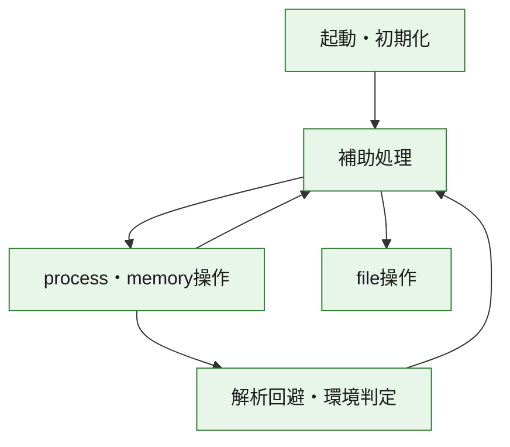
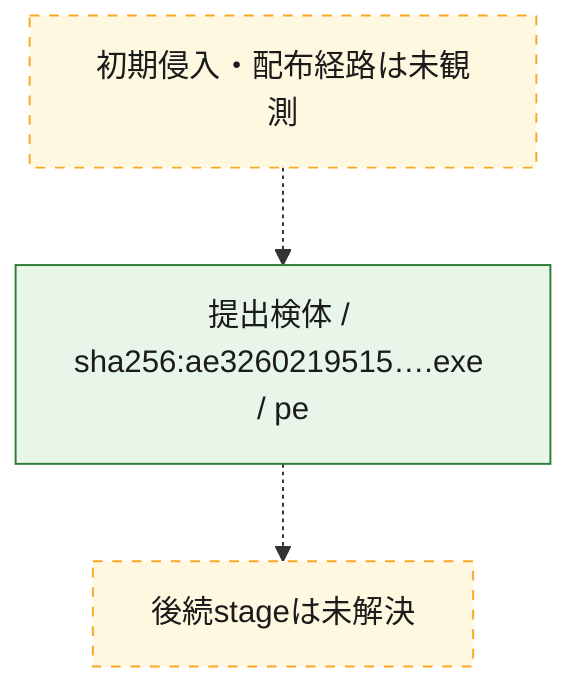
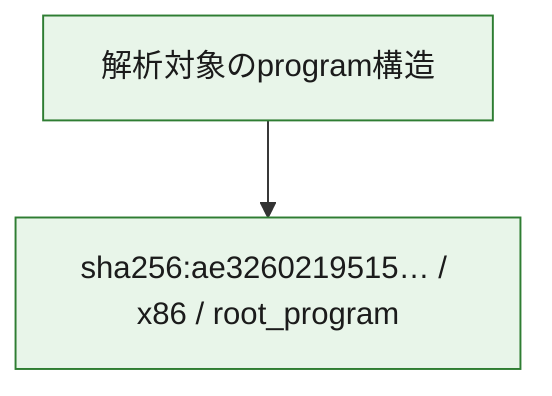

# 全体ロジック：ae326021951543267d2a4e8ea020a21ad5b804ecd1c02467992efcb4b10fddbd

代表関数の静的証跡から、起動・初期化、解析回避・環境判定、process・memory操作、file操作の処理群を確認しました。

## 読み方

- phaseの掲載順は解析上の整理順です。observed_call_edgesがない段階間の実行順を断定しません。
- 図の実線は静的に観測した関係、点線と黄色のノードは未観測・未解決の関係を示します。
- 図は静的な要約であり、動的実行を再現するものではありません。
- 詳細な関数解説とfingerprintは[STATIC-LOGIC.md](STATIC-LOGIC.md)を参照してください。

## 静的可視化

### 実行フロー

### 感染チェーン

### モジュール関係

## 処理段階

### 1. 起動・初期化

entry pointから初期化と後続処理への移行を確認します。
確度: `confirmed_static_function_evidence`

- `ae326021951543267d2a4e8ea020a21ad5b804ecd1c02467992efcb4b10fddbd:ghidra:1800015ec` — 初期化と主要処理への分岐を行う入口関数です。 状態: `succeeded`、選定理由: `entry_point`, `meaningful_symbol_name`, `reviewed_call_centrality:4`, `role:entrypoint`

### 2. 解析回避・環境判定

debugger、sandbox、仮想環境、時間差などの判定を確認します。
確度: `confirmed_static_function_evidence`

- `ae326021951543267d2a4e8ea020a21ad5b804ecd1c02467992efcb4b10fddbd:ghidra:180002448` — debugger、仮想環境、sandbox、または時間差の確認に関係する関数です。 状態: `succeeded`、選定理由: `context_representative`, `reviewed_call_centrality:14`, `role:anti_analysis`

### 3. process・memory操作

process、thread、module、memory操作と実行移行を確認します。
確度: `confirmed_static_function_evidence_with_limits`

- `ae326021951543267d2a4e8ea020a21ad5b804ecd1c02467992efcb4b10fddbd:ghidra:1800010f8` — process、thread、module、またはmemory操作に関係する関数です。 状態: `succeeded`、選定理由: `context_representative`, `reviewed_call_centrality:6`, `role:process_or_memory_operation`
- `ae326021951543267d2a4e8ea020a21ad5b804ecd1c02467992efcb4b10fddbd:ghidra:180002594` — process、thread、module、またはmemory操作に関係する関数です。 状態: `limited_bad_instruction_or_flow`、選定理由: `context_representative`, `reviewed_call_centrality:6`, `role:process_or_memory_operation`

### 4. file操作

fileやdirectoryの作成、読書き、削除を確認します。
確度: `confirmed_static_function_evidence`

- `ae326021951543267d2a4e8ea020a21ad5b804ecd1c02467992efcb4b10fddbd:ghidra:180001014` — fileまたはdirectoryの読書き・管理に関係する関数です。 状態: `succeeded`、選定理由: `context_representative`, `reviewed_call_centrality:16`, `role:file_operation`

### 5. 補助処理

主要処理を支える一般内部関数またはlibrary処理を確認します。
確度: `confirmed_static_function_evidence`

- `ae326021951543267d2a4e8ea020a21ad5b804ecd1c02467992efcb4b10fddbd:ghidra:1800011a4` — 検体内部の一般処理を実装する関数です。 状態: `succeeded`、選定理由: `entry_point`, `meaningful_symbol_name`, `reviewed_call_centrality:3`
- `ae326021951543267d2a4e8ea020a21ad5b804ecd1c02467992efcb4b10fddbd:ghidra:1800011f0` — 検体内部の一般処理を実装する関数です。 状態: `succeeded`、選定理由: `context_representative`, `reviewed_call_centrality:5`
- `ae326021951543267d2a4e8ea020a21ad5b804ecd1c02467992efcb4b10fddbd:ghidra:1800012dc` — 検体内部の一般処理を実装する関数です。 状態: `succeeded`、選定理由: `context_representative`, `reviewed_call_centrality:6`
- `ae326021951543267d2a4e8ea020a21ad5b804ecd1c02467992efcb4b10fddbd:ghidra:18000137c` — 検体内部の一般処理を実装する関数です。 状態: `succeeded`、選定理由: `context_representative`, `reviewed_call_centrality:25`
- `ae326021951543267d2a4e8ea020a21ad5b804ecd1c02467992efcb4b10fddbd:ghidra:1800014d0` — 検体内部の一般処理を実装する関数です。 状態: `succeeded`、選定理由: `context_representative`, `reviewed_call_centrality:3`
- `ae326021951543267d2a4e8ea020a21ad5b804ecd1c02467992efcb4b10fddbd:ghidra:18000162c` — 検体内部の一般処理を実装する関数です。 状態: `succeeded`、選定理由: `context_representative`, `reviewed_call_centrality:9`
- `ae326021951543267d2a4e8ea020a21ad5b804ecd1c02467992efcb4b10fddbd:ghidra:1800017bc` — 検体内部の一般処理を実装する関数です。 状態: `succeeded`、選定理由: `context_representative`, `reviewed_call_centrality:4`
- `ae326021951543267d2a4e8ea020a21ad5b804ecd1c02467992efcb4b10fddbd:ghidra:180001860` — 検体内部の一般処理を実装する関数です。 状態: `succeeded`、選定理由: `context_representative`, `reviewed_call_centrality:4`
- `ae326021951543267d2a4e8ea020a21ad5b804ecd1c02467992efcb4b10fddbd:ghidra:1800018a8` — 検体内部の一般処理を実装する関数です。 状態: `succeeded`、選定理由: `context_representative`, `reviewed_call_centrality:2`
- `ae326021951543267d2a4e8ea020a21ad5b804ecd1c02467992efcb4b10fddbd:ghidra:1800018fc` — 検体内部の一般処理を実装する関数です。 状態: `succeeded`、選定理由: `context_representative`, `reviewed_call_centrality:2`
- `ae326021951543267d2a4e8ea020a21ad5b804ecd1c02467992efcb4b10fddbd:ghidra:180001994` — 検体内部の一般処理を実装する関数です。 状態: `succeeded`、選定理由: `context_representative`, `reviewed_call_centrality:19`
- `ae326021951543267d2a4e8ea020a21ad5b804ecd1c02467992efcb4b10fddbd:ghidra:1800025c8` — 検体内部の一般処理を実装する関数です。 状態: `succeeded`、選定理由: `context_representative`, `reviewed_call_centrality:5`
- `ae326021951543267d2a4e8ea020a21ad5b804ecd1c02467992efcb4b10fddbd:ghidra:180002638` — 検体内部の一般処理を実装する関数です。 状態: `succeeded`、選定理由: `context_representative`, `reviewed_call_centrality:3`
- `ae326021951543267d2a4e8ea020a21ad5b804ecd1c02467992efcb4b10fddbd:ghidra:1800026a0` — 検体内部の一般処理を実装する関数です。 状態: `succeeded`、選定理由: `context_representative`, `reviewed_call_centrality:5`
- `ae326021951543267d2a4e8ea020a21ad5b804ecd1c02467992efcb4b10fddbd:ghidra:1800026c0` — 検体内部の一般処理を実装する関数です。 状態: `succeeded`、選定理由: `context_representative`, `reviewed_call_centrality:1`
- `ae326021951543267d2a4e8ea020a21ad5b804ecd1c02467992efcb4b10fddbd:ghidra:1800026e0` — 検体内部の一般処理を実装する関数です。 状態: `succeeded`、選定理由: `context_representative`, `reviewed_call_centrality:2`
- `ae326021951543267d2a4e8ea020a21ad5b804ecd1c02467992efcb4b10fddbd:ghidra:180002728` — 検体内部の一般処理を実装する関数です。 状態: `succeeded`、選定理由: `context_representative`, `reviewed_call_centrality:5`
- `ae326021951543267d2a4e8ea020a21ad5b804ecd1c02467992efcb4b10fddbd:ghidra:180002938` — 検体内部の一般処理を実装する関数です。 状態: `succeeded`、選定理由: `context_representative`, `reviewed_call_centrality:7`
- `ae326021951543267d2a4e8ea020a21ad5b804ecd1c02467992efcb4b10fddbd:ghidra:180002960` — 検体内部の一般処理を実装する関数です。 状態: `succeeded`、選定理由: `context_representative`, `reviewed_call_centrality:8`
- `ae326021951543267d2a4e8ea020a21ad5b804ecd1c02467992efcb4b10fddbd:ghidra:180002a18` — 検体内部の一般処理を実装する関数です。 状態: `succeeded`、選定理由: `context_representative`, `reviewed_call_centrality:17`
- `ae326021951543267d2a4e8ea020a21ad5b804ecd1c02467992efcb4b10fddbd:ghidra:180002a9c` — 検体内部の一般処理を実装する関数です。 状態: `succeeded`、選定理由: `context_representative`, `reviewed_call_centrality:3`
- `ae326021951543267d2a4e8ea020a21ad5b804ecd1c02467992efcb4b10fddbd:ghidra:180002ac0` — 検体内部の一般処理を実装する関数です。 状態: `succeeded`、選定理由: `context_representative`, `reviewed_call_centrality:8`
- `ae326021951543267d2a4e8ea020a21ad5b804ecd1c02467992efcb4b10fddbd:ghidra:180002bf4` — 検体内部の一般処理を実装する関数です。 状態: `succeeded`、選定理由: `context_representative`, `reviewed_call_centrality:6`
- `ae326021951543267d2a4e8ea020a21ad5b804ecd1c02467992efcb4b10fddbd:ghidra:180002c34` — 検体内部の一般処理を実装する関数です。 状態: `succeeded`、選定理由: `context_representative`, `reviewed_call_centrality:12`
- `ae326021951543267d2a4e8ea020a21ad5b804ecd1c02467992efcb4b10fddbd:ghidra:180002cb8` — 検体内部の一般処理を実装する関数です。 状態: `succeeded`、選定理由: `context_representative`, `reviewed_call_centrality:11`
- `ae326021951543267d2a4e8ea020a21ad5b804ecd1c02467992efcb4b10fddbd:ghidra:180002cf8` — 検体内部の一般処理を実装する関数です。 状態: `succeeded`、選定理由: `context_representative`, `reviewed_call_centrality:4`
- `ae326021951543267d2a4e8ea020a21ad5b804ecd1c02467992efcb4b10fddbd:ghidra:180002d78` — 検体内部の一般処理を実装する関数です。 状態: `succeeded`、選定理由: `context_representative`, `reviewed_call_centrality:6`

## 観測したcall関係

- `ae326021951543267d2a4e8ea020a21ad5b804ecd1c02467992efcb4b10fddbd:ghidra:1800010f8` → `ae326021951543267d2a4e8ea020a21ad5b804ecd1c02467992efcb4b10fddbd:ghidra:1800011f0` （`execution` → `support`）
- `ae326021951543267d2a4e8ea020a21ad5b804ecd1c02467992efcb4b10fddbd:ghidra:1800011a4` → `ae326021951543267d2a4e8ea020a21ad5b804ecd1c02467992efcb4b10fddbd:ghidra:180001014` （`support` → `file_activity`）
- `ae326021951543267d2a4e8ea020a21ad5b804ecd1c02467992efcb4b10fddbd:ghidra:1800011a4` → `ae326021951543267d2a4e8ea020a21ad5b804ecd1c02467992efcb4b10fddbd:ghidra:1800010f8` （`support` → `execution`）
- `ae326021951543267d2a4e8ea020a21ad5b804ecd1c02467992efcb4b10fddbd:ghidra:1800011a4` → `ae326021951543267d2a4e8ea020a21ad5b804ecd1c02467992efcb4b10fddbd:ghidra:1800012dc` （`support` → `support`）
- `ae326021951543267d2a4e8ea020a21ad5b804ecd1c02467992efcb4b10fddbd:ghidra:1800012dc` → `ae326021951543267d2a4e8ea020a21ad5b804ecd1c02467992efcb4b10fddbd:ghidra:1800011f0` （`support` → `support`）
- `ae326021951543267d2a4e8ea020a21ad5b804ecd1c02467992efcb4b10fddbd:ghidra:1800012dc` → `ae326021951543267d2a4e8ea020a21ad5b804ecd1c02467992efcb4b10fddbd:ghidra:18000162c` （`support` → `support`）
- `ae326021951543267d2a4e8ea020a21ad5b804ecd1c02467992efcb4b10fddbd:ghidra:1800012dc` → `ae326021951543267d2a4e8ea020a21ad5b804ecd1c02467992efcb4b10fddbd:ghidra:180001994` （`support` → `support`）
- `ae326021951543267d2a4e8ea020a21ad5b804ecd1c02467992efcb4b10fddbd:ghidra:1800012dc` → `ae326021951543267d2a4e8ea020a21ad5b804ecd1c02467992efcb4b10fddbd:ghidra:180002638` （`support` → `support`）
- `ae326021951543267d2a4e8ea020a21ad5b804ecd1c02467992efcb4b10fddbd:ghidra:1800012dc` → `ae326021951543267d2a4e8ea020a21ad5b804ecd1c02467992efcb4b10fddbd:ghidra:1800026a0` （`support` → `support`）
- `ae326021951543267d2a4e8ea020a21ad5b804ecd1c02467992efcb4b10fddbd:ghidra:18000137c` → `ae326021951543267d2a4e8ea020a21ad5b804ecd1c02467992efcb4b10fddbd:ghidra:180002938` （`support` → `support`）
- `ae326021951543267d2a4e8ea020a21ad5b804ecd1c02467992efcb4b10fddbd:ghidra:18000137c` → `ae326021951543267d2a4e8ea020a21ad5b804ecd1c02467992efcb4b10fddbd:ghidra:180002960` （`support` → `support`）
- `ae326021951543267d2a4e8ea020a21ad5b804ecd1c02467992efcb4b10fddbd:ghidra:18000137c` → `ae326021951543267d2a4e8ea020a21ad5b804ecd1c02467992efcb4b10fddbd:ghidra:180002bf4` （`support` → `support`）
- `ae326021951543267d2a4e8ea020a21ad5b804ecd1c02467992efcb4b10fddbd:ghidra:18000137c` → `ae326021951543267d2a4e8ea020a21ad5b804ecd1c02467992efcb4b10fddbd:ghidra:180002c34` （`support` → `support`）
- `ae326021951543267d2a4e8ea020a21ad5b804ecd1c02467992efcb4b10fddbd:ghidra:18000137c` → `ae326021951543267d2a4e8ea020a21ad5b804ecd1c02467992efcb4b10fddbd:ghidra:180002cb8` （`support` → `support`）
- `ae326021951543267d2a4e8ea020a21ad5b804ecd1c02467992efcb4b10fddbd:ghidra:18000137c` → `ae326021951543267d2a4e8ea020a21ad5b804ecd1c02467992efcb4b10fddbd:ghidra:180002d78` （`support` → `support`）
- `ae326021951543267d2a4e8ea020a21ad5b804ecd1c02467992efcb4b10fddbd:ghidra:1800014d0` → `ae326021951543267d2a4e8ea020a21ad5b804ecd1c02467992efcb4b10fddbd:ghidra:18000137c` （`support` → `support`）
- `ae326021951543267d2a4e8ea020a21ad5b804ecd1c02467992efcb4b10fddbd:ghidra:1800015ec` → `ae326021951543267d2a4e8ea020a21ad5b804ecd1c02467992efcb4b10fddbd:ghidra:18000137c` （`startup` → `support`）
- `ae326021951543267d2a4e8ea020a21ad5b804ecd1c02467992efcb4b10fddbd:ghidra:18000162c` → `ae326021951543267d2a4e8ea020a21ad5b804ecd1c02467992efcb4b10fddbd:ghidra:1800026a0` （`support` → `support`）
- `ae326021951543267d2a4e8ea020a21ad5b804ecd1c02467992efcb4b10fddbd:ghidra:1800017bc` → `ae326021951543267d2a4e8ea020a21ad5b804ecd1c02467992efcb4b10fddbd:ghidra:180002a9c` （`support` → `support`）
- `ae326021951543267d2a4e8ea020a21ad5b804ecd1c02467992efcb4b10fddbd:ghidra:180001860` → `ae326021951543267d2a4e8ea020a21ad5b804ecd1c02467992efcb4b10fddbd:ghidra:18000162c` （`support` → `support`）
- `ae326021951543267d2a4e8ea020a21ad5b804ecd1c02467992efcb4b10fddbd:ghidra:1800018a8` → `ae326021951543267d2a4e8ea020a21ad5b804ecd1c02467992efcb4b10fddbd:ghidra:180001860` （`support` → `support`）
- `ae326021951543267d2a4e8ea020a21ad5b804ecd1c02467992efcb4b10fddbd:ghidra:1800018fc` → `ae326021951543267d2a4e8ea020a21ad5b804ecd1c02467992efcb4b10fddbd:ghidra:180001860` （`support` → `support`）
- `ae326021951543267d2a4e8ea020a21ad5b804ecd1c02467992efcb4b10fddbd:ghidra:180001994` → `ae326021951543267d2a4e8ea020a21ad5b804ecd1c02467992efcb4b10fddbd:ghidra:1800017bc` （`support` → `support`）
- `ae326021951543267d2a4e8ea020a21ad5b804ecd1c02467992efcb4b10fddbd:ghidra:180001994` → `ae326021951543267d2a4e8ea020a21ad5b804ecd1c02467992efcb4b10fddbd:ghidra:180001860` （`support` → `support`）
- `ae326021951543267d2a4e8ea020a21ad5b804ecd1c02467992efcb4b10fddbd:ghidra:180001994` → `ae326021951543267d2a4e8ea020a21ad5b804ecd1c02467992efcb4b10fddbd:ghidra:1800018a8` （`support` → `support`）
- `ae326021951543267d2a4e8ea020a21ad5b804ecd1c02467992efcb4b10fddbd:ghidra:180001994` → `ae326021951543267d2a4e8ea020a21ad5b804ecd1c02467992efcb4b10fddbd:ghidra:1800018fc` （`support` → `support`）
- `ae326021951543267d2a4e8ea020a21ad5b804ecd1c02467992efcb4b10fddbd:ghidra:180001994` → `ae326021951543267d2a4e8ea020a21ad5b804ecd1c02467992efcb4b10fddbd:ghidra:180002638` （`support` → `support`）
- `ae326021951543267d2a4e8ea020a21ad5b804ecd1c02467992efcb4b10fddbd:ghidra:180001994` → `ae326021951543267d2a4e8ea020a21ad5b804ecd1c02467992efcb4b10fddbd:ghidra:1800026a0` （`support` → `support`）
- `ae326021951543267d2a4e8ea020a21ad5b804ecd1c02467992efcb4b10fddbd:ghidra:180001994` → `ae326021951543267d2a4e8ea020a21ad5b804ecd1c02467992efcb4b10fddbd:ghidra:180002cb8` （`support` → `support`）
- `ae326021951543267d2a4e8ea020a21ad5b804ecd1c02467992efcb4b10fddbd:ghidra:180001994` → `ae326021951543267d2a4e8ea020a21ad5b804ecd1c02467992efcb4b10fddbd:ghidra:180002cf8` （`support` → `support`）
- `ae326021951543267d2a4e8ea020a21ad5b804ecd1c02467992efcb4b10fddbd:ghidra:180002448` → `ae326021951543267d2a4e8ea020a21ad5b804ecd1c02467992efcb4b10fddbd:ghidra:1800011f0` （`evasion` → `support`）
- `ae326021951543267d2a4e8ea020a21ad5b804ecd1c02467992efcb4b10fddbd:ghidra:180002594` → `ae326021951543267d2a4e8ea020a21ad5b804ecd1c02467992efcb4b10fddbd:ghidra:180002448` （`execution` → `evasion`）
- `ae326021951543267d2a4e8ea020a21ad5b804ecd1c02467992efcb4b10fddbd:ghidra:1800025c8` → `ae326021951543267d2a4e8ea020a21ad5b804ecd1c02467992efcb4b10fddbd:ghidra:180002594` （`support` → `execution`）
- `ae326021951543267d2a4e8ea020a21ad5b804ecd1c02467992efcb4b10fddbd:ghidra:180002638` → `ae326021951543267d2a4e8ea020a21ad5b804ecd1c02467992efcb4b10fddbd:ghidra:1800025c8` （`support` → `support`）
- `ae326021951543267d2a4e8ea020a21ad5b804ecd1c02467992efcb4b10fddbd:ghidra:1800026a0` → `ae326021951543267d2a4e8ea020a21ad5b804ecd1c02467992efcb4b10fddbd:ghidra:180002a18` （`support` → `support`）
- `ae326021951543267d2a4e8ea020a21ad5b804ecd1c02467992efcb4b10fddbd:ghidra:1800026c0` → `ae326021951543267d2a4e8ea020a21ad5b804ecd1c02467992efcb4b10fddbd:ghidra:180002a18` （`support` → `support`）
- `ae326021951543267d2a4e8ea020a21ad5b804ecd1c02467992efcb4b10fddbd:ghidra:1800026e0` → `ae326021951543267d2a4e8ea020a21ad5b804ecd1c02467992efcb4b10fddbd:ghidra:180002a18` （`support` → `support`）
- `ae326021951543267d2a4e8ea020a21ad5b804ecd1c02467992efcb4b10fddbd:ghidra:180002938` → `ae326021951543267d2a4e8ea020a21ad5b804ecd1c02467992efcb4b10fddbd:ghidra:180002cb8` （`support` → `support`）
- `ae326021951543267d2a4e8ea020a21ad5b804ecd1c02467992efcb4b10fddbd:ghidra:180002a18` → `ae326021951543267d2a4e8ea020a21ad5b804ecd1c02467992efcb4b10fddbd:ghidra:180002960` （`support` → `support`）
- `ae326021951543267d2a4e8ea020a21ad5b804ecd1c02467992efcb4b10fddbd:ghidra:180002a18` → `ae326021951543267d2a4e8ea020a21ad5b804ecd1c02467992efcb4b10fddbd:ghidra:180002cb8` （`support` → `support`）
- `ae326021951543267d2a4e8ea020a21ad5b804ecd1c02467992efcb4b10fddbd:ghidra:180002a18` → `ae326021951543267d2a4e8ea020a21ad5b804ecd1c02467992efcb4b10fddbd:ghidra:180002d78` （`support` → `support`）
- `ae326021951543267d2a4e8ea020a21ad5b804ecd1c02467992efcb4b10fddbd:ghidra:180002a9c` → `ae326021951543267d2a4e8ea020a21ad5b804ecd1c02467992efcb4b10fddbd:ghidra:180002a18` （`support` → `support`）
- `ae326021951543267d2a4e8ea020a21ad5b804ecd1c02467992efcb4b10fddbd:ghidra:180002ac0` → `ae326021951543267d2a4e8ea020a21ad5b804ecd1c02467992efcb4b10fddbd:ghidra:180002cb8` （`support` → `support`）
- `ae326021951543267d2a4e8ea020a21ad5b804ecd1c02467992efcb4b10fddbd:ghidra:180002bf4` → `ae326021951543267d2a4e8ea020a21ad5b804ecd1c02467992efcb4b10fddbd:ghidra:180002ac0` （`support` → `support`）
- `ae326021951543267d2a4e8ea020a21ad5b804ecd1c02467992efcb4b10fddbd:ghidra:180002c34` → `ae326021951543267d2a4e8ea020a21ad5b804ecd1c02467992efcb4b10fddbd:ghidra:180002938` （`support` → `support`）
- `ae326021951543267d2a4e8ea020a21ad5b804ecd1c02467992efcb4b10fddbd:ghidra:180002c34` → `ae326021951543267d2a4e8ea020a21ad5b804ecd1c02467992efcb4b10fddbd:ghidra:180002960` （`support` → `support`）
- `ae326021951543267d2a4e8ea020a21ad5b804ecd1c02467992efcb4b10fddbd:ghidra:180002c34` → `ae326021951543267d2a4e8ea020a21ad5b804ecd1c02467992efcb4b10fddbd:ghidra:180002d78` （`support` → `support`）
- `ae326021951543267d2a4e8ea020a21ad5b804ecd1c02467992efcb4b10fddbd:ghidra:180002cb8` → `ae326021951543267d2a4e8ea020a21ad5b804ecd1c02467992efcb4b10fddbd:ghidra:1800026a0` （`support` → `support`）
- `ghidra-function:004fea55f228f6efc42cc209` → `ghidra-function:d4ec5ada4377f9823d6ffc14` （`unclassified` → `unclassified`）
- `ghidra-function:004fea55f228f6efc42cc209` → `ghidra-function:e4326b719d4c3d9982ca2a25` （`unclassified` → `unclassified`）
- `ghidra-function:004fea55f228f6efc42cc209` → `ghidra-function:e4bf70ccd7ae78cabcfb4e23` （`unclassified` → `unclassified`）
- `ghidra-function:005197a4736f52645aa6531f` → `ghidra-function:8be098c5209e59cdbcf5aa68` （`unclassified` → `unclassified`）
- `ghidra-function:005197a4736f52645aa6531f` → `ghidra-function:bc50cae6793d25ebb8afa438` （`unclassified` → `unclassified`）
- `ghidra-function:005197a4736f52645aa6531f` → `ghidra-function:bf3acb9af9e539d35e26f131` （`unclassified` → `unclassified`）
- `ghidra-function:011f20b913d3c2fe39b737a2` → `ghidra-function:058d226108605a497934980c` （`unclassified` → `unclassified`）
- `ghidra-function:058d226108605a497934980c` → `ghidra-external:c4022fff1c0dfeeb1eb1eb19` （`unclassified` → `unclassified`）
- `ghidra-function:058d226108605a497934980c` → `ghidra-function:e6ceb102ec49c5e150856db6` （`unclassified` → `unclassified`）
- `ghidra-function:058d226108605a497934980c` → `ghidra-function:e9fc610a036bd22a3849f7dd` （`unclassified` → `unclassified`）
- `ghidra-function:0b4db6de8d5fa4fea7ec16f3` → `ghidra-external:fd88939063eddce6c82e10b6` （`unclassified` → `unclassified`）
- `ghidra-function:0b4db6de8d5fa4fea7ec16f3` → `ghidra-function:8ac292dc2ef0e50757cf4bc6` （`unclassified` → `unclassified`）
- `ghidra-function:0b4db6de8d5fa4fea7ec16f3` → `ghidra-function:e0dc40fd13776bdc14005c84` （`unclassified` → `unclassified`）
- `ghidra-function:0b4db6de8d5fa4fea7ec16f3` → `ghidra-function:e7541406521cd3b58a056967` （`unclassified` → `unclassified`）
- `ghidra-function:1871ad15ead796f4baba62ff` → `ghidra-external:75b654c80b0d5388035d92e7` （`unclassified` → `unclassified`）
- `ghidra-function:1871ad15ead796f4baba62ff` → `ghidra-function:0ee0b47a73342b9fb6f04f3a` （`unclassified` → `unclassified`）
- `ghidra-function:1871ad15ead796f4baba62ff` → `ghidra-function:2f15469aec0f2779500371c2` （`unclassified` → `unclassified`）
- `ghidra-function:1871ad15ead796f4baba62ff` → `ghidra-function:32d7e9748b60b63518fdd6ea` （`unclassified` → `unclassified`）
- `ghidra-function:1871ad15ead796f4baba62ff` → `ghidra-function:8ac292dc2ef0e50757cf4bc6` （`unclassified` → `unclassified`）
- `ghidra-function:1871ad15ead796f4baba62ff` → `ghidra-function:adba08db44c520a94c16cfce` （`unclassified` → `unclassified`）
- `ghidra-function:1871ad15ead796f4baba62ff` → `ghidra-function:b4e0e60d9a55673e31ca77e7` （`unclassified` → `unclassified`）
- `ghidra-function:22749e46f93e3273a304ff84` → `ghidra-function:1ddba95378cb938d9bf9c594` （`unclassified` → `unclassified`）
- `ghidra-function:22749e46f93e3273a304ff84` → `ghidra-function:296fcf2c334ff7c56fb564f1` （`unclassified` → `unclassified`）
- `ghidra-function:22749e46f93e3273a304ff84` → `ghidra-function:c9046e53e36f78cc5f15fb27` （`unclassified` → `unclassified`）
- `ghidra-function:22749e46f93e3273a304ff84` → `ghidra-function:e16fd4612502c6de834edaf7` （`unclassified` → `unclassified`）
- `ghidra-function:2d62a766240672900c775401` → `ghidra-function:1871ad15ead796f4baba62ff` （`unclassified` → `unclassified`）
- `ghidra-function:322b3b1d87298cf3ca52aa96` → `ghidra-external:210930cda877e07ea53b43b2` （`unclassified` → `unclassified`）
- `ghidra-function:322b3b1d87298cf3ca52aa96` → `ghidra-external:dcbd69b84adee871b6ba704d` （`unclassified` → `unclassified`）
- `ghidra-function:322b3b1d87298cf3ca52aa96` → `ghidra-function:d9803be5a518729e00a7babc` （`unclassified` → `unclassified`）
- `ghidra-function:3a370de919ddd14c886169b1` → `ghidra-function:68f666bc07fd03861b23050c` （`unclassified` → `unclassified`）
- `ghidra-function:3a370de919ddd14c886169b1` → `ghidra-function:cc9b38de90209e86f963ffa9` （`unclassified` → `unclassified`）
- `ghidra-function:3c4c84c930fbf93977f81461` → `ghidra-function:3a07f5930da027d8a954b4da` （`unclassified` → `unclassified`）
- `ghidra-function:3c4c84c930fbf93977f81461` → `ghidra-function:3a370de919ddd14c886169b1` （`unclassified` → `unclassified`）
- `ghidra-function:3c4c84c930fbf93977f81461` → `ghidra-function:6705ba890478340ecdbc8035` （`unclassified` → `unclassified`）
- `ghidra-function:3c4c84c930fbf93977f81461` → `ghidra-function:868c4539b12650d42a214ed6` （`unclassified` → `unclassified`）
- `ghidra-function:3c4c84c930fbf93977f81461` → `ghidra-function:8be098c5209e59cdbcf5aa68` （`unclassified` → `unclassified`）
- `ghidra-function:3c4c84c930fbf93977f81461` → `ghidra-function:ded2379a14b9ca17a597ee1d` （`unclassified` → `unclassified`）
- `ghidra-function:3c4c84c930fbf93977f81461` → `ghidra-function:e9929768f36de38e028c0ab9` （`unclassified` → `unclassified`）
- `ghidra-function:3c4c84c930fbf93977f81461` → `ghidra-function:eb5030109f6fe74eda63f270` （`unclassified` → `unclassified`）
- `ghidra-function:489e4c201d699f08aeed674a` → `ghidra-external:fd88939063eddce6c82e10b6` （`unclassified` → `unclassified`）
- `ghidra-function:489e4c201d699f08aeed674a` → `ghidra-function:ad5ae63af4d833c079f3c753` （`unclassified` → `unclassified`）
- `ghidra-function:4b3c33c3fed8f9080ff87ce8` → `ghidra-external:0912de6416ef0e792e1b9da5` （`unclassified` → `unclassified`）
- `ghidra-function:4b3c33c3fed8f9080ff87ce8` → `ghidra-function:0aa0da199f2e6669ad77acc0` （`unclassified` → `unclassified`）
- `ghidra-function:4b3c33c3fed8f9080ff87ce8` → `ghidra-function:375d072d957c7d05aa00a099` （`unclassified` → `unclassified`）
- `ghidra-function:4b3c33c3fed8f9080ff87ce8` → `ghidra-function:8e50ac03c7adcfbe4159b61e` （`unclassified` → `unclassified`）
- `ghidra-function:4b3c33c3fed8f9080ff87ce8` → `ghidra-function:a00180ba36f1092ddaf1327b` （`unclassified` → `unclassified`）
- `ghidra-function:4b3c33c3fed8f9080ff87ce8` → `ghidra-function:a5ed586bfea0ad0d376cd2b7` （`unclassified` → `unclassified`）
- `ghidra-function:4b3c33c3fed8f9080ff87ce8` → `ghidra-function:c1e228b63d1307115873b541` （`unclassified` → `unclassified`）
- `ghidra-function:4b3c33c3fed8f9080ff87ce8` → `ghidra-function:f46bde2c75a6e228921cb206` （`unclassified` → `unclassified`）
- `ghidra-function:693cc96af334164c28a2a33c` → `ghidra-function:2d62a766240672900c775401` （`unclassified` → `unclassified`）
- `ghidra-function:7f507db7cff37cc9a9c88347` → `ghidra-external:0912de6416ef0e792e1b9da5` （`unclassified` → `unclassified`）
- `ghidra-function:7f507db7cff37cc9a9c88347` → `ghidra-external:210930cda877e07ea53b43b2` （`unclassified` → `unclassified`）
- `ghidra-function:7f507db7cff37cc9a9c88347` → `ghidra-external:3d744a406df12dcfdafe1e57` （`unclassified` → `unclassified`）
- `ghidra-function:7f507db7cff37cc9a9c88347` → `ghidra-function:004fea55f228f6efc42cc209` （`unclassified` → `unclassified`）
- `ghidra-function:7f507db7cff37cc9a9c88347` → `ghidra-function:011f20b913d3c2fe39b737a2` （`unclassified` → `unclassified`）
- `ghidra-function:7f507db7cff37cc9a9c88347` → `ghidra-function:0b4db6de8d5fa4fea7ec16f3` （`unclassified` → `unclassified`）
- `ghidra-function:7f507db7cff37cc9a9c88347` → `ghidra-function:0cb14808a9cab36c917185b3` （`unclassified` → `unclassified`）
- `ghidra-function:7f507db7cff37cc9a9c88347` → `ghidra-function:10986962e264bd1b07024773` （`unclassified` → `unclassified`）
- `ghidra-function:7f507db7cff37cc9a9c88347` → `ghidra-function:2d62a766240672900c775401` （`unclassified` → `unclassified`）
- `ghidra-function:7f507db7cff37cc9a9c88347` → `ghidra-function:61f2386434e7389984efacbc` （`unclassified` → `unclassified`）
- `ghidra-function:7f507db7cff37cc9a9c88347` → `ghidra-function:693cc96af334164c28a2a33c` （`unclassified` → `unclassified`）
- `ghidra-function:7f507db7cff37cc9a9c88347` → `ghidra-function:8070e59c694397edeec37c1b` （`unclassified` → `unclassified`）
- `ghidra-function:7f507db7cff37cc9a9c88347` → `ghidra-function:8ac292dc2ef0e50757cf4bc6` （`unclassified` → `unclassified`）
- `ghidra-function:7f507db7cff37cc9a9c88347` → `ghidra-function:9afb33ea6e9d17dcf2726c93` （`unclassified` → `unclassified`）
- `ghidra-function:7f507db7cff37cc9a9c88347` → `ghidra-function:adba08db44c520a94c16cfce` （`unclassified` → `unclassified`）
- `ghidra-function:7f507db7cff37cc9a9c88347` → `ghidra-function:e9fc610a036bd22a3849f7dd` （`unclassified` → `unclassified`）
- `ghidra-function:7f507db7cff37cc9a9c88347` → `ghidra-function:f1686287a506b861ca5533d3` （`unclassified` → `unclassified`）
- `ghidra-function:8070e59c694397edeec37c1b` → `ghidra-function:2d62a766240672900c775401` （`unclassified` → `unclassified`）
- `ghidra-function:868c4539b12650d42a214ed6` → `ghidra-external:43bc07aece393fd48c3cf834` （`unclassified` → `unclassified`）
- `ghidra-function:868c4539b12650d42a214ed6` → `ghidra-external:be80a595bc6ec439552d811e` （`unclassified` → `unclassified`）
- `ghidra-function:868c4539b12650d42a214ed6` → `ghidra-external:da3748436408509068770e3b` （`unclassified` → `unclassified`）
- `ghidra-function:868c4539b12650d42a214ed6` → `ghidra-external:fb6aff12163f4353ad2a6497` （`unclassified` → `unclassified`）
- `ghidra-function:868c4539b12650d42a214ed6` → `ghidra-function:cf5ce3f7efc4c10ec7c67ca0` （`unclassified` → `unclassified`）
- `ghidra-function:8ac292dc2ef0e50757cf4bc6` → `ghidra-function:ad5ae63af4d833c079f3c753` （`unclassified` → `unclassified`）
- `ghidra-function:a30950f86b494a178ebefc0b` → `ghidra-function:ad5ae63af4d833c079f3c753` （`unclassified` → `unclassified`）
- `ghidra-function:ad5ae63af4d833c079f3c753` → `ghidra-function:0b4db6de8d5fa4fea7ec16f3` （`unclassified` → `unclassified`）
- `ghidra-function:ad5ae63af4d833c079f3c753` → `ghidra-function:195d98ea9757a8d21544af8b` （`unclassified` → `unclassified`）
- `ghidra-function:ad5ae63af4d833c079f3c753` → `ghidra-function:3a370de919ddd14c886169b1` （`unclassified` → `unclassified`）
- `ghidra-function:ad5ae63af4d833c079f3c753` → `ghidra-function:868c4539b12650d42a214ed6` （`unclassified` → `unclassified`）
- `ghidra-function:ad5ae63af4d833c079f3c753` → `ghidra-function:8be098c5209e59cdbcf5aa68` （`unclassified` → `unclassified`）
- `ghidra-function:ad5ae63af4d833c079f3c753` → `ghidra-function:bf3acb9af9e539d35e26f131` （`unclassified` → `unclassified`）
- `ghidra-function:ad5ae63af4d833c079f3c753` → `ghidra-function:e7541406521cd3b58a056967` （`unclassified` → `unclassified`）
- `ghidra-function:ad5ae63af4d833c079f3c753` → `ghidra-function:e9929768f36de38e028c0ab9` （`unclassified` → `unclassified`）
- `ghidra-function:b38ec22564172656d19b2246` → `ghidra-external:0ba992f605fc2ef32d43315d` （`unclassified` → `unclassified`）
- `ghidra-function:b38ec22564172656d19b2246` → `ghidra-external:5622adc9926e04946911ae13` （`unclassified` → `unclassified`）
- `ghidra-function:b38ec22564172656d19b2246` → `ghidra-external:b3dfc297e6146029fde26d6a` （`unclassified` → `unclassified`）
- `ghidra-function:b38ec22564172656d19b2246` → `ghidra-function:56f062f3dd3f7eab3a3ed7a4` （`unclassified` → `unclassified`）
- `ghidra-function:b38ec22564172656d19b2246` → `ghidra-function:9afb33ea6e9d17dcf2726c93` （`unclassified` → `unclassified`）
- `ghidra-function:b38ec22564172656d19b2246` → `ghidra-function:b062a053be6d0f500cb5f765` （`unclassified` → `unclassified`）
- `ghidra-function:b38ec22564172656d19b2246` → `ghidra-function:bfd17f353afda63eb015c013` （`unclassified` → `unclassified`）
- `ghidra-function:b38ec22564172656d19b2246` → `ghidra-function:c405b2ca1327ad8d36b787d9` （`unclassified` → `unclassified`）
- `ghidra-function:b38ec22564172656d19b2246` → `ghidra-function:daa3c6942eb1d718ea8b73a8` （`unclassified` → `unclassified`）
- `ghidra-function:bc50cae6793d25ebb8afa438` → `ghidra-external:43bc07aece393fd48c3cf834` （`unclassified` → `unclassified`）
- `ghidra-function:bc50cae6793d25ebb8afa438` → `ghidra-external:be80a595bc6ec439552d811e` （`unclassified` → `unclassified`）
- `ghidra-function:bc50cae6793d25ebb8afa438` → `ghidra-external:e5bdb469ff81de6dd0923891` （`unclassified` → `unclassified`）
- `ghidra-function:bc50cae6793d25ebb8afa438` → `ghidra-external:fb6aff12163f4353ad2a6497` （`unclassified` → `unclassified`）
- `ghidra-function:bc50cae6793d25ebb8afa438` → `ghidra-function:0b4db6de8d5fa4fea7ec16f3` （`unclassified` → `unclassified`）
- `ghidra-function:bc50cae6793d25ebb8afa438` → `ghidra-function:944fdab9822ac0a22e467918` （`unclassified` → `unclassified`）
- `ghidra-function:bc50cae6793d25ebb8afa438` → `ghidra-function:cf5ce3f7efc4c10ec7c67ca0` （`unclassified` → `unclassified`）
- `ghidra-function:d4ec5ada4377f9823d6ffc14` → `ghidra-function:318c7ca83e3bd482c1ffa074` （`unclassified` → `unclassified`）
- `ghidra-function:d4ec5ada4377f9823d6ffc14` → `ghidra-function:ad5ae63af4d833c079f3c753` （`unclassified` → `unclassified`）
- `ghidra-function:d72661d3362d884a40a29240` → `ghidra-function:011f20b913d3c2fe39b737a2` （`unclassified` → `unclassified`）
- `ghidra-function:d72661d3362d884a40a29240` → `ghidra-function:1871ad15ead796f4baba62ff` （`unclassified` → `unclassified`）
- `ghidra-function:d72661d3362d884a40a29240` → `ghidra-function:7f507db7cff37cc9a9c88347` （`unclassified` → `unclassified`）
- `ghidra-function:d72661d3362d884a40a29240` → `ghidra-function:8ac292dc2ef0e50757cf4bc6` （`unclassified` → `unclassified`）
- `ghidra-function:d72661d3362d884a40a29240` → `ghidra-function:daa3c6942eb1d718ea8b73a8` （`unclassified` → `unclassified`）
- `ghidra-function:d9803be5a518729e00a7babc` → `ghidra-external:0a9af3ec65a282d39cd00bb7` （`unclassified` → `unclassified`）
- `ghidra-function:d9803be5a518729e00a7babc` → `ghidra-external:daef81b8a3a2469c44edd484` （`unclassified` → `unclassified`）
- `ghidra-function:d9803be5a518729e00a7babc` → `ghidra-function:005197a4736f52645aa6531f` （`unclassified` → `unclassified`）
- `ghidra-function:d9803be5a518729e00a7babc` → `ghidra-function:0b4db6de8d5fa4fea7ec16f3` （`unclassified` → `unclassified`）
- `ghidra-function:d9803be5a518729e00a7babc` → `ghidra-function:0eecba1f881c3864db2c0a92` （`unclassified` → `unclassified`）
- `ghidra-function:d9803be5a518729e00a7babc` → `ghidra-function:2a1bad617fc5e8f3a78f4209` （`unclassified` → `unclassified`）
- `ghidra-function:d9803be5a518729e00a7babc` → `ghidra-function:3a370de919ddd14c886169b1` （`unclassified` → `unclassified`）
- `ghidra-function:d9803be5a518729e00a7babc` → `ghidra-function:3c4c84c930fbf93977f81461` （`unclassified` → `unclassified`）
- `ghidra-function:d9803be5a518729e00a7babc` → `ghidra-function:6bc27a76c6971eb3eeaaa807` （`unclassified` → `unclassified`）
- `ghidra-function:d9803be5a518729e00a7babc` → `ghidra-function:6cd1ea2cd7692c752eba7ad7` （`unclassified` → `unclassified`）
- `ghidra-function:d9803be5a518729e00a7babc` → `ghidra-function:868c4539b12650d42a214ed6` （`unclassified` → `unclassified`）
- `ghidra-function:d9803be5a518729e00a7babc` → `ghidra-function:8be098c5209e59cdbcf5aa68` （`unclassified` → `unclassified`）
- `ghidra-function:d9803be5a518729e00a7babc` → `ghidra-function:aa1176d8879d69c247ae5157` （`unclassified` → `unclassified`）
- `ghidra-function:d9803be5a518729e00a7babc` → `ghidra-function:c4819ad6622f5cdf4eee8c3e` （`unclassified` → `unclassified`）
- `ghidra-function:d9803be5a518729e00a7babc` → `ghidra-function:cccd6a032f7cc4384d4402ba` （`unclassified` → `unclassified`）
- `ghidra-function:d9803be5a518729e00a7babc` → `ghidra-function:d10cd8fe41ce780e807f21bb` （`unclassified` → `unclassified`）
- `ghidra-function:d9803be5a518729e00a7babc` → `ghidra-function:ded2379a14b9ca17a597ee1d` （`unclassified` → `unclassified`）
- `ghidra-function:d9803be5a518729e00a7babc` → `ghidra-function:e1d3f962b2a5393a5a15b5c7` （`unclassified` → `unclassified`）
- `ghidra-function:d9803be5a518729e00a7babc` → `ghidra-function:e9929768f36de38e028c0ab9` （`unclassified` → `unclassified`）
- `ghidra-function:d9803be5a518729e00a7babc` → `ghidra-function:fc571e844777f5aebf533be9` （`unclassified` → `unclassified`）
- `ghidra-function:daa3c6942eb1d718ea8b73a8` → `ghidra-external:43bc07aece393fd48c3cf834` （`unclassified` → `unclassified`）
- `ghidra-function:daa3c6942eb1d718ea8b73a8` → `ghidra-external:fb6aff12163f4353ad2a6497` （`unclassified` → `unclassified`）
- `ghidra-function:deadc06e773dd131626251a2` → `ghidra-function:0aa0da199f2e6669ad77acc0` （`unclassified` → `unclassified`）
- `ghidra-function:deadc06e773dd131626251a2` → `ghidra-function:bfd8ebf70de197c79b85e4ec` （`unclassified` → `unclassified`）
- `ghidra-function:deadc06e773dd131626251a2` → `ghidra-function:daa3c6942eb1d718ea8b73a8` （`unclassified` → `unclassified`）
- `ghidra-function:ded2379a14b9ca17a597ee1d` → `ghidra-function:0b4db6de8d5fa4fea7ec16f3` （`unclassified` → `unclassified`）
- `ghidra-function:ded2379a14b9ca17a597ee1d` → `ghidra-function:12560eda5244f53100ffd235` （`unclassified` → `unclassified`）
- `ghidra-function:ded2379a14b9ca17a597ee1d` → `ghidra-function:400d1e32cf8b3ad5fdc0bfba` （`unclassified` → `unclassified`）
- `ghidra-function:e0e4bedc42e5e3c1e4e54494` → `ghidra-external:210930cda877e07ea53b43b2` （`unclassified` → `unclassified`）
- `ghidra-function:e0e4bedc42e5e3c1e4e54494` → `ghidra-external:dcbd69b84adee871b6ba704d` （`unclassified` → `unclassified`）
- `ghidra-function:e0e4bedc42e5e3c1e4e54494` → `ghidra-function:7c77f68ff9e7f6cae84f860a` （`unclassified` → `unclassified`）
- `ghidra-function:e0e4bedc42e5e3c1e4e54494` → `ghidra-function:d9803be5a518729e00a7babc` （`unclassified` → `unclassified`）
- `ghidra-function:e13fc039ad04ba6810e3238e` → `ghidra-function:4b3c33c3fed8f9080ff87ce8` （`unclassified` → `unclassified`）
- `ghidra-function:e13fc039ad04ba6810e3238e` → `ghidra-function:d72661d3362d884a40a29240` （`unclassified` → `unclassified`）
- `ghidra-function:e13fc039ad04ba6810e3238e` → `ghidra-function:deadc06e773dd131626251a2` （`unclassified` → `unclassified`）
- `ghidra-function:e6ceb102ec49c5e150856db6` → `ghidra-function:715e922c16bffce3e7aa652b` （`unclassified` → `unclassified`）
- `ghidra-function:e6ceb102ec49c5e150856db6` → `ghidra-function:b38ec22564172656d19b2246` （`unclassified` → `unclassified`）
- `ghidra-function:e6ceb102ec49c5e150856db6` → `ghidra-function:ffa1b4ec0fb7177187824d0a` （`unclassified` → `unclassified`）
- `ghidra-function:f1686287a506b861ca5533d3` → `ghidra-function:cc9b38de90209e86f963ffa9` （`unclassified` → `unclassified`）
- `ghidra-function:f1686287a506b861ca5533d3` → `ghidra-function:e9ff321cad171c2eaf6fff84` （`unclassified` → `unclassified`）

## 解析範囲と制約

- 選定外関数は全体inventoryへ残しますが、関数本体の個別解説対象にはしていません。
- indirect call、難読化、packer、VM、壊れたcontrol flowによりcall関係が欠落する場合があります。
- 文書は静的解析に基づき、検体実行や外部通信による動的確認は行っていません。
