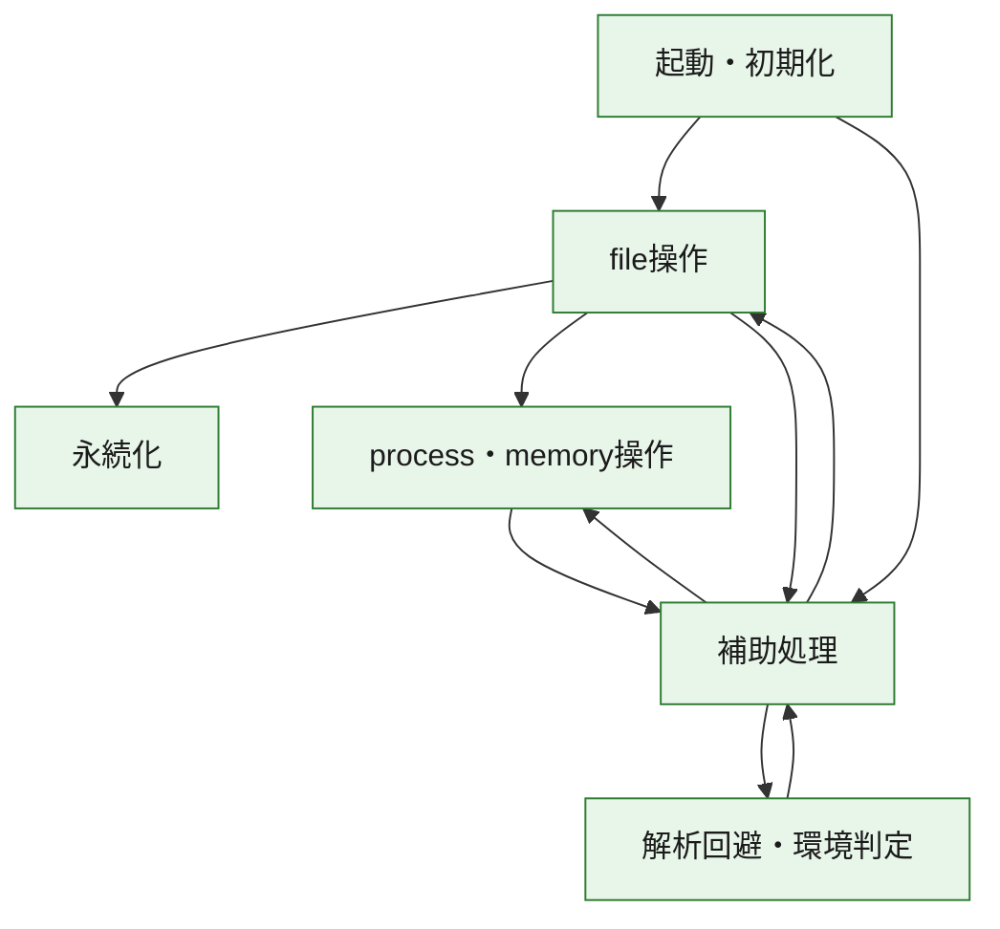
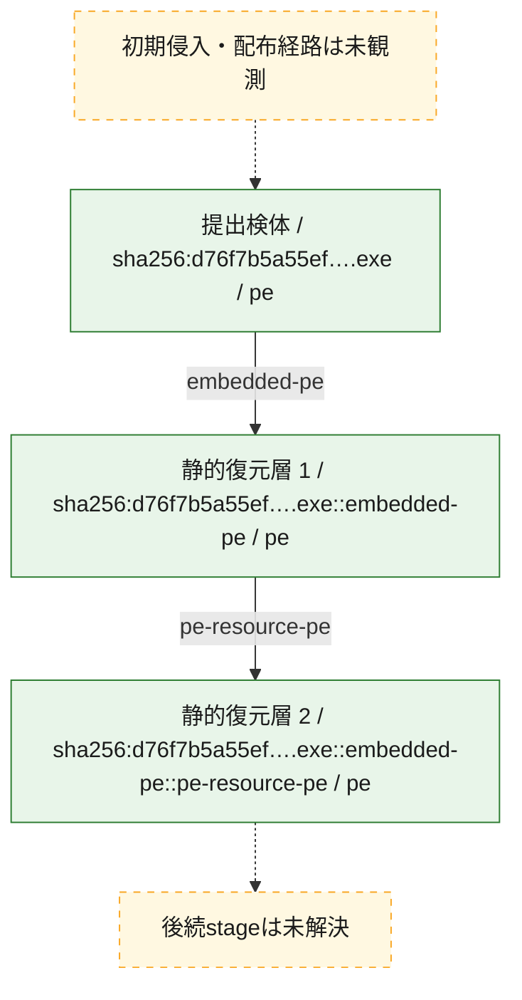
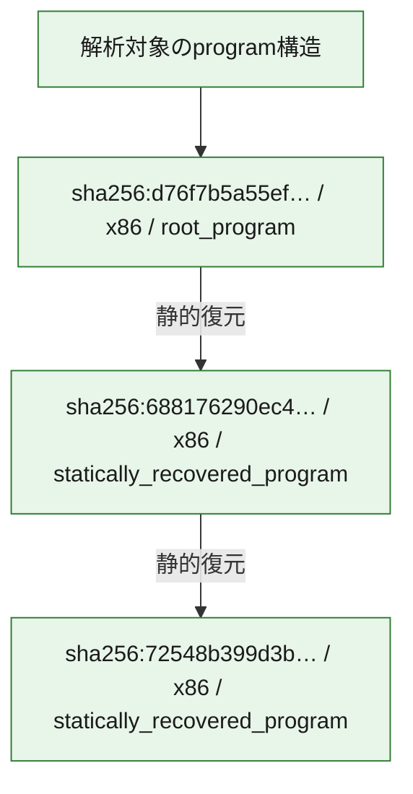

# 全体ロジック：d76f7b5a55ef8f6db63f62a3e83646d57d50677267ab316909122b2ae716eb90

代表関数の静的証跡から、起動・初期化、解析回避・環境判定、永続化、process・memory操作、file操作の処理群を確認しました。

## 読み方

- phaseの掲載順は解析上の整理順です。observed_call_edgesがない段階間の実行順を断定しません。
- 図の実線は静的に観測した関係、点線と黄色のノードは未観測・未解決の関係を示します。
- 図は静的な要約であり、動的実行を再現するものではありません。
- 詳細な関数解説とfingerprintは[STATIC-LOGIC.md](STATIC-LOGIC.md)を参照してください。

## 静的可視化

### 実行フロー

### 感染チェーン

### モジュール関係

## 処理段階

### 1. 起動・初期化

entry pointから初期化と後続処理への移行を確認します。
確度: `confirmed_static_function_evidence`

- `72548b399d3b0da50ffdbdb16bdc06582d9cc210a27c4685f0a79fbcb293d2c9:ghidra:004077ba` — 初期化と主要処理への分岐を行う入口関数です。 状態: `succeeded`、選定理由: `call_graph_centrality:in=0,out=13`, `entry_point`, `large_function:instructions=111`, `meaningful_symbol_name`, `reviewed_call_centrality:13`, `reviewed_call_centrality:21`, `role:entrypoint`
- `688176290ec4c2df1575a0015881ea225b439e50dfff55fedb9cd644f12ab9f4:ghidra:00409a16` — 初期化と主要処理への分岐を行う入口関数です。 状態: `succeeded`、選定理由: `call_graph_centrality:in=0,out=2`, `entry_point`, `large_function:instructions=111`, `meaningful_symbol_name`, `reviewed_call_centrality:2`, `reviewed_call_centrality:21`, `role:entrypoint`, `small_program_complete_context`
- `d76f7b5a55ef8f6db63f62a3e83646d57d50677267ab316909122b2ae716eb90:ghidra:1800015ec` — 初期化と主要処理への分岐を行う入口関数です。 状態: `succeeded`、選定理由: `entry_point`, `meaningful_symbol_name`, `reviewed_call_centrality:4`, `role:entrypoint`

### 2. 解析回避・環境判定

debugger、sandbox、仮想環境、時間差などの判定を確認します。
確度: `confirmed_static_function_evidence`

- `d76f7b5a55ef8f6db63f62a3e83646d57d50677267ab316909122b2ae716eb90:ghidra:180002448` — debugger、仮想環境、sandbox、または時間差の確認に関係する関数です。 状態: `succeeded`、選定理由: `context_representative`, `reviewed_call_centrality:14`, `role:anti_analysis`

### 3. 永続化

自動起動や永続化に関係する設定変更を確認します。
確度: `confirmed_static_function_evidence`

- `72548b399d3b0da50ffdbdb16bdc06582d9cc210a27c4685f0a79fbcb293d2c9:ghidra:004010fd` — 自動起動または永続化に関係する処理を含む関数です。 状態: `succeeded`、選定理由: `call_graph_centrality:in=1,out=8`, `large_function:instructions=100`, `reviewed_call_centrality:16`, `reviewed_call_centrality:9`, `role:persistence`
- `72548b399d3b0da50ffdbdb16bdc06582d9cc210a27c4685f0a79fbcb293d2c9:ghidra:00401ce8` — 自動起動または永続化に関係する処理を含む関数です。 状態: `succeeded`、選定理由: `call_graph_centrality:in=1,out=6`, `large_function:instructions=75`, `reviewed_call_centrality:13`, `reviewed_call_centrality:7`, `role:persistence`

### 4. process・memory操作

process、thread、module、memory操作と実行移行を確認します。
確度: `confirmed_static_function_evidence`

- `72548b399d3b0da50ffdbdb16bdc06582d9cc210a27c4685f0a79fbcb293d2c9:ghidra:00401064` — process、thread、module、またはmemory操作に関係する関数です。 状態: `succeeded`、選定理由: `call_graph_centrality:in=2,out=5`, `reviewed_call_centrality:12`, `reviewed_call_centrality:7`, `role:process_or_memory_operation`
- `72548b399d3b0da50ffdbdb16bdc06582d9cc210a27c4685f0a79fbcb293d2c9:ghidra:0040170a` — process、thread、module、またはmemory操作に関係する関数です。 状態: `succeeded`、選定理由: `call_graph_centrality:in=1,out=3`, `large_function:instructions=65`, `reviewed_call_centrality:4`, `reviewed_call_centrality:6`, `role:process_or_memory_operation`
- `72548b399d3b0da50ffdbdb16bdc06582d9cc210a27c4685f0a79fbcb293d2c9:ghidra:00401a45` — process、thread、module、またはmemory操作に関係する関数です。 状態: `succeeded`、選定理由: `call_graph_centrality:in=1,out=2`, `reviewed_call_centrality:3`, `reviewed_call_centrality:5`, `role:process_or_memory_operation`
- `72548b399d3b0da50ffdbdb16bdc06582d9cc210a27c4685f0a79fbcb293d2c9:ghidra:0040267b` — process、thread、module、またはmemory操作に関係する関数です。 状態: `succeeded`、選定理由: `call_graph_centrality:in=1,out=1`, `large_function:instructions=67`, `reviewed_call_centrality:2`, `reviewed_call_centrality:3`, `role:process_or_memory_operation`
- `d76f7b5a55ef8f6db63f62a3e83646d57d50677267ab316909122b2ae716eb90:ghidra:1800010f8` — process、thread、module、またはmemory操作に関係する関数です。 状態: `succeeded`、選定理由: `context_representative`, `reviewed_call_centrality:6`, `role:process_or_memory_operation`

### 5. file操作

fileやdirectoryの作成、読書き、削除を確認します。
確度: `confirmed_static_function_evidence`

- `72548b399d3b0da50ffdbdb16bdc06582d9cc210a27c4685f0a79fbcb293d2c9:ghidra:004014a6` — fileまたはdirectoryの読書き・管理に関係する関数です。 状態: `succeeded`、選定理由: `call_graph_centrality:in=1,out=8`, `large_function:instructions=178`, `reviewed_call_centrality:12`, `reviewed_call_centrality:9`, `role:file_operation`
- `72548b399d3b0da50ffdbdb16bdc06582d9cc210a27c4685f0a79fbcb293d2c9:ghidra:004018f9` — fileまたはdirectoryの読書き・管理に関係する関数です。 状態: `succeeded`、選定理由: `call_graph_centrality:in=1,out=5`, `large_function:instructions=79`, `reviewed_call_centrality:10`, `reviewed_call_centrality:6`, `role:file_operation`
- `72548b399d3b0da50ffdbdb16bdc06582d9cc210a27c4685f0a79fbcb293d2c9:ghidra:00401fe7` — fileまたはdirectoryの読書き・管理に関係する関数です。 状態: `succeeded`、選定理由: `call_graph_centrality:in=1,out=22`, `large_function:instructions=132`, `reviewed_call_centrality:23`, `reviewed_call_centrality:30`, `role:file_operation`
- `72548b399d3b0da50ffdbdb16bdc06582d9cc210a27c4685f0a79fbcb293d2c9:ghidra:00405bae` — fileまたはdirectoryの読書き・管理に関係する関数です。 状態: `succeeded`、選定理由: `call_graph_centrality:in=1,out=3`, `large_function:instructions=93`, `reviewed_call_centrality:5`, `reviewed_call_centrality:6`, `role:file_operation`
- `72548b399d3b0da50ffdbdb16bdc06582d9cc210a27c4685f0a79fbcb293d2c9:ghidra:00405d8a` — fileまたはdirectoryの読書き・管理に関係する関数です。 状態: `succeeded`、選定理由: `call_graph_centrality:in=5,out=2`, `reviewed_call_centrality:7`, `reviewed_call_centrality:8`, `role:file_operation`
- `72548b399d3b0da50ffdbdb16bdc06582d9cc210a27c4685f0a79fbcb293d2c9:ghidra:00407136` — fileまたはdirectoryの読書き・管理に関係する関数です。 状態: `succeeded`、選定理由: `call_graph_centrality:in=1,out=14`, `large_function:instructions=272`, `reviewed_call_centrality:16`, `reviewed_call_centrality:20`, `role:file_operation`
- `d76f7b5a55ef8f6db63f62a3e83646d57d50677267ab316909122b2ae716eb90:ghidra:180001014` — fileまたはdirectoryの読書き・管理に関係する関数です。 状態: `succeeded`、選定理由: `context_representative`, `reviewed_call_centrality:16`, `role:file_operation`

### 6. 補助処理

主要処理を支える一般内部関数またはlibrary処理を確認します。
確度: `confirmed_static_function_evidence_with_limits`

- `72548b399d3b0da50ffdbdb16bdc06582d9cc210a27c4685f0a79fbcb293d2c9:ghidra:00401b5f` — 検体内部の一般処理を実装する関数です。 状態: `succeeded`、選定理由: `call_graph_centrality:in=1,out=7`, `large_function:instructions=123`, `reviewed_call_centrality:14`, `reviewed_call_centrality:8`
- `72548b399d3b0da50ffdbdb16bdc06582d9cc210a27c4685f0a79fbcb293d2c9:ghidra:00401dab` — 検体内部の一般処理を実装する関数です。 状態: `succeeded`、選定理由: `call_graph_centrality:in=1,out=9`, `large_function:instructions=88`, `reviewed_call_centrality:12`, `reviewed_call_centrality:14`
- `72548b399d3b0da50ffdbdb16bdc06582d9cc210a27c4685f0a79fbcb293d2c9:ghidra:004021e9` — 検体内部の一般処理を実装する関数です。 状態: `succeeded`、選定理由: `call_graph_centrality:in=1,out=12`, `large_function:instructions=233`, `reviewed_call_centrality:13`, `reviewed_call_centrality:17`
- `72548b399d3b0da50ffdbdb16bdc06582d9cc210a27c4685f0a79fbcb293d2c9:ghidra:00402a76` — 検体内部の一般処理を実装する関数です。 状態: `succeeded`、選定理由: `call_graph_centrality:in=1,out=3`, `large_function:instructions=334`, `reviewed_call_centrality:5`, `reviewed_call_centrality:8`
- `72548b399d3b0da50ffdbdb16bdc06582d9cc210a27c4685f0a79fbcb293d2c9:ghidra:00402e7e` — 検体内部の一般処理を実装する関数です。 状態: `succeeded`、選定理由: `call_graph_centrality:in=1,out=2`, `large_function:instructions=272`, `reviewed_call_centrality:4`, `reviewed_call_centrality:5`
- `72548b399d3b0da50ffdbdb16bdc06582d9cc210a27c4685f0a79fbcb293d2c9:ghidra:004031bc` — 検体内部の一般処理を実装する関数です。 状態: `succeeded`、選定理由: `call_graph_centrality:in=1,out=2`, `large_function:instructions=271`, `reviewed_call_centrality:4`, `reviewed_call_centrality:5`
- `72548b399d3b0da50ffdbdb16bdc06582d9cc210a27c4685f0a79fbcb293d2c9:ghidra:0040350f` — 検体内部の一般処理を実装する関数です。 状態: `succeeded`、選定理由: `call_graph_centrality:in=1,out=4`, `large_function:instructions=214`, `reviewed_call_centrality:6`
- `72548b399d3b0da50ffdbdb16bdc06582d9cc210a27c4685f0a79fbcb293d2c9:ghidra:00403797` — 検体内部の一般処理を実装する関数です。 状態: `succeeded`、選定理由: `call_graph_centrality:in=1,out=4`, `large_function:instructions=214`, `reviewed_call_centrality:6`
- `72548b399d3b0da50ffdbdb16bdc06582d9cc210a27c4685f0a79fbcb293d2c9:ghidra:00403a77` — 検体内部の一般処理を実装する関数です。 状態: `succeeded`、選定理由: `call_graph_centrality:in=1,out=6`, `large_function:instructions=123`, `reviewed_call_centrality:8`
- `72548b399d3b0da50ffdbdb16bdc06582d9cc210a27c4685f0a79fbcb293d2c9:ghidra:00403cfc` — 検体内部の一般処理を実装する関数です。 状態: `succeeded`、選定理由: `call_graph_centrality:in=1,out=2`, `large_function:instructions=490`, `reviewed_call_centrality:3`
- `72548b399d3b0da50ffdbdb16bdc06582d9cc210a27c4685f0a79fbcb293d2c9:ghidra:004043b6` — 検体内部の一般処理を実装する関数です。 状態: `succeeded`、選定理由: `call_graph_centrality:in=1,out=8`, `large_function:instructions=683`, `reviewed_call_centrality:11`, `reviewed_call_centrality:9`
- `72548b399d3b0da50ffdbdb16bdc06582d9cc210a27c4685f0a79fbcb293d2c9:ghidra:00404c19` — 検体内部の一般処理を実装する関数です。 状態: `succeeded`、選定理由: `call_graph_centrality:in=2,out=0`, `large_function:instructions=331`, `reviewed_call_centrality:2`, `reviewed_call_centrality:5`
- `72548b399d3b0da50ffdbdb16bdc06582d9cc210a27c4685f0a79fbcb293d2c9:ghidra:0040583c` — 検体内部の一般処理を実装する関数です。 状態: `succeeded`、選定理由: `call_graph_centrality:in=1,out=2`, `large_function:instructions=276`, `reviewed_call_centrality:3`
- `72548b399d3b0da50ffdbdb16bdc06582d9cc210a27c4685f0a79fbcb293d2c9:ghidra:00405fe2` — 検体内部の一般処理を実装する関数です。 状態: `succeeded`、選定理由: `call_graph_centrality:in=1,out=7`, `large_function:instructions=152`, `reviewed_call_centrality:8`, `reviewed_call_centrality:9`
- `72548b399d3b0da50ffdbdb16bdc06582d9cc210a27c4685f0a79fbcb293d2c9:ghidra:004061e0` — 検体内部の一般処理を実装する関数です。 状態: `succeeded`、選定理由: `call_graph_centrality:in=3,out=5`, `large_function:instructions=302`, `reviewed_call_centrality:8`
- `72548b399d3b0da50ffdbdb16bdc06582d9cc210a27c4685f0a79fbcb293d2c9:ghidra:0040671d` — 検体内部の一般処理を実装する関数です。 状態: `succeeded`、選定理由: `call_graph_centrality:in=1,out=6`, `large_function:instructions=134`, `reviewed_call_centrality:7`, `reviewed_call_centrality:9`
- `72548b399d3b0da50ffdbdb16bdc06582d9cc210a27c4685f0a79fbcb293d2c9:ghidra:00406880` — 検体内部の一般処理を実装する関数です。 状態: `succeeded`、選定理由: `call_graph_centrality:in=1,out=5`, `large_function:instructions=197`, `reviewed_call_centrality:6`, `reviewed_call_centrality:7`
- `72548b399d3b0da50ffdbdb16bdc06582d9cc210a27c4685f0a79fbcb293d2c9:ghidra:00406c40` — 検体内部の一般処理を実装する関数です。 状態: `succeeded`、選定理由: `call_graph_centrality:in=2,out=16`, `large_function:instructions=365`, `reviewed_call_centrality:20`, `reviewed_call_centrality:24`
- `72548b399d3b0da50ffdbdb16bdc06582d9cc210a27c4685f0a79fbcb293d2c9:ghidra:00407070` — 検体内部の一般処理を実装する関数です。 状態: `succeeded`、選定理由: `call_graph_centrality:in=2,out=6`, `large_function:instructions=74`, `reviewed_call_centrality:10`, `reviewed_call_centrality:8`
- `d76f7b5a55ef8f6db63f62a3e83646d57d50677267ab316909122b2ae716eb90:ghidra:1800011a4` — 検体内部の一般処理を実装する関数です。 状態: `succeeded`、選定理由: `entry_point`, `meaningful_symbol_name`, `reviewed_call_centrality:3`
- `d76f7b5a55ef8f6db63f62a3e83646d57d50677267ab316909122b2ae716eb90:ghidra:1800011f0` — 検体内部の一般処理を実装する関数です。 状態: `succeeded`、選定理由: `context_representative`, `reviewed_call_centrality:5`
- `d76f7b5a55ef8f6db63f62a3e83646d57d50677267ab316909122b2ae716eb90:ghidra:1800012dc` — 検体内部の一般処理を実装する関数です。 状態: `succeeded`、選定理由: `context_representative`, `reviewed_call_centrality:6`
- `d76f7b5a55ef8f6db63f62a3e83646d57d50677267ab316909122b2ae716eb90:ghidra:18000137c` — 検体内部の一般処理を実装する関数です。 状態: `succeeded`、選定理由: `context_representative`, `reviewed_call_centrality:25`
- `d76f7b5a55ef8f6db63f62a3e83646d57d50677267ab316909122b2ae716eb90:ghidra:1800014d0` — 検体内部の一般処理を実装する関数です。 状態: `succeeded`、選定理由: `context_representative`, `reviewed_call_centrality:3`
- `d76f7b5a55ef8f6db63f62a3e83646d57d50677267ab316909122b2ae716eb90:ghidra:18000162c` — 検体内部の一般処理を実装する関数です。 状態: `succeeded`、選定理由: `context_representative`, `reviewed_call_centrality:9`
- `d76f7b5a55ef8f6db63f62a3e83646d57d50677267ab316909122b2ae716eb90:ghidra:1800017bc` — 検体内部の一般処理を実装する関数です。 状態: `succeeded`、選定理由: `context_representative`, `reviewed_call_centrality:4`
- `d76f7b5a55ef8f6db63f62a3e83646d57d50677267ab316909122b2ae716eb90:ghidra:180001860` — 検体内部の一般処理を実装する関数です。 状態: `succeeded`、選定理由: `context_representative`, `reviewed_call_centrality:4`
- `d76f7b5a55ef8f6db63f62a3e83646d57d50677267ab316909122b2ae716eb90:ghidra:1800018a8` — 検体内部の一般処理を実装する関数です。 状態: `succeeded`、選定理由: `context_representative`, `reviewed_call_centrality:2`
- `d76f7b5a55ef8f6db63f62a3e83646d57d50677267ab316909122b2ae716eb90:ghidra:1800018fc` — 検体内部の一般処理を実装する関数です。 状態: `succeeded`、選定理由: `context_representative`, `reviewed_call_centrality:2`
- `d76f7b5a55ef8f6db63f62a3e83646d57d50677267ab316909122b2ae716eb90:ghidra:180001994` — 検体内部の一般処理を実装する関数です。 状態: `succeeded`、選定理由: `context_representative`, `reviewed_call_centrality:19`
- `d76f7b5a55ef8f6db63f62a3e83646d57d50677267ab316909122b2ae716eb90:ghidra:180002594` — 検体内部の一般処理を実装する関数です。 状態: `limited_bad_instruction_or_flow`、選定理由: `context_representative`, `reviewed_call_centrality:6`
- `d76f7b5a55ef8f6db63f62a3e83646d57d50677267ab316909122b2ae716eb90:ghidra:1800025c8` — 検体内部の一般処理を実装する関数です。 状態: `succeeded`、選定理由: `context_representative`, `reviewed_call_centrality:5`
- `d76f7b5a55ef8f6db63f62a3e83646d57d50677267ab316909122b2ae716eb90:ghidra:180002638` — 検体内部の一般処理を実装する関数です。 状態: `succeeded`、選定理由: `context_representative`, `reviewed_call_centrality:3`
- `d76f7b5a55ef8f6db63f62a3e83646d57d50677267ab316909122b2ae716eb90:ghidra:1800026a0` — 検体内部の一般処理を実装する関数です。 状態: `succeeded`、選定理由: `context_representative`, `reviewed_call_centrality:5`
- `d76f7b5a55ef8f6db63f62a3e83646d57d50677267ab316909122b2ae716eb90:ghidra:1800026c0` — 検体内部の一般処理を実装する関数です。 状態: `succeeded`、選定理由: `context_representative`, `reviewed_call_centrality:1`
- `d76f7b5a55ef8f6db63f62a3e83646d57d50677267ab316909122b2ae716eb90:ghidra:1800026e0` — 検体内部の一般処理を実装する関数です。 状態: `succeeded`、選定理由: `context_representative`, `reviewed_call_centrality:2`
- `d76f7b5a55ef8f6db63f62a3e83646d57d50677267ab316909122b2ae716eb90:ghidra:180002728` — 検体内部の一般処理を実装する関数です。 状態: `succeeded`、選定理由: `context_representative`, `reviewed_call_centrality:5`
- `d76f7b5a55ef8f6db63f62a3e83646d57d50677267ab316909122b2ae716eb90:ghidra:180002938` — 検体内部の一般処理を実装する関数です。 状態: `succeeded`、選定理由: `context_representative`, `reviewed_call_centrality:7`
- `d76f7b5a55ef8f6db63f62a3e83646d57d50677267ab316909122b2ae716eb90:ghidra:180002960` — 検体内部の一般処理を実装する関数です。 状態: `succeeded`、選定理由: `context_representative`, `reviewed_call_centrality:8`
- `d76f7b5a55ef8f6db63f62a3e83646d57d50677267ab316909122b2ae716eb90:ghidra:180002a18` — 検体内部の一般処理を実装する関数です。 状態: `succeeded`、選定理由: `context_representative`, `reviewed_call_centrality:17`
- `d76f7b5a55ef8f6db63f62a3e83646d57d50677267ab316909122b2ae716eb90:ghidra:180002a9c` — 検体内部の一般処理を実装する関数です。 状態: `succeeded`、選定理由: `context_representative`, `reviewed_call_centrality:3`
- `d76f7b5a55ef8f6db63f62a3e83646d57d50677267ab316909122b2ae716eb90:ghidra:180002ac0` — 検体内部の一般処理を実装する関数です。 状態: `succeeded`、選定理由: `context_representative`, `reviewed_call_centrality:8`
- `d76f7b5a55ef8f6db63f62a3e83646d57d50677267ab316909122b2ae716eb90:ghidra:180002bf4` — 検体内部の一般処理を実装する関数です。 状態: `succeeded`、選定理由: `context_representative`, `reviewed_call_centrality:6`
- `d76f7b5a55ef8f6db63f62a3e83646d57d50677267ab316909122b2ae716eb90:ghidra:180002c34` — 検体内部の一般処理を実装する関数です。 状態: `succeeded`、選定理由: `context_representative`, `reviewed_call_centrality:12`
- `d76f7b5a55ef8f6db63f62a3e83646d57d50677267ab316909122b2ae716eb90:ghidra:180002cb8` — 検体内部の一般処理を実装する関数です。 状態: `succeeded`、選定理由: `context_representative`, `reviewed_call_centrality:11`
- `d76f7b5a55ef8f6db63f62a3e83646d57d50677267ab316909122b2ae716eb90:ghidra:180002cf8` — 検体内部の一般処理を実装する関数です。 状態: `succeeded`、選定理由: `context_representative`, `reviewed_call_centrality:4`
- `d76f7b5a55ef8f6db63f62a3e83646d57d50677267ab316909122b2ae716eb90:ghidra:180002d78` — 検体内部の一般処理を実装する関数です。 状態: `succeeded`、選定理由: `context_representative`, `reviewed_call_centrality:6`

## 観測したcall関係

- `72548b399d3b0da50ffdbdb16bdc06582d9cc210a27c4685f0a79fbcb293d2c9:ghidra:004014a6` → `72548b399d3b0da50ffdbdb16bdc06582d9cc210a27c4685f0a79fbcb293d2c9:ghidra:00402a76` （`file_activity` → `support`）
- `72548b399d3b0da50ffdbdb16bdc06582d9cc210a27c4685f0a79fbcb293d2c9:ghidra:004014a6` → `72548b399d3b0da50ffdbdb16bdc06582d9cc210a27c4685f0a79fbcb293d2c9:ghidra:00403a77` （`file_activity` → `support`）
- `72548b399d3b0da50ffdbdb16bdc06582d9cc210a27c4685f0a79fbcb293d2c9:ghidra:0040170a` → `72548b399d3b0da50ffdbdb16bdc06582d9cc210a27c4685f0a79fbcb293d2c9:ghidra:00401a45` （`execution` → `execution`）
- `72548b399d3b0da50ffdbdb16bdc06582d9cc210a27c4685f0a79fbcb293d2c9:ghidra:00401fe7` → `72548b399d3b0da50ffdbdb16bdc06582d9cc210a27c4685f0a79fbcb293d2c9:ghidra:00401064` （`file_activity` → `execution`）
- `72548b399d3b0da50ffdbdb16bdc06582d9cc210a27c4685f0a79fbcb293d2c9:ghidra:00401fe7` → `72548b399d3b0da50ffdbdb16bdc06582d9cc210a27c4685f0a79fbcb293d2c9:ghidra:004010fd` （`file_activity` → `persistence`）
- `72548b399d3b0da50ffdbdb16bdc06582d9cc210a27c4685f0a79fbcb293d2c9:ghidra:00401fe7` → `72548b399d3b0da50ffdbdb16bdc06582d9cc210a27c4685f0a79fbcb293d2c9:ghidra:004014a6` （`file_activity` → `file_activity`）
- `72548b399d3b0da50ffdbdb16bdc06582d9cc210a27c4685f0a79fbcb293d2c9:ghidra:00401fe7` → `72548b399d3b0da50ffdbdb16bdc06582d9cc210a27c4685f0a79fbcb293d2c9:ghidra:0040170a` （`file_activity` → `execution`）
- `72548b399d3b0da50ffdbdb16bdc06582d9cc210a27c4685f0a79fbcb293d2c9:ghidra:00401fe7` → `72548b399d3b0da50ffdbdb16bdc06582d9cc210a27c4685f0a79fbcb293d2c9:ghidra:00401b5f` （`file_activity` → `support`）
- `72548b399d3b0da50ffdbdb16bdc06582d9cc210a27c4685f0a79fbcb293d2c9:ghidra:00401fe7` → `72548b399d3b0da50ffdbdb16bdc06582d9cc210a27c4685f0a79fbcb293d2c9:ghidra:00401dab` （`file_activity` → `support`）
- `72548b399d3b0da50ffdbdb16bdc06582d9cc210a27c4685f0a79fbcb293d2c9:ghidra:0040350f` → `72548b399d3b0da50ffdbdb16bdc06582d9cc210a27c4685f0a79fbcb293d2c9:ghidra:00402e7e` （`support` → `support`）
- `72548b399d3b0da50ffdbdb16bdc06582d9cc210a27c4685f0a79fbcb293d2c9:ghidra:00403797` → `72548b399d3b0da50ffdbdb16bdc06582d9cc210a27c4685f0a79fbcb293d2c9:ghidra:004031bc` （`support` → `support`）
- `72548b399d3b0da50ffdbdb16bdc06582d9cc210a27c4685f0a79fbcb293d2c9:ghidra:00403a77` → `72548b399d3b0da50ffdbdb16bdc06582d9cc210a27c4685f0a79fbcb293d2c9:ghidra:0040350f` （`support` → `support`）
- `72548b399d3b0da50ffdbdb16bdc06582d9cc210a27c4685f0a79fbcb293d2c9:ghidra:00403a77` → `72548b399d3b0da50ffdbdb16bdc06582d9cc210a27c4685f0a79fbcb293d2c9:ghidra:00403797` （`support` → `support`）
- `72548b399d3b0da50ffdbdb16bdc06582d9cc210a27c4685f0a79fbcb293d2c9:ghidra:004043b6` → `72548b399d3b0da50ffdbdb16bdc06582d9cc210a27c4685f0a79fbcb293d2c9:ghidra:00403cfc` （`support` → `support`）
- `72548b399d3b0da50ffdbdb16bdc06582d9cc210a27c4685f0a79fbcb293d2c9:ghidra:0040583c` → `72548b399d3b0da50ffdbdb16bdc06582d9cc210a27c4685f0a79fbcb293d2c9:ghidra:004043b6` （`support` → `support`）
- `72548b399d3b0da50ffdbdb16bdc06582d9cc210a27c4685f0a79fbcb293d2c9:ghidra:004061e0` → `72548b399d3b0da50ffdbdb16bdc06582d9cc210a27c4685f0a79fbcb293d2c9:ghidra:00405d8a` （`support` → `file_activity`）
- `72548b399d3b0da50ffdbdb16bdc06582d9cc210a27c4685f0a79fbcb293d2c9:ghidra:00406880` → `72548b399d3b0da50ffdbdb16bdc06582d9cc210a27c4685f0a79fbcb293d2c9:ghidra:0040583c` （`support` → `support`）
- `72548b399d3b0da50ffdbdb16bdc06582d9cc210a27c4685f0a79fbcb293d2c9:ghidra:00406880` → `72548b399d3b0da50ffdbdb16bdc06582d9cc210a27c4685f0a79fbcb293d2c9:ghidra:00405d8a` （`support` → `file_activity`）
- `72548b399d3b0da50ffdbdb16bdc06582d9cc210a27c4685f0a79fbcb293d2c9:ghidra:00406c40` → `72548b399d3b0da50ffdbdb16bdc06582d9cc210a27c4685f0a79fbcb293d2c9:ghidra:00405d8a` （`support` → `file_activity`）
- `72548b399d3b0da50ffdbdb16bdc06582d9cc210a27c4685f0a79fbcb293d2c9:ghidra:00407136` → `72548b399d3b0da50ffdbdb16bdc06582d9cc210a27c4685f0a79fbcb293d2c9:ghidra:0040671d` （`file_activity` → `support`）
- `72548b399d3b0da50ffdbdb16bdc06582d9cc210a27c4685f0a79fbcb293d2c9:ghidra:00407136` → `72548b399d3b0da50ffdbdb16bdc06582d9cc210a27c4685f0a79fbcb293d2c9:ghidra:00406880` （`file_activity` → `support`）
- `72548b399d3b0da50ffdbdb16bdc06582d9cc210a27c4685f0a79fbcb293d2c9:ghidra:00407136` → `72548b399d3b0da50ffdbdb16bdc06582d9cc210a27c4685f0a79fbcb293d2c9:ghidra:00406c40` （`file_activity` → `support`）
- `72548b399d3b0da50ffdbdb16bdc06582d9cc210a27c4685f0a79fbcb293d2c9:ghidra:00407136` → `72548b399d3b0da50ffdbdb16bdc06582d9cc210a27c4685f0a79fbcb293d2c9:ghidra:00407070` （`file_activity` → `support`）
- `72548b399d3b0da50ffdbdb16bdc06582d9cc210a27c4685f0a79fbcb293d2c9:ghidra:004077ba` → `72548b399d3b0da50ffdbdb16bdc06582d9cc210a27c4685f0a79fbcb293d2c9:ghidra:00401fe7` （`startup` → `file_activity`）
- `d76f7b5a55ef8f6db63f62a3e83646d57d50677267ab316909122b2ae716eb90:ghidra:1800010f8` → `d76f7b5a55ef8f6db63f62a3e83646d57d50677267ab316909122b2ae716eb90:ghidra:1800011f0` （`execution` → `support`）
- `d76f7b5a55ef8f6db63f62a3e83646d57d50677267ab316909122b2ae716eb90:ghidra:1800011a4` → `d76f7b5a55ef8f6db63f62a3e83646d57d50677267ab316909122b2ae716eb90:ghidra:180001014` （`support` → `file_activity`）
- `d76f7b5a55ef8f6db63f62a3e83646d57d50677267ab316909122b2ae716eb90:ghidra:1800011a4` → `d76f7b5a55ef8f6db63f62a3e83646d57d50677267ab316909122b2ae716eb90:ghidra:1800010f8` （`support` → `execution`）
- `d76f7b5a55ef8f6db63f62a3e83646d57d50677267ab316909122b2ae716eb90:ghidra:1800011a4` → `d76f7b5a55ef8f6db63f62a3e83646d57d50677267ab316909122b2ae716eb90:ghidra:1800012dc` （`support` → `support`）
- `d76f7b5a55ef8f6db63f62a3e83646d57d50677267ab316909122b2ae716eb90:ghidra:1800012dc` → `d76f7b5a55ef8f6db63f62a3e83646d57d50677267ab316909122b2ae716eb90:ghidra:1800011f0` （`support` → `support`）
- `d76f7b5a55ef8f6db63f62a3e83646d57d50677267ab316909122b2ae716eb90:ghidra:1800012dc` → `d76f7b5a55ef8f6db63f62a3e83646d57d50677267ab316909122b2ae716eb90:ghidra:18000162c` （`support` → `support`）
- `d76f7b5a55ef8f6db63f62a3e83646d57d50677267ab316909122b2ae716eb90:ghidra:1800012dc` → `d76f7b5a55ef8f6db63f62a3e83646d57d50677267ab316909122b2ae716eb90:ghidra:180001994` （`support` → `support`）
- `d76f7b5a55ef8f6db63f62a3e83646d57d50677267ab316909122b2ae716eb90:ghidra:1800012dc` → `d76f7b5a55ef8f6db63f62a3e83646d57d50677267ab316909122b2ae716eb90:ghidra:180002638` （`support` → `support`）
- `d76f7b5a55ef8f6db63f62a3e83646d57d50677267ab316909122b2ae716eb90:ghidra:1800012dc` → `d76f7b5a55ef8f6db63f62a3e83646d57d50677267ab316909122b2ae716eb90:ghidra:1800026a0` （`support` → `support`）
- `d76f7b5a55ef8f6db63f62a3e83646d57d50677267ab316909122b2ae716eb90:ghidra:18000137c` → `d76f7b5a55ef8f6db63f62a3e83646d57d50677267ab316909122b2ae716eb90:ghidra:180002938` （`support` → `support`）
- `d76f7b5a55ef8f6db63f62a3e83646d57d50677267ab316909122b2ae716eb90:ghidra:18000137c` → `d76f7b5a55ef8f6db63f62a3e83646d57d50677267ab316909122b2ae716eb90:ghidra:180002960` （`support` → `support`）
- `d76f7b5a55ef8f6db63f62a3e83646d57d50677267ab316909122b2ae716eb90:ghidra:18000137c` → `d76f7b5a55ef8f6db63f62a3e83646d57d50677267ab316909122b2ae716eb90:ghidra:180002bf4` （`support` → `support`）
- `d76f7b5a55ef8f6db63f62a3e83646d57d50677267ab316909122b2ae716eb90:ghidra:18000137c` → `d76f7b5a55ef8f6db63f62a3e83646d57d50677267ab316909122b2ae716eb90:ghidra:180002c34` （`support` → `support`）
- `d76f7b5a55ef8f6db63f62a3e83646d57d50677267ab316909122b2ae716eb90:ghidra:18000137c` → `d76f7b5a55ef8f6db63f62a3e83646d57d50677267ab316909122b2ae716eb90:ghidra:180002cb8` （`support` → `support`）
- `d76f7b5a55ef8f6db63f62a3e83646d57d50677267ab316909122b2ae716eb90:ghidra:18000137c` → `d76f7b5a55ef8f6db63f62a3e83646d57d50677267ab316909122b2ae716eb90:ghidra:180002d78` （`support` → `support`）
- `d76f7b5a55ef8f6db63f62a3e83646d57d50677267ab316909122b2ae716eb90:ghidra:1800014d0` → `d76f7b5a55ef8f6db63f62a3e83646d57d50677267ab316909122b2ae716eb90:ghidra:18000137c` （`support` → `support`）
- `d76f7b5a55ef8f6db63f62a3e83646d57d50677267ab316909122b2ae716eb90:ghidra:1800015ec` → `d76f7b5a55ef8f6db63f62a3e83646d57d50677267ab316909122b2ae716eb90:ghidra:18000137c` （`startup` → `support`）
- `d76f7b5a55ef8f6db63f62a3e83646d57d50677267ab316909122b2ae716eb90:ghidra:18000162c` → `d76f7b5a55ef8f6db63f62a3e83646d57d50677267ab316909122b2ae716eb90:ghidra:1800026a0` （`support` → `support`）
- `d76f7b5a55ef8f6db63f62a3e83646d57d50677267ab316909122b2ae716eb90:ghidra:1800017bc` → `d76f7b5a55ef8f6db63f62a3e83646d57d50677267ab316909122b2ae716eb90:ghidra:180002a9c` （`support` → `support`）
- `d76f7b5a55ef8f6db63f62a3e83646d57d50677267ab316909122b2ae716eb90:ghidra:180001860` → `d76f7b5a55ef8f6db63f62a3e83646d57d50677267ab316909122b2ae716eb90:ghidra:18000162c` （`support` → `support`）
- `d76f7b5a55ef8f6db63f62a3e83646d57d50677267ab316909122b2ae716eb90:ghidra:1800018a8` → `d76f7b5a55ef8f6db63f62a3e83646d57d50677267ab316909122b2ae716eb90:ghidra:180001860` （`support` → `support`）
- `d76f7b5a55ef8f6db63f62a3e83646d57d50677267ab316909122b2ae716eb90:ghidra:1800018fc` → `d76f7b5a55ef8f6db63f62a3e83646d57d50677267ab316909122b2ae716eb90:ghidra:180001860` （`support` → `support`）
- `d76f7b5a55ef8f6db63f62a3e83646d57d50677267ab316909122b2ae716eb90:ghidra:180001994` → `d76f7b5a55ef8f6db63f62a3e83646d57d50677267ab316909122b2ae716eb90:ghidra:1800017bc` （`support` → `support`）
- `d76f7b5a55ef8f6db63f62a3e83646d57d50677267ab316909122b2ae716eb90:ghidra:180001994` → `d76f7b5a55ef8f6db63f62a3e83646d57d50677267ab316909122b2ae716eb90:ghidra:180001860` （`support` → `support`）
- `d76f7b5a55ef8f6db63f62a3e83646d57d50677267ab316909122b2ae716eb90:ghidra:180001994` → `d76f7b5a55ef8f6db63f62a3e83646d57d50677267ab316909122b2ae716eb90:ghidra:1800018a8` （`support` → `support`）
- `d76f7b5a55ef8f6db63f62a3e83646d57d50677267ab316909122b2ae716eb90:ghidra:180001994` → `d76f7b5a55ef8f6db63f62a3e83646d57d50677267ab316909122b2ae716eb90:ghidra:1800018fc` （`support` → `support`）
- `d76f7b5a55ef8f6db63f62a3e83646d57d50677267ab316909122b2ae716eb90:ghidra:180001994` → `d76f7b5a55ef8f6db63f62a3e83646d57d50677267ab316909122b2ae716eb90:ghidra:180002638` （`support` → `support`）
- `d76f7b5a55ef8f6db63f62a3e83646d57d50677267ab316909122b2ae716eb90:ghidra:180001994` → `d76f7b5a55ef8f6db63f62a3e83646d57d50677267ab316909122b2ae716eb90:ghidra:1800026a0` （`support` → `support`）
- `d76f7b5a55ef8f6db63f62a3e83646d57d50677267ab316909122b2ae716eb90:ghidra:180001994` → `d76f7b5a55ef8f6db63f62a3e83646d57d50677267ab316909122b2ae716eb90:ghidra:180002cb8` （`support` → `support`）
- `d76f7b5a55ef8f6db63f62a3e83646d57d50677267ab316909122b2ae716eb90:ghidra:180001994` → `d76f7b5a55ef8f6db63f62a3e83646d57d50677267ab316909122b2ae716eb90:ghidra:180002cf8` （`support` → `support`）
- `d76f7b5a55ef8f6db63f62a3e83646d57d50677267ab316909122b2ae716eb90:ghidra:180002448` → `d76f7b5a55ef8f6db63f62a3e83646d57d50677267ab316909122b2ae716eb90:ghidra:1800011f0` （`evasion` → `support`）
- `d76f7b5a55ef8f6db63f62a3e83646d57d50677267ab316909122b2ae716eb90:ghidra:180002594` → `d76f7b5a55ef8f6db63f62a3e83646d57d50677267ab316909122b2ae716eb90:ghidra:180002448` （`support` → `evasion`）
- `d76f7b5a55ef8f6db63f62a3e83646d57d50677267ab316909122b2ae716eb90:ghidra:1800025c8` → `d76f7b5a55ef8f6db63f62a3e83646d57d50677267ab316909122b2ae716eb90:ghidra:180002594` （`support` → `support`）
- `d76f7b5a55ef8f6db63f62a3e83646d57d50677267ab316909122b2ae716eb90:ghidra:180002638` → `d76f7b5a55ef8f6db63f62a3e83646d57d50677267ab316909122b2ae716eb90:ghidra:1800025c8` （`support` → `support`）
- `d76f7b5a55ef8f6db63f62a3e83646d57d50677267ab316909122b2ae716eb90:ghidra:1800026a0` → `d76f7b5a55ef8f6db63f62a3e83646d57d50677267ab316909122b2ae716eb90:ghidra:180002a18` （`support` → `support`）
- `d76f7b5a55ef8f6db63f62a3e83646d57d50677267ab316909122b2ae716eb90:ghidra:1800026c0` → `d76f7b5a55ef8f6db63f62a3e83646d57d50677267ab316909122b2ae716eb90:ghidra:180002a18` （`support` → `support`）
- `d76f7b5a55ef8f6db63f62a3e83646d57d50677267ab316909122b2ae716eb90:ghidra:1800026e0` → `d76f7b5a55ef8f6db63f62a3e83646d57d50677267ab316909122b2ae716eb90:ghidra:180002a18` （`support` → `support`）
- `d76f7b5a55ef8f6db63f62a3e83646d57d50677267ab316909122b2ae716eb90:ghidra:180002938` → `d76f7b5a55ef8f6db63f62a3e83646d57d50677267ab316909122b2ae716eb90:ghidra:180002cb8` （`support` → `support`）
- `d76f7b5a55ef8f6db63f62a3e83646d57d50677267ab316909122b2ae716eb90:ghidra:180002a18` → `d76f7b5a55ef8f6db63f62a3e83646d57d50677267ab316909122b2ae716eb90:ghidra:180002960` （`support` → `support`）
- `d76f7b5a55ef8f6db63f62a3e83646d57d50677267ab316909122b2ae716eb90:ghidra:180002a18` → `d76f7b5a55ef8f6db63f62a3e83646d57d50677267ab316909122b2ae716eb90:ghidra:180002cb8` （`support` → `support`）
- `d76f7b5a55ef8f6db63f62a3e83646d57d50677267ab316909122b2ae716eb90:ghidra:180002a18` → `d76f7b5a55ef8f6db63f62a3e83646d57d50677267ab316909122b2ae716eb90:ghidra:180002d78` （`support` → `support`）
- `d76f7b5a55ef8f6db63f62a3e83646d57d50677267ab316909122b2ae716eb90:ghidra:180002a9c` → `d76f7b5a55ef8f6db63f62a3e83646d57d50677267ab316909122b2ae716eb90:ghidra:180002a18` （`support` → `support`）
- `d76f7b5a55ef8f6db63f62a3e83646d57d50677267ab316909122b2ae716eb90:ghidra:180002ac0` → `d76f7b5a55ef8f6db63f62a3e83646d57d50677267ab316909122b2ae716eb90:ghidra:180002cb8` （`support` → `support`）
- `d76f7b5a55ef8f6db63f62a3e83646d57d50677267ab316909122b2ae716eb90:ghidra:180002bf4` → `d76f7b5a55ef8f6db63f62a3e83646d57d50677267ab316909122b2ae716eb90:ghidra:180002ac0` （`support` → `support`）
- `d76f7b5a55ef8f6db63f62a3e83646d57d50677267ab316909122b2ae716eb90:ghidra:180002c34` → `d76f7b5a55ef8f6db63f62a3e83646d57d50677267ab316909122b2ae716eb90:ghidra:180002938` （`support` → `support`）
- `d76f7b5a55ef8f6db63f62a3e83646d57d50677267ab316909122b2ae716eb90:ghidra:180002c34` → `d76f7b5a55ef8f6db63f62a3e83646d57d50677267ab316909122b2ae716eb90:ghidra:180002960` （`support` → `support`）
- `d76f7b5a55ef8f6db63f62a3e83646d57d50677267ab316909122b2ae716eb90:ghidra:180002c34` → `d76f7b5a55ef8f6db63f62a3e83646d57d50677267ab316909122b2ae716eb90:ghidra:180002d78` （`support` → `support`）
- `d76f7b5a55ef8f6db63f62a3e83646d57d50677267ab316909122b2ae716eb90:ghidra:180002cb8` → `d76f7b5a55ef8f6db63f62a3e83646d57d50677267ab316909122b2ae716eb90:ghidra:1800026a0` （`support` → `support`）
- `ghidra-function:000ee93ce5c9b2a35f8dc376` → `ghidra-function:305cec35197022771bf93a13` （`unclassified` → `unclassified`）
- `ghidra-function:000ee93ce5c9b2a35f8dc376` → `ghidra-function:3bec7a58938eb4057985a3af` （`unclassified` → `unclassified`）
- `ghidra-function:000ee93ce5c9b2a35f8dc376` → `ghidra-function:5a66b9e3083785c1707d12ab` （`unclassified` → `unclassified`）
- `ghidra-function:000ee93ce5c9b2a35f8dc376` → `ghidra-function:bc1e5f2a9846f7ec75d8ade1` （`unclassified` → `unclassified`）
- `ghidra-function:000ee93ce5c9b2a35f8dc376` → `ghidra-function:f84b883988b31f338d3505b2` （`unclassified` → `unclassified`）
- `ghidra-function:075ef2a0a791916b63fb13f8` → `ghidra-function:b83ddc43b5aed991cfd414bd` （`unclassified` → `unclassified`）
- `ghidra-function:0bbd17d7cd79cea63d3d2520` → `ghidra-function:a81cb6bf69c03525cceb8c1f` （`unclassified` → `unclassified`）
- `ghidra-function:103e816540f7f3bafc9d7dd5` → `ghidra-function:075ef2a0a791916b63fb13f8` （`unclassified` → `unclassified`）
- `ghidra-function:103e816540f7f3bafc9d7dd5` → `ghidra-function:21a83b1af239de1981007804` （`unclassified` → `unclassified`）
- `ghidra-function:103e816540f7f3bafc9d7dd5` → `ghidra-function:2709273135b95a069f0e38c8` （`unclassified` → `unclassified`）
- `ghidra-function:103e816540f7f3bafc9d7dd5` → `ghidra-function:326f9c4103895f82b7932b75` （`unclassified` → `unclassified`）
- `ghidra-function:103e816540f7f3bafc9d7dd5` → `ghidra-function:3e8e8e68b92570835840cf7d` （`unclassified` → `unclassified`）
- `ghidra-function:103e816540f7f3bafc9d7dd5` → `ghidra-function:498bef1b138eb3262b7396ec` （`unclassified` → `unclassified`）
- `ghidra-function:103e816540f7f3bafc9d7dd5` → `ghidra-function:4e123825e904179673b3ec8f` （`unclassified` → `unclassified`）
- `ghidra-function:103e816540f7f3bafc9d7dd5` → `ghidra-function:53660ec597d0bedd30d522b5` （`unclassified` → `unclassified`）
- `ghidra-function:103e816540f7f3bafc9d7dd5` → `ghidra-function:60145046bbc2e2814ad44b0d` （`unclassified` → `unclassified`）
- `ghidra-function:103e816540f7f3bafc9d7dd5` → `ghidra-function:72371060e70c4786ca6360c5` （`unclassified` → `unclassified`）
- `ghidra-function:103e816540f7f3bafc9d7dd5` → `ghidra-function:728c26e195c3da297f81d552` （`unclassified` → `unclassified`）
- `ghidra-function:103e816540f7f3bafc9d7dd5` → `ghidra-function:89bcb340c65cf6145695bdb4` （`unclassified` → `unclassified`）
- `ghidra-function:103e816540f7f3bafc9d7dd5` → `ghidra-function:8e9886a34af31ee7fe684e68` （`unclassified` → `unclassified`）
- `ghidra-function:103e816540f7f3bafc9d7dd5` → `ghidra-function:9d91d96d4095100fde697521` （`unclassified` → `unclassified`）
- `ghidra-function:103e816540f7f3bafc9d7dd5` → `ghidra-function:ac29fced4166343552137750` （`unclassified` → `unclassified`）
- `ghidra-function:103e816540f7f3bafc9d7dd5` → `ghidra-function:b6af950fde85a176a9e4c586` （`unclassified` → `unclassified`）
- `ghidra-function:103e816540f7f3bafc9d7dd5` → `ghidra-function:ce69575407c44f11a2797f48` （`unclassified` → `unclassified`）
- `ghidra-function:103e816540f7f3bafc9d7dd5` → `ghidra-function:d1d29cae58d6353eeca6f109` （`unclassified` → `unclassified`）
- `ghidra-function:103e816540f7f3bafc9d7dd5` → `ghidra-function:d8c7fabdd9b9b37e2432b4e1` （`unclassified` → `unclassified`）
- `ghidra-function:103e816540f7f3bafc9d7dd5` → `ghidra-function:e52d13a636476a44a492b75b` （`unclassified` → `unclassified`）
- `ghidra-function:103e816540f7f3bafc9d7dd5` → `ghidra-function:e7692cd9d62ad01ec7467d78` （`unclassified` → `unclassified`）
- `ghidra-function:103e816540f7f3bafc9d7dd5` → `ghidra-function:f433fb84fde97e1d77cfc8b8` （`unclassified` → `unclassified`）
- `ghidra-function:136263527e52ee8a973b59d0` → `ghidra-function:89eebd99f6fabf402b90149e` （`unclassified` → `unclassified`）
- `ghidra-function:14cc75835d81177c526876ad` → `ghidra-function:591c13846437fd11eaec80da` （`unclassified` → `unclassified`）
- `ghidra-function:14cc75835d81177c526876ad` → `ghidra-function:92bc5538abdfadf821f141ef` （`unclassified` → `unclassified`）
- `ghidra-function:14cc75835d81177c526876ad` → `ghidra-function:c1707f7fb8a7ff6f327a8768` （`unclassified` → `unclassified`）
- `ghidra-function:160c6c87742d6b37c66a9b24` → `ghidra-function:80ae15a2c90eeef5183a37c9` （`unclassified` → `unclassified`）
- `ghidra-function:160c6c87742d6b37c66a9b24` → `ghidra-function:c831e4f6e2f498766d753b6e` （`unclassified` → `unclassified`）
- `ghidra-function:160c6c87742d6b37c66a9b24` → `ghidra-function:e6e55205e3339c7d43c9646b` （`unclassified` → `unclassified`）
- `ghidra-function:194c2fb27ff10dfe305d8a9e` → `ghidra-function:525beb23b39847a461ed607d` （`unclassified` → `unclassified`）
- `ghidra-function:194c2fb27ff10dfe305d8a9e` → `ghidra-function:5af65cc234c2e95c2f733801` （`unclassified` → `unclassified`）
- `ghidra-function:194c2fb27ff10dfe305d8a9e` → `ghidra-function:a62ddb26f943182bc5506d35` （`unclassified` → `unclassified`）
- `ghidra-function:19c3245fe639a0b30cf33da3` → `ghidra-function:3dee2ce9dcc79056801b9ecc` （`unclassified` → `unclassified`）
- `ghidra-function:19c3245fe639a0b30cf33da3` → `ghidra-function:434098c7f04cfe203de1f3b1` （`unclassified` → `unclassified`）
- `ghidra-function:19c3245fe639a0b30cf33da3` → `ghidra-function:57a5fc953bff42330c3a5e1b` （`unclassified` → `unclassified`）
- `ghidra-function:19c3245fe639a0b30cf33da3` → `ghidra-function:692d8f14fbf24d7119f9a79a` （`unclassified` → `unclassified`）
- `ghidra-function:19c3245fe639a0b30cf33da3` → `ghidra-function:e66fb6e119c7cacd730b04cd` （`unclassified` → `unclassified`）
- `ghidra-function:1a36b31ad95df31c0a0c1334` → `ghidra-external:0ce3cb2996912d7a9839ab6c` （`unclassified` → `unclassified`）
- `ghidra-function:1a36b31ad95df31c0a0c1334` → `ghidra-external:6045fad07d92695a5e67031b` （`unclassified` → `unclassified`）
- `ghidra-function:1a36b31ad95df31c0a0c1334` → `ghidra-external:dc40da592a35191d62e4b45e` （`unclassified` → `unclassified`）
- `ghidra-function:1dd5be463d60030a46809181` → `ghidra-function:563c038c6a522badc65b81f2` （`unclassified` → `unclassified`）
- `ghidra-function:1f7697657338e7d995a8d95b` → `ghidra-external:48eca459b42e30c1ff38542f` （`unclassified` → `unclassified`）
- `ghidra-function:1f7697657338e7d995a8d95b` → `ghidra-external:ae2018205dc1c0b651a24dda` （`unclassified` → `unclassified`）
- `ghidra-function:1f7697657338e7d995a8d95b` → `ghidra-function:655807b44f1dbca7bb7999bd` （`unclassified` → `unclassified`）
- `ghidra-function:1f7697657338e7d995a8d95b` → `ghidra-function:848399354785442e42ccede9` （`unclassified` → `unclassified`）
- `ghidra-function:21175b07108540f265a9b945` → `ghidra-function:136263527e52ee8a973b59d0` （`unclassified` → `unclassified`）
- `ghidra-function:21175b07108540f265a9b945` → `ghidra-function:9488403031a77b72fcfee2e3` （`unclassified` → `unclassified`）
- `ghidra-function:21a83b1af239de1981007804` → `ghidra-function:422ee125b8ca9b9d7119838a` （`unclassified` → `unclassified`）
- `ghidra-function:21a83b1af239de1981007804` → `ghidra-function:8d8bbc4c352050c900ccfc62` （`unclassified` → `unclassified`）
- `ghidra-function:21a83b1af239de1981007804` → `ghidra-function:cc412588abb954d76b14a607` （`unclassified` → `unclassified`）
- `ghidra-function:25160a8483c1fbb4b83de198` → `ghidra-function:591c13846437fd11eaec80da` （`unclassified` → `unclassified`）
- `ghidra-function:25160a8483c1fbb4b83de198` → `ghidra-function:6d1b9c0b80e6d623da5d5514` （`unclassified` → `unclassified`）
- `ghidra-function:25160a8483c1fbb4b83de198` → `ghidra-function:c39ab3b9860aa07e2e0285d9` （`unclassified` → `unclassified`）
- `ghidra-function:2570ea1795bb54cb9d4469d5` → `ghidra-function:c5ec332acf721d6364cd8a35` （`unclassified` → `unclassified`）
- `ghidra-function:2804bb89f3d62f54e0df818e` → `ghidra-function:067f9ca23cd6fa9544170a7b` （`unclassified` → `unclassified`）
- `ghidra-function:2804bb89f3d62f54e0df818e` → `ghidra-function:55557f4c0196e928e372d7fd` （`unclassified` → `unclassified`）
- `ghidra-function:29191ebb072833f17734a44c` → `ghidra-function:bc528e556a1b323ced599e0f` （`unclassified` → `unclassified`）
- `ghidra-function:29d3a53eca47283c2d0bb423` → `ghidra-function:2e7dcf9cfaeb37e03e8a81db` （`unclassified` → `unclassified`）
- `ghidra-function:2a75b2946846c8fdb419ef83` → `ghidra-external:a07d5793738f09266c9d43c4` （`unclassified` → `unclassified`）
- `ghidra-function:2a75b2946846c8fdb419ef83` → `ghidra-external:b0328f217e98b934522bcae5` （`unclassified` → `unclassified`）
- `ghidra-function:2ade79f0e378f6a267242c03` → `ghidra-function:7100b9f1b06dee9a325c0238` （`unclassified` → `unclassified`）
- `ghidra-function:2ade79f0e378f6a267242c03` → `ghidra-function:7ac97673d9cfce53d31b0967` （`unclassified` → `unclassified`）
- `ghidra-function:2ade79f0e378f6a267242c03` → `ghidra-function:d42b0c61422d971b691dcd48` （`unclassified` → `unclassified`）
- `ghidra-function:2d28a8155296822b4169e007` → `ghidra-function:842e758d5fb1f143aed00939` （`unclassified` → `unclassified`）
- `ghidra-function:2d28a8155296822b4169e007` → `ghidra-function:f3ea299d013562cdbcab5bd2` （`unclassified` → `unclassified`）
- `ghidra-function:2f794853b7f55459c7b4b6ff` → `ghidra-external:48eca459b42e30c1ff38542f` （`unclassified` → `unclassified`）
- `ghidra-function:2f794853b7f55459c7b4b6ff` → `ghidra-external:629eae346f09371ad6759e69` （`unclassified` → `unclassified`）
- `ghidra-function:2f794853b7f55459c7b4b6ff` → `ghidra-external:7c083a871eb436f875282127` （`unclassified` → `unclassified`）
- `ghidra-function:2f794853b7f55459c7b4b6ff` → `ghidra-function:2570ea1795bb54cb9d4469d5` （`unclassified` → `unclassified`）
- `ghidra-function:2f794853b7f55459c7b4b6ff` → `ghidra-function:2ade79f0e378f6a267242c03` （`unclassified` → `unclassified`）
- `ghidra-function:2f794853b7f55459c7b4b6ff` → `ghidra-function:2e172c239b2cf6c59c1a00fa` （`unclassified` → `unclassified`）
- `ghidra-function:2f794853b7f55459c7b4b6ff` → `ghidra-function:36456b221b58cf4f14e17a61` （`unclassified` → `unclassified`）
- `ghidra-function:2f794853b7f55459c7b4b6ff` → `ghidra-function:390c24ab57c4ee23151f92a6` （`unclassified` → `unclassified`）
- `ghidra-function:2f794853b7f55459c7b4b6ff` → `ghidra-function:4bb0bb95a0e46fff2eec72e9` （`unclassified` → `unclassified`）
- `ghidra-function:2f794853b7f55459c7b4b6ff` → `ghidra-function:525beb23b39847a461ed607d` （`unclassified` → `unclassified`）
- `ghidra-function:2f794853b7f55459c7b4b6ff` → `ghidra-function:c5ec332acf721d6364cd8a35` （`unclassified` → `unclassified`）
- `ghidra-function:2f794853b7f55459c7b4b6ff` → `ghidra-function:cb4efa7d27dcfd76bfc7f1b0` （`unclassified` → `unclassified`）
- `ghidra-function:2f794853b7f55459c7b4b6ff` → `ghidra-function:cc748cab4028880c1fa4e6f6` （`unclassified` → `unclassified`）
- `ghidra-function:2f794853b7f55459c7b4b6ff` → `ghidra-function:ce061043c59ae76376b2234a` （`unclassified` → `unclassified`）
- `ghidra-function:2f794853b7f55459c7b4b6ff` → `ghidra-function:d39f6dfc3d0e31871599b2fc` （`unclassified` → `unclassified`）
- `ghidra-function:2f794853b7f55459c7b4b6ff` → `ghidra-function:da51bae644c017bbddc0f966` （`unclassified` → `unclassified`）
- `ghidra-function:2f794853b7f55459c7b4b6ff` → `ghidra-function:ff148456bb45b70c37afba4a` （`unclassified` → `unclassified`）
- `ghidra-function:326f9c4103895f82b7932b75` → `ghidra-function:62c423acb7715929a91f7250` （`unclassified` → `unclassified`）
- `ghidra-function:326f9c4103895f82b7932b75` → `ghidra-function:8d8bbc4c352050c900ccfc62` （`unclassified` → `unclassified`）
- `ghidra-function:326f9c4103895f82b7932b75` → `ghidra-function:e14f9998809fbab673787a4b` （`unclassified` → `unclassified`）
- `ghidra-function:326f9c4103895f82b7932b75` → `ghidra-function:eb9667b7efeff68c928f8fc5` （`unclassified` → `unclassified`）
- `ghidra-function:33655631e1134825fba7740f` → `ghidra-function:1a36b31ad95df31c0a0c1334` （`unclassified` → `unclassified`）
- `ghidra-function:36456b221b58cf4f14e17a61` → `ghidra-function:c5ec332acf721d6364cd8a35` （`unclassified` → `unclassified`）
- `ghidra-function:390c24ab57c4ee23151f92a6` → `ghidra-function:6d632b8c90d3a7582f391de1` （`unclassified` → `unclassified`）
- `ghidra-function:3ddf396f236732007fe206f9` → `ghidra-function:1bf0efcd15f959d6f1591d4a` （`unclassified` → `unclassified`）
- `ghidra-function:3ddf396f236732007fe206f9` → `ghidra-function:9f8aa3a35af1c3b537f1e213` （`unclassified` → `unclassified`）
- `ghidra-function:3ddf396f236732007fe206f9` → `ghidra-function:bde22dccadee63a6b093111c` （`unclassified` → `unclassified`）
- `ghidra-function:3ddf396f236732007fe206f9` → `ghidra-function:c7831e75f42ba38cc7f7e245` （`unclassified` → `unclassified`）
- `ghidra-function:3dee2ce9dcc79056801b9ecc` → `ghidra-function:f49e507e79831c29c31e00bc` （`unclassified` → `unclassified`）
- `ghidra-function:434098c7f04cfe203de1f3b1` → `ghidra-function:3bec7a58938eb4057985a3af` （`unclassified` → `unclassified`）
- `ghidra-function:434098c7f04cfe203de1f3b1` → `ghidra-function:591c13846437fd11eaec80da` （`unclassified` → `unclassified`）
- `ghidra-function:45bf15d3fc4ac7a6f51dca2b` → `ghidra-function:39b15f83aab48e004bd04e78` （`unclassified` → `unclassified`）
- `ghidra-function:4ae5017dec61a6c398d270e8` → `ghidra-external:649d52b9f0492af8accee7ed` （`unclassified` → `unclassified`）
- `ghidra-function:4ae5017dec61a6c398d270e8` → `ghidra-external:758d7d11c9221de537cb5646` （`unclassified` → `unclassified`）
- `ghidra-function:4ae5017dec61a6c398d270e8` → `ghidra-external:ef0eee64b26dd5b9cf9c9621` （`unclassified` → `unclassified`）
- `ghidra-function:4ae5017dec61a6c398d270e8` → `ghidra-function:2a75b2946846c8fdb419ef83` （`unclassified` → `unclassified`）
- `ghidra-function:4ae5017dec61a6c398d270e8` → `ghidra-function:330386896b5c70e4e4d34e8d` （`unclassified` → `unclassified`）
- `ghidra-function:4ae5017dec61a6c398d270e8` → `ghidra-function:490e300fcb3633e3182a3c5b` （`unclassified` → `unclassified`）
- `ghidra-function:4ae5017dec61a6c398d270e8` → `ghidra-function:4f863152b8364ddb62b77658` （`unclassified` → `unclassified`）
- `ghidra-function:4ae5017dec61a6c398d270e8` → `ghidra-function:c1cf37423a6c345f9ecd421d` （`unclassified` → `unclassified`）
- `ghidra-function:4ae5017dec61a6c398d270e8` → `ghidra-function:ff148456bb45b70c37afba4a` （`unclassified` → `unclassified`）
- `ghidra-function:4bb0bb95a0e46fff2eec72e9` → `ghidra-function:e5b4e60e835e3d8b18cbf890` （`unclassified` → `unclassified`）
- `ghidra-function:4bb0bb95a0e46fff2eec72e9` → `ghidra-function:f66b8db852193584873343a9` （`unclassified` → `unclassified`）
- `ghidra-function:4deccd98e81ffe23c7583d0a` → `ghidra-function:000ee93ce5c9b2a35f8dc376` （`unclassified` → `unclassified`）
- `ghidra-function:4deccd98e81ffe23c7583d0a` → `ghidra-function:f3ea299d013562cdbcab5bd2` （`unclassified` → `unclassified`）
- `ghidra-function:4deccd98e81ffe23c7583d0a` → `ghidra-function:f81f808534db218f4787c9dc` （`unclassified` → `unclassified`）
- `ghidra-function:4df1bcbb0fedace531decc8f` → `ghidra-function:45bf15d3fc4ac7a6f51dca2b` （`unclassified` → `unclassified`）
- `ghidra-function:4df1bcbb0fedace531decc8f` → `ghidra-function:4eedb768d7c477eb6b3b2a3a` （`unclassified` → `unclassified`）
- `ghidra-function:4df1bcbb0fedace531decc8f` → `ghidra-function:55557f4c0196e928e372d7fd` （`unclassified` → `unclassified`）
- `ghidra-function:4df1bcbb0fedace531decc8f` → `ghidra-function:dd6d5413123ae94d5acf0a90` （`unclassified` → `unclassified`）
- `ghidra-function:4e123825e904179673b3ec8f` → `ghidra-function:079985921cfc6244e9c9d0f9` （`unclassified` → `unclassified`）
- `ghidra-function:4e123825e904179673b3ec8f` → `ghidra-function:0bbd17d7cd79cea63d3d2520` （`unclassified` → `unclassified`）
- `ghidra-function:4e123825e904179673b3ec8f` → `ghidra-function:53660ec597d0bedd30d522b5` （`unclassified` → `unclassified`）
- `ghidra-function:4e123825e904179673b3ec8f` → `ghidra-function:6f75ab8c8d3a6457c4071ec8` （`unclassified` → `unclassified`）
- `ghidra-function:4e123825e904179673b3ec8f` → `ghidra-function:920ca2961c926ac7aad47523` （`unclassified` → `unclassified`）
- `ghidra-function:4e123825e904179673b3ec8f` → `ghidra-function:a90f0e02bc1db94c453dabec` （`unclassified` → `unclassified`）
- 残り388件は`static-logic.json`に記録しています。

## 解析範囲と制約

- 選定外関数は全体inventoryへ残しますが、関数本体の個別解説対象にはしていません。
- indirect call、難読化、packer、VM、壊れたcontrol flowによりcall関係が欠落する場合があります。
- 文書は静的解析に基づき、検体実行や外部通信による動的確認は行っていません。
