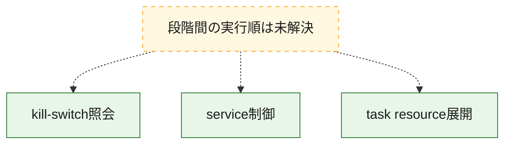
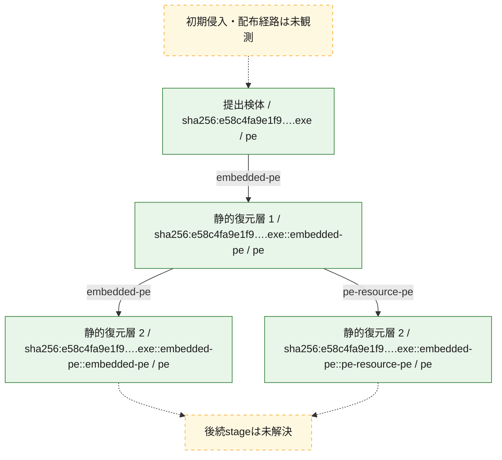
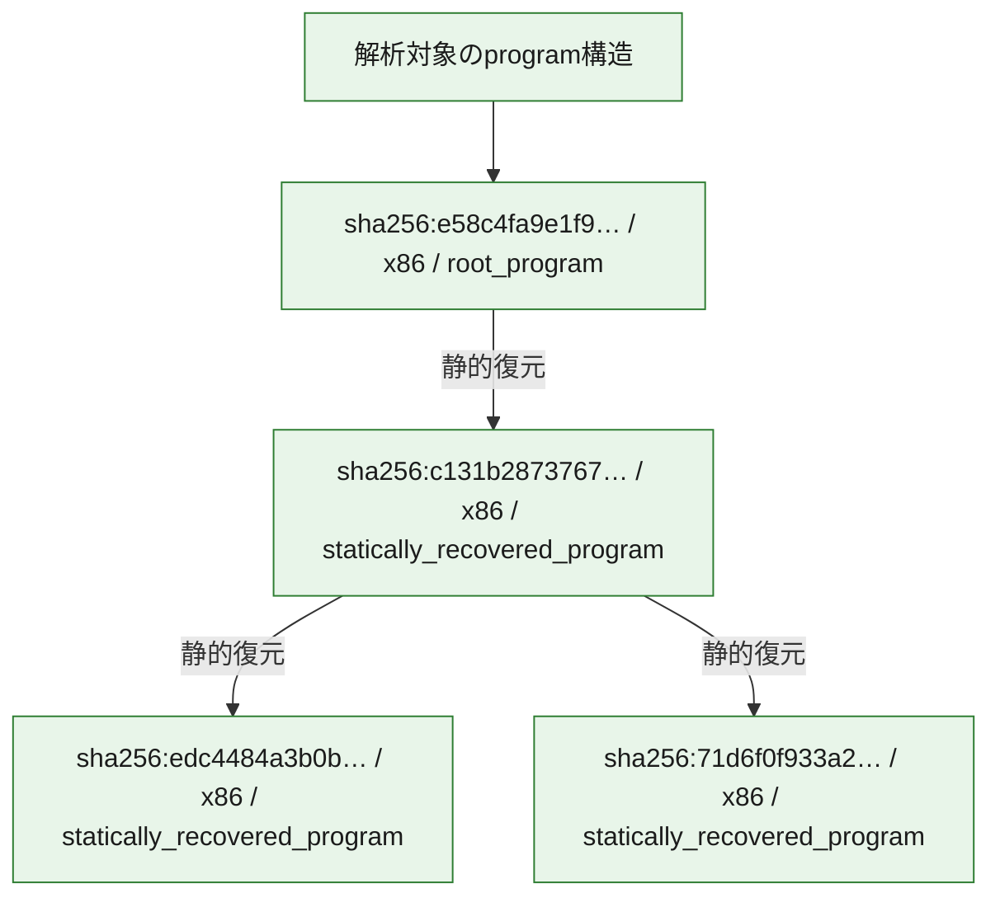

# 全体ロジック：e58c4fa9e1f9fcbb205b80cf3c2b6cfe824ef9aa9475489e93e613624fe5e582

kill-switch照会後、service制御へ進み、R/1831をtasksche.exeとして無変換で保存・起動する経路を確認しました。

## 読み方

- Ghidra MCPで確認したdirect callと分岐に基づきます。
- 図の実線は静的に観測した関係、点線と黄色のノードは未観測・未解決の関係を示します。
- 図は静的な要約であり、動的実行を再現するものではありません。
- 詳細な関数解説とfingerprintは[STATIC-LOGIC.md](STATIC-LOGIC.md)を参照してください。

## 静的可視化

### 実行フロー

### 感染チェーン

### モジュール関係

## 処理段階

### 1. kill-switch照会

固定URLを照会し、後続処理へ移行します。
確度: `confirmed_static_function_evidence`

- `c131b2873767e4dfb170810d10597966ee496ab3f7bc4921cbdd691e03042b15:ghidra:00408140` — 固定kill-switch URLをWinINetで照会し、その後のサービス・resource展開経路へ移行します。 状態: `succeeded`、選定理由: `entry_reachable`, `kill_switch_gate`

### 2. service制御

mssecsvc2.1の既存service処理とdispatcher移行を確認します。
確度: `confirmed_static_function_evidence`

- `c131b2873767e4dfb170810d10597966ee496ab3f7bc4921cbdd691e03042b15:ghidra:00408090` — 引数の有無で展開経路とservice dispatcher経路を分け、mssecsvc2.1を操作します。 状態: `succeeded`、選定理由: `entry_reachable`, `service_control`

### 3. task resource展開

R/1831を無変換でtasksche.exeへ保存し、processを作成します。
確度: `confirmed_static_function_evidence`

- `c131b2873767e4dfb170810d10597966ee496ab3f7bc4921cbdd691e03042b15:ghidra:00407ce0` — resource R/1831を無変換でtasksche.exeへ書き出し、CreateProcessAで起動する経路です。 状態: `succeeded`、選定理由: `entry_reachable`, `resource_to_process_chain`, `terminal_payload_recovery`

## 観測したcall関係

- `00408140` → `00408090` （`未記録` → `未記録`）
- `00408090` → `00407ce0` （`未記録` → `未記録`）

## 解析範囲と制約

- tasksche.exe imageは全sectionとentrypointが高entropyで、importとXIA/2058を確認できません。
- resource-backed task imageの実行やemulationは行わず、configとC2は未回収のまま保持します。
