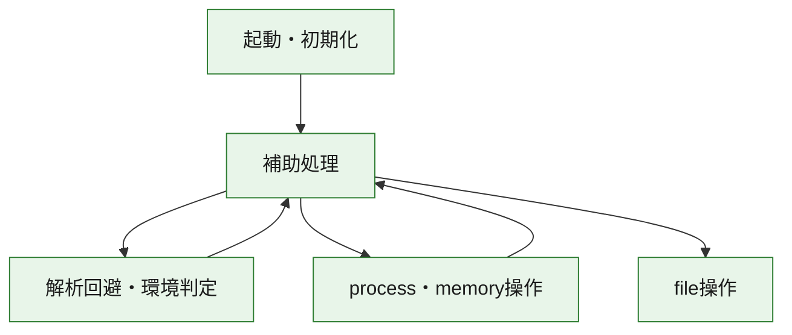
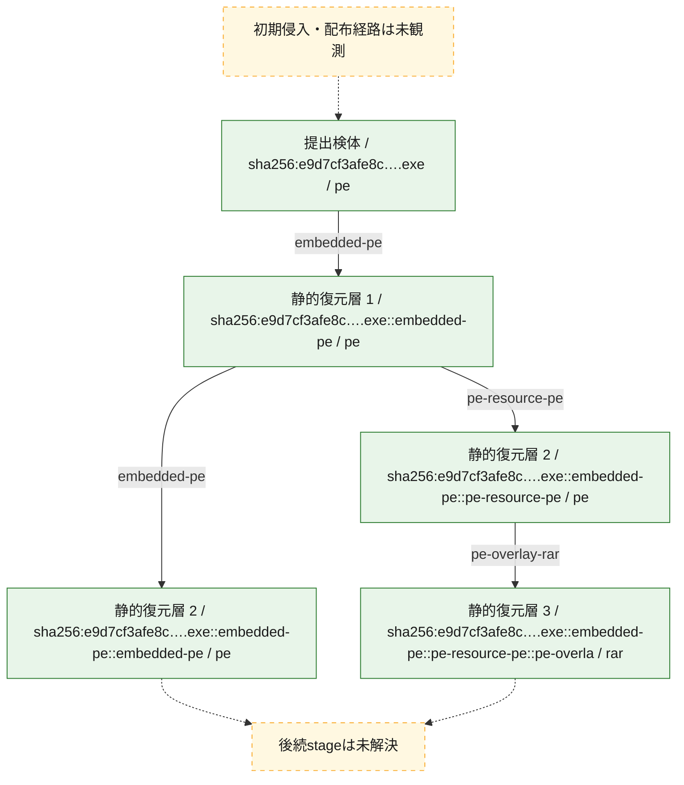
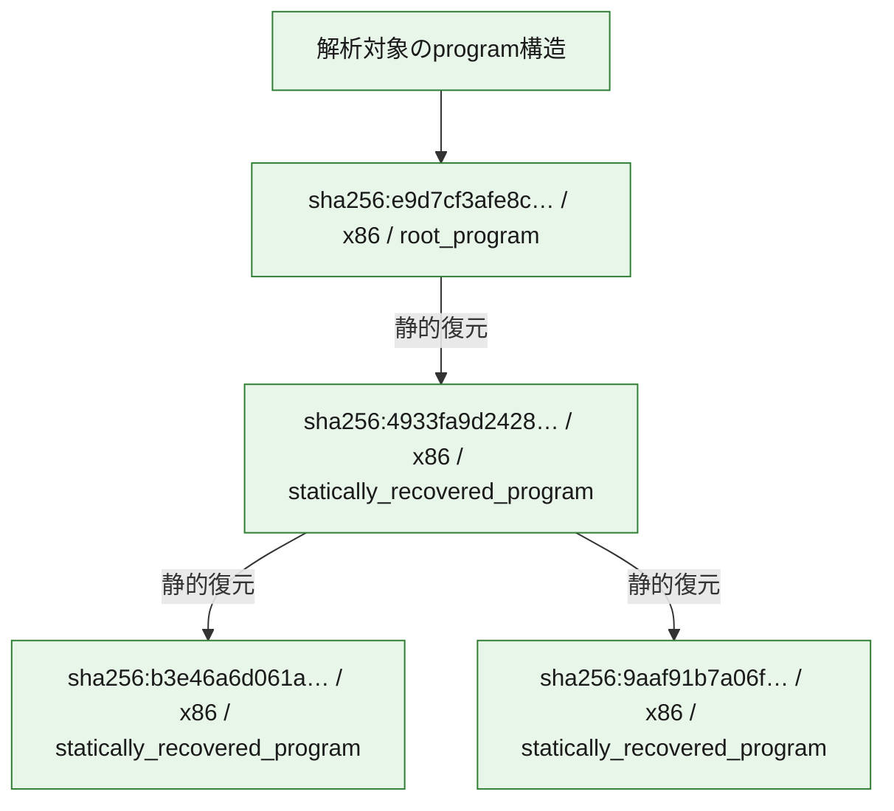

# 全体ロジック：e9d7cf3afe8cf7cbf806e39ce528648ea9bb5aa64b0d1b2fc4d2ec3fe92f294b

代表関数の静的証跡から、起動・初期化、解析回避・環境判定、process・memory操作、file操作の処理群を確認しました。

## 読み方

- phaseの掲載順は解析上の整理順です。observed_call_edgesがない段階間の実行順を断定しません。
- 図の実線は静的に観測した関係、点線と黄色のノードは未観測・未解決の関係を示します。
- 図は静的な要約であり、動的実行を再現するものではありません。
- 詳細な関数解説とfingerprintは[STATIC-LOGIC.md](STATIC-LOGIC.md)を参照してください。

## 静的可視化

### 実行フロー

### 感染チェーン

### モジュール関係

## 処理段階

### 1. 起動・初期化

entry pointから初期化と後続処理への移行を確認します。
確度: `confirmed_static_function_evidence`

- `b3e46a6d061aff51d5cebd44e789f653cc70f79e3b90454e0c644f811f2793e3:ghidra:0041da1b` — 初期化と主要処理への分岐を行う入口関数です。 状態: `succeeded`、選定理由: `entry_point`, `large_function:instructions=102`, `meaningful_symbol_name`, `reviewed_call_centrality:2`, `role:entrypoint`, `small_program_complete_context`
- `9aaf91b7a06ff8791f018794e98708d0d883098fd3b322964c0b12dda6122d73:ghidra:0041da1b` — 初期化と主要処理への分岐を行う入口関数です。 状態: `succeeded`、選定理由: `entry_point`, `large_function:instructions=102`, `meaningful_symbol_name`, `reviewed_call_centrality:2`, `role:entrypoint`, `small_program_complete_context`
- `4933fa9d242843d117c6ccf4870e4f938df9b72cc86987d8d2ff352a1cf5583f:ghidra:00409a16` — 初期化と主要処理への分岐を行う入口関数です。 状態: `succeeded`、選定理由: `entry_point`, `large_function:instructions=111`, `meaningful_symbol_name`, `reviewed_call_centrality:20`, `role:entrypoint`, `small_program_complete_context`
- `e9d7cf3afe8cf7cbf806e39ce528648ea9bb5aa64b0d1b2fc4d2ec3fe92f294b:ghidra:1800015ec` — 初期化と主要処理への分岐を行う入口関数です。 状態: `succeeded`、選定理由: `entry_point`, `meaningful_symbol_name`, `reviewed_call_centrality:4`, `role:entrypoint`

### 2. 解析回避・環境判定

debugger、sandbox、仮想環境、時間差などの判定を確認します。
確度: `confirmed_static_function_evidence`

- `e9d7cf3afe8cf7cbf806e39ce528648ea9bb5aa64b0d1b2fc4d2ec3fe92f294b:ghidra:180002448` — debugger、仮想環境、sandbox、または時間差の確認に関係する関数です。 状態: `succeeded`、選定理由: `context_representative`, `reviewed_call_centrality:14`, `role:anti_analysis`

### 3. process・memory操作

process、thread、module、memory操作と実行移行を確認します。
確度: `confirmed_static_function_evidence`

- `e9d7cf3afe8cf7cbf806e39ce528648ea9bb5aa64b0d1b2fc4d2ec3fe92f294b:ghidra:1800010f8` — process、thread、module、またはmemory操作に関係する関数です。 状態: `succeeded`、選定理由: `context_representative`, `reviewed_call_centrality:6`, `role:process_or_memory_operation`

### 4. file操作

fileやdirectoryの作成、読書き、削除を確認します。
確度: `confirmed_static_function_evidence`

- `e9d7cf3afe8cf7cbf806e39ce528648ea9bb5aa64b0d1b2fc4d2ec3fe92f294b:ghidra:180001014` — fileまたはdirectoryの読書き・管理に関係する関数です。 状態: `succeeded`、選定理由: `context_representative`, `reviewed_call_centrality:16`, `role:file_operation`

### 5. 補助処理

主要処理を支える一般内部関数またはlibrary処理を確認します。
確度: `confirmed_static_function_evidence_with_limits`

- `9aaf91b7a06ff8791f018794e98708d0d883098fd3b322964c0b12dda6122d73:ghidra:004062fd` — 検体内部の一般処理を実装する関数です。 状態: `succeeded`、選定理由: `context_representative`, `reviewed_call_centrality:2`, `small_program_complete_context`
- `e9d7cf3afe8cf7cbf806e39ce528648ea9bb5aa64b0d1b2fc4d2ec3fe92f294b:ghidra:1800011a4` — 検体内部の一般処理を実装する関数です。 状態: `succeeded`、選定理由: `entry_point`, `meaningful_symbol_name`, `reviewed_call_centrality:3`
- `e9d7cf3afe8cf7cbf806e39ce528648ea9bb5aa64b0d1b2fc4d2ec3fe92f294b:ghidra:1800011f0` — 検体内部の一般処理を実装する関数です。 状態: `succeeded`、選定理由: `context_representative`, `reviewed_call_centrality:5`
- `e9d7cf3afe8cf7cbf806e39ce528648ea9bb5aa64b0d1b2fc4d2ec3fe92f294b:ghidra:1800012dc` — 検体内部の一般処理を実装する関数です。 状態: `succeeded`、選定理由: `context_representative`, `reviewed_call_centrality:6`
- `e9d7cf3afe8cf7cbf806e39ce528648ea9bb5aa64b0d1b2fc4d2ec3fe92f294b:ghidra:18000137c` — 検体内部の一般処理を実装する関数です。 状態: `succeeded`、選定理由: `context_representative`, `reviewed_call_centrality:25`
- `e9d7cf3afe8cf7cbf806e39ce528648ea9bb5aa64b0d1b2fc4d2ec3fe92f294b:ghidra:1800014d0` — 検体内部の一般処理を実装する関数です。 状態: `succeeded`、選定理由: `context_representative`, `reviewed_call_centrality:3`
- `e9d7cf3afe8cf7cbf806e39ce528648ea9bb5aa64b0d1b2fc4d2ec3fe92f294b:ghidra:18000162c` — 検体内部の一般処理を実装する関数です。 状態: `succeeded`、選定理由: `context_representative`, `reviewed_call_centrality:9`
- `e9d7cf3afe8cf7cbf806e39ce528648ea9bb5aa64b0d1b2fc4d2ec3fe92f294b:ghidra:1800017bc` — 検体内部の一般処理を実装する関数です。 状態: `succeeded`、選定理由: `context_representative`, `reviewed_call_centrality:4`
- `e9d7cf3afe8cf7cbf806e39ce528648ea9bb5aa64b0d1b2fc4d2ec3fe92f294b:ghidra:180001860` — 検体内部の一般処理を実装する関数です。 状態: `succeeded`、選定理由: `context_representative`, `reviewed_call_centrality:4`
- `e9d7cf3afe8cf7cbf806e39ce528648ea9bb5aa64b0d1b2fc4d2ec3fe92f294b:ghidra:1800018a8` — 検体内部の一般処理を実装する関数です。 状態: `succeeded`、選定理由: `context_representative`, `reviewed_call_centrality:2`
- `e9d7cf3afe8cf7cbf806e39ce528648ea9bb5aa64b0d1b2fc4d2ec3fe92f294b:ghidra:1800018fc` — 検体内部の一般処理を実装する関数です。 状態: `succeeded`、選定理由: `context_representative`, `reviewed_call_centrality:2`
- `e9d7cf3afe8cf7cbf806e39ce528648ea9bb5aa64b0d1b2fc4d2ec3fe92f294b:ghidra:180001994` — 検体内部の一般処理を実装する関数です。 状態: `succeeded`、選定理由: `context_representative`, `reviewed_call_centrality:19`
- `e9d7cf3afe8cf7cbf806e39ce528648ea9bb5aa64b0d1b2fc4d2ec3fe92f294b:ghidra:180002594` — 検体内部の一般処理を実装する関数です。 状態: `limited_bad_instruction_or_flow`、選定理由: `context_representative`, `reviewed_call_centrality:6`
- `e9d7cf3afe8cf7cbf806e39ce528648ea9bb5aa64b0d1b2fc4d2ec3fe92f294b:ghidra:1800025c8` — 検体内部の一般処理を実装する関数です。 状態: `succeeded`、選定理由: `context_representative`, `reviewed_call_centrality:5`
- `e9d7cf3afe8cf7cbf806e39ce528648ea9bb5aa64b0d1b2fc4d2ec3fe92f294b:ghidra:180002638` — 検体内部の一般処理を実装する関数です。 状態: `succeeded`、選定理由: `context_representative`, `reviewed_call_centrality:3`
- `e9d7cf3afe8cf7cbf806e39ce528648ea9bb5aa64b0d1b2fc4d2ec3fe92f294b:ghidra:1800026a0` — 検体内部の一般処理を実装する関数です。 状態: `succeeded`、選定理由: `context_representative`, `reviewed_call_centrality:5`
- `e9d7cf3afe8cf7cbf806e39ce528648ea9bb5aa64b0d1b2fc4d2ec3fe92f294b:ghidra:1800026c0` — 検体内部の一般処理を実装する関数です。 状態: `succeeded`、選定理由: `context_representative`, `reviewed_call_centrality:1`
- `e9d7cf3afe8cf7cbf806e39ce528648ea9bb5aa64b0d1b2fc4d2ec3fe92f294b:ghidra:1800026e0` — 検体内部の一般処理を実装する関数です。 状態: `succeeded`、選定理由: `context_representative`, `reviewed_call_centrality:2`
- `e9d7cf3afe8cf7cbf806e39ce528648ea9bb5aa64b0d1b2fc4d2ec3fe92f294b:ghidra:180002728` — 検体内部の一般処理を実装する関数です。 状態: `succeeded`、選定理由: `context_representative`, `reviewed_call_centrality:5`
- `e9d7cf3afe8cf7cbf806e39ce528648ea9bb5aa64b0d1b2fc4d2ec3fe92f294b:ghidra:180002938` — 検体内部の一般処理を実装する関数です。 状態: `succeeded`、選定理由: `context_representative`, `reviewed_call_centrality:7`
- `e9d7cf3afe8cf7cbf806e39ce528648ea9bb5aa64b0d1b2fc4d2ec3fe92f294b:ghidra:180002960` — 検体内部の一般処理を実装する関数です。 状態: `succeeded`、選定理由: `context_representative`, `reviewed_call_centrality:8`
- `e9d7cf3afe8cf7cbf806e39ce528648ea9bb5aa64b0d1b2fc4d2ec3fe92f294b:ghidra:180002a18` — 検体内部の一般処理を実装する関数です。 状態: `succeeded`、選定理由: `context_representative`, `reviewed_call_centrality:17`
- `e9d7cf3afe8cf7cbf806e39ce528648ea9bb5aa64b0d1b2fc4d2ec3fe92f294b:ghidra:180002a9c` — 検体内部の一般処理を実装する関数です。 状態: `succeeded`、選定理由: `context_representative`, `reviewed_call_centrality:3`
- `e9d7cf3afe8cf7cbf806e39ce528648ea9bb5aa64b0d1b2fc4d2ec3fe92f294b:ghidra:180002ac0` — 検体内部の一般処理を実装する関数です。 状態: `succeeded`、選定理由: `context_representative`, `reviewed_call_centrality:8`
- `e9d7cf3afe8cf7cbf806e39ce528648ea9bb5aa64b0d1b2fc4d2ec3fe92f294b:ghidra:180002bf4` — 検体内部の一般処理を実装する関数です。 状態: `succeeded`、選定理由: `context_representative`, `reviewed_call_centrality:6`
- `e9d7cf3afe8cf7cbf806e39ce528648ea9bb5aa64b0d1b2fc4d2ec3fe92f294b:ghidra:180002c34` — 検体内部の一般処理を実装する関数です。 状態: `succeeded`、選定理由: `context_representative`, `reviewed_call_centrality:12`
- `e9d7cf3afe8cf7cbf806e39ce528648ea9bb5aa64b0d1b2fc4d2ec3fe92f294b:ghidra:180002cb8` — 検体内部の一般処理を実装する関数です。 状態: `succeeded`、選定理由: `context_representative`, `reviewed_call_centrality:11`
- `e9d7cf3afe8cf7cbf806e39ce528648ea9bb5aa64b0d1b2fc4d2ec3fe92f294b:ghidra:180002cf8` — 検体内部の一般処理を実装する関数です。 状態: `succeeded`、選定理由: `context_representative`, `reviewed_call_centrality:4`
- `e9d7cf3afe8cf7cbf806e39ce528648ea9bb5aa64b0d1b2fc4d2ec3fe92f294b:ghidra:180002d78` — 検体内部の一般処理を実装する関数です。 状態: `succeeded`、選定理由: `context_representative`, `reviewed_call_centrality:6`

## 観測したcall関係

- `e9d7cf3afe8cf7cbf806e39ce528648ea9bb5aa64b0d1b2fc4d2ec3fe92f294b:ghidra:1800010f8` → `e9d7cf3afe8cf7cbf806e39ce528648ea9bb5aa64b0d1b2fc4d2ec3fe92f294b:ghidra:1800011f0` （`execution` → `support`）
- `e9d7cf3afe8cf7cbf806e39ce528648ea9bb5aa64b0d1b2fc4d2ec3fe92f294b:ghidra:1800011a4` → `e9d7cf3afe8cf7cbf806e39ce528648ea9bb5aa64b0d1b2fc4d2ec3fe92f294b:ghidra:180001014` （`support` → `file_activity`）
- `e9d7cf3afe8cf7cbf806e39ce528648ea9bb5aa64b0d1b2fc4d2ec3fe92f294b:ghidra:1800011a4` → `e9d7cf3afe8cf7cbf806e39ce528648ea9bb5aa64b0d1b2fc4d2ec3fe92f294b:ghidra:1800010f8` （`support` → `execution`）
- `e9d7cf3afe8cf7cbf806e39ce528648ea9bb5aa64b0d1b2fc4d2ec3fe92f294b:ghidra:1800011a4` → `e9d7cf3afe8cf7cbf806e39ce528648ea9bb5aa64b0d1b2fc4d2ec3fe92f294b:ghidra:1800012dc` （`support` → `support`）
- `e9d7cf3afe8cf7cbf806e39ce528648ea9bb5aa64b0d1b2fc4d2ec3fe92f294b:ghidra:1800012dc` → `e9d7cf3afe8cf7cbf806e39ce528648ea9bb5aa64b0d1b2fc4d2ec3fe92f294b:ghidra:1800011f0` （`support` → `support`）
- `e9d7cf3afe8cf7cbf806e39ce528648ea9bb5aa64b0d1b2fc4d2ec3fe92f294b:ghidra:1800012dc` → `e9d7cf3afe8cf7cbf806e39ce528648ea9bb5aa64b0d1b2fc4d2ec3fe92f294b:ghidra:18000162c` （`support` → `support`）
- `e9d7cf3afe8cf7cbf806e39ce528648ea9bb5aa64b0d1b2fc4d2ec3fe92f294b:ghidra:1800012dc` → `e9d7cf3afe8cf7cbf806e39ce528648ea9bb5aa64b0d1b2fc4d2ec3fe92f294b:ghidra:180001994` （`support` → `support`）
- `e9d7cf3afe8cf7cbf806e39ce528648ea9bb5aa64b0d1b2fc4d2ec3fe92f294b:ghidra:1800012dc` → `e9d7cf3afe8cf7cbf806e39ce528648ea9bb5aa64b0d1b2fc4d2ec3fe92f294b:ghidra:180002638` （`support` → `support`）
- `e9d7cf3afe8cf7cbf806e39ce528648ea9bb5aa64b0d1b2fc4d2ec3fe92f294b:ghidra:1800012dc` → `e9d7cf3afe8cf7cbf806e39ce528648ea9bb5aa64b0d1b2fc4d2ec3fe92f294b:ghidra:1800026a0` （`support` → `support`）
- `e9d7cf3afe8cf7cbf806e39ce528648ea9bb5aa64b0d1b2fc4d2ec3fe92f294b:ghidra:18000137c` → `e9d7cf3afe8cf7cbf806e39ce528648ea9bb5aa64b0d1b2fc4d2ec3fe92f294b:ghidra:180002938` （`support` → `support`）
- `e9d7cf3afe8cf7cbf806e39ce528648ea9bb5aa64b0d1b2fc4d2ec3fe92f294b:ghidra:18000137c` → `e9d7cf3afe8cf7cbf806e39ce528648ea9bb5aa64b0d1b2fc4d2ec3fe92f294b:ghidra:180002960` （`support` → `support`）
- `e9d7cf3afe8cf7cbf806e39ce528648ea9bb5aa64b0d1b2fc4d2ec3fe92f294b:ghidra:18000137c` → `e9d7cf3afe8cf7cbf806e39ce528648ea9bb5aa64b0d1b2fc4d2ec3fe92f294b:ghidra:180002bf4` （`support` → `support`）
- `e9d7cf3afe8cf7cbf806e39ce528648ea9bb5aa64b0d1b2fc4d2ec3fe92f294b:ghidra:18000137c` → `e9d7cf3afe8cf7cbf806e39ce528648ea9bb5aa64b0d1b2fc4d2ec3fe92f294b:ghidra:180002c34` （`support` → `support`）
- `e9d7cf3afe8cf7cbf806e39ce528648ea9bb5aa64b0d1b2fc4d2ec3fe92f294b:ghidra:18000137c` → `e9d7cf3afe8cf7cbf806e39ce528648ea9bb5aa64b0d1b2fc4d2ec3fe92f294b:ghidra:180002cb8` （`support` → `support`）
- `e9d7cf3afe8cf7cbf806e39ce528648ea9bb5aa64b0d1b2fc4d2ec3fe92f294b:ghidra:18000137c` → `e9d7cf3afe8cf7cbf806e39ce528648ea9bb5aa64b0d1b2fc4d2ec3fe92f294b:ghidra:180002d78` （`support` → `support`）
- `e9d7cf3afe8cf7cbf806e39ce528648ea9bb5aa64b0d1b2fc4d2ec3fe92f294b:ghidra:1800014d0` → `e9d7cf3afe8cf7cbf806e39ce528648ea9bb5aa64b0d1b2fc4d2ec3fe92f294b:ghidra:18000137c` （`support` → `support`）
- `e9d7cf3afe8cf7cbf806e39ce528648ea9bb5aa64b0d1b2fc4d2ec3fe92f294b:ghidra:1800015ec` → `e9d7cf3afe8cf7cbf806e39ce528648ea9bb5aa64b0d1b2fc4d2ec3fe92f294b:ghidra:18000137c` （`startup` → `support`）
- `e9d7cf3afe8cf7cbf806e39ce528648ea9bb5aa64b0d1b2fc4d2ec3fe92f294b:ghidra:18000162c` → `e9d7cf3afe8cf7cbf806e39ce528648ea9bb5aa64b0d1b2fc4d2ec3fe92f294b:ghidra:1800026a0` （`support` → `support`）
- `e9d7cf3afe8cf7cbf806e39ce528648ea9bb5aa64b0d1b2fc4d2ec3fe92f294b:ghidra:1800017bc` → `e9d7cf3afe8cf7cbf806e39ce528648ea9bb5aa64b0d1b2fc4d2ec3fe92f294b:ghidra:180002a9c` （`support` → `support`）
- `e9d7cf3afe8cf7cbf806e39ce528648ea9bb5aa64b0d1b2fc4d2ec3fe92f294b:ghidra:180001860` → `e9d7cf3afe8cf7cbf806e39ce528648ea9bb5aa64b0d1b2fc4d2ec3fe92f294b:ghidra:18000162c` （`support` → `support`）
- `e9d7cf3afe8cf7cbf806e39ce528648ea9bb5aa64b0d1b2fc4d2ec3fe92f294b:ghidra:1800018a8` → `e9d7cf3afe8cf7cbf806e39ce528648ea9bb5aa64b0d1b2fc4d2ec3fe92f294b:ghidra:180001860` （`support` → `support`）
- `e9d7cf3afe8cf7cbf806e39ce528648ea9bb5aa64b0d1b2fc4d2ec3fe92f294b:ghidra:1800018fc` → `e9d7cf3afe8cf7cbf806e39ce528648ea9bb5aa64b0d1b2fc4d2ec3fe92f294b:ghidra:180001860` （`support` → `support`）
- `e9d7cf3afe8cf7cbf806e39ce528648ea9bb5aa64b0d1b2fc4d2ec3fe92f294b:ghidra:180001994` → `e9d7cf3afe8cf7cbf806e39ce528648ea9bb5aa64b0d1b2fc4d2ec3fe92f294b:ghidra:1800017bc` （`support` → `support`）
- `e9d7cf3afe8cf7cbf806e39ce528648ea9bb5aa64b0d1b2fc4d2ec3fe92f294b:ghidra:180001994` → `e9d7cf3afe8cf7cbf806e39ce528648ea9bb5aa64b0d1b2fc4d2ec3fe92f294b:ghidra:180001860` （`support` → `support`）
- `e9d7cf3afe8cf7cbf806e39ce528648ea9bb5aa64b0d1b2fc4d2ec3fe92f294b:ghidra:180001994` → `e9d7cf3afe8cf7cbf806e39ce528648ea9bb5aa64b0d1b2fc4d2ec3fe92f294b:ghidra:1800018a8` （`support` → `support`）
- `e9d7cf3afe8cf7cbf806e39ce528648ea9bb5aa64b0d1b2fc4d2ec3fe92f294b:ghidra:180001994` → `e9d7cf3afe8cf7cbf806e39ce528648ea9bb5aa64b0d1b2fc4d2ec3fe92f294b:ghidra:1800018fc` （`support` → `support`）
- `e9d7cf3afe8cf7cbf806e39ce528648ea9bb5aa64b0d1b2fc4d2ec3fe92f294b:ghidra:180001994` → `e9d7cf3afe8cf7cbf806e39ce528648ea9bb5aa64b0d1b2fc4d2ec3fe92f294b:ghidra:180002638` （`support` → `support`）
- `e9d7cf3afe8cf7cbf806e39ce528648ea9bb5aa64b0d1b2fc4d2ec3fe92f294b:ghidra:180001994` → `e9d7cf3afe8cf7cbf806e39ce528648ea9bb5aa64b0d1b2fc4d2ec3fe92f294b:ghidra:1800026a0` （`support` → `support`）
- `e9d7cf3afe8cf7cbf806e39ce528648ea9bb5aa64b0d1b2fc4d2ec3fe92f294b:ghidra:180001994` → `e9d7cf3afe8cf7cbf806e39ce528648ea9bb5aa64b0d1b2fc4d2ec3fe92f294b:ghidra:180002cb8` （`support` → `support`）
- `e9d7cf3afe8cf7cbf806e39ce528648ea9bb5aa64b0d1b2fc4d2ec3fe92f294b:ghidra:180001994` → `e9d7cf3afe8cf7cbf806e39ce528648ea9bb5aa64b0d1b2fc4d2ec3fe92f294b:ghidra:180002cf8` （`support` → `support`）
- `e9d7cf3afe8cf7cbf806e39ce528648ea9bb5aa64b0d1b2fc4d2ec3fe92f294b:ghidra:180002448` → `e9d7cf3afe8cf7cbf806e39ce528648ea9bb5aa64b0d1b2fc4d2ec3fe92f294b:ghidra:1800011f0` （`evasion` → `support`）
- `e9d7cf3afe8cf7cbf806e39ce528648ea9bb5aa64b0d1b2fc4d2ec3fe92f294b:ghidra:180002594` → `e9d7cf3afe8cf7cbf806e39ce528648ea9bb5aa64b0d1b2fc4d2ec3fe92f294b:ghidra:180002448` （`support` → `evasion`）
- `e9d7cf3afe8cf7cbf806e39ce528648ea9bb5aa64b0d1b2fc4d2ec3fe92f294b:ghidra:1800025c8` → `e9d7cf3afe8cf7cbf806e39ce528648ea9bb5aa64b0d1b2fc4d2ec3fe92f294b:ghidra:180002594` （`support` → `support`）
- `e9d7cf3afe8cf7cbf806e39ce528648ea9bb5aa64b0d1b2fc4d2ec3fe92f294b:ghidra:180002638` → `e9d7cf3afe8cf7cbf806e39ce528648ea9bb5aa64b0d1b2fc4d2ec3fe92f294b:ghidra:1800025c8` （`support` → `support`）
- `e9d7cf3afe8cf7cbf806e39ce528648ea9bb5aa64b0d1b2fc4d2ec3fe92f294b:ghidra:1800026a0` → `e9d7cf3afe8cf7cbf806e39ce528648ea9bb5aa64b0d1b2fc4d2ec3fe92f294b:ghidra:180002a18` （`support` → `support`）
- `e9d7cf3afe8cf7cbf806e39ce528648ea9bb5aa64b0d1b2fc4d2ec3fe92f294b:ghidra:1800026c0` → `e9d7cf3afe8cf7cbf806e39ce528648ea9bb5aa64b0d1b2fc4d2ec3fe92f294b:ghidra:180002a18` （`support` → `support`）
- `e9d7cf3afe8cf7cbf806e39ce528648ea9bb5aa64b0d1b2fc4d2ec3fe92f294b:ghidra:1800026e0` → `e9d7cf3afe8cf7cbf806e39ce528648ea9bb5aa64b0d1b2fc4d2ec3fe92f294b:ghidra:180002a18` （`support` → `support`）
- `e9d7cf3afe8cf7cbf806e39ce528648ea9bb5aa64b0d1b2fc4d2ec3fe92f294b:ghidra:180002938` → `e9d7cf3afe8cf7cbf806e39ce528648ea9bb5aa64b0d1b2fc4d2ec3fe92f294b:ghidra:180002cb8` （`support` → `support`）
- `e9d7cf3afe8cf7cbf806e39ce528648ea9bb5aa64b0d1b2fc4d2ec3fe92f294b:ghidra:180002a18` → `e9d7cf3afe8cf7cbf806e39ce528648ea9bb5aa64b0d1b2fc4d2ec3fe92f294b:ghidra:180002960` （`support` → `support`）
- `e9d7cf3afe8cf7cbf806e39ce528648ea9bb5aa64b0d1b2fc4d2ec3fe92f294b:ghidra:180002a18` → `e9d7cf3afe8cf7cbf806e39ce528648ea9bb5aa64b0d1b2fc4d2ec3fe92f294b:ghidra:180002cb8` （`support` → `support`）
- `e9d7cf3afe8cf7cbf806e39ce528648ea9bb5aa64b0d1b2fc4d2ec3fe92f294b:ghidra:180002a18` → `e9d7cf3afe8cf7cbf806e39ce528648ea9bb5aa64b0d1b2fc4d2ec3fe92f294b:ghidra:180002d78` （`support` → `support`）
- `e9d7cf3afe8cf7cbf806e39ce528648ea9bb5aa64b0d1b2fc4d2ec3fe92f294b:ghidra:180002a9c` → `e9d7cf3afe8cf7cbf806e39ce528648ea9bb5aa64b0d1b2fc4d2ec3fe92f294b:ghidra:180002a18` （`support` → `support`）
- `e9d7cf3afe8cf7cbf806e39ce528648ea9bb5aa64b0d1b2fc4d2ec3fe92f294b:ghidra:180002ac0` → `e9d7cf3afe8cf7cbf806e39ce528648ea9bb5aa64b0d1b2fc4d2ec3fe92f294b:ghidra:180002cb8` （`support` → `support`）
- `e9d7cf3afe8cf7cbf806e39ce528648ea9bb5aa64b0d1b2fc4d2ec3fe92f294b:ghidra:180002bf4` → `e9d7cf3afe8cf7cbf806e39ce528648ea9bb5aa64b0d1b2fc4d2ec3fe92f294b:ghidra:180002ac0` （`support` → `support`）
- `e9d7cf3afe8cf7cbf806e39ce528648ea9bb5aa64b0d1b2fc4d2ec3fe92f294b:ghidra:180002c34` → `e9d7cf3afe8cf7cbf806e39ce528648ea9bb5aa64b0d1b2fc4d2ec3fe92f294b:ghidra:180002938` （`support` → `support`）
- `e9d7cf3afe8cf7cbf806e39ce528648ea9bb5aa64b0d1b2fc4d2ec3fe92f294b:ghidra:180002c34` → `e9d7cf3afe8cf7cbf806e39ce528648ea9bb5aa64b0d1b2fc4d2ec3fe92f294b:ghidra:180002960` （`support` → `support`）
- `e9d7cf3afe8cf7cbf806e39ce528648ea9bb5aa64b0d1b2fc4d2ec3fe92f294b:ghidra:180002c34` → `e9d7cf3afe8cf7cbf806e39ce528648ea9bb5aa64b0d1b2fc4d2ec3fe92f294b:ghidra:180002d78` （`support` → `support`）
- `e9d7cf3afe8cf7cbf806e39ce528648ea9bb5aa64b0d1b2fc4d2ec3fe92f294b:ghidra:180002cb8` → `e9d7cf3afe8cf7cbf806e39ce528648ea9bb5aa64b0d1b2fc4d2ec3fe92f294b:ghidra:1800026a0` （`support` → `support`）
- `ghidra-function:0691b7d86ea21f3d1640460d` → `ghidra-function:922fcecab874406c0b609c0e` （`unclassified` → `unclassified`）
- `ghidra-function:0691b7d86ea21f3d1640460d` → `ghidra-function:97fb7ad0e16511f738412314` （`unclassified` → `unclassified`）
- `ghidra-function:0691b7d86ea21f3d1640460d` → `ghidra-function:bbd04041fe3d32f366879ab3` （`unclassified` → `unclassified`）
- `ghidra-function:0691b7d86ea21f3d1640460d` → `ghidra-function:f69cabb24e3b414345c18e3d` （`unclassified` → `unclassified`）
- `ghidra-function:07781f3149c36126b596179d` → `ghidra-external:03b8f85f32642023515b44ca` （`unclassified` → `unclassified`）
- `ghidra-function:07781f3149c36126b596179d` → `ghidra-external:69051834335bb2ba05eed5e1` （`unclassified` → `unclassified`）
- `ghidra-function:10129389324c88b633bb0f33` → `ghidra-function:18c03626e88bb546203a9f09` （`unclassified` → `unclassified`）
- `ghidra-function:10129389324c88b633bb0f33` → `ghidra-function:9991584e39881727d6114cbe` （`unclassified` → `unclassified`）
- `ghidra-function:2549c3a256ff4974cca9b222` → `ghidra-function:9991584e39881727d6114cbe` （`unclassified` → `unclassified`）
- `ghidra-function:28b3a882ac3814aba74810af` → `ghidra-external:652eb5a00c71fc663bb825b3` （`unclassified` → `unclassified`）
- `ghidra-function:28b3a882ac3814aba74810af` → `ghidra-function:9991584e39881727d6114cbe` （`unclassified` → `unclassified`）
- `ghidra-function:2cb1705d6d4c08391f3a539d` → `ghidra-function:9991584e39881727d6114cbe` （`unclassified` → `unclassified`）
- `ghidra-function:3cb0a39f52cd8afb04f902d9` → `ghidra-external:141094a8f391eb1d6415069f` （`unclassified` → `unclassified`）
- `ghidra-function:3cb0a39f52cd8afb04f902d9` → `ghidra-external:22df7f6925857a73089d0d51` （`unclassified` → `unclassified`）
- `ghidra-function:3e0b4b922a9bd5636d09bddd` → `ghidra-external:ecd6080ff71afb421b7bc773` （`unclassified` → `unclassified`）
- `ghidra-function:3e0b4b922a9bd5636d09bddd` → `ghidra-function:5239bdba333e0259945823e5` （`unclassified` → `unclassified`）
- `ghidra-function:3e0b4b922a9bd5636d09bddd` → `ghidra-function:d7c6652d60985216ba2f6a6b` （`unclassified` → `unclassified`）
- `ghidra-function:3e4c82b14397aa7d5a52ef68` → `ghidra-function:d6194cd76264caa63c56ad65` （`unclassified` → `unclassified`）
- `ghidra-function:3e4c82b14397aa7d5a52ef68` → `ghidra-function:ec9ea959e6499a0b3665ee41` （`unclassified` → `unclassified`）
- `ghidra-function:3e4c82b14397aa7d5a52ef68` → `ghidra-function:efa66a16a372bfd2044be8a6` （`unclassified` → `unclassified`）
- `ghidra-function:472e6165ff3b144a94b7823d` → `ghidra-external:25289f5620d578325e67225d` （`unclassified` → `unclassified`）
- `ghidra-function:472e6165ff3b144a94b7823d` → `ghidra-external:f84b1e1c5e880515eb9594b5` （`unclassified` → `unclassified`）
- `ghidra-function:472e6165ff3b144a94b7823d` → `ghidra-function:5c6500021faa90c331d6fbb5` （`unclassified` → `unclassified`）
- `ghidra-function:5239bdba333e0259945823e5` → `ghidra-function:212328963f3fe24ae9b2f85a` （`unclassified` → `unclassified`）
- `ghidra-function:5239bdba333e0259945823e5` → `ghidra-function:790eef47ee26b5bc366cbf6b` （`unclassified` → `unclassified`）
- `ghidra-function:5239bdba333e0259945823e5` → `ghidra-function:96f277db1f6e2011e9ccb6da` （`unclassified` → `unclassified`）
- `ghidra-function:5c6500021faa90c331d6fbb5` → `ghidra-external:56d144c4d90d50eb0147b164` （`unclassified` → `unclassified`）
- `ghidra-function:5c6500021faa90c331d6fbb5` → `ghidra-external:f2e9c34f0f523412427cd7eb` （`unclassified` → `unclassified`）
- `ghidra-function:5c6500021faa90c331d6fbb5` → `ghidra-function:25ad58fd22245301197af459` （`unclassified` → `unclassified`）
- `ghidra-function:5c6500021faa90c331d6fbb5` → `ghidra-function:3e4c82b14397aa7d5a52ef68` （`unclassified` → `unclassified`）
- `ghidra-function:5c6500021faa90c331d6fbb5` → `ghidra-function:60432d82b5f3545d70cb40d0` （`unclassified` → `unclassified`）
- `ghidra-function:5c6500021faa90c331d6fbb5` → `ghidra-function:6b18e9490bcdfeaa7eca6036` （`unclassified` → `unclassified`）
- `ghidra-function:5c6500021faa90c331d6fbb5` → `ghidra-function:732d975954fae129372d9ad8` （`unclassified` → `unclassified`）
- `ghidra-function:5c6500021faa90c331d6fbb5` → `ghidra-function:788b7b65ca2ea8b64b3bb4ae` （`unclassified` → `unclassified`）
- `ghidra-function:5c6500021faa90c331d6fbb5` → `ghidra-function:7b01179f06ee25567f1ec060` （`unclassified` → `unclassified`）
- `ghidra-function:5c6500021faa90c331d6fbb5` → `ghidra-function:88522956abee2c739ff62586` （`unclassified` → `unclassified`）
- `ghidra-function:5c6500021faa90c331d6fbb5` → `ghidra-function:8e11747c5a4763732c82abf1` （`unclassified` → `unclassified`）
- `ghidra-function:5c6500021faa90c331d6fbb5` → `ghidra-function:94c01224c3e00daa9c210f2b` （`unclassified` → `unclassified`）
- `ghidra-function:5c6500021faa90c331d6fbb5` → `ghidra-function:a903f6f844dd08249e5413db` （`unclassified` → `unclassified`）
- `ghidra-function:5c6500021faa90c331d6fbb5` → `ghidra-function:d176b3181bf0c1ec92ce2013` （`unclassified` → `unclassified`）
- `ghidra-function:5c6500021faa90c331d6fbb5` → `ghidra-function:d4483fc28111c4c6b66cc15a` （`unclassified` → `unclassified`）
- `ghidra-function:5c6500021faa90c331d6fbb5` → `ghidra-function:d765870398c8c7f7e6ba2fe3` （`unclassified` → `unclassified`）
- `ghidra-function:5c6500021faa90c331d6fbb5` → `ghidra-function:dce8962b137c60cf8a690953` （`unclassified` → `unclassified`）
- `ghidra-function:5c6500021faa90c331d6fbb5` → `ghidra-function:efa66a16a372bfd2044be8a6` （`unclassified` → `unclassified`）
- `ghidra-function:5c6500021faa90c331d6fbb5` → `ghidra-function:fc0ecfef3a7590462cc536c7` （`unclassified` → `unclassified`）
- `ghidra-function:5c6500021faa90c331d6fbb5` → `ghidra-function:fc749fde6ee0b88e08411960` （`unclassified` → `unclassified`）
- `ghidra-function:60432d82b5f3545d70cb40d0` → `ghidra-external:4159a46efbb75e5831cbd590` （`unclassified` → `unclassified`）
- `ghidra-function:60432d82b5f3545d70cb40d0` → `ghidra-external:82e0e628892f04aff54a42e5` （`unclassified` → `unclassified`）
- `ghidra-function:60432d82b5f3545d70cb40d0` → `ghidra-external:a7abc0877fbe0309f6210f50` （`unclassified` → `unclassified`）
- `ghidra-function:60432d82b5f3545d70cb40d0` → `ghidra-external:c4738384b74d3dec0dd74fd3` （`unclassified` → `unclassified`）
- `ghidra-function:60432d82b5f3545d70cb40d0` → `ghidra-function:115d019f6ca30e676db4ad03` （`unclassified` → `unclassified`）
- `ghidra-function:6522e0d6f4895b2afce9087c` → `ghidra-function:10129389324c88b633bb0f33` （`unclassified` → `unclassified`）
- `ghidra-function:6522e0d6f4895b2afce9087c` → `ghidra-function:618298cec9a8af0140a3dbe5` （`unclassified` → `unclassified`）
- `ghidra-function:6522e0d6f4895b2afce9087c` → `ghidra-function:cfe1bbb69ee00385a48ffd9e` （`unclassified` → `unclassified`）
- `ghidra-function:67a3ff0d407703d927936a8c` → `ghidra-function:e677be8f07621bede991b26f` （`unclassified` → `unclassified`）
- `ghidra-function:692e28f5bf13c0a715668b96` → `ghidra-function:01e927e40b0d2349a677595e` （`unclassified` → `unclassified`）
- `ghidra-function:692e28f5bf13c0a715668b96` → `ghidra-function:dced694622ebc108cbdfcfdd` （`unclassified` → `unclassified`）
- `ghidra-function:732d975954fae129372d9ad8` → `ghidra-function:8d4b7eee792fac19f425e0f6` （`unclassified` → `unclassified`）
- `ghidra-function:732d975954fae129372d9ad8` → `ghidra-function:9b3b5fcf9d7710d12fe06624` （`unclassified` → `unclassified`）
- `ghidra-function:732d975954fae129372d9ad8` → `ghidra-function:d4483fc28111c4c6b66cc15a` （`unclassified` → `unclassified`）
- `ghidra-function:7358682e8c18347265ddfffb` → `ghidra-function:3e0b4b922a9bd5636d09bddd` （`unclassified` → `unclassified`）
- `ghidra-function:822bfc9baaa35e484bb51557` → `ghidra-external:306f2f5472b694dd652ee2f9` （`unclassified` → `unclassified`）
- `ghidra-function:822bfc9baaa35e484bb51557` → `ghidra-external:5bc6fb8a78cf898c91345904` （`unclassified` → `unclassified`）
- `ghidra-function:822bfc9baaa35e484bb51557` → `ghidra-external:642f36d9fb89409acf6d4fef` （`unclassified` → `unclassified`）
- `ghidra-function:822bfc9baaa35e484bb51557` → `ghidra-external:f66c2f499c5eb0a51b41cce7` （`unclassified` → `unclassified`）
- `ghidra-function:822bfc9baaa35e484bb51557` → `ghidra-function:0e5d3fb4ca81c037237341e0` （`unclassified` → `unclassified`）
- `ghidra-function:822bfc9baaa35e484bb51557` → `ghidra-function:13dcd294c4e78dd4b3cb65e5` （`unclassified` → `unclassified`）
- `ghidra-function:822bfc9baaa35e484bb51557` → `ghidra-function:7d0bdacb19448ebc5659c72e` （`unclassified` → `unclassified`）
- `ghidra-function:822bfc9baaa35e484bb51557` → `ghidra-function:8e3669d910b37c204dbe69a0` （`unclassified` → `unclassified`）
- `ghidra-function:822bfc9baaa35e484bb51557` → `ghidra-function:a1682528560460e71f103040` （`unclassified` → `unclassified`）
- `ghidra-function:822bfc9baaa35e484bb51557` → `ghidra-function:b52b494d267ccff5bf1c4e99` （`unclassified` → `unclassified`）
- `ghidra-function:822bfc9baaa35e484bb51557` → `ghidra-function:bed2fabc81c9708477156c91` （`unclassified` → `unclassified`）
- `ghidra-function:822bfc9baaa35e484bb51557` → `ghidra-function:e33187f5103509428428293e` （`unclassified` → `unclassified`）
- `ghidra-function:8d4b7eee792fac19f425e0f6` → `ghidra-external:5e6a652d9d96335f2a1feae7` （`unclassified` → `unclassified`）
- `ghidra-function:8d4b7eee792fac19f425e0f6` → `ghidra-external:82e0e628892f04aff54a42e5` （`unclassified` → `unclassified`）
- `ghidra-function:8d4b7eee792fac19f425e0f6` → `ghidra-external:a7abc0877fbe0309f6210f50` （`unclassified` → `unclassified`）
- `ghidra-function:8d4b7eee792fac19f425e0f6` → `ghidra-external:c4738384b74d3dec0dd74fd3` （`unclassified` → `unclassified`）
- `ghidra-function:8d4b7eee792fac19f425e0f6` → `ghidra-function:115d019f6ca30e676db4ad03` （`unclassified` → `unclassified`）
- `ghidra-function:8d4b7eee792fac19f425e0f6` → `ghidra-function:134077e0cca3cbcf8e7d1e4f` （`unclassified` → `unclassified`）
- `ghidra-function:8d4b7eee792fac19f425e0f6` → `ghidra-function:efa66a16a372bfd2044be8a6` （`unclassified` → `unclassified`）
- `ghidra-function:926876cd7e0f4395671304ed` → `ghidra-external:25289f5620d578325e67225d` （`unclassified` → `unclassified`）
- `ghidra-function:926876cd7e0f4395671304ed` → `ghidra-external:5ece968616d9fa18fa2d2626` （`unclassified` → `unclassified`）
- `ghidra-function:926876cd7e0f4395671304ed` → `ghidra-external:d54993ced5c473040dae8cc1` （`unclassified` → `unclassified`）
- `ghidra-function:926876cd7e0f4395671304ed` → `ghidra-function:2cb1705d6d4c08391f3a539d` （`unclassified` → `unclassified`）
- `ghidra-function:926876cd7e0f4395671304ed` → `ghidra-function:57bddd4e85500384d1381482` （`unclassified` → `unclassified`）
- `ghidra-function:926876cd7e0f4395671304ed` → `ghidra-function:5b0c34c7e5183ee580d862e0` （`unclassified` → `unclassified`）
- `ghidra-function:926876cd7e0f4395671304ed` → `ghidra-function:6522e0d6f4895b2afce9087c` （`unclassified` → `unclassified`）
- `ghidra-function:926876cd7e0f4395671304ed` → `ghidra-function:67a3ff0d407703d927936a8c` （`unclassified` → `unclassified`）
- `ghidra-function:926876cd7e0f4395671304ed` → `ghidra-function:692e28f5bf13c0a715668b96` （`unclassified` → `unclassified`）
- `ghidra-function:926876cd7e0f4395671304ed` → `ghidra-function:7358682e8c18347265ddfffb` （`unclassified` → `unclassified`）
- `ghidra-function:926876cd7e0f4395671304ed` → `ghidra-function:7c8e09d330e5bf915dc2ce31` （`unclassified` → `unclassified`）
- `ghidra-function:926876cd7e0f4395671304ed` → `ghidra-function:a7cba1a384257fcd38936c14` （`unclassified` → `unclassified`）
- `ghidra-function:926876cd7e0f4395671304ed` → `ghidra-function:b874f3b38f2e12f029e9f566` （`unclassified` → `unclassified`）
- `ghidra-function:926876cd7e0f4395671304ed` → `ghidra-function:d7c6652d60985216ba2f6a6b` （`unclassified` → `unclassified`）
- `ghidra-function:926876cd7e0f4395671304ed` → `ghidra-function:e677be8f07621bede991b26f` （`unclassified` → `unclassified`）
- `ghidra-function:926876cd7e0f4395671304ed` → `ghidra-function:ea26b80763b5b4430ba7bc20` （`unclassified` → `unclassified`）
- `ghidra-function:926876cd7e0f4395671304ed` → `ghidra-function:efa66a16a372bfd2044be8a6` （`unclassified` → `unclassified`）
- `ghidra-function:96f277db1f6e2011e9ccb6da` → `ghidra-external:39f8b1fd5c0e5712ab82a3ef` （`unclassified` → `unclassified`）
- `ghidra-function:96f277db1f6e2011e9ccb6da` → `ghidra-external:3bba689ae7a7532d746e4cee` （`unclassified` → `unclassified`）
- `ghidra-function:96f277db1f6e2011e9ccb6da` → `ghidra-external:921e8ba01f3244114dbe4586` （`unclassified` → `unclassified`）
- `ghidra-function:96f277db1f6e2011e9ccb6da` → `ghidra-function:3856d7817c9b94acecf7d35f` （`unclassified` → `unclassified`）
- `ghidra-function:96f277db1f6e2011e9ccb6da` → `ghidra-function:a0b7176e39699a76d3f483ef` （`unclassified` → `unclassified`）
- `ghidra-function:96f277db1f6e2011e9ccb6da` → `ghidra-function:acad5b6cf8b662643ea9f31f` （`unclassified` → `unclassified`）
- `ghidra-function:96f277db1f6e2011e9ccb6da` → `ghidra-function:b874f3b38f2e12f029e9f566` （`unclassified` → `unclassified`）
- `ghidra-function:96f277db1f6e2011e9ccb6da` → `ghidra-function:c9ff72ad3f3166f83b751ed7` （`unclassified` → `unclassified`）
- `ghidra-function:96f277db1f6e2011e9ccb6da` → `ghidra-function:eb87ef6a2cc7525d8b862fc0` （`unclassified` → `unclassified`）
- `ghidra-function:9991584e39881727d6114cbe` → `ghidra-function:60432d82b5f3545d70cb40d0` （`unclassified` → `unclassified`）
- `ghidra-function:9991584e39881727d6114cbe` → `ghidra-function:826d1a8b4ab0bff2d677830d` （`unclassified` → `unclassified`）
- `ghidra-function:9991584e39881727d6114cbe` → `ghidra-function:88522956abee2c739ff62586` （`unclassified` → `unclassified`）
- `ghidra-function:9991584e39881727d6114cbe` → `ghidra-function:9b3b5fcf9d7710d12fe06624` （`unclassified` → `unclassified`）
- `ghidra-function:9991584e39881727d6114cbe` → `ghidra-function:aaaf1feb66efa9cb5aadbcf0` （`unclassified` → `unclassified`）
- `ghidra-function:9991584e39881727d6114cbe` → `ghidra-function:d4483fc28111c4c6b66cc15a` （`unclassified` → `unclassified`）
- `ghidra-function:9991584e39881727d6114cbe` → `ghidra-function:d765870398c8c7f7e6ba2fe3` （`unclassified` → `unclassified`）
- `ghidra-function:9991584e39881727d6114cbe` → `ghidra-function:efa66a16a372bfd2044be8a6` （`unclassified` → `unclassified`）
- `ghidra-function:9a002378758e484b501848ea` → `ghidra-external:8817ed64ed725eb059d9099f` （`unclassified` → `unclassified`）
- `ghidra-function:9a002378758e484b501848ea` → `ghidra-function:2cb1705d6d4c08391f3a539d` （`unclassified` → `unclassified`）
- `ghidra-function:9a002378758e484b501848ea` → `ghidra-function:458d7afd55e9af45ff038239` （`unclassified` → `unclassified`）
- `ghidra-function:9a002378758e484b501848ea` → `ghidra-function:5a55ad1f659e80e87cee3ba3` （`unclassified` → `unclassified`）
- `ghidra-function:9a002378758e484b501848ea` → `ghidra-function:7d2a2ec1196fa38d6c628e17` （`unclassified` → `unclassified`）
- `ghidra-function:9a002378758e484b501848ea` → `ghidra-function:d55c4a3258cf2ec2a1c0a26d` （`unclassified` → `unclassified`）
- `ghidra-function:9a002378758e484b501848ea` → `ghidra-function:ea26b80763b5b4430ba7bc20` （`unclassified` → `unclassified`）
- `ghidra-function:a35cceda41aaf9da953b2898` → `ghidra-function:59d86576528abe980d0840bc` （`unclassified` → `unclassified`）
- `ghidra-function:a35cceda41aaf9da953b2898` → `ghidra-function:acad5b6cf8b662643ea9f31f` （`unclassified` → `unclassified`）
- `ghidra-function:a35cceda41aaf9da953b2898` → `ghidra-function:f2abe46b55906ccff78a57b4` （`unclassified` → `unclassified`）
- `ghidra-function:a7cba1a384257fcd38936c14` → `ghidra-function:e677be8f07621bede991b26f` （`unclassified` → `unclassified`）
- `ghidra-function:acad5b6cf8b662643ea9f31f` → `ghidra-external:82e0e628892f04aff54a42e5` （`unclassified` → `unclassified`）
- `ghidra-function:acad5b6cf8b662643ea9f31f` → `ghidra-external:c4738384b74d3dec0dd74fd3` （`unclassified` → `unclassified`）
- `ghidra-function:b74fc6c0ea86ce42ae7bc738` → `ghidra-function:a35cceda41aaf9da953b2898` （`unclassified` → `unclassified`）
- `ghidra-function:b74fc6c0ea86ce42ae7bc738` → `ghidra-function:b76571fc13d70a3a03713821` （`unclassified` → `unclassified`）
- `ghidra-function:b74fc6c0ea86ce42ae7bc738` → `ghidra-function:efb62d990319339dcca7575d` （`unclassified` → `unclassified`）
- `ghidra-function:b76571fc13d70a3a03713821` → `ghidra-function:2cb1705d6d4c08391f3a539d` （`unclassified` → `unclassified`）
- `ghidra-function:b76571fc13d70a3a03713821` → `ghidra-function:7358682e8c18347265ddfffb` （`unclassified` → `unclassified`）
- `ghidra-function:b76571fc13d70a3a03713821` → `ghidra-function:926876cd7e0f4395671304ed` （`unclassified` → `unclassified`）
- `ghidra-function:b76571fc13d70a3a03713821` → `ghidra-function:9a002378758e484b501848ea` （`unclassified` → `unclassified`）
- `ghidra-function:b76571fc13d70a3a03713821` → `ghidra-function:acad5b6cf8b662643ea9f31f` （`unclassified` → `unclassified`）
- `ghidra-function:d765870398c8c7f7e6ba2fe3` → `ghidra-function:01e927e40b0d2349a677595e` （`unclassified` → `unclassified`）
- `ghidra-function:d765870398c8c7f7e6ba2fe3` → `ghidra-function:472a5f84e28caca7a2fac670` （`unclassified` → `unclassified`）
- `ghidra-function:e073c2dcf8babfdc7b30d30e` → `ghidra-external:bda2daa29e589faf93449a1a` （`unclassified` → `unclassified`）
- `ghidra-function:e073c2dcf8babfdc7b30d30e` → `ghidra-external:d19b2423e6091be6f720dc57` （`unclassified` → `unclassified`）
- `ghidra-function:e677be8f07621bede991b26f` → `ghidra-function:9a002378758e484b501848ea` （`unclassified` → `unclassified`）
- `ghidra-function:efa66a16a372bfd2044be8a6` → `ghidra-external:652eb5a00c71fc663bb825b3` （`unclassified` → `unclassified`）
- `ghidra-function:efa66a16a372bfd2044be8a6` → `ghidra-function:2cb1705d6d4c08391f3a539d` （`unclassified` → `unclassified`）
- `ghidra-function:efa66a16a372bfd2044be8a6` → `ghidra-function:60d43d51c3758c292660e54f` （`unclassified` → `unclassified`）
- `ghidra-function:efa66a16a372bfd2044be8a6` → `ghidra-function:826d1a8b4ab0bff2d677830d` （`unclassified` → `unclassified`）
- `ghidra-function:efb62d990319339dcca7575d` → `ghidra-external:d54993ced5c473040dae8cc1` （`unclassified` → `unclassified`）
- `ghidra-function:efb62d990319339dcca7575d` → `ghidra-function:07b175168fa4e9eb31d8def7` （`unclassified` → `unclassified`）
- `ghidra-function:efb62d990319339dcca7575d` → `ghidra-function:0bae70931a024b86538fba4b` （`unclassified` → `unclassified`）
- `ghidra-function:efb62d990319339dcca7575d` → `ghidra-function:20065afe78b56e877862906b` （`unclassified` → `unclassified`）
- `ghidra-function:efb62d990319339dcca7575d` → `ghidra-function:262fd1e5c1e8695aca2a734c` （`unclassified` → `unclassified`）
- `ghidra-function:efb62d990319339dcca7575d` → `ghidra-function:572ca173da7dba2e3e922893` （`unclassified` → `unclassified`）
- `ghidra-function:efb62d990319339dcca7575d` → `ghidra-function:59d86576528abe980d0840bc` （`unclassified` → `unclassified`）
- `ghidra-function:efb62d990319339dcca7575d` → `ghidra-function:8321e3be1f5e1358c0f0eb6d` （`unclassified` → `unclassified`）
- 残り12件は`static-logic.json`に記録しています。

## 解析範囲と制約

- 選定外関数は全体inventoryへ残しますが、関数本体の個別解説対象にはしていません。
- indirect call、難読化、packer、VM、壊れたcontrol flowによりcall関係が欠落する場合があります。
- 文書は静的解析に基づき、検体実行や外部通信による動的確認は行っていません。
