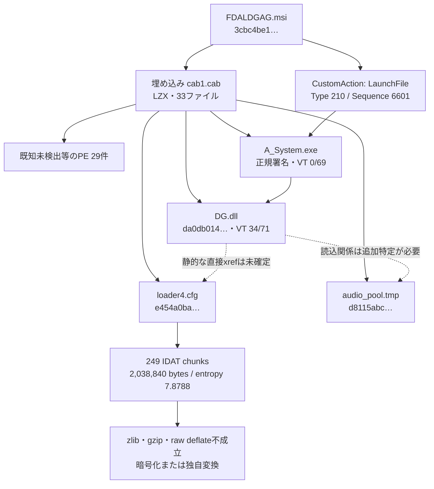
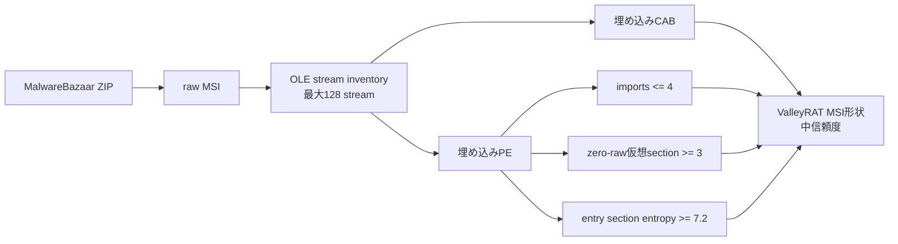
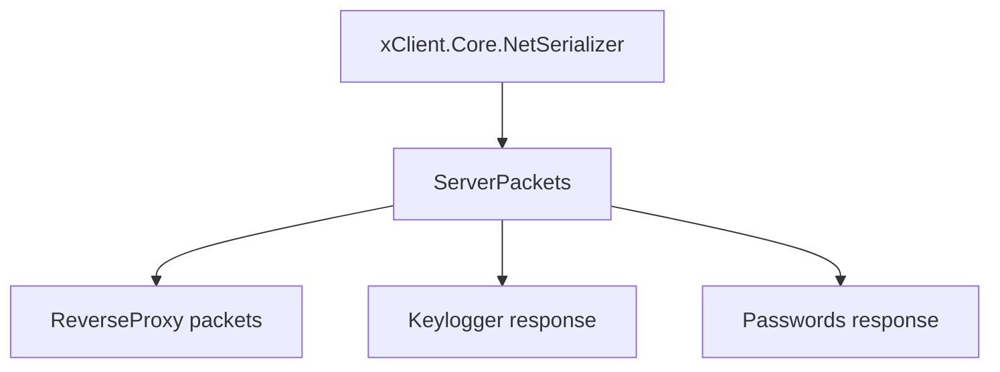
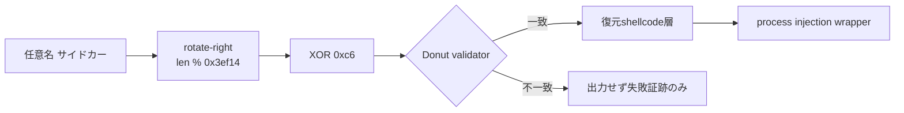

# 重点5系統の静的解析深化（2026-08-03）

## 概要

VenomRAT、ValleyRAT、HijackLoader、PureHVNC／PureRAT、QuasarRATについて、MalwareBazaarで各タグ・signatureの新しい順に5件、合計30件を固定選択して再評価した。検体、復元層、MSIは実行していない。C2や配布インフラへの接続も行っていない。

今回の主な成果は次のとおりである。

- ValleyRATのraw MSIを従来検知器が見落とす不具合を修正し、最新5件すべてで「CAB＋高エントロピー実行セクション＋複数のzero-raw仮想セクション」を確認した。
- VenomRATのASCII／UTF-16LE混在マーカーを相関し、最新2件でMessagePack、接続、キーロガー、プラグインの5証跡を一致させた。
- QuasarRATの設定が未復号でも、`xClient`のパケット、リバースプロキシ、直列化、キー入力記録、パスワード応答という5つの型トポロジーから最新版を中信頼度で識別できるようにした。
- HijackLoaderの最新MSIから33ファイルを復元し、PE 31件（既知未検出等30件と、VirusTotalで34エンジンが悪性判定した偽装`DG.dll` 1件）およびデータ2件を切り分けた。設定データではPNGヘッダを持たない249個のCRC検証に合格 IDAT連鎖を自動検出した。
- PureHVNC／PureRATのAppV系サイドカー復号をファイル名非依存にし、Ghidraで確認済みのrotate-right＋XOR処理を共通変換プロファイルへ結び付けた。
- MSIの`File`、`CustomAction`、`InstallExecuteSequence`、`Media`を読み取り専用で相関する棚卸しスクリプトを追加した。

## 取得範囲

| 系統 | 固定選択数 | 最新観測 | 最新SHA-256 | 備考 |
|---|---:|---|---|---|
| ValleyRAT | 5 | 2026-07-31 20:23:17 | `1217b7b48b21d322037e4f2b9a54b8f45e8e3674b094a97a2aa042fce3fe2004` | MSI |
| HijackLoader | 5 | 2026-07-23 12:04:22 | `3cbc4be157777afb8f4a38673a1910fe7a615135e4819069818e590f4b82f717` | MSI |
| QuasarRAT | 5 | 2026-07-28 06:52:02 | `9270d36aa57eec3d44dc2d66929551198cb8a31d0ef383a726c38b75ad8144ba` | xClientトポロジー一致 |
| VenomRAT | 5 | 2025-08-13 15:18:35 | `6a24ba25482c73d193fcc208d8ae267236b870b9ab30c44cabe2dc8bfb7a1073` | 当該タグの新しい5件自体が古い |
| PureHVNC | 5 | 2026-06-23 18:45:33 | `d025a29613e300d7755f878eb1d23d8a8a042cb2d3eb9005d66664ab9b97c677` | Rust系ローダー候補。AppVプロファイルとは不一致 |
| PureRAT | 5 | 2026-07-30 13:17:21 | `728a2f85c9ff8bbb463e93253ec05e8f3933271887457c5a0f5d4933ec8712c7` | XLSM配布物。最終RATは未復元 |

MalwareBazaarのタグ・signatureは選択根拠であり、単独ではファミリー確定根拠にしていない。選択時のメタデータは固定manifestへ保存し、後続処理が同じSHA-256集合を再利用する。

## HijackLoaderの解析

### MSIからの実行チェーン

MSIテーブルの自動相関結果は以下である。

- `Media.Cabinet`: `#cab1.cab`
- `CustomAction.Action`: `LaunchFile`
- `CustomAction.Source`: `oiggeNuHaSuoGnQ`
- `File.File=oiggeNuHaSuoGnQ`の実ファイル名: `A_System.exe`
- `InstallExecuteSequence.Sequence`: `6601`
- `File`テーブル: 33行

`DG.dll`は唯一、VirusTotal既知メタデータで複数エンジンの悪性判定を受けた内包PEであり、主要脅威名は`Rugmi`が中心だった。一方、Ghidraで`DllMain`、セキュリティクッキー初期化、`DGInit`を追った範囲ではGraphisoft本来の初期化ロジックが多く、`loader4.cfg`文字列`0x180250317`への静的な相互参照は得られなかった。このため「DG.dllが直接サイドカーデータを読む」という部分は確定扱いにせず、暗号化された追加スタブ、実行時に組み立てる名前、または別の到達経路の特定を残課題とする。

### 自動化した構造

`loader4.cfg`はオフセット16,462から始まり、8,192バイト単位を中心とする249個のIDATとIENDがすべてCRC検証に合格で連続していた。通常のPNGにある`IHDR`とシグネチャはなく、結合IDATはzlibとして終端しない。新しい静的検出器は、この構造を誤って実行可能層として出力せず、`encrypted_or_non_zlib_detached_idat`としてハッシュ、エントロピー、境界、チャンク数だけを保存する。

## ValleyRATの解析

従来はMalwareBazaar ZIPを共通層が先に展開すると、ValleyRAT検知器へraw MSIが渡り、ZIP内MSI専用分岐を通らない問題があった。raw MSIを同じ境界付きOLE検査へ渡すように修正した。

最新5件すべてがCAB 1個、PE 1個、パック済み形状1個で一致した。最新版内のPE `7975ff75…`はx64、非.NET、インポート1件、エントリセクション`.GH\`のエントロピー7.9688、rawサイズ0の仮想セクション5個を持つ。高仮想化・パッキング形状は確認できるが、保護製品名までは帰属していない。

## VenomRATの解析

最新版2件で以下の独立マーカー5種を確認した。

- `MessagePackLib.MessagePack`
- `Client.Connection`
- `DataLogs_keylog_online.txt`
- `OfflineKeylog sending`
- `Plugin.Plugin`

ASCIIだけでなくUTF-16LEも同じ相関器で調べ、直列化、通信、キー入力記録の3役以上かつ独立マーカー3個以上を必須にした。単一のMessagePack文字列だけではVenomRATへ帰属しない。

## 遠隔操作型マルウェア`QuasarRAT`の詳細解析

最新版`9270d36…`では設定復号前でも以下5マーカーが一致した。

- `xClient.Core.Packets.ServerPackets`
- `xClient.Core.ReverseProxy.Packets`
- `xClient.Core.NetSerializer`
- `GetKeyloggerLogsResponse`
- `GetPasswordsResponse`

3個以上の独立マーカーを必須にし、`managed_xclient_topology`として中信頼度で扱う。C2や暗号鍵が未復元の段階でendpointを推測しない。

## PureHVNC／PureRATの解析

### AppVローダーの確認済みロジック

既存の代表`AppVIsvSubsystems64.dll`をGhidra MCPで再確認した。

| 関数 | 確認した役割 |
|---|---|
| `0x1800012d0` | 入力長に対する`0x3ef14`の剰余だけ右ローテートし、全バイトを`0xc6`でXOR。ベクトル化反復と末尾処理を含む |
| `0x180003780` | 遠隔プロセスでの割当、書込み、保護属性変更、スレッド開始をまとめるプロセス注入ラッパー |
| `0x1800041e0` | DLLコピー、hidden/system属性設定、登録・永続化補助 |
| `DllRegisterServer` | 上記の中核初期化へ到達 |

サイドカー名`riched32.dat`は過去観測の手掛かりに変更し、変換適用条件から外した。復号結果がDonut shellcode validatorを通った場合だけ層を出力する。

### 新しいタグ付き検体の限界

`PureHVNC`の最新検体`d025a296…`は`AggregatorHost.exe`を名乗る32ビットの`Rust`系PEで、`WriteProcessMemory`、`CreateThread`、`AddVectoredExceptionHandler`、7MB超の`.data`を持つ。次点`17261fe2…`も`Rust`系暗号化ローダー形状である。ただし既存`AppV`のエクスポート・リソース構造とは一致せず、一般的な`Rust`製ローダーとの誤帰属を避けるため、タグだけで自動的に`PureHVNC`へ確定していない。

PureRAT最新`728a2f85…`はXLSM配布物、残る4件は小型ZIP配布物で、今回の静的経路では最終RAT本体まで復元できていない。これは「ファミリー本体ではなく初期配布物がタグ付けされた」可能性を含む。今後はVBA、外部relation、取得可能な後段URLを個別に追う必要がある。

## 類似性と横断知識

| 比較 | 類似点 | 相違点 | 自動化への反映 |
|---|---|---|---|
| ValleyRAT / HijackLoader | MSI・CABを初期コンテナに使用 | ValleyRATはパック済みPE形状、HijackLoaderは多数の正規ファイルとサイドカー | コンテナ構造とペイロードロジックを別スコアにする |
| `VenomRAT` / `QuasarRAT` | `.NET`型名・パケットトポロジーが残る | `VenomRAT`は`MessagePack`＋プラグイン／キー入力記録、`QuasarRAT`は`xClient`名前空間 | 単語一致ではなく3役以上の相関を必須にする |
| PureHVNC / ValleyRAT | ローダーから最終RATへ段階展開 | PureHVNCはサイドカー変換、ValleyRATはMSI内packed PE | 復号検証器とコンテナ検出器を分離する |
| HijackLoader / PureHVNC | 外部データをローダーが復元 | HijackLoaderは分離IDAT、PureHVNCはローテート＋XOR | ファイル名非依存、変換方式＋検証器で識別する |

## 追加・変更した解析機能

- MalwareBazaarの`--signature --selection-only`がダウンロードしてしまう不具合を修正し、固定選択manifestを後続処理で再利用するようにした。
- OLE／MSIストリームとCABメンバーを件数・単体サイズ・合計サイズの上限付きで復元するようにした。
- Python CAB parserがLZX非対応の場合、利用者が明示したローカル7-Zipへだけフォールバックする。
- 分離IDAT/IEND連鎖のCRC、境界、結合ハッシュ、zlib成立可否を記録する。
- 多数の正規ファイルに埋もれた設定参照PEと分離IDATを後段層の先頭へ優先する。
- archive内メンバー棚卸し上限512と静的採用層上限64を分離し、33ファイルCABを事前拒否する不具合を修正した。最終実検体テストでは46層を制限イベント0で解析し、`loader4.cfg`を第3層、悪性`DG.dll`を第4層として処理した。
- MSIテーブル相関を`unpackers/msi_static_inventory.py`へ実装した。
- PureHVNC変換プロファイルをサイドカーファイル名非依存にした。
- ValleyRAT、VenomRAT、QuasarRATの検知器に実検体回帰テストを追加した。

## データ整理

公開解析結果、機械可読所見、Ghidraプロジェクトは保持した。削除対象は再取得可能な旧検体・取得キャッシュ、今回の一時検体コピー、テストで生成された`__pycache__`に限定し、合計1,204,828,685バイトを削除した。終了時のCドライブ空き容量は2,697,228,288バイトである。
## 検証結果

- 共通解析、unpacker、VenomRAT、QuasarRAT、PureHVNCの回帰テスト：1,530件成功、4件skip。
- 変更したPython実装とテストのRuff検査：成功。
- 新規公開レポートの日本語化dry-runおよびfail-closed監査：未解決0件。
- 変更Markdown 4件のローカルリンク監査：リンク切れ0件。
- 変更JSONの標準パーサ検証：成功。
## 未解決事項

- HijackLoader `loader4.cfg`の暗号方式・鍵導出と、悪性`DG.dll`からの確定到達経路。
- PureRATのXLSM／ZIP配布物から最終PureRAT本体までの静的復元。
- PureHVNCのRust系crypter候補とAppV系ローダーの同一キャンペーン性。
- ValleyRAT MSI内packed PEの保護処理／仮想機械命令の意味と最終設定復号。
- C2はこの静的深化作業では接続せず、既存のライブ監視処理とも混同していない。

## 情報源

- [MalwareBazaar Community API](https://bazaar.abuse.ch/api/): signature/tagの新しい順の固定選択、検体メタデータ、既知SHA-256
- [VirusTotal API](https://docs.virustotal.com/reference/overview): 既知ファイルの検知統計、主要脅威名、既存サンドボックス関連情報。新規検体送信は実施していない
- Ghidra MCP：ローカルに取り込んだ代表バイナリの逆コンパイル、相互参照、関数ロジック。すべて明示的な`program selector`を使用