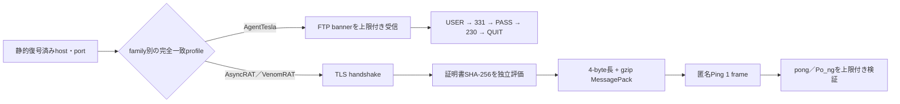

# AgentTesla／AsyncRAT／VenomRAT C2プロトコル追加解析（2026-08-04）

## 結論

AgentTeslaの外側JavaScriptを最終.NETまで静的復元し、AsyncRAT 0.5.8とVenomRAT 6.0.3の最終managed clientも実行せず確認しました。両者はTLS、4-byte little-endian長、gzip圧縮MessagePackを共有しますが、VenomRATはpacket fieldを`Pac_ket`、応答を`Po_ng`へ改変しています。この差を別profileとして固定し、未知endpointへ自動送信しないようにしました。

証明書の完全一致は強い加点材料です。一方、不一致だけでC2を除外しません。builderによる差し替え、fork、再build、運用時のrotationがあり得るため、記録上は`mismatch_inconclusive`とし、MessagePack応答が一致すればプロトコル一致を優先します。

## 静的通信フロー

AsyncRATは`Packet=Ping`に対する`pong`、VenomRATは`Pac_ket=Ping`に対する`Po_ng`を確認条件とします。probeの`Message`は空文字列で、端末名、ユーザー名、HWID、active window、OS、導入済みアプリなどは送信しません。stage要求、command polling、任意commandも行いません。

## 最終段の確認

- AsyncRAT: SHA-256 `20f21565d7e77f3b3b7247099af91da43dcde0078c173f8e6efc74a6d40b44c3`、210 managed methods、version 0.5.8。
- VenomRAT: SHA-256 `6a24ba25482c73d193fcc208d8ae267236b870b9ab30c44cabe2dc8bfb7a1073`、264 managed methods、version 6.0.3。
- VenomRATは固定host/portが`null`で、静的復号したPastebin URLから2026-08-04に動的endpointを1件取得しました。配布検体、復号済みbinary、証明書本体、秘密鍵はリポジトリへ保存していません。

機械可読根拠は[profiles-evidence.json](profiles-evidence.json)を参照してください。

## 実通信での検証

2026-08-04T11:42:10Zに、AsyncRATの復号済みendpoint `191.96.78.221:7788`へ、レビュー済みprofileの匿名Pingを1回だけ送信しました。TLS証明書SHA-256は静的configと完全一致し、圧縮MessagePack応答の`Packet=pong`も一致したため、`c2_protocol_confirmed`と判定しました。観測IPはBR、AS270353（Tyna Host - Datacenter no Brasil）です。端末情報、HWID、ユーザー名、stage要求、command pollingは送信していません。

2026-08-04T11:41:43ZのVenomRAT endpoint `s2gj9tonn.localto.net:6377`は、TLS接続前にタイムアウトしました。これは観測時点の一時的停止または到達不能を示すだけで、恒久停止や非C2を意味しません。最終payload、動的endpoint、期待証明書、`Pac_ket`／`Po_ng`の通信仕様は静的解析で確定済みのため、同じprofileを継続監視へ利用できます。 同日の別時刻のDNS-only観測では`45.140.42.50`（DE、AS62240 Clouvider Limited、TTL 300秒）へ解決しました。これは到達性やC2稼働を示すものではありません。

各チェックの前にMaxMind DBの鮮度確認と更新を実施しました。ASN DBは24時間基準内、City DBは更新後も提供元の最新版自体が基準を超えていたため、その状態を機械可読記録に残しています。

## AgentTesla FTP実認証

MalwareBazaarから外側JavaScript（SHA-256 `3f09145757282e6a59cd69319ac3b9da3265022a1d4f92a1646f8ddbaad89333`）を再取得し、実行せずJavaScript、LuaJIT、PolyRot、Donutを解除して最終.NET（SHA-256 `987bed1a8e0a44a6a34d3193cbb1f782c45d51419a317e55f086d8de0748d018`、245,248 bytes）を復元しました。資格情報はリポジトリ外private vaultへだけ抽出し、公開側は存在フラグと非秘密参照IDだけを保持します。

2026-08-04T12:11:03Zに`ftp.vilimorin.com:21`へ完全一致資格情報で1回だけ認証し、reply code `220 → 331 → 230 → 221`を確認しました。`PASS`後の`230`から`c2_protocol_confirmed`と判定しています。送信は`USER`、`PASS`、`QUIT`だけで、`LIST`、`PWD`、`RETR`、`STOR`、ファイル転送、ディレクトリ操作は行っていません。資格情報値とraw replyは保存していません。観測IPは`66.29.137.55`、US、AS22612（Namecheap, Inc.）です。