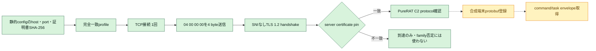

# PureRAT／PureHVNC C2判定の追加検討（2026-08-05）

## 結論

managed PureRAT／PureHVNC 4.x系は、単なるTCP port公開より強い能動判定が可能です。確認済み通信は、TCP接続直後の4 byte `04 00 00 00`、SNIなしTLS、設定へ埋め込まれた証明書との照合、GZip圧縮protobufによる端末登録・command受信の順に進みます。

今回、次の3条件がすべて成立した場合だけ`c2_protocol_confirmed`相当とできる限定probeを実装しました。

1. レビュー済みの完全一致endpointへ`04 00 00 00`だけを送信する。
2. そのprelude後にTLS 1.2 handshakeが成立する。
3. server certificateのDER SHA-256が、同一検体の静的設定から抽出した値と完全一致する。

一般のTLS serverはTLS ClientHelloの前にこの4 byteを受理しないため、prelude後にTLSが成立すること自体がprotocol固有の証拠です。さらに検体固有のcertificate pinが一致すれば、単一IOCやport番号だけに依存しない高確度判定になります。

## 通信フローと今回の到達範囲

実線部分は実装済みです。破線部分は未実装です。端末登録に必要なnetwork側protobuf classのfield schemaとcommand envelopeを、現存する証拠だけでは完全復元できていません。

## 根拠

- Check Point Researchが解析したPureHVNC 4.1.9は、TCP接続後に`04 00 00 00`を送信してから`SSLStream`を作成し、設定内証明書でserver certificateを検証します。その後、端末情報をprotobufでserializeし、GZip圧縮して送信します。C2からは圧縮buffer size、buffer本体の順に受信し、展開・deserialize後にcommandを別threadで処理します。[Check Point Research: Under the Pure Curtain](https://research.checkpoint.com/2025/under-the-pure-curtain-from-rat-to-builder-to-coder/)
- FortiGuard Labsも、設定のBase64／GZip解除、端末情報送信、C2から受信したpluginの展開・registry保存・memory実行を独立に確認しています。[FortiGuard Labs: PureHVNC Deployed via Python Multi-stage Loader](https://www.fortinet.com/uk/blog/threat-research/purehvnc-deployed-via-python-multi-stage-loader)
- ローカルで復元済みのPureRAT 4.4.1 caseは、`tirakian.com:56001`、`:56002`、`:56003`、certificate DER SHA-256 `67260a713ab105197098882f6d126f89fe4f48df8013f8bba1d2c9307b17410b`を静的設定から確認済みです。
- 2026-07-28の復号PCAPでは、別campaignの`tea.vexexo.com:56001`でSNIなしTLS 1.2と双方向binary通信を確認しています。過去の単純TLS試行はClientHello後にEOFとなりましたが、malware固有preludeを送らずにTLSを開始したことが原因候補です。

## 判定レベル

| 観測 | 判定 | C2稼働confidenceの目安 |
|---|---|---:|
| DNS解決だけ | C2 service未確認 | 0.00 |
| TCP接続だけ | transport到達のみ | 最大0.25 |
| `04 00 00 00`後にTLS成立、certificate不一致 | PureRAT互換protocol候補。別build・rotationの可能性 | 最大0.60 |
| `04 00 00 00`後にTLS成立、静的configのcertificate pin完全一致 | 検体対応PureRAT C2 protocol確認 | 0.95 |
| 合成端末登録後に正規command envelopeを受信 | C2 tasking確認 | 将来0.98を想定 |

certificate不一致だけでPureRATではないとは判定しません。builderによる証明書差し替え、別顧客build、server更新があり得ます。ただし、特定検体は埋め込みpinと合わないserver certificateを拒否するため、その検体と当該serverの互換性は失われています。

## 実装と安全境界

- 共通probe: `analysis-framework/common/purerat_tls_probe.py`
- 固定profile CLI: `analysis-framework/malware/purehvnc/active_c2_detector.py`
- profile registry: `analysis-framework/malware/purehvnc/active_profiles.json`
- 単体テスト: `analysis-framework/tests/test_purerat_tls_probe.py`、`analysis-framework/malware/purehvnc/tests/test_active_c2_detector.py`

network接続と4-byte prelude送信は別々の明示flagが必要です。任意host・port・送信byte列はCLIから指定できず、固定registryの完全一致profileだけを使用します。端末名、ユーザー名、HWID、OS情報、campaign以外のvictim metadata、登録protobuf、command poll、task実行、payload取得は行いません。certificate本体や秘密鍵も出力しません。

今回は設計・実装・offline testまでとし、C2への新規live接続は行っていません。

## command/task取得まで進めるために必要な追加解析

1. PureRAT 4.4.1終端assemblyを再取得し、network message classの`ProtoMember(n)`、送信順序、length framingを関数単位で復元する。
2. Triage等からmemory dumpまたはTLS復号済みPCAPを取得し、初回bot messageとserver acknowledgementをstatic class schemaへ対応付ける。
3. 実端末値を含まない合成protobufをloopback emulatorで往復testする。
4. 登録とtask取得を独立した明示gateにし、要求回数1回、応答上限、task本文非公開、task非実行、payload非取得でfail-closed実装する。
5. versionごとにprofileを分離し、4.1.9のschemaを4.4.1以降へ推測適用しない。
