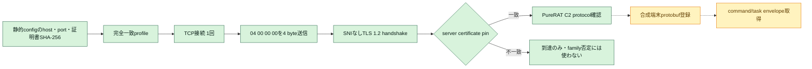

# PureRAT／PureHVNC C2判定の追加検討（2026-08-05）

## 結論

managed PureRAT／PureHVNC 4.x系は、単なるTCP port公開より強い能動判定が可能です。確認済み通信は、TCP接続直後の4 byte `04 00 00 00`、SNIなしTLS、設定へ埋め込まれた証明書との照合、GZip圧縮protobufによる端末登録・command受信の順に進みます。

今回、次の3条件がすべて成立した場合だけ`c2_protocol_confirmed`相当とできる限定probeを実装しました。

1. レビュー済みの完全一致endpointへ`04 00 00 00`だけを送信する。
2. そのprelude後にTLS 1.2 handshakeが成立する。
3. server certificateのDER SHA-256が、同一検体の静的設定から抽出した値と完全一致する。

一般のTLS serverはTLS ClientHelloの前にこの4 byteを受理しないため、prelude後にTLSが成立すること自体がprotocol固有の証拠です。さらに検体固有のcertificate pinが一致すれば、単一IOCやport番号だけに依存しない高確度判定になります。

## 通信フローと今回の到達範囲

実線部分は実装済みです。破線部分は未実装です。端末登録に必要なnetwork側protobuf classのfield schemaとcommand envelopeを、現存する証拠だけでは完全復元できていません。

## 根拠

- Check Point Researchが解析したPureHVNC 4.1.9は、TCP接続後に`04 00 00 00`を送信してから`SSLStream`を作成し、設定内証明書でserver certificateを検証します。その後、端末情報をprotobufでserializeし、GZip圧縮して送信します。C2からは圧縮buffer size、buffer本体の順に受信し、展開・deserialize後にcommandを別threadで処理します。[Check Point Research: Under the Pure Curtain](https://research.checkpoint.com/2025/under-the-pure-curtain-from-rat-to-builder-to-coder/)
- FortiGuard Labsも、設定のBase64／GZip解除、端末情報送信、C2から受信したpluginの展開・registry保存・memory実行を独立に確認しています。[FortiGuard Labs: PureHVNC Deployed via Python Multi-stage Loader](https://www.fortinet.com/uk/blog/threat-research/purehvnc-deployed-via-python-multi-stage-loader)
- ローカルで復元済みのPureRAT 4.4.1 caseは、`tirakian.com:56001`、`:56002`、`:56003`、certificate DER SHA-256 `67260a713ab105197098882f6d126f89fe4f48df8013f8bba1d2c9307b17410b`を静的設定から確認済みです。
- 2026-07-28の復号PCAPでは、別campaignの`tea.vexexo.com:56001`でSNIなしTLS 1.2と双方向binary通信を確認しています。過去の単純TLS試行はClientHello後にEOFとなりましたが、malware固有preludeを送らずにTLSを開始したことが原因候補です。

## 判定レベル

| 観測 | 判定 | C2稼働confidenceの目安 |
|---|---|---:|
| DNS解決だけ | C2 service未確認 | 0.00 |
| TCP接続だけ | transport到達のみ | 最大0.25 |
| `04 00 00 00`後にTLS成立、certificate不一致 | PureRAT互換protocol候補。別build・rotationの可能性 | 最大0.60 |
| `04 00 00 00`後にTLS成立、静的configのcertificate pin完全一致 | 検体対応PureRAT C2 protocol確認 | 0.95 |
| `04 00 00 00`送信後に切断、またはTLS handshake不成立 | protocol固有の根拠なし。非PureRATの証明にもならない | 最大0.25 |
| 合成端末登録後に正規command envelopeを受信 | C2 tasking確認 | 将来0.98を想定 |

certificate不一致だけでPureRATではないとは判定しません。builderによる証明書差し替え、別顧客build、server更新があり得ます。ただし、特定検体は埋め込みpinと合わないserver certificateを拒否するため、その検体と当該serverの互換性は失われています。

到達しない、prelude送信後に切断される、TLS handshakeが成立しない、のいずれもPureRAT C2でないことの証明にはなりません。停止、filtering、port閉塞、build差異があり得ます。観測結果には `observation_excludes_purerat: false` を必ず含めています。

## 未確定: 埋め込み証明書がserver検証用かclient認証用か

**この点は確定していません。判定の前提に関わるため明示します。**

ケースレポートに記録されているのは設定内の **PFX（秘密鍵つきPKCS#12）** で、leafは `CN=PureRAT Agent`、DER SHA-256は `67260a71...` です。

- Check Pointの記述に従えば、埋め込み証明書は **server certificateの検証** に使われます。この場合、serverは同じ証明書を提示するのでpin照合が成立します。
- 一方、server検証だけなら公開証明書で足り、**秘密鍵は不要**です。秘密鍵つきPFXが入っていることは、**TLSクライアント認証**に使っている可能性を示します。この場合、serverが提示するのは別の証明書なのでpinは一致せず、さらにserverがclient証明書を要求するならhandshake自体が成立しません。

現在のprobeはclient証明書を提示しません（`load_cert_chain` を呼びません）。client認証を要求するserverに対しては、`purerat_prelude_tls_handshake_failed` として記録されます。この挙動は `analysis-framework/tests/test_purerat_tls_probe_live_path.py` の
`test_server_requiring_client_certificate_is_reported_not_raised` で固定しています。

この検体の終端assemblyから `SslStream.AuthenticateAsClient` の引数（client証明書コレクションの有無）と `RemoteCertificateValidationCallback` の中身を復元するまで、pinが一致しなかった場合に「別build」なのか「そもそもpinの向きが違う」のかは区別できません。

## 実装と安全境界

- 共通probe: `analysis-framework/common/purerat_tls_probe.py`
- 固定profile CLI: `analysis-framework/malware/purehvnc/active_c2_detector.py`
- profile registry: `analysis-framework/malware/purehvnc/active_profiles.json`（CLI用）、`analysis-framework/common/c2_protocol_probe_profiles.json`（日次監視用）
- nmap NSE: `analysis-framework/nmap/scripts/purerat-c2.nse`
- 単体テスト: `analysis-framework/tests/test_purerat_tls_probe.py`（境界）、`analysis-framework/tests/test_purerat_tls_probe_live_path.py`（実TLS経路）、`analysis-framework/tests/test_purerat_monitoring_integration.py`（監視パイプライン）、`analysis-framework/malware/purehvnc/tests/test_active_c2_detector.py`（CLI）

network接続と4-byte prelude送信は別々の明示flagが必要です。任意host・port・送信byte列はCLIから指定できず、固定registryの完全一致profileだけを使用します。端末名、ユーザー名、HWID、OS情報、campaign以外のvictim metadata、登録protobuf、command poll、task実行、payload取得は行いません。certificate本体や秘密鍵も出力しません。

今回は設計・実装・offline testまでとし、C2への新規live接続は行っていません。実TLS経路の検証は、文書どおりに振る舞うloopbackの模擬C2に対して行っています。

### 観測結果の status

到達しない場合も含め、常に同じ形のJSONを返します。例外で打ち切ると監視履歴に何も残らないため、以下はすべて「観測結果」として記録されます。

| status | 意味 | 判定 |
|---|---|---:|
| `confirmed_purerat_prelude_tls_certificate` | prelude受理＋TLS成立＋pin完全一致 | 0.95 |
| `purerat_prelude_tls_certificate_mismatch` | prelude受理＋TLS成立、pin不一致 | 0.00（否定にも使わない） |
| `purerat_prelude_tls_handshake_failed` | TCPは開いたがTLS handshakeが不成立 | 0.00 |
| `purerat_prelude_rejected` | prelude送信後に切断。PureRAT protocolの応答ではない | 0.00 |
| `not_reachable_at_observation` | TCP接続できない | 0.00 |
| `dns_unresolved` | global IPへ解決できない | 0.00 |
| `network_disabled` / `purerat_protocol_prelude_disabled` | 安全gate未充足で観測していない | 0.00 |

A recordが複数ある場合も接続は1本に固定します。したがって「到達しなかった」は解決した全IPが落ちていることを意味しません。結果の `resolved_ips` と `connected_ip` の差を見てください。

### 日次監視への組み込み

`purerat_tls_prelude` は `monitor_recent_c2.py` の `ACTIVE_PROFILE_METHODS` に登録済みです。日次監視は静的IOC由来の `tcp_connect` 対象を、`c2_protocol_probe_profiles.json` の完全一致profileでこのmethodへ昇格させます。他のactive methodと同じく、`--allow-network` と application probe の両gateが必要です。

## command/task取得まで進めるために必要な追加解析

1. PureRAT 4.4.1終端assemblyを再取得し、network message classの`ProtoMember(n)`、送信順序、length framingを関数単位で復元する。
2. Triage等からmemory dumpまたはTLS復号済みPCAPを取得し、初回bot messageとserver acknowledgementをstatic class schemaへ対応付ける。
3. 実端末値を含まない合成protobufをloopback emulatorで往復testする。
4. 登録とtask取得を独立した明示gateにし、要求回数1回、応答上限、task本文非公開、task非実行、payload非取得でfail-closed実装する。
5. versionごとにprofileを分離し、4.1.9のschemaを4.4.1以降へ推測適用しない。
