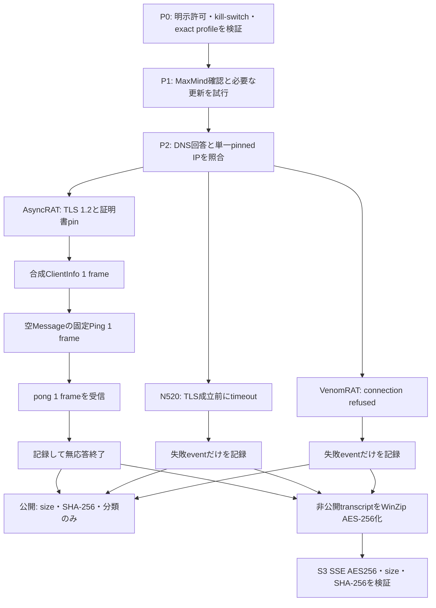

# 防御的RATホストエミュレーターのライブ観測（2026-08-09）

## 結論

2026-08-09 09:38:21～09:41:22 UTC（同日18:38:21～18:41:22 JST）に、完全一致profileへ固定した3件の短時間sessionを実施した。AsyncRAT 0.5.8ではTLS 1.2、合成`ClientInfo`、active window情報を除いた固定Ping request、`pong` responseまで成立した。ValleyRAT N520はTLS成立前にtimeoutし、VenomRAT 6.0.3はTCP接続を拒否された。

成功したAsyncRAT sessionで受信したapplication frameは`pong` 1件だけで、operator taskは観測していない。全sessionで検体、plugin、taskを実行せず、任意操作結果のfake replyも送信していない。N520とVenomRATの失敗は、その観測時刻に接続を確立できなかった事実に限られ、C2の恒久停止または非C2を意味しない。

## 公開証拠

| 対象 | 公開JSON | JSON SHA-256 |
|---|---|---|
| AsyncRAT 0.5.8 | [live-asyncrat-058-20260809.json](live-asyncrat-058-20260809.json) | `e35064443718acf80c87d28183bba0553487b39419e0124d017bbe0e6c15db1e` |
| ValleyRAT N520 | [live-valleyrat-n520-20260809.json](live-valleyrat-n520-20260809.json) | `57cebf4971154c41f57431dc180aa76a9d19a47ef6f8ea1da8dabe5cee35355c` |
| VenomRAT 6.0.3 | [live-venomrat-603-20260809.json](live-venomrat-603-20260809.json) | `8482938627fe558c3412a60793c2691b1ecaa93bd98ebe4d336ed2c50452bd57` |

静的なprotocol比較、対象検体SHA-256、profileの制約は[防御的RATホストエミュレーター比較](README.md)を参照する。3つの`live-*.json`と本書にはraw frame、復号済みtask本文、資格情報、鍵、token、合成ID、private path、S3 object URIを含めない。監視sidecarだけは、archive report SHA-256、SSE、size、archive／manifest hashとの整合をvalidatorで確認した検証用`object_uri`をallowlist項目として含む。

## 監視sidecarの非通信再検証

[rat-emulation-evidence.json](rat-emulation-evidence.json)を監視planの実targetsへ結合し、ネットワーク通信を行わずvalidatorで再検証した。結果はsession 1件、status=`heartbeat_response_observed`、`c2_confirmed=true`、`heartbeat_count=1`、private evidenceの`archived=true`である。これは上記AsyncRAT観測を監視へ安全に取り込めることの再検証であり、新たなlive sessionではない。

- raw file SHA-256（保存ファイル）: `994b787a4c77aa4ba093150f60ec236fcf20913150fab4c9d623639815b329ec`
- validator canonical public SHA-256（正規化済み公開JSON）: `c2428b3433004427a0fe4d8d52113f9a69a159de0fb8f83bc8925d0c735d5fd0`

raw file SHA-256は保存ファイルそのもののbyte列を識別し、canonical public SHA-256はvalidatorがallowlistで再構成してkey順を正規化した公開JSONのbyte列を識別するため、両者を混同または相互代用しない。

## 厳格な安全境界

- live network許可、live C2 emulation許可、完全一致profile確認、存在するkill-switchを接続前に確認した。
- 各sessionを単一profile、単一接続、単一pinned IPへ限定し、profile外IP、複数IP試行、redirect、fallback、reconnectを行わなかった。
- DNS回答にpinned IPが含まれることを確認し、証拠・protocol profile・registryのSHA-256を固定した。
- マルウェア検体は実行していない。実host名、user名、process、file、画面、camera、clipboard、credentialも読み取っていない。
- AsyncRATの実検体は`KeepAlivePacket`でactive window titleを`Ping.Message`へ入れるが、エミュレーターは`GetActiveWindowTitle`を呼ばず、空文字へsanitizeした。
- AsyncRATで送信したapplication frameは、合成`ClientInfo`と固定Ping requestの2件だけである。受信上限は1 frameとし、`pong`を受けても返信しなかった。
- file、plugin、stageを要求、保存、実行していない。受信taskも実行せず、secondary networkを開始しない設計とした。
- 任意操作結果のserializerは未解決であり、`arbitrary_fake_result_sent=false`、`live_arbitrary_result_allowed=false`を維持した。
- 公開証拠はframeのsizeとSHA-256だけを保持する。AsyncRATの受信frameは`raw_retained=false`であり、生byte列を公開していない。

## 3セッションの結果

| 対象・検体SHA-256 | 観測時刻（UTC／JST） | transportと送信 | 結果 | 評価 |
|---|---|---|---|---|
| AsyncRAT 0.5.8 `20f21565d7e77f3b3b7247099af91da43dcde0078c173f8e6efc74a6d40b44c3` | 09:40:33～09:40:34 UTC 18:40:33～18:40:34 JST | TLS 1.2、合成`ClientInfo`、空`Message`の固定`Packet=Ping` | `completed`／`heartbeat_response_observed`。`pong` 1 frameを受信 | 観測時点でprofile固有protocolが活動。operator taskは未観測 |
| ValleyRAT N520 `d11e793159f0da3c88a9ecebb8e5df88919843a1eeaaf71117377db58224a1ae` | 09:38:21～09:38:42 UTC 18:38:21～18:38:42 JST | pinned endpointへの単一接続。application frame送信なし | `failed`／`TimeoutError`。TLS証明書pin eventより前に終了 | 観測時点のtimeout。恒久停止または非C2とは判定しない |
| VenomRAT 6.0.3 `6a24ba25482c73d193fcc208d8ae267236b870b9ab30c44cabe2dc8bfb7a1073` | 09:41:20～09:41:22 UTC 18:41:20～18:41:22 JST | pinned endpointへの単一接続。application frame送信なし | `failed`／`ConnectionRefusedError`。TLS成立前に終了 | 観測時点の接続拒否。恒久停止または非C2とは判定しない |

N520とVenomRATはpolicy検証後にtransport段階で終了し、公開eventは`preconnect_policy_validated`と`session_failed`の2件だけである。TLS、registration、heartbeat、taskの成立を示すeventはない。この陰性結果を7日停止判定の単独根拠にはしない。

## AsyncRATのframe証拠

TLS 1.2の証明書SHA-256は`86b87d08f7c6f01acf68204715cc33d160b69561b15bceaee50fb6cf95466e02`で、固定profileと一致した。application send countは2、受信は41 byte、read callは2、受信frameと分類commandは各1件だった。

| 方向 | 種別 | wire size | wire SHA-256 | decoded size | decoded SHA-256 |
|---|---|---:|---|---:|---|
| 送信 | 合成`ClientInfo` registration | 278 byte | `7bb8692714d8998488292d899a1045d77959badaf3a9af026f5b8b9aad2f3634` | 288 byte | `8bea2bf51d18b52bba2b5a17e149891792fc6a1a4d05c1136da76c0aa1150ec4` |
| 送信 | 安全化した固定`Packet=Ping`／空`Message` | 50 byte | `c217ea276e4baf22edcdb708f9720dcc9378c87f5eabe0da127bc3b720de583f` | 22 byte | `6463effa24c54c3e6afdf138ea6f17ec8b0ced8da3c34bca438d1f22424cbc7c` |
| 受信 | `Packet=pong` heartbeat response | 41 byte | `0f361df3565943f12f89bc6ba505ead190a20787ef3c180c093394d65e23b356` | 13 byte | `e30da9e44472999f31f9503dc74c19457d7a2ac617ba1a0f32d8cdc67c1b8500` |

受信opcodeは`pong`だけで、actionは`record_heartbeat_response_and_terminate`、`should_respond=false`だった。したがってoperator task、file／plugin転送、未知commandは観測されず、task実行もfake結果送信もなかった。

## 安全な通信フロー

図の実線は今回実施した処理だけを示す。taskへのreply、fake結果、stage取得、別endpointへの通信、再接続は経路に含まれない。

## MaxMind Geo／ASと鮮度

全sessionでnetwork接続前に24時間基準の鮮度確認を行った。GeoLite2 Cityは更新前から期限超過で、更新を実行してもbuild時刻が`2026-08-07T05:30:45Z`（2026-08-07 14:30:45 JST）のままだった。providerから取得できた最新版自体が24時間を超えていたため、`latest_available_still_stale=true`として記録し、freshとは扱っていない。GeoLite2 ASNは`2026-08-09T08:15:51Z`（同日17:15:51 JST）で、観測時点の24時間範囲内だった。

| 対象IP | MaxMind Geo | ASN／組織 | 位置精度の注意 |
|---|---|---|---|
| `191.96.78.221` | ブラジル連邦共和国、ミナス・ジェライス州、Muriaé | AS270353／Tyna Host - Datacenter no Brasil | accuracy radius 20 km |
| `118.107.21.88` | シンガポール。都市情報なし | AS152194／CTG Server Limited | accuracy radius 1,000 km |
| `45.140.42.50` | ドイツ連邦共和国、ヘッセン州、フランクフルト・アム・マイン | AS62240／Clouvider Limited | accuracy radius 20 km |

GeoLite2の位置はIPインフラの概略であり、C2 operatorまたは攻撃者の所在地・帰属を示さない。本表は「This product includes GeoLite2 Data created by MaxMind, available from https://www.maxmind.com.」に基づく。

## private transcriptのS3保管検証

各sessionのprivate transcriptは解析対象別に分離し、password `infected`のWinZip AES-256 archiveとしてS3へuploadした。既存のupload reportでは3件とも`status=verified`、S3 server-side encryptionは`AES256`で、object size、archive SHA-256 metadata、manifest SHA-256の検証が完了している。3つの`live-*.json`と本書にはobject URIを公開しないが、監視sidecarに限り、bucket／解析対象とのbindingをvalidatorで確認した`object_uri`をarchive report SHA-256、SSE、size、archive／manifest hashに結び付く検証参照として公開する。credential、ETag、IAM role、local path、raw transcriptは監視sidecarにも含めない。

| 対象 | event数 | transcript root SHA-256 | archive size | archive SHA-256 | manifest SHA-256 |
|---|---:|---|---:|---|---|
| AsyncRAT | 9 | `c51cae45428639fc64f5801e6d34fc7b0182a1cbf9efb76532809cd43fe56619` | 9,746 byte | `3d3092390fabb946293f90d0e1d2052bc06ffa6a5bac70f89b7659328852a4a0` | `507cdc5df50ff9ff2e24a91f4cae58ac86b2da85a7f4438a757cfeacfeed96d5` |
| ValleyRAT N520 | 2 | `70279ff155f434cbef7d0bf9374c88f0ba12133c12f58ccf7da625eddd3248d2` | 3,755 byte | `0e92430f273cf74bc4c809852a7ff620a235994b76502287bda9192edcaced89` | `91dad6be99e8e2b9d3992475479f928dfebf34b19283d2f48438f52d79ab7348` |
| VenomRAT | 2 | `0dbb9ff693c4fd1a1c8bb037724e14f29ffed5623f8687d6d2c6939ca0857efc` | 3,926 byte | `138ac49520c1b69875319ed5942b74cdfbd769fa936c398b600cdf4a875fc90c` | `6253fcf62f632264648e26def4dd0563c73fc7f80344de173e28365295100131` |

## 判定上の制約

- AsyncRATの`pong`一致は、2026-08-09 09:40:34 UTC時点でprofile固有protocolが応答した肯定証拠である。将来の稼働を保証しない。
- operator taskが届かなかったのは1秒未満の短時間sessionで配信がなかったという事実だけで、task機能がないことを示さない。
- N520のtimeoutとVenomRATのconnection refusedは一時停止、filter、listener変更、IP／port移行でも生じ得る。再観測なしに停止へ移さない。
- 証明書不一致だけで非C2としないprofile方針は維持する。今回はAsyncRATで固定証明書が一致し、N520／VenomRATではTLS証明書を観測していない。
- result serializerは未解決であり、fake成功・失敗結果を返す能力を本観測は検証していない。

## 将来の隔離常駐設計

常時観測へ進む場合も、現行runnerを単純な無限loopへ変更しない。専用VMまたは使い捨てcontainer、非特権service account、exact IP／portだけのOSレベルegress allowlist、同時接続1、期限付きsession lease、kill-switch、profile別cooldownと指数backoffを必須とする。

実host filesystem、shell、PowerShell、browser、credential store、clipboard、camera、microphone、画面APIへ到達できる機能を持たせない。登録値とPingは決定的な合成値へ固定し、raw taskはprivate transcriptでも保存範囲と保持期間を制限する。公開側はhash、size、role、時刻だけとし、S3 archiveのupload・SSE・size・SHA-256検証が終わるまでlocal stagingを削除しない。

listenerの継続状態は到達性、TLS、heartbeat response、operator taskを別系列で追跡し、timeoutやconnection refusedへbackoffを適用する。task受信時も実行・返信せず終了する。任意操作結果を将来返す場合は、family・version・commandごとのresult serializerを静的解析とloopbackで確定し、別の明示承認を得るまでlive送信を禁止する。
