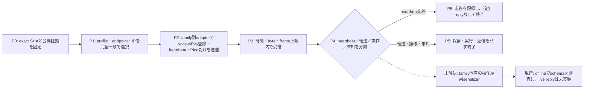
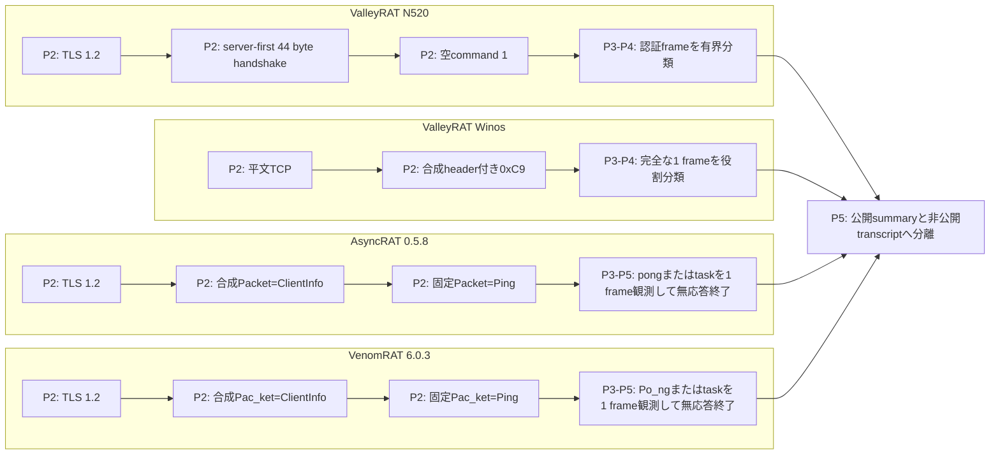
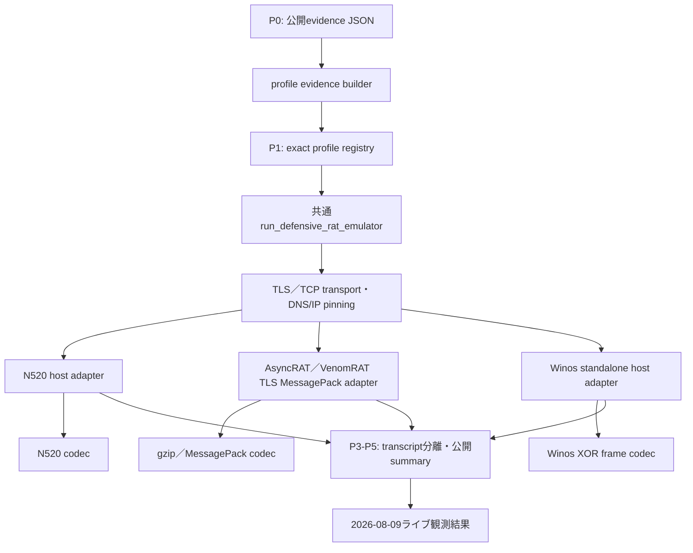

# 防御的RATホストエミュレーター比較（2026-08-09）

## 目的と現在地

ValleyRATのN520／Winos、AsyncRAT 0.5.8、VenomRAT 6.0.3について、静的解析で復元した登録、フレーム、コマンド分類を同じ観点で比較し、実装済みの防御的host emulatorが安全に観測できる範囲を固定する。本成果物はマルウェア本体を実行せず、実端末情報を送らず、受信した操作、ファイル、pluginを実行しない。

2026-08-09に今回実装したhost emulatorでAsyncRAT、ValleyRAT N520、VenomRATの短時間sessionを実施した。AsyncRATはTLS 1.2、合成`ClientInfo`、安全化したPing、`pong`まで成立し、N520はTLS成立前にtimeout、VenomRATは接続拒否だった。Winosのhost emulatorによる直接sessionは実施していない。時刻、frame hash、安全境界、失敗の解釈は[2026-08-09ライブ観測結果](LIVE-OBSERVATIONS.md)へ分離し、本書の静的ベースラインを上書きしない。過去のN520空check-in、Winos限定heartbeat、AsyncRAT／VenomRAT限定Ping probeは今回のsessionとは別の証拠である。

## 公開エビデンス

- 2026-08-09のhost emulator直接session: [LIVE-OBSERVATIONS.md](LIVE-OBSERVATIONS.md)
- 監視連携用の検証済みsidecar: [rat-emulation-evidence.json](rat-emulation-evidence.json)
- AsyncRATの登録・dispatcher証拠: [asyncrat-protocol-evidence.json](asyncrat-protocol-evidence.json)
- VenomRATの登録・dispatcher証拠: [venomrat-protocol-evidence.json](venomrat-protocol-evidence.json)
- N520の過去の限定check-in証拠: [n520-live-summary.json](../../../malware/valleyrat/versions/unknown/cases/d11e793159f0da3c88a9ecebb8e5df88919843a1eeaaf71117377db58224a1ae/n520-live-summary.json)
- Winos対象caseのIOC・限定heartbeat証拠: [iocs.json](../../../malware/valleyrat/versions/unknown/cases/ee0ef34a4402dea54ec8b4e0557de9605a038a4f2b82380f2978296fd60f9791/iocs.json)
- Winos別caseのstage／control役割証拠: [network-evidence.json](../../../malware/valleyrat/versions/unknown/cases/e0e1ae775ef8e530875235f035fb623b217d48fa810537144c872fcf41592648/network-evidence.json)
- AsyncRAT／VenomRATの過去の限定Ping結果: [profiles-evidence.json](../2026-08-04/profiles-evidence.json)

sidecarのraw file SHA-256は`994b787a4c77aa4ba093150f60ec236fcf20913150fab4c9d623639815b329ec`、validator canonical public SHA-256は`c2428b3433004427a0fe4d8d52113f9a69a159de0fb8f83bc8925d0c735d5fd0`である。前者は保存ファイルのbyte列、後者はvalidatorがallowlistで再構成してkey順を正規化した公開JSONのbyte列に対するhashであり、相互に置き換えない。

## 比較結果

| 系統 | 対象検体SHA-256 | 静的に確定した登録・heartbeat | フレーム | 受信コマンドの分類 | 現在のエミュレーター範囲 | 未解決事項 |
|---|---|---|---|---|---|---|
| ValleyRAT N520 | `d11e793159f0da3c88a9ecebb8e5df88919843a1eeaaf71117377db58224a1ae` | server-first handshakeを完全検証後、sequence 1、command 1、空payloadを1回送信する。station IDは送らない | TLS 1.2内で44 byte handshakeを受信する。application frameはsession ID、長さ、sequence、AES-CBC暗号文、HMAC-SHA256、CRC32で構成される | command 16／18はfile・plugin転送として拒否する。command 1／2／3／17をserverから受けた場合は方向不一致、その他は未知として無応答で終了する | handshake検証、空登録1回、認証済みframeの有界受信と役割分類、hash／sizeだけの記録 | command 2の操作結果serializerが未確定。偽結果はoffline fixtureだけで、wire送信は禁止 |
| ValleyRAT Winos | `ee0ef34a4402dea54ec8b4e0557de9605a038a4f2b82380f2978296fd60f9791`（悪性DLL: `292bbcce82d7446fd1106adb3659b824ac321c604ac8073cbadc87b62f6e448a`） | 実端末情報を含まない固定10 byte headerでcommand `0xC9` heartbeatを1回送る。registrationは送らない | 平文TCP。4 byte little-endian全長、10 byte session header、header依存XOR body | `0xC9`、`0xCA`、`0xCB`、`0x04`、`0x05`、`0x06`を既知のheartbeat、登録、stage役割へ分類し、その他は未知操作として拒否する | control endpointだけへheartbeat 1 frame、最大64 byteの完全な1 frameを受信し、command role、size、hashだけを記録する | registration schema、操作結果serializerとも未確定。stage要求、未知command返信、偽結果送信は未実装かつ禁止 |
| AsyncRAT 0.5.8 | `20f21565d7e77f3b3b7247099af91da43dcde0078c173f8e6efc74a6d40b44c3` | exact ILの`KeepAlivePacket`（token `0x06000024`）は`Packet=Ping`の`Message`へ`GetActiveWindowTitle`結果を入れる。エミュレーターは`ClientInfo`後にprivacy-safeな空`Message`の固定Pingを1回送り、`pong`を期待する | TLS 1.2。4 byte little-endian圧縮長、4 byte little-endian展開長、gzip圧縮MessagePack map | `pong`はheartbeat応答、`plugin`／`savePlugin`／`winUpdate`はfile・plugin、その他は未知として分類する | 合成`ClientInfo`、固定Ping request、`pong`またはtask 1 frameの有界観測。受信frameへ追加応答は送らない | 任意操作の分類表と結果serializerが未確定。任意の偽実行結果は送れない |
| VenomRAT 6.0.3 | `6a24ba25482c73d193fcc208d8ae267236b870b9ab30c44cabe2dc8bfb7a1073` | exact ILの`KeepAlivePacket`（token `0x06000056`）は`Pac_ket=Ping`の`Message`へ`GetActiveWindowTitle`結果を入れる。エミュレーターは`ClientInfo`後にprivacy-safeな空`Message`の固定Pingを1回送り、`Po_ng`を期待する | TLS 1.2。4 byte little-endian圧縮長、4 byte little-endian展開長、gzip圧縮MessagePack map | `Po_ng`はheartbeat応答、`plu_gin`／`save_Plugin`／`loadofflinelog`はfile・plugin、`init_reg`／`HVNCStop`／`keylogsetting`／`runningapp`／`filterinfo`は操作として分類する | 合成`ClientInfo`、固定Ping request、`Po_ng`またはtask 1 frameの有界観測。受信frameへ追加応答は送らない | 操作結果serializerが未確定。操作は実行せず、任意の偽実行結果も送れない |

AsyncRATとVenomRATでは証明書SHA-256をprofileへ固定するが、証明書不一致だけで非C2とは判定しない。operatorによる証明書差し替えがあり得るため、不一致は観測属性として残し、フレーム、登録応答、opcodeなど独立したprotocol証拠と組み合わせる。

## 実行フロー

実線は静的に確認し実装済みの処理、破線はserializer確定後にのみ検討する将来処理を表す。`P0`から`P5`のphase IDは後続の図でも共通である。

## 通信フロー

## モジュール関係

Winos adapterは現時点で共通profile registryには登録せず、standaloneかつreview済みcontrol endpoint限定である。registrationと結果serializerを確定し、共通runnerのprofile整合性検証と同等の試験を通すまでは統合しない。

## 安全境界

- live通信にはnetwork許可、live C2 emulation許可、exact profile確認、identity-pinned kill-switchの全てを必須とする。
- DNS解決結果に固定IPが含まれない場合は接続せず、1 profile、1接続、1 sessionに限定する。
- MaxMind DBの24時間基準を接続前に確認し、期限超過時は更新を試行する。providerの最新版自体が期限超過の場合は`latest_available_still_stale`として残し、freshと誤記しない。
- 実ユーザー名、host名、OS実測値、station ID、file一覧、process一覧、credentialは収集も送信もしない。
- AsyncRAT／VenomRATの実検体はactive window titleを`Ping.Message`へ入れるが、エミュレーターは`GetActiveWindowTitle`を呼ばず、固定の空文字へ置換する。
- 受信したfile、plugin、command引数のraw値は公開summaryへ残さず、sizeとSHA-256へ正規化する。file／pluginは保存も実行もしない。
- Winosの固定heartbeatおよびAsyncRAT／VenomRATの固定Ping request以外の操作は送らず、受信したheartbeat応答、task、未知commandには返信しない。結果serializer未確定のfamilyでは成功・失敗を装うwire応答を禁止する。
- 非公開transcriptは暗号化保管し、公開summaryとは複合root hashで対応付ける。認証後のraw application payloadは既定で保持しない。

## AgentTeslaなどを対象外とする理由

AgentTeslaのFTPは、端末側から窃取結果を送るsink型のexfiltration先であり、RAT operatorが端末へ操作commandを配信する対話的なcontrol channelではない。したがって、接続、認証、書き込み権限の限定確認はC2／sink検知として有用でも、host emulatorが待機してcommandを受け取り、偽の実行結果を返す対象にはならない。同じ理由で、一方向のHTTP uploadやSMTP exfiltrationだけが確認されたstealerは本比較から除外する。task取得や双方向sessionが静的・動的証拠で確認できた場合は、別profileとして再評価する。

## 将来の常時稼働に必要な隔離

常時稼働へ移行する場合は、専用VMまたは使い捨てcontainer、非特権service account、exact IP／portだけのegress allowlist、同時接続数1、session leaseと強制終了、再接続backoff、時刻同期、容量上限付き暗号化ログ、監視alertを必須とする。shell、PowerShell、browser、実host filesystem、実credentialへ到達できる機能は持たせない。profileには有効期限とreview担当を設け、C2停止または証拠失効時に自動無効化する。非公開成果物をS3へ退避する場合は、解析対象別のWinZip AES-256 ZIP、password `infected`、SSE、size、SHA-256 metadata検証を完了してからlocal stagingの削除を判断する。
