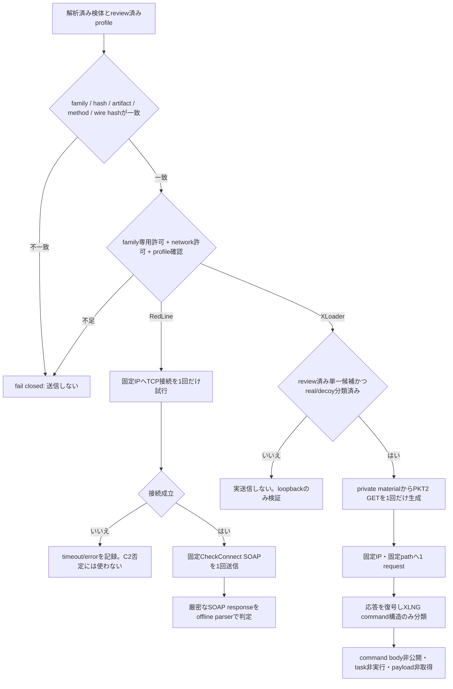

# RedLine / GuLoader・XLoader 能動C2検証（2026-08-09）

## 結論

- **RedLine**: 復元した端末アセンブリと設定を固定したレビュー済みプロファイルから、引数を持たない WCF/SOAP 1.1 `CheckConnect` 要求を再現できるようにした。実エンドポイントへは **1回だけ接続を試行**したが、TCP接続成立前に3秒でタイムアウトした。HTTP/SOAPのapplication dataは送信されておらず、RedLine C2であることも稼働中であることも確認できなかった。この結果は、サーバ停止や非C2を意味しない。
- **GuLoader / XLoader**: 現在検体から、XLoader v8.9系とみられる登録要求、65件の候補レコード、初期16件の選択、bootstrap置換、`PKT2`・`XLNG`・RC4・SHA-1を組み合わせたHTTP GET生成までを静的に復元した。要求生成は現在検体の逆コンパイル結果、応答復号とcommand構造はZscalerが公開したXLoader v8.7一次調査を根拠としており、根拠の版と強度を分離して扱う。
- **検証範囲**: RedLineとXLoaderの双方でloopbackエミュレータを用いたプロトコル判定を検証した。XLoaderについては、現在の65件の候補でreal C2とdecoyを事前に区別できないため、実エンドポイントへの送信は行っていない。16件または65件への順次送信は第三者サイトへのsprayになるため禁止した。

## 対象と根拠

### RedLine

レビュー済みプロファイル `redline-3f3ac0a3-checkconnect-v1` は、SHA-256 `3f3ac0a31d28e9bbc85df54dd4300c9b15bf255b192fab15d94505ea1e528b02` の解析結果に固定している。端末アセンブリのMVID、CIL意味ハッシュ、設定artifact、endpoint JSON pointer、HTTP method/path、SOAPAction、要求長と要求SHA-256の一致をすべて確認しない限り送信しない。

実確認の対象は `hxxp://192[.]144[.]32[.]84:16383/` であり、2026-08-09T05:01:23.3078138Z に1回だけTCP接続を試行した。3秒の接続タイムアウトとなり、request countは0、application data sentはfalseである。ここで `network_contacted: true` は「対象IPへの接続を試行した」という監査上の意味であり、「TCP接続成立」や「SOAP交換成立」を意味しない。

`CheckConnectResult=true` または `false` を返すloopbackエミュレータでは、SOAP envelope、namespace、operation、応答構造の一致を検証した。`false` でもRedLineのプロトコル一致候補にはなるが、運用上のチェックイン受理とは扱わない。

### GuLoader / XLoader

GuLoader後段から復元した現在検体では、内側登録値の `8.9:` 表現からXLoader v8.9系と推定している。確定版番号ではないため、結果は `assessed_v8_9` として扱う。

静的解析で確認した主な処理は次のとおりである。

1. `0x6b50` 周辺で65件の候補レコードを初期化し、そのうち16件を初期接続候補として選ぶ。
2. 初期16件のうち1レコードは、通常builder値から隔離されたbootstrap値へ置換される。現在検体の実効bootstrap候補は `www[.]plantaonewsms[.]com[.]br/ximu/` である。この値は公開IOCとして記録するが、real C2であることを確認した値ではない。
3. `0xe5e0` 周辺で `XLNG` から始まる合成登録情報をRC4処理し、Base64化して `PKT2:` を付与する。
4. `0x61d0` 周辺で、URLのSHA-1とURL seedから導出した鍵を用いて追加のRC4層とBase64層を構成し、HTTP GET要求を生成する。
5. 同関数で応答bufferの保存までは確認したが、現在検体内でそのconsumerへのxrefは確定できていない。

このため、**要求生成**は現在検体の静的解析を直接根拠とする。一方、**応答処理**は[ZscalerによるXLoader v8.7一次調査](https://www.zscaler.com/blogs/security-research/latest-xloader-obfuscation-methods-and-network-protocol)および同調査が示す参照検体を根拠とする。同資料では、URL SHA-1とURL seed派生鍵による二段階復号、`XLNG` command構造、command ID 1〜9が説明されている。現在のv8.9想定検体でも同じ契約であることはloopbackで検証したが、実C2応答による同一性確認はまだ行っていない。

## 実行・判定フロー

## XLoader実送信を見送った理由

- 65件の候補にはdecoyが含まれ、初期16件にもreal C2であるとの事前保証がない。
- bootstrap置換の静的確認だけでは、置換先が現在も悪性か、侵害済み第三者サイトか、すでに無関係なサイトへ戻ったかを区別できない。
- real/decoyを判定するためだけに複数候補へ登録要求を送ると、第三者インフラへのsprayになる。
- したがって、現在は「review済み単一候補」「候補クラス専用許可」「private materialとprofileのhash固定」が揃うまで、実ネットワーク送信をfail closedとする。

## 安全境界

- 既定はnetwork無効。汎用 `--allow-network` だけでは送信できない。
- RedLineはreview済み `CheckConnect` 専用許可とprofile IDの明示確認が必要。
- XLoaderはreview済みregistration専用許可に加え、bootstrap候補を扱う場合は候補専用許可が必要。
- endpoint、pinned IP、port、path、method、request hash/length、private material hashを固定する。
- 1実行1 request、短いtimeout、response上限、redirect無効、fallback無効。
- task poll、task実行、command bodyの公開、payload download、追加コマンド送信は行わない。
- 秘密鍵・復号鍵、raw request/response、被害端末由来値は結果へ保存しない。
- `network_contacted`、`tcp_connected`、`application_data_sent`、`protocol_confirmed`を別々に記録し、接続試行をプロトコル確認と混同しない。

## 関連実装

- RedLine能動probe: [`active_probe.py`](../../../../analysis-framework/malware/redlinestealer/active_probe.py)
- RedLine loopback emulator: [`checkconnect_emulator.py`](../../../../analysis-framework/malware/redlinestealer/checkconnect_emulator.py)
- RedLine review済みprofile: [`active_profiles.json`](../../../../analysis-framework/malware/redlinestealer/active_profiles.json)
- XLoader能動probe: [`xloader_active_probe.py`](../../../../analysis-framework/malware/formbook_loader/xloader_active_probe.py)
- XLoader wire protocol処理: [`xloader_c2.py`](../../../../analysis-framework/malware/formbook_loader/xloader_c2.py)
- XLoader loopback emulator: [`xloader_emulator.py`](../../../../analysis-framework/malware/formbook_loader/xloader_emulator.py)
- 共通profile registry: [`c2_protocol_probe_profiles.json`](../../../../analysis-framework/common/c2_protocol_probe_profiles.json)
- 共通monitor: [`monitor_recent_c2.py`](../../../../analysis-framework/common/monitor_recent_c2.py)
- RedLine Nmap補助検出: [`redline-c2.nse`](../../../../analysis-framework/nmap/scripts/redline-c2.nse)
- XLoader Nmap transport-only補助検出: [`xloader-c2.nse`](../../../../analysis-framework/nmap/scripts/xloader-c2.nse)
- 機械可読な観測値: [`observations.json`](observations.json)

## 判定上の注意

RedLineの今回の実確認は「C2未確認」であり「停止確認」ではない。XLoaderは、loopback上で要求・応答のプロトコル処理を検証できた一方、現在検体に対する実C2の能動確認は未実施である。したがって、どちらも今回の外部観測だけを根拠にIOCを無効化してはならない。
