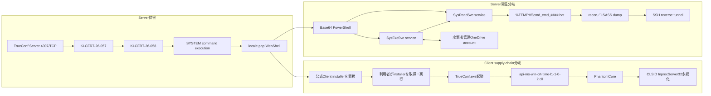

# 感染チェーンと観測境界

## 2つの後段分岐

## 段階別の根拠

| 段階 | ロジック | 根拠 | 本調査の評価 |
|---|---|---|---|
| 初期侵入 | 4307/TCP上のTrueConf serviceへ認証なしで接続 | Kaspersky一次情報 | 4307/TCPをC2に分類しない |
| 権限獲得 | 1つ目の脆弱性で隔離環境のscript実行、2つ目で制限回避しSYSTEM command | Kaspersky一次情報 | exploit codeは未取得・未再現 |
| WebShell | `public\js\locale.php`を悪性PHPへ置換 | 一次情報とMD5、VT既存情報 | SHA-256を復元。本文は未取得 |
| installer改ざん | TrueConf Clientの公式配布物をPhantomCore入りinstallerへ置換 | 一次情報、VT、Triage exact hash | supply-chain型の利用者側感染 |
| PhantomCore永続化 | 固定CLSIDの`InprocServer32`へ悪性DLL pathを登録 | 一次情報とTriage挙動 | exact key／pathをSigma化 |
| PhantomGraph導入 | Base64 PowerShellで`SysExcSvc.dll`と`SysReadSvc.dll`をservice化 | 一次情報 | module hashの一部のみprovider確認 |
| command channel | SysExcSvcが攻撃者管理OneDriveからcommandを受け、結果を返す | 一次情報 | 一般OneDrive endpointはIOCにしない |
| command実行 | SysReadSvcがbatch fileを介して`cmd.exe`実行 | 一次情報 | 固有temp filenameをhunt軸にする |
| tunnel | SSH reverse tunnelで攻撃者endpointへ接続 | 一次情報 | `194.87.239.71`と`194.87.93.153`を明示的なSSH endpointとして扱う |

## Triageで補強できたClient分岐

公開Triageのexact hash一致では、Inno Setupの一時実行、既存TrueConf processの停止、Windows Firewall ruleの削除・再追加、インストール後の`TrueConf.exe`起動、固定CLSIDによるCOM hijackが観測されています。これはClient分岐の「改ざんinstaller実行→PhantomCore永続化」を補強します。

一方、Triageで見えた`c.pki.goog`はMicrosoft CryptoAPIの証明書失効確認、Cloudflare共有IPは基盤文脈です。PhantomCore C2として扱いません。

## root検体の静的解析で確定した境界

exact-hashの改ざんinstallerを取得し、実行せずに解析しました。rootは32-bit x86 native PEで、`Inno Setup Setup Data (6.5.2)`を含みます。PE stubの末尾`0x11ba00`から192,156,242 bytesのoverlayが続き、全体の99.3991%を占めます。全域の埋め込みPE走査と7-Zip container probeでは子fileを復元できませんでした。

したがって、静的解析で実線にできるのは「root PE→Inno Setup 6.5.2 stub→opaque overlay」までです。「overlay→PhantomCore DLL→COM hijack」は一次情報と公開sandboxで強く補強されますが、rootからの独立抽出ではないため点線相当です。詳細は[改ざんinstallerの静的解析](STATIC-ANALYSIS.md)を参照してください。

## 未観測区間

- exploit request／responseのpacketとTrueConf固有request body
- `locale.php`の関数ロジックと認証方式
- PhantomCoreの設定復号、C2 protocol、check-in field
- PhantomGraphが使うOneDrive tenant／account／item固有識別子
- SSH command lineの完全な引数列と鍵material

root installerは取得済みですが、上記区間を担う子payload、memory、PCAPは未取得です。まずInno Setup 6.5.2 overlayに対応する非実行extractorで子fileを復元し、失敗する場合に公開sandboxのmemory dump／dropped artifactで不足処理を補う必要があります。
