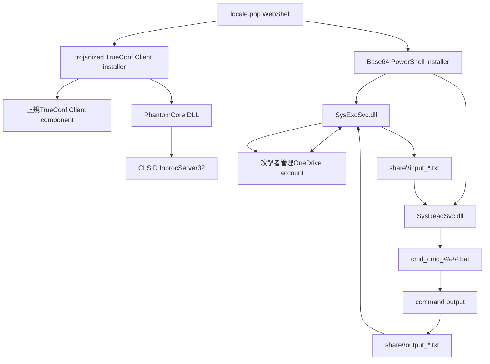
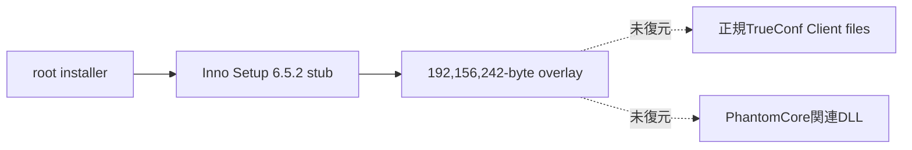

# モジュール関係と責務

## 関係図

## 責務

| module／artifact | 入力 | 出力 | 機能 |
|---|---|---|---|
| `locale.php` | HTTP requestと攻撃者command | OS command結果、配置したfile | 侵害Server上の操作点。recon、installer置換、後段uploadに使用 |
| 改ざんTrueConf Client installer | 利用者による実行 | 正規ClientとPhantomCore関連file | rootはInno Setup 6.5.2 x86 stub＋99.3991%のopaque overlay。子fileの静的復元は未完了 |
| PhantomCore DLL | Client process／COM load | backdoor session、永続化状態 | Head MareのWindows backdoorとして報告。固定CLSIDでloadを維持 |
| `SysExcSvc.dll` | OneDrive上のcommand／local input | `SysReadSvc`向けtask、OneDriveへの結果 | command channelと結果の往復を担当 |
| `SysReadSvc.dll` | `SysExcSvc`から渡されたcommand | batch実行結果 | local command executionを担当 |
| `graphi-refresh.dat` | module内部状態と推定されるdata | module状態 | 一次情報で関連fileとして報告。厳密なformatは未解析 |
| `share\input_*.txt` | 取得したtask | `SysReadSvc` | 2 module間の受け渡しartifact |
| `share\output_*.txt` | command stdout／stderr | `SysExcSvc` | 実行結果の受け渡しartifact |

## 静的に見えたcontainer境界

rootのimportはprocess、file、registry、memory、thread制御を含みますが、Inno Setup自身の機能と重なるため、個別importをPhantomCoreロジックへ帰属しません。子DLL取得後に初めて、module境界、設定復号、C2処理を関数単位で確定できます。

## コード類似性の扱い

KasperskyはPhantomGraphの一部codeがPhantomCoreと重なると評価し、Head Mare toolkitとの関連根拠にしています。本調査ではroot installer stubは取得しましたが、PhantomCore／PhantomGraphの関数本体を取得・逆コンパイルしていないため、独自の関数fingerprint、basic block類似度、暗号routineの一致は未確認です。次回比較では次を保存対象とします。

- OneDrive API request構築、token処理、task pollの関数境界
- `input_*.txt`／`output_*.txt`のserialize／parseロジック
- service entrypoint（`#1`／`ServiceMain`）からworker threadまでのcall graph
- PhantomCore／PhantomGraph共通関数のnormalized opcode hash
- command ID、buffer layout、error code、sleep／jitterの入出力仕様
