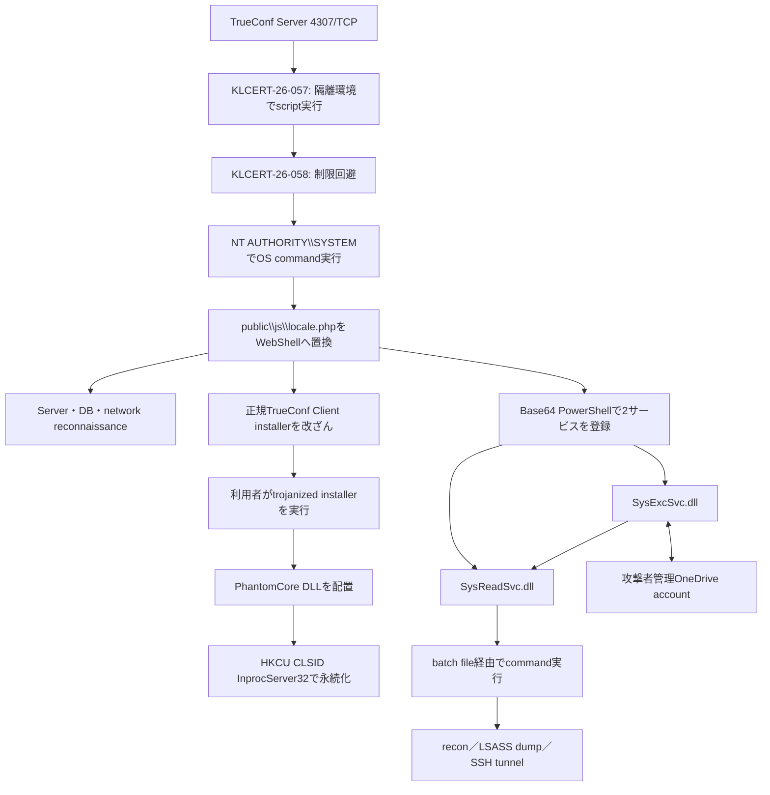

# Head MareによるTrueConf Server侵害（2026年7月観測）

## 結論

Kasperskyが2026年8月7日に公表した調査では、Head Mareは2026年7月、TrueConf Serverの脆弱性`KLCERT-26-057`と`KLCERT-26-058`を連鎖させ、認証なしの入口から`NT AUTHORITY\SYSTEM`権限のOSコマンド実行へ到達しました。その後、`locale.php` WebShell、PhantomCoreを含む改ざんインストーラ、二分割バックドアPhantomGraph、SSH reverse tunnelを使った活動が報告されています。

本成果物で独自に確認したのは、公開IOC 20個のMD5に対するMalwareBazaar／VirusTotal照合、6個のSHA-256復元、改ざんTrueConf Clientインストーラと一致する公開Triage実行結果、およびexact-hash root検体の非実行静的解析です。root検体は認証付き暗号化archiveとして取得し、メモリ内で復号してSHA-256とPE構造を確認しました。実行と外部通信は行っておらず、検体はrepository外の暗号化保管先で整合性検証済みです。PhantomCoreの子DLLはrootから復元できていないため、コード同一性とactor帰属は引き続き一次情報の評価を継承します。

## campaign評価

| 項目 | 評価 |
|---|---|
| 攻撃者 | Head Mare（Kasperskyの帰属。独立帰属ではない） |
| 対象 | インターネット公開TrueConf Serverと、そこから正規Clientインストーラを取得する利用者 |
| 観測時期 | 2026年7月 |
| 侵入経路 | TrueConf Serverの`4307/TCP`へ接続し、2脆弱性を連鎖 |
| 後段 | `locale.php` WebShell、PhantomCore、PhantomGraph、SSH tunnel |
| campaign確度 | 中～高。一次情報の一貫した侵害チェーン、hash、ファイルパス、永続化、公開sandboxの一致を根拠とする |
| 開発主体 | PhantomCore／PhantomGraphはHead Mareのtoolkitとして報告されるが、個々の開発者は未特定 |
| コモディティ性 | 公開販売型コモディティマルウェアと確認できない。標的活動向けtoolkitとして扱う |

## 重要な境界

- `4307/TCP`はTrueConf Serverの初期侵入面であり、PhantomCore／PhantomGraphのC2ポートではありません。
- PhantomGraphは攻撃者管理のMicrosoft OneDriveアカウントをcommand channelとして使うと報告されています。しかし、アカウントIDやitem固有URLは公開IOCから復元できていません。`login.microsoftonline.com`などの一般的なMicrosoft endpointをIOCにしません。
- 公開sandboxに現れた`162.159.36.2`はCloudflareの共有基盤文脈、`c.pki.goog`は証明書失効確認文脈であり、campaign IOCから除外します。
- IOC一覧の15個のhostは一次情報に記載された攻撃者インフラです。DNS解決、TCP open、TLS handshakeだけでC2 protocol稼働を確認したとは扱いません。

## 実行・感染チェーン

より細かな観測／推定の区別は[感染チェーン](INFECTION-CHAIN.md)、module間の責務は[モジュール関係](MODULES.md)を参照してください。

## 脆弱版と修正版

一次情報では、TrueConf Server 5.3系の5.3.9未満、5.4系の5.4.9未満、5.5系の5.5.5未満、およびそれ以前の版が影響対象として記載されています。修正版は2026年6月18日に公開されたと報告されています。資産管理では「4307/TCPが開いているか」だけでなく、実際のServer versionと修正適用日を確認してください。

## 証拠レベル

| 証拠 | 内容 | 評価 |
|---|---|---|
| 一次情報 | exploit chain、WebShell、PhantomCore、PhantomGraph、SSH tunnel、20 MD5、15 host | campaign構成の主根拠 |
| VirusTotal既存情報 | 20 MD5中6件を確認しSHA-256へ展開 | ファイル同一性と既存解析の補助。provider labelだけでfamily確定しない |
| MalwareBazaar | 20 MD5を照合し全件未収録 | 未収録であり不存在を意味しない |
| 公開Triage | 改ざんinstallerのexact hash一致、COM hijack、実行processを確認 | 動的挙動の強い補助証拠 |
| 非実行静的解析 | root installerを解析 | Inno Setup 6.5.2、x86 stub、99.3991%のopaque overlayを独立確認。子DLL、設定、C2 protocolは未復元 |

## 関連成果物

- [感染チェーン](INFECTION-CHAIN.md)
- [モジュール関係](MODULES.md)
- [provider照合](PROVIDER-EVIDENCE.md)
- [公開Triage証拠](TRIAGE.md)
- [改ざんinstallerの静的解析](STATIC-ANALYSIS.md)
- [IOC一覧](IOC-LIST.md)
- [Sigmaルール](rules/)
- [2026-08-10 daily解析](../../daily-news-malware/2026-08-10/README.md)

## 出典

- [Kaspersky SecurelistのHead Mare／TrueConf調査](https://securelist.ru/tr/head-mare-targets-trueconf-server-with-phantomcore/116557/)
- [Triage公開解析 260722-z86htahl6y](https://tria.ge/260722-z86htahl6y)
