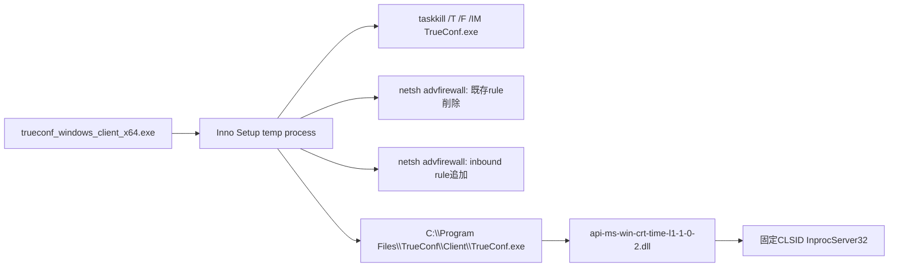

# 公開Triage証拠

## 一致した解析

- Triage解析ID: [`260722-z86htahl6y`](https://tria.ge/260722-z86htahl6y)
- submitted: `2026-07-22T21:24:18Z`
- completed: `2026-07-22T21:30:05Z`
- filename: `trueconf_windows_client_x64.exe`
- MD5: `748c9f8cb1065000616204935f96207f`
- SHA-256: `e66bbb6c651b5ab839434b8e62f502169f35894e28dbe9f3275911582eccd250`
- サイズ: 193,317,970 bytes
- format: Windows x86 Inno Setup、署名状態`unsigned_pe`

一次情報の改ざんTrueConf Client installerとMD5が完全一致し、VirusTotalから復元したSHA-256とも一致します。本調査では公開metadata／既存behaviorに加え、exact-hashのroot検体を認証付き暗号化archiveとして取得しました。rootはメモリ内で復号して非実行静的解析し、repository外の暗号化保管先で整合性検証済みです。memory、PCAP、dropped artifactは取得していません。

## 観測された実行

Firewall操作は`TrueConf.exe`と`ExecutorServer.exe`に対するrule更新として観測されています。正規installerでも一部のprocess停止・firewall操作は起こり得るため、これら単独ではなく、exact hash、署名状態、悪性DLL path、固定CLSIDを相関します。

## 永続化証拠

- key: `HKCU\Software\Classes\CLSID\{0340F119-A598-4ed9-B0AC-6F6A12D3E755}\InprocServer32`
- value: `C:\Program Files\TrueConf\Client\api-ms-win-crt-time-l1-1-0-2.dll`

この組合せは一次情報のPhantomCore永続化記述と一致します。

## networkの除外

- `c.pki.goog`: Microsoft CryptoAPIによる証明書失効確認の文脈。C2ではない。
- `162.159.36.2`: Cloudflare共有基盤の文脈。shared edgeのためcampaign IOCにしない。
- 一般的なMicrosoft／sandbox基盤endpoint: 悪性processへの固有帰属がないためIOCにしない。

Triage結果だけからPhantomCore固有C2 protocolやcheck-in成功を確認していません。

rootの独立静的解析ではInno Setup 6.5.2と巨大overlayまでは確認できましたが、悪性DLL、設定、C2 endpointは復元できませんでした。公開sandboxの動的証拠と独立静的結果の境界は[静的解析](STATIC-ANALYSIS.md)に記録しています。
