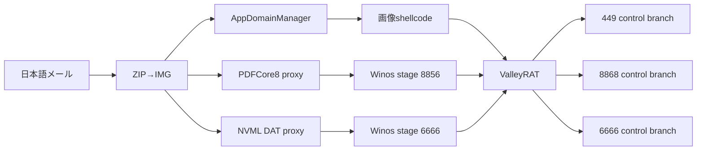

# ValleyRAT日本語マルスパム比較（2026-08-04）

## 結論

同日に観測された3件はいずれもZIP→IMGとValleyRAT後段へ到達しますが、入口ローダー、永続化、C2 branchは異なります。「同日・日本語・ValleyRAT」だけを根拠に単一actor／単一campaignとは断定しません。

| ケース | 入口 | 後段取得 | 永続化・権限 | 通信 | 相関評価 |
|---|---|---|---|---|---|
| e-Tax | `.config`＋AppDomainManager＋画像pixel | memoryからx64 Stage 2 | 今回の外層では未確認 | `204.194.50.231:449` | 新しい入口branch |
| 8月請求書 | ConvertToPDF＋PDFCore8保護proxy | 8856のWinos stage | ms-settings UAC bypass＋CMD watchdog | `ljdnxz.cc:8856/8868` | 2026-08-03 branch Aと高い類似 |
| 楽楽明細 | 正規host＋NVML DLL＋DAT | 6666のWinos module | RuntimeBroker RunOnce | `192.252.180.45:6666` | NVML小型APC branch |

## コード・構造類似性

- 3件とも外層の同一hashは共有しません。
- PDFCore8ケースのmodule ID `e84687e90263ec3cc28b55e05d09dc5b`は、2026-08-03の`ljdnxz.cc` branch Aと一致します。ここは同じ後段運用clusterの強い証拠です。
- NVMLケースは既知の正規host hashを再利用しますが、悪性DLLは`nvml.dat`＋`QueueUserAPC`の小型ローダーです。正規host hashだけを悪性IOCにはしません。
- AppDomainManagerケースはCLR設定、pixel赤チャネル、Base64、callback APIの組合せが相関軸です。ファイル名やURL変更に耐える構造ルールを追加しました。

## 比較フロー

## 自動相関ルール

次回は次の独立証拠を2つ以上組み合わせます。

- 配布容器: ZIP→IMG
- host／DLL関係: AppDomain設定、PDFCore export、NVML export
- 復号ロジック: pixel/Base64、巨大高entropy section、DAT＋APC
- 永続化: ms-settings＋ComputerDefaults、RuntimeBroker RunOnce
- protocol: Winos frame、module ID、stage/control port配置
- infrastructure: domain／IP再利用

同一メール言語、正規host hash、ファミリーlabelだけではcampaignを確定しません。