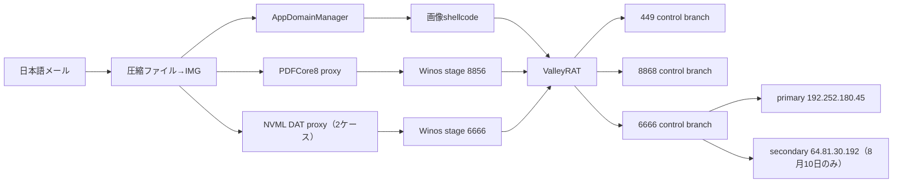

# ValleyRAT日本語マルスパム比較（2026-08-04）

## 結論

2026-08-04から2026-08-10に観測された4件はいずれも圧縮ファイル→IMGとValleyRAT後段へ到達しますが、入口ローダー、永続化、C2 branchは異なります。campaign IDの末尾`20260804`は初回観測日を表し、観測終了日ではありません。「近接時期・日本語・ValleyRAT」だけを根拠に単一actor／単一campaignとは断定しません。

| ケース | 入口 | 後段取得 | 永続化・権限 | 通信 | 相関評価 |
|---|---|---|---|---|---|
| e-Tax | `.config`＋AppDomainManager＋画像pixel | memoryからx64 Stage 2 | 今回の外層では未確認 | `204.194.50.231:449` | 新しい入口branch |
| 8月請求書 | ConvertToPDF＋PDFCore8保護proxy | 8856のWinos stage | ms-settings UAC bypass＋CMD watchdog | `ljdnxz.cc:8856/8868` | 2026-08-03 branch Aと高い類似 |
| 楽楽明細 | 正規host＋NVML DLL＋DAT | 6666のWinos module | RuntimeBroker RunOnce | `192.252.180.45:6666` | NVML小型APC branch |
| 電子インボイス（8月10日） | 同一正規host＋NVML DLL＋DAT | x64 downloader、主制御module、遠隔画面pluginを復元 | RuntimeBroker RunOnce | `192.252.180.45:6666`＋`64.81.30.192:6666` | 8月4日NVML小型APC branchと高い類似 |

## コード・構造類似性

- 4件とも外層の同一hashは共有しません。
- PDFCore8ケースのmodule ID `e84687e90263ec3cc28b55e05d09dc5b`は、2026-08-03の`ljdnxz.cc` branch Aと一致します。ここは同じ後段運用clusterの強い証拠です。
- 8月4日と8月10日のNVMLケースは、正規host SHA-256 `93694473622f770d539263ae211dde4715264b0f23c858ba69796adca76cae35`、悪性DLL imphash `38635fb6aa9fc723412530df72c15ac2`、9つのNVML export、DAT復号、`QueueUserAPC`実行、RuntimeBroker RunOnce、primary C2 `192.252.180.45:6666`が一致します。正規host hashはcontext-onlyであり、単体を悪性IOCにはしません。
- 8月10日ケースではsecondary C2 `64.81.30.192:6666`が追加されました。x64 downloader、主制御module `登录模块.dll`、遠隔画面plugin `红队高速.dll_bin`の3後段を復元し、中間Winos bootstrapも確認しました。両C2は最小heartbeatへのWinos `0xC9`応答を返し、TCP port openだけでなくprotocolレベルで確認済みです。
- AppDomainManagerケースはCLR設定、pixel赤チャネル、Base64、callback APIの組合せが相関軸です。ファイル名やURL変更に耐える構造ルールを追加しました。

## 比較フロー

## NVML APC branchの時系列相関

8月4日の`93df03d7db7df23317ee87ebe3946ddff4364e45de5217b0c90c7925b22c8f04`と、8月10日の`6469edd613ceb62dd8e14a75628a6b75fa443ef4311da2b45e805bc7d18afe25`を`nvml_apc_branch`へまとめます。同一host、同一imphash、9つのNVML export、DAT/APC処理、RunOnce、primary C2の一致からコード・運用の近縁性は高いと評価します。一方、これらの一致だけでは運用者を一意に特定できないため、actor帰属は未確定です。

## 自動相関ルール

次回は次の独立証拠を2つ以上組み合わせます。

- 配布容器: ZIP→IMG
- host／DLL関係: AppDomain設定、PDFCore export、NVML export
- 復号ロジック: pixel/Base64、巨大高entropy section、DAT＋APC
- 永続化: ms-settings＋ComputerDefaults、RuntimeBroker RunOnce
- protocol: Winos frame、module ID、stage/control port配置
- infrastructure: domain／IP再利用

同一メール言語、正規host hash、ファミリーlabelだけではcampaignを確定しません。