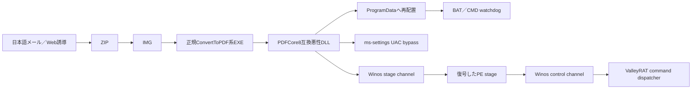

# ValleyRAT PDFCore8日本語メールcluster（2026-08-03）

## 結論

3件は、同一の配布・サイドロード・UAC bypass・Winos通信設計を共有します。ケース1と3は復元stage PEとmodule IDが完全一致するbranch A、ケース2は別stage PEと別module IDを使うbranch Bです。同一ビルダーまたは同一運用clusterである可能性は中〜高ですが、同一人物・組織による運用を確定する証拠ではありません。

| 観点 | ケース1 | ケース2 | ケース3 |
|---|---|---|---|
| 誘導 | 組織通知 | 7月請求書 | 税務罰則通知 |
| 親SHA-256 | `e0e1ae77...` | `12a22fec...` | `61a602b2...` |
| 悪性DLL | `bc65acbf...` | `ecc1cec9...` | `bbb509be...` |
| ProgramData名 | SID様 | GUID＋version様 | SID様 |
| watchdog | CMD、60秒 | BAT、30秒 | CMD、60秒 |
| stage port | 8856 | 7811 | 6698 |
| control port | 8868 | 7800 | 6685 |
| module ID | `e84687e9...` | `72cce659...` | `e84687e9...` |
| 復元stage | `48e02989...` | `c1dc1f2f...` | `48e02989...` |
| 2026-08-04 live | heartbeat確認 | 両port timeout | heartbeat確認 |

## 共通感染チェーン

## コード・protocol相関

- Winos frameは全件で`uint32le total + 10-byte header + header由来XOR payload`です。
- stage channelはclient `0x04/0x05`、server `0x04/0x01`です。`0x01`の大きな応答からPEを復元しました。
- control channelは登録`0x06`、確認`0xca/0xcb`、heartbeat`0xc9`を共有します。
- branch Aのケース1・3はserver stage payload hash、module ID、復元PE SHA-256が一致します。
- branch Bは同じ機能設計ですが、module ID、PE SHA-256、section境界、main worker RVAが異なります。
- ケース1・3の外層DLLはCRT／DllMain骨格が一致する一方、protected blockの大きさが18,944 byte異なります。包装を再生成しながら同じ後段を配る構造と整合します。

## 相関の扱い

高確度ラベルには、配布骨格、UAC bypass、protocol、後段SHA-256／module IDの複数軸を使います。domainやIPだけの一致、RightPDFの正規hostだけの一致、`SilverFox`というcommunity tagだけではcampaign・actorを確定しません。

## 検知・自動解析

- `winos_pcap.py`: TCP streamをsequence再構成し、frame role・command・hashを抽出します。
- `winos_stage_recovery.py`: server `0x01` stageを復号し、PE境界を検証してリポジトリ外へ復元します。
- `winos_protocol.py`: reviewed host/portだけへ、stageはconnect-only、controlはheartbeat 1 frameで確認します。
- Sigma: `valleyrat_pdfcore8_programdata_host_variants.yml`
- `extractors/valleyrat/extractor.py`: 復元stageの構造markerを識別し、RFC1918既定slotをC2として誤公開しません。

## 制約

- 検体をローカル実行していません。
- C2 live確認でstage要求、victim metadata、operation commandは送っていません。
- actor帰属は未解決です。clusterは技術相関であり、人・組織の帰属ではありません。
