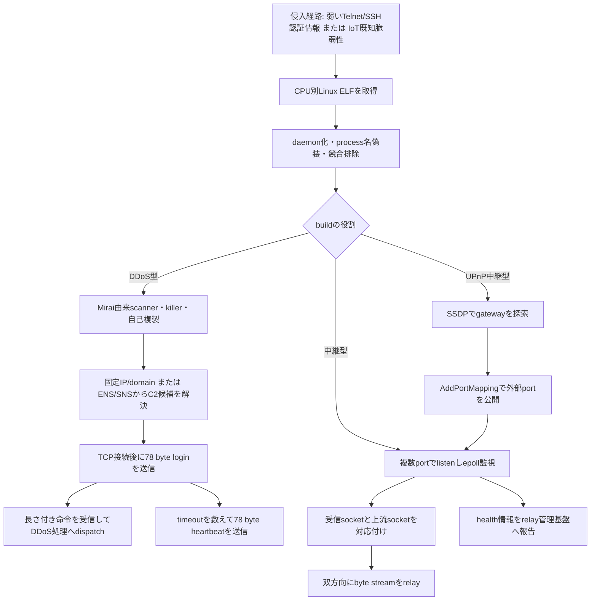

# 公開情報・挙動・検知分析 — 2026-07-29

## 調査結論

本日分では、DysphoriaのSHA-1 IOC 12件のうち9件をMalwareBazaarから取得し、SHA-256へ正規化して非実行静的解析した。9件はすべてLinux ELFで、ARM little-endian 7件、MIPS big-endian 2件だった。新しい専用ハンドラをワンショット解析へ登録した結果、従来は3件だけがMiraiとして構造分類されていた入力を、9件すべてDysphoriaとして自動選択・抽出できた。

Dysphoriaは単一機能ではなく、DDoSボットとTCP中継プロキシを同じ運用基盤で扱うボットネットである。代表6検体のGhidra解析では、DDoS型の固定長C2プロトコル、中継型のepoll双方向転送、UPnP型の外部ポート公開を別の実装として確認した。運営者の実名・国籍は不明で、OSINT上はDDoS代行とプロキシ提供を収益化するコモディティ寄りの犯罪サービスと評価される。

## Dysphoria

### 開発者・利用者・コモディティ性

| 観点 | 評価 |
|---|---|
| 開発者 | 不明。JackSkid/FBot/Mirai由来コードを継続改変する運営主体が存在するとみられるが、個人・組織名は確定できない。 |
| 利用アクター | 不明。感染拡大とサービス販売を行うボットネット運営者、購入者であるDDoS利用者・プロキシ利用者を分けて考える必要がある。 |
| コモディティ性 | 高い。DDoS能力をストレステストサービスとして販売し、中継ノードも第三者へ提供する運用で、特定の国家・標的専用ツールではない。 |
| 過去の利用 | 2026年3月以降にJackSkid/FBot系から独自RC4、ENS/SNS解決、relay-only、UPnP対応へ変化したと報告されている。弱いTelnet/SSH資格情報とIoT製品の既知脆弱性を感染拡大へ利用する。 |

一次情報は[XLabのDysphoria分析](https://blog.xlab.qianxin.com/dysphoria/)である。約20万台という規模、最大4 Tbpsという宣伝値、ENS/SNS、155ポートの説明はOSINT報告に基づき、本リポジトリが独自に観測・実測した値ではない。

### 感染・実行・モジュール関係

### 9検体の役割

| SHA-256 | CPU | 専用抽出器の役割 | 主な独自証拠 |
|---|---|---|---|
| `0269c367...ead5b` | MIPS-BE | DDoS bot | `hail china mainland`、Mirai配布、固定長C2関数 |
| `17c5f13d...c4b5` | ARM-LE | DDoS bot | Mirai scanner/killer/配布、C2 loop |
| `1c5080b6...536b` | ARM-LE | DDoS bot | 独自RC4鍵、78 byte login/heartbeat |
| `336db0ba...07d3` | ARM-LE | DDoS bot | 独自RC4鍵、operator phrase、固定長C2 |
| `461a9036...452f` | ARM-LE | DDoS bot | 独自RC4鍵 |
| `8df9fee6...82f8` | ARM-LE | UPnP中継 | `trees4sale.net`、SSDP、AddPortMapping、epoll relay |
| `b55bd5db...150e` | MIPS-BE | 役割未確定 | OSINT対応hash。高entropyで固有文字列の追加復号が必要 |
| `d0310e98...3449` | ARM-LE | 中継proxy | `saintpetersburgresident.ru`、多port listen、epoll relay |
| `d6b7bb3b...1a97` | ARM-LE | DDoS bot | Mirai配布・killer構造 |

完全hashと一次解析値は[STATIC-ANALYSIS.md](STATIC-ANALYSIS.md)および`sample-static-summary.json`に記録した。関数単位の根拠は[GHIDRA-FUNCTIONS.md](GHIDRA-FUNCTIONS.md)を参照する。

### C2・中継インフラ

静的に確認したdomainは、`c2.saintpetersburgresident.ru`、`peer.saintpetersburgresident.ru`、`login.trees4sale.net`、`www.trees4sale.net`である。前2件は中継制御・peer配布、後2件はUPnP中継・health reportingに対応する。OSINT IOCには通常DNSでは解決できないENS/SNS名も含まれるため、NXDOMAINだけで停止と判定しない。

限定到達性確認では、Dysphoria関連の4 IPに対するTCP 80/443はいずれもtimeoutまたはrefusedだった。`i.peer4you.net`と`login.trees4sale.net`は`185.104.63.79`へ解決され80/tcpがopen、`www.trees4sale.net`は別IPで80/tcpがopenだった。これは一般的なport到達性であり、C2稼働やDysphoria制御権を証明しない。実C2へ78バイトのbot登録packetや命令要求は送信していない。

### 検知

- 検体: 独自16バイトRC4鍵、operator phrase、中継domain、UPnP文字列を組み合わせるYARAを追加した。
- 通信: 78バイト固定長とlogin/heartbeatの固有prefixを同時に要求するSnort/Suricata ruleを追加した。
- 自動解析: ELF、hash、固有markerをDysphoriaハンドラへ関連付け、役割、architecture、静的domain、通信仕様をJSON化する。
- 検証: socketを作らないエミュレータで合成packetを作り、offline通信検出器が長さ・prefixの欠落時にfail-closedとなることをテストする。

詳細は[DETECTION.md](DETECTION.md)を参照する。

## 日本語マルスパム／PureLogs

本日の記事は、正規`WinWord.exe`と`AppVIsvSubsystems32.dll`のDLLサイドローディングからPython環境を展開し、`instructions.pdf`に埋めたPythonコードを実行する事例である。3件のSHA-256はMalwareBazaarで未確認、VirusTotalの既存情報では確認できた。配布URLは調査時点でGoogleへの302を返し、redirectを追わなかったためZIPは再取得していない。

同一検体の専用解析はdraft PR [#30](https://github.com/proshiba/AI-security-analysis/pull/30)で完了している。感染チェーン、Triage memory、復号済みPureLogs設定、C2検知はそちらを正本とし、本日分で重複生成しない。

## Arista VeloCloud CVE-2026-16812

3件のIPは、[Arista公式アドバイザリ](https://www.arista.com/en/support/advisories-notices/security-advisory/24364-security-advisory-0144)が認証不要OS command injectionの悪用元として掲載したsource IPである。マルウェアC2ではないため、Dysphoria/PureLogsのC2候補へ混ぜない。検知はVCO Webアクセスログ、不審なcommand実行、設定・資格情報・証明書・鍵の利用履歴と合わせる必要がある。

## Hato Tsusin関連インフラ

Hato Tsusin、Glocom、Future Tech GroupのdomainとPDF URLは、北朝鮮関連の調達・フロント企業クラスターを調べるための組織・インフラIOCである。検体hashやマルウェア配布根拠はなく、C2やmalware familyへ分類しない。DNS・WHOIS・証明書・document metadata・取引履歴を結ぶインテリジェンス課題として保持する。

## 安全性と未完了事項

- 検体は実行していない。Ghidraによる代表関数の逆コンパイルと静的抽出だけを行った。
- Dysphoria 9件中6件で代表関数を確認した。残る3件、とくに高entropyのMIPS検体は追加復号が必要。
- 暗号化C2の最終endpointは全検体で復元できていない。domainを確認した中継型でもportを推測していない。
- 公開成果物に検体本体、復元payload、逆コンパイル全文、資格情報を含めていない。