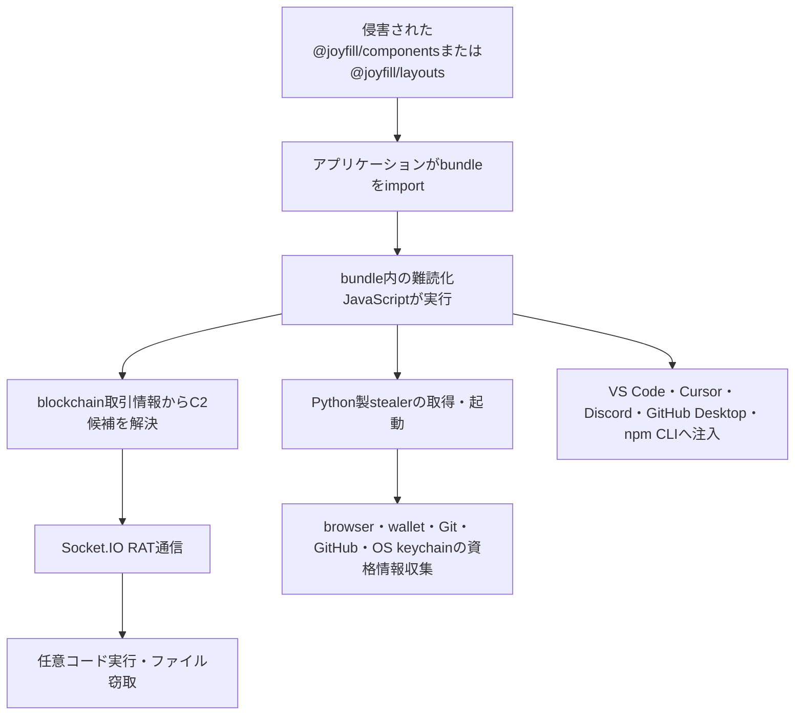
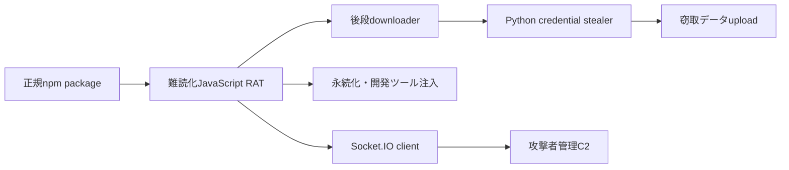
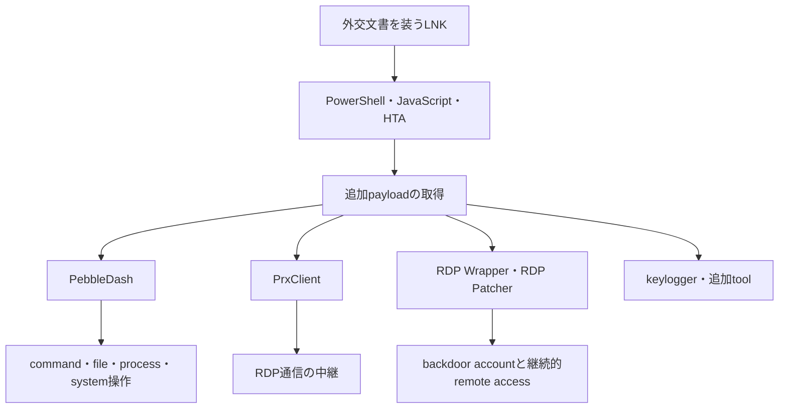
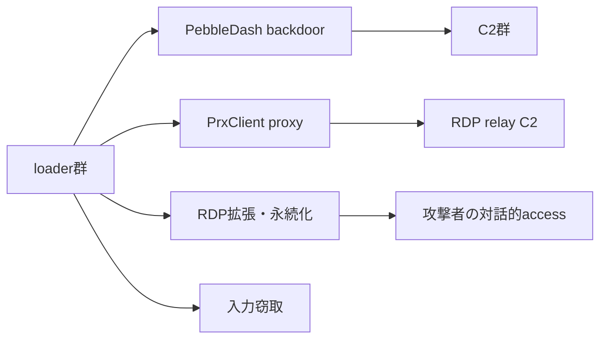

# 公開情報・挙動・検知分析 — 2026-07-30

## 調査結果

本日の34 IOCは、性質の異なる3つの活動へ分離して評価した。

| 活動 | 主な侵入経路 | 最終目的 | 検体確認 |
|---|---|---|---|
| 日本語マルスパム／AgentTesla | 請求書を装うRAR内JScript | 認証情報・入力・画面の窃取とFTP送信 | MalwareBazaarでJScript 1件を取得。既存の多層静的解析と一致 |
| Joyfill npm supply-chain | 侵害された正規npmパッケージのimport | RAT、認証情報窃取、開発環境への注入 | JavaScript 1件をVirusTotalで確認。Python後段は未確認 |
| Kimsuky／PebbleDash・PrxClient | 外交関係者を装うLNK、PowerShell、JavaScript、HTA | 情報窃取、遠隔操作、RDP中継・永続化 | MD5 3件をVirusTotalで確認、2件は未確認。検体本体は未取得 |

MalwareBazaarには10ハッシュ中1件、VirusTotalにはMalwareBazaarで未確認だった9ハッシュ中6件が存在した。両方で確認できなかった3件は、存在しないと断定せず未確認として保持する。VirusTotalへの新規submitは行っていない。

## 日本語マルスパム／AgentTesla

### 静的解析で確認したロジック

取得したJScript `3f091457...89333` は、既に本リポジトリで多層復元済みの同一検体だった。汎用トリアージだけでは`function_analysis_required`となるが、専用解析では次の流れを確認している。

1. JScriptが巨大文字列を反転し、区切り除去とBase64復号を行う。
2. LuaJIT実行環境をPIF偽装ファイル、LuaローダーをTTF偽装ファイルとして復元する。
3. Luaローダーが25行の置換表、反転、Base64、PolyRot、XORを順に解除する。
4. guard page、CRC、ページ保護変更を伴うDonutローダーで.NET payloadをメモリ実行する。
5. AgentTeslaがブラウザー・メールクライアント資格情報、キー入力、clipboard、画面、端末識別情報を収集する。
6. HTML reportとJPEGをstagingし、FTP `STOR`で送信した後に一時ファイルを削除する。

実行・感染・モジュールの3図、16個の特徴的処理、545 managed methodの集計、Ghidra MCPで確認したLuaJIT側関数は[同一検体の全体ロジック](../../../malware/agenttesla/versions/2026-07-js-luajit-donut-ftp/cases/3f09145757282e6a59cd69319ac3b9da3265022a1d4f92a1646f8ddbaad89333/OVERALL-LOGIC.md)と[特徴的関数](../../../malware/agenttesla/versions/2026-07-js-luajit-donut-ftp/cases/3f09145757282e6a59cd69319ac3b9da3265022a1d4f92a1646f8ddbaad89333/STATIC-LOGIC.md)を正本とする。

### 比較上の特徴

JScript、LuaJIT、置換表付きLua、Donut、AgentTeslaという5層構成が重要である。単独のBase64、.NET、FTP一致ではなく、次の複合条件を類似性の軸にする。

- `|0`から`|O`のheaderと25行×10文字の置換表
- 反転、Base64、PolyRot、8バイトXORの順序
- Donut関連、AMSI、ETW、WinINet痕跡の実行前後変異
- 資格情報・入力・画面をHTML/JPEGへ集約しFTP `STOR`する処理

## Joyfill npmサプライチェーン

### OSINTから得られた感染・実行フロー

本活動のコード本体は取得できていないため、次図は[StepSecurityの公開分析](https://www.stepsecurity.io/blog/joyfill-npm-supply-chain-compromise)をtech-memoが収集した内容に基づく。関数単位の独自復元結果ではない。

`--ignore-scripts`だけでは防げない点が通常の悪性npm packageと異なる。package lifecycle scriptではなく、配布bundleをimportした時点で悪性コードが動くと報告されているためである。

### IOCと到達性

4 IPのうち`166.88.134[.]62`と`198.105.127[.]210`は調査時に80/tcp・443/tcpへ接続できたが、TLS handshakeは成立しなかった。`23.27.13[.]43`と`23.27.202[.]27`は80/tcp・443/tcpがtimeoutした。

HTTP path、Socket.IO handshake、追加payload要求は送っていない。TCP openはホスト到達性だけを示し、Joyfill C2の稼働、同一サービス、窃取データ受信を確認したものではない。

## Kimsuky／PebbleDash・PrxClientの脅威分析

### OSINTから得られた感染・モジュール関係

[AhnLab ASECの公開記事](https://asec.ahnlab.com/jp/94655/)では、外交関係者を装うLNKからPowerShell、JavaScript、HTAを経由し、複数の遠隔操作・中継モジュールを導入する活動として報告されている。

MD5 `029db651...e420`、`07010ef3...b35f`、`0a5f8bb2...d8ad`はVirusTotalで確認できた。前2件はWin32 EXE、後者はLNKであり、`07010ef3...b35f`にはKimsuky関連のpopular threat nameが付いている。ただしproviderラベル単独ではファミリまたはactor帰属を確定しない。

### インフラのまとまり

`fsfhsfgsfsnxcvbasfsgsrhsf234fsd.mywebcommunity[.]org`と`p563q1.sportsontheweb[.]net`は同じ`185.176.43[.]112`へ解決し、`mpo4wj.scienceontheweb[.]net`は`185.176.43[.]108`へ解決した。3ホストのTLS証明書SHA-256は同一だった。これは共有hostingまたは同一証明書運用の手掛かりだが、Kimsuky専用インフラや同一運用者の確定根拠にはしない。

`edcvbgtrf.medianewsonline[.]com`と`103.212.120[.]253`でも80/tcp・443/tcpおよびTLS handshakeを確認した。一方、PrxClient候補の`153.75.233[.]17`と`173.214.170[.]58`は80/tcp・443/tcpがtimeoutし、`ng.mofagov[.]com`はDNS解決できなかった。いずれもC2 protocolは送信していない。

## 3活動の切り分け

| 比較軸 | AgentTesla | Joyfill | Kimsuky |
|---|---|---|---|
| delivery | 請求書RAR・JScript | 侵害されたnpm package | 外交文書LNK |
| loader | LuaJIT・Lua・Donut | bundle内JavaScript、後段Python | PowerShell・JavaScript・HTA |
| 主機能 | 情報窃取 | RAT・情報窃取・開発tool注入 | backdoor・RDP中継・永続化 |
| 通信 | FTP | Socket.IO・HTTP upload | HTTP系C2・relay候補 |
| actor評価 | コモディティ利用者は未特定 | package侵害者は未特定 | 公開情報ではKimsuky |

delivery、loader、通信方式、目的がそれぞれ異なり、IOCの時間的近接だけで同一campaignへ統合しない。今回確認したIP、domain、証明書にも3活動を横断する共有根拠はない。

## 安全性と未完了事項

- 検体は実行していない。
- 外部インフラにはDNS、TCP 80/443、TLS handshake以外のC2要求を送っていない。
- AgentTesla以外のpayload本体は取得できず、JoyfillとKimsukyの関数単位ロジックは未確認である。
- 公開IOCの時点と本調査の疎通時点は異なる。現在の到達性だけで過去の攻撃成立・停止を判断しない。
- providerの検知名、OSINTのactor帰属、独自静的解析を別々の証拠として保持する。
