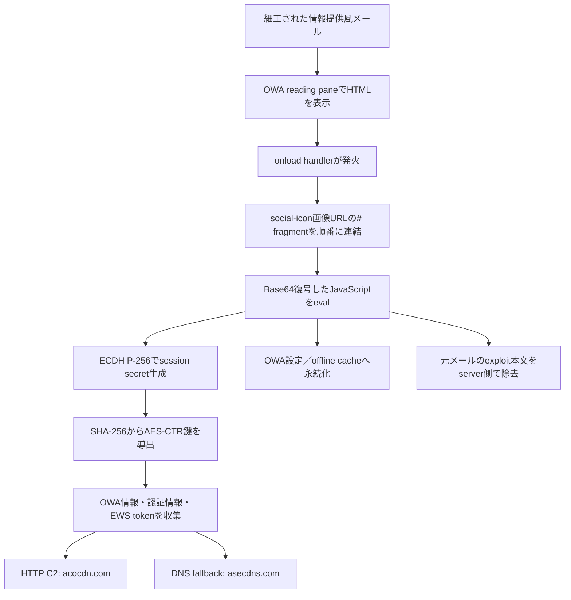
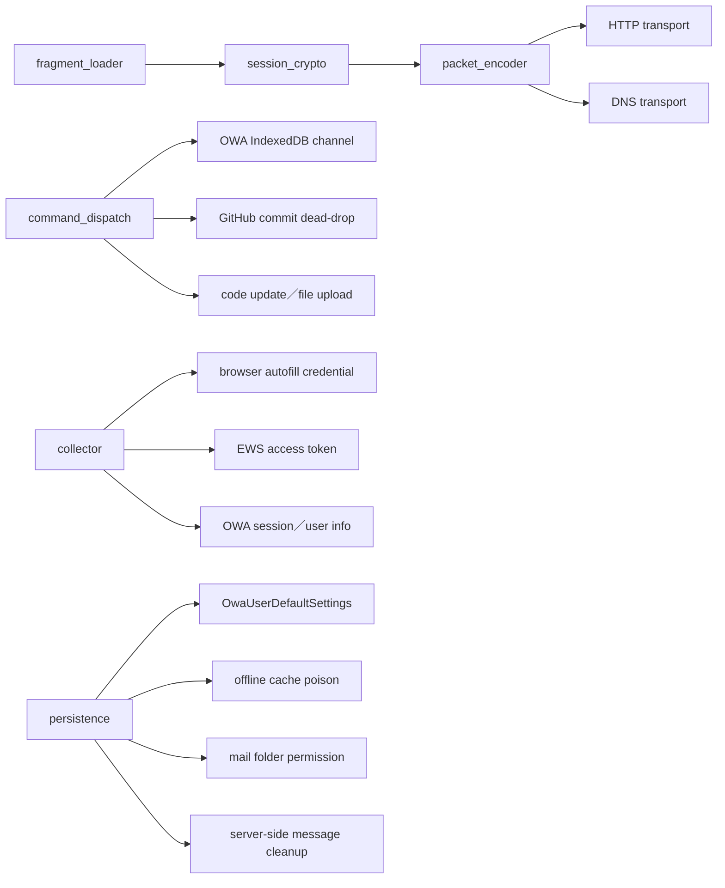
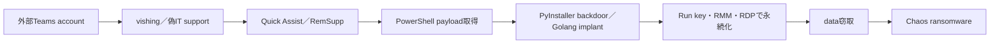

# 2026-07-31 脅威分析

## 調査範囲

tech-memoの2026年7月31日付記事・IOC、公開一次情報、取得できた検体の静的解析結果を統合した。検体は実行しておらず、外部インフラ確認はDNS、TLS、通常HTTP応答などの到達性確認に限定した。

## 主要な結論

| 活動／マルウェア | 開発・運用主体 | コモディティ性 | 今回確認した用途 |
|---|---|---|---|
| OWAReaper | 開発者は未公表。ロシア国家支援型のTA488（Laundry Bear／Void Blizzard）が運用 | 非コモディティの標的型implant | OWA内での長期諜報、認証情報・EWS token窃取、mail folder共有 |
| Chaos | RaaS運営はBlackSuit／Royal系の元構成員との関連が報告される。STAC4749が展開 | RaaSとしてコモディティ性あり | Teams vishing後の暗号化・恐喝 |
| Flying Eagle／Night Dragon | SQLRCE0、Yx科技など中国語圏の犯罪サービス提供者が改変・運用支援 | 流出codeとpanelを基盤とするcrimeware ecosystem | 中国利用者を狙うAndroid認証情報・資金窃取 |
| Sliver（Operation Talked） | Sliver自体はBishop Foxのopen-source red-team framework。今回の利用者はロシア系と評価 | dual-use／広く転用可能 | ウクライナ防衛・航空宇宙への諜報と対話型操作 |
| typo-crypto等のnpm改ざん | AmazonはSAPPHIRE SLEET／BlueNoroff系の北朝鮮関連groupと中程度の確度で評価 | 個別campaign向けだが、公開package trustを大量配布経路に悪用 | 開発環境侵害、認証情報窃取、後段payload配布 |
| ClickFix＋Node.js RAT | UNC5342／Contagious Interview系の北朝鮮関連運用と評価 | custom chain。ClickFix手法自体は多数actorが利用 | macOS利用者・開発者のwallet、browser、credential窃取 |
| ValleyRAT（SilverFox） | implant開発者は断定不能。今回の運用はSilverFoxと中～高確度で評価 | 複数campaignで観測されるremote access malware | 日本の製造業を狙う遠隔操作、BYOVDによる防御回避 |

## OWAReaperの分析

### 検体と帰属

- SHA-256: `6897b649f29e54d8910459963bbf94ed5c7a4fe66a56bc5962540b226b8e48c4`
- 形式: HTMLメール本文、68,829 byte
- exploit: CVE-2026-42897（Exchange OWAのHTML sanitization不備）
- 利用アクター: TA488（Laundry Bear／Void Blizzard）
- 標的: 米国・欧州の政府、通信、金融、宿泊、航空宇宙
- 開発者: 公開情報からは断定不能。ただしZimReaperとのcode・behavior overlapが報告され、TA488のtooling進化と整合する。
- コモディティ性: 販売・共有された汎用crimewareを示す根拠はなく、OWA専用の標的型browser implantと評価する。

### 静的解析で復元した実行チェーン

HTML本文は正常な「Language Preservation Brief」を装い、payload断片を`contenteditable`配下の`social-icon`画像URLのfragmentへ分散していた。初期loaderは対象画像を列挙し、`#`以降を連結してから`atob`と`eval`へ渡す。URL fragmentはHTTP requestに送信されないため、mail gatewayやproxyだけを見た検知を回避しやすい。

### 暗号・packet・C2 logic

1. 埋め込みP-256公開鍵を使ったECDHでtarget固有の共有秘密を生成する。
2. 共有秘密をSHA-256へ入力し、AES-CTR用session鍵を導出する。
3. packetへtarget ID、message ID、chunk index、chunk countを格納する。
4. 転送前に単一byte XOR maskを付与し、外側の形式を変化させる。
5. 主経路は`acocdn.com/assets/v1_<Base64URL packet>`への画像GETまたはblob POSTである。
6. 主経路が使えない場合、符号化chunkをDNS labelへ分割し、`asecdns.com`配下へ送信する。

`checkip.amazonaws.com`と`1.1.1.1/cdn-cgi/trace`はpublic IP確認用であり、OWAReaper固有C2とは扱わない。WordPress、Weserv、Slackの画像proxyもrelay候補としてcodeに現れるが、共有サービス全体をIOCとして遮断してはならない。

### module関係

### 特徴的な処理単位

| 処理単位 | 復元したlogic |
|---|---|
| `fragment_loader` | 画像URL fragmentを連結してBase64復号し、JavaScriptを実行 |
| `establish_session_crypto` | ECDH P-256、SHA-256、AES-CTRによるtarget別session確立 |
| `encode_transport_packet` | target・message・chunk情報とXOR maskをpacket化 |
| `exfiltrate_http` | `acocdn.com`へのGET／POSTによるC2・exfiltration |
| `exfiltrate_dns` | `asecdns.com`配下のDNS queryをfallback transportとして使用 |
| `persist_owa_settings` | `PageDataPayload.OwaUserDefaultSettings`へ暗号化本体とwrapperを保存 |
| `clean_server_message` | `UpdateItem`で`vexih` marker以降を元メールから除去 |
| `scan_owa_offline_db` | `owa_offline_db`の`UniqueBody`から暗号化更新を探索 |
| `poll_github_commands` | target IDを使うGitHub commit検索をdead-dropとして利用 |
| `gather_autocomplete_password` | 画面外inputでbrowser autofill credentialを収集 |
| `gather_ews_token` | `GetApp`／`GetClientAccessToken`でEWS tokenを取得 |
| `gather_info` | `/owa/sessiondata.ashx`からemail、UPN、session情報を収集 |
| `share_folders` | `GetFolder`／`UpdateFolder`でDefault permissionをOwnerへ変更 |
| `poison_db_cache` | offline cacheへ`ms-outlook-email-sandbox` iframe loaderを埋め込み |
| `command_dispatch` | 暗号化`code`、`domn`、`cmnd` recordを復号し、更新codeを実行 |

### 永続化の意味

`OwaFrontendSyncState`など正規のOWA同期設定へ暗号化payloadと復号wrapperを保存するため、browser再起動後もOWAの同期復元処理から再実行される。さらにoffline DB/cacheへのiframe注入、mail folder permission変更、EWS token窃取を組み合わせる。端末を再image化してもserver側設定やmailbox permissionが残る場合があるため、endpoint cleanupだけでは不十分である。

### 公開情報との照合

ProofpointはOWAReaperをZimReaperの進化形とし、CVE-2026-42897を利用する「half-click」chain、OWA reading pane内での実行、二つのC2 channelと二つのexfiltration protocol、browser再起動・credential rotation・端末再image化を越える永続性を報告している。本検体から復元したfragment loader、OWA同期設定、EWS token、folder permission、HTTP／DNS transportはこの報告と一致した。

- 参考資料: [Proofpoint: Cleaning Out Inboxes: TA488 Comes for Outlook with Another Half-Click Exploit](https://www.proofpoint.com/us/blog/threat-insight/cleaning-out-inboxes-ta488-comes-outlook-another-half-click-exploit)

## STAC4749とChaos ransomware

STAC4749はTeams chat／callでIT supportを装い、Quick AssistまたはRemSuppでremote sessionを取得する。PowerShellからloader・PyInstaller backdoor・Golang implantを導入し、HKCU Run key、Startup shortcut、RDP、AnyDesk、DWAgentでaccessを冗長化する。少なくとも3件でChaos ransomwareに至り、ある事例では最初の接触から17時間未満で暗号化された。

STAC4749は金銭目的と高い確度で評価されるが、具体的な国家・既知actorへの帰属根拠は不足する。Chaos RaaSとBlackSuit／Royal系の人的関連は報告されるものの、STAC4749とMuddyWaterの関連は確認されていない。

- 参考資料: [Sophos: Chaos in Teams vishing](https://www.sophos.com/en-us/blog/chaos-in-teams-vishing)

## Flying Eagle／Night Dragonの分析

Flying EagleはAndroid APK builder、偽login UI、C2 device panelを統合した犯罪基盤である。政府、金融、SNS、成人向けserviceを装い、Alipay、WeChat、bank credential等を窃取する。流出source codeと既定証明書、管理panelから約170 serverが関連付けられた。SQLRCE0とYx科技による改変・運用支援、後継Night Dragonの提供が報告されており、単一actor専用implantよりcrimeware ecosystemとして扱うのが妥当である。

- 参考資料: [Hunt.io: Flying Eagle Android RAT](https://hunt.io/blog/flying-eagle-android-rat-170-servers-night-dragon)

## Operation Talkedの分析

Operation Talkedは、公開状態のoperator serverから8,436 file、target list、credential、Sliver session log等が発見されたことで全chainが復元された。主要serverではSliver mTLS／HTTP、WireGuard、3x-ui、open directoryが同居していた。SOCRadarはkeyboard、source language、timezone、Yandex Cloud、targeting、tool profileの複数根拠からロシア系actorと85%の確度で評価する。

Sliverは合法的なopen-source red-team frameworkであり、binary名やSliver利用だけで帰属してはならない。mTLS certificate、listener port、webshell／tunnel、mass exploitation、Git repositoryの大量取得をcampaign単位で相関する。

- 参考資料: [SOCRadar: Operation Talked](https://socradar.io/blog/operation-talked-russia-ukraine-defense-industry/)

## 北朝鮮関連の二つのchain

### npmサプライチェーン

Amazonは`typo-crypto`、`debug`、`chalk`、`axios`への侵害を、SAPPHIRE SLEET／BlueNoroff系の北朝鮮関連groupに中程度の確度で結び付けた。`typo-crypto`は特定入力をtriggerとしてC2からWindows・macOS・Linux向け後段payloadを取得する。package名だけでなく、lockfile、install時script、外部resource、CI token・npm token・cloud credentialの利用履歴を確認する必要がある。

- [AWS Security Blog](https://aws.amazon.com/jp/blogs/security/amazon-identifies-north-korean-hacker-group-behind-open-source-supply-chain-attacks/)

### ClickFix＋EtherHidingの感染チェーン

偽macOS update画面がcommandをclipboardへ配置し、利用者にTerminalで実行させる。Node.js RATはEthereum smart contractを設定dead-dropとしてC2を更新し、約5分間隔で通信する。157種のwallet、browser情報、悪意あるChrome extensionが対象である。UNC5342／Contagious InterviewとのTTPと資金flowの一致が報告される。

- 参考資料: [AllSecure: ClickFix, EtherHiding, and the DPRK Wallet Trail](https://www.allsecure.io/blog/clickfix-etherhiding-dprk-wallet/)

## SilverFoxによるValleyRAT配布

日本の製造業を狙うinvoice lureから、QQ／Tencent Cloud、正規`ConvertToPDF.exe`または`PDFDirect.exe`、悪意ある`PDFCORE8.dll`へ進む。DLLは`BootRepair.sys`、`EnPortv.sys`、`wsftprm.sys`を内包し、BYOVDでsecurity processを停止する。NTDLL unhook、dynamic API resolution、suspended `svchost.exe`へのthread-context hijack、registry payload、scheduled task、二重のrecovery mechanismを経てValleyRAT（Winos 4.0）を展開する。

この活動はValleyRATだけでなく、`FaCai2024` marker、BYOVD、DLL sideload host、registry path、cloud delivery、Japan targetingを組み合わせてSilverFox campaignへ関連付けるべきである。

- 参考資料: [Cato Networks: SilverFox Evolves](https://www.catonetworks.com/blog/cato-ctrl-silverfox-evolves/)

## 制約

- OWAReaperのJavaScriptは静的にBase64層を復元して確認した。browserやOWA上で実行していない。
- live infrastructureの通常応答は到達性の補助情報であり、C2 protocol成功やactor支配を意味しない。
- 正規cloud、GitHub、画像proxy、DNS resolverは共有基盤であり、単独IOCとしての遮断は避ける。
- actor帰属は各一次情報の評価を明示し、検体の機能一致だけで確度を引き上げていない。
