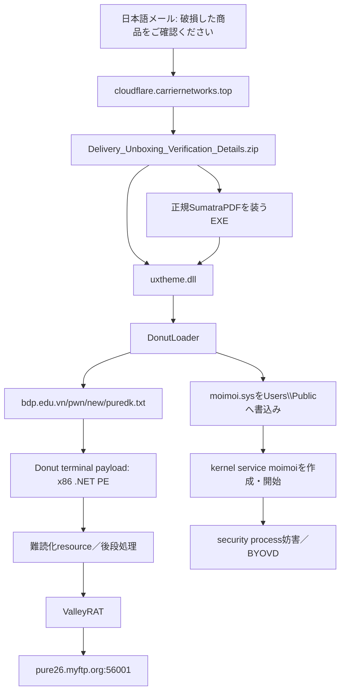
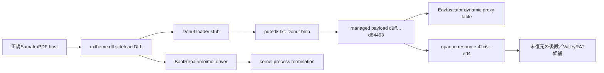
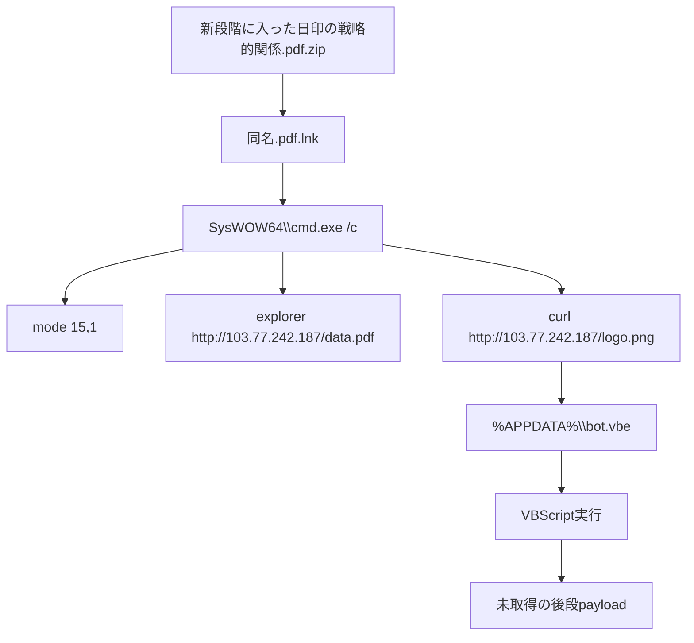

# 2026-08-01 脅威分析

## 調査範囲

tech-memoの2026年8月1日付記事・IOC、MalwareBazaarとVirusTotalの既存情報、取得できた検体の非実行静的解析、および2026年8月1日時点の限定的なインフラ観測を統合した。C2候補へマルウェア固有protocolやcheck-inは送信していない。配布URLの確認は、リダイレクトを拒否した上限付きGETだけを使用した。

## 主要な結論

| 活動／マルウェア | 開発・運用主体 | コモディティ性 | 今回の評価 |
|---|---|---|---|
| ValleyRAT／DonutLoader | ValleyRATの開発者は公開情報だけでは断定不能。運用はSilverFox系campaignとの重なりが強いが、本件単独で帰属を確定しない | ValleyRATは複数campaignで流通するRAT。Donutは公開loader技術 | 日本語配送通知を装い、SumatraPDFのDLL sideload、Donut、BYOVD、ValleyRATへ進む多段chain |
| LNK downloader | 不明 | LNK、`cmd.exe`、`curl`、VBScriptを組み合わせた再利用可能な手法 | 日印関係のPDFを装い、decoy表示と`bot.vbe`取得・実行を一つのcommand lineで行う |
| XCSSET v40 | 既知actor名は未確定 | campaign固有のmacOS malware | Xcode project／GitHubを供給網として悪用し、17 module、Chrome CDP、Telegram置換、認証情報・暗号資産窃取を実行 |
| BlueShell亜種 | IIJはBlackTech等のAPTによる侵入後利用を報告。BlueShell自体は公開Go backdoor | 公開codeを改変可能なdual-use／commodity寄りのbackdoor | Linux上で一時展開後に削除し、kernel workerを装い、proxy経由TLS C2、shell、file転送、SOCKS5を提供 |
| OctLurk／SilkLurk | Kasperskyは同一の中国語話者による運用を中程度の確度で評価。既知groupへは未帰属 | 標的特化型で非コモディティ | 中央アジアの政府・外交等を狙い、端末固有復号、memory内plugin、credential・文書窃取、PlugX展開を実施 |
| Operation Double Barrel | 国家支援型活動とGunra affiliateの関係は未確定 | Struggle／Brandoorは限定的、GunraはRaaS | 韓国の水飲み場と金融security software脆弱性を共通初期accessとして、諜報とransomwareの技術的接点を示す |

## 日本語マルスパムからValleyRATへ至るchain

### 実行・感染チェーン

### 取得と静的解析

| 対象 | SHA-256 | 独自静的解析 |
|---|---|---|
| `moimoi.sys` | `5ab36c116767eaae53a466fbc2dae7cfd608ed77721f65e83312037fbd57c946` | x64 kernel driver、30,320 byte。`IoCreateDevice`、`IoCreateSymbolicLink`、`PsLookupProcessByProcessId`、`ObOpenObjectByPointer`、`ZwTerminateProcess`、registry APIをimport |
| `puredk.txt` | `554ea9c12cd430c91bede296f437477629b2b26d89cdbe80784f44686696272c` | 458,827 byte、entropy 7.9882。legacy Donut instanceを静的復号し、427,520 byteのx86 .NET PEを回収 |
| Donut terminal payload | `d9ff4f9cc0bb688d652216174651ecf5c9e5a47aa5f84178b3e96ca9a5d84493` | CLR v4、2,126 method中1,409 method bodyを静的parse。Eazfuscator系dynamic proxy表279 recordを復元。高fan-out switchを持つ25 methodを確認 |
| opaque resource | `42c6799acc7490b3282940ea4de0ec076fa0bfba16fc678578e306910b602ed4` | 85,310 byte、entropy 7.9976。追加の暗号化resourceで、現時点ではsample固有鍵を復元できず終端payloadは未確定 |
| 正規SumatraPDF | `719f689b34f47be8ca105ce8484948474dafde0e106bab599e4a89326070c3d0` | x64 PE、20,292,984 byte。`UxTheme.dll`をimportするため、同一directoryの悪性`uxtheme.dll`を読み込ませるhostとして悪用可能 |

`moimoi.sys`はIOC CSV上でDonutLoaderと記載されるが、静的構造はuser-mode loaderではなくkernel driverである。PDB／文字列には`bootrepair.sys`が残り、`LAVService`、`LenovoDRS`、`LenovoPcManagerService`のservice registry pathを含む。process object取得と`ZwTerminateProcess`の組み合わせから、security製品processをkernel側で停止するBYOVD componentと評価する。importだけで個々の停止対象成立までは断定せず、上記service文字列と報告済みchainを併せて判断した。

### モジュール関係

Donut module metadataはruntime `v4.0.30319`、domain `R9F6TFR7`、API library `ole32`、`oleaut32`、`wininet`、`mscoree`、`shell32`を示す。managed payloadはcontrol-flow flatteningの疑いがあり、25個の高fan-out switchと、最大815 targetのdispatcher候補を含む。dynamic proxy表は復元できたが、85,310 byte resourceの復号鍵dataflowは未完了である。今後はresource参照元、static constructor、proxy復元後のcall graphを優先する。

### 配布元とC2の2026-08-01観測

- `https://bdp.edu.vn/pwn/new/puredk.txt`は取得に成功し、上記Donut blobと一致した。
- `https://bdp.edu.vn/pwn/new/pdf.exe?inline=false`は取得に成功し、記事記載の正規SumatraPDF hashと一致した。
- `103.138.88.87`はTCP/80・443とTLS handshakeに応答した。これはhost到達性であり、C2 protocol成功を意味しない。
- `151.241.154.227`／`pure26.myftp.org`は本調査のHTTP/HTTPS観測では応答を確認できなかった。ValleyRAT固有port 56001へのcheck-inは送信していない。

## LNKからVBScriptへ進むフィッシングchain

このchainは、decoy PDF表示と後段取得を同じ`cmd.exe`で並行して行う。`logo.png`という拡張子を取得元で使いながら、保存名を`bot.vbe`に変更して直接実行する点が最も強い検知特徴である。2026年8月1日の再確認では`103.77.242.187:80`が接続を拒否し、`data.pdf`と`logo.png`はいずれも取得できなかった。したがってVBScript以降のpayload familyとC2は未確定である。

## XCSSET v40の脅威評価

XCSSET v40はXcode projectのbuild phaseやGitHub上のprojectを感染媒体とし、17種類のmoduleをmemory内で動かす。Chrome DevTools ProtocolによるJavaScript／shell command実行、Telegramのトロイ化版への置換、browser・wallet・clipboard情報の窃取、XProtect更新とApple telemetryの妨害が報告されている。本日のIOCには多数の`.ru`／`.in` domainとCDP helper配布pathが含まれる。

限定観測では、XCSSETを含む全活動を重複排除した149 host中123 hostがDNS解決し、TCP/80は28、TCP/443は24、TLSは18 hostで成功した。共有hostingやsinkhole、再割当てを含み得るため、domain到達性のみで現在のC2稼働や同一actor支配を確定しない。XCSSETはdomain群だけでなく、Xcode build script、CDP helper path、共通証明書／SSH鍵、module behaviorを相関する。

- 参考資料: [Unit 42: Xcode’s Silent Assassin Returns – A Deep Dive into XCSSET v40](https://unit42.paloaltonetworks.com/xcsset-v40-malware-analysis/)

## BlueShell亜種

BlueShellはGoで実装された公開backdoorで、remote shell、file upload/download、SOCKS5 proxy、TLS C2を持つ。IIJが分析した亜種はLinux向けで、dropperが一時ファイルへ本体を配置し、実行後に削除する。kernel worker風process名、組織proxy経由通信、証明書Common Name検証を組み合わせるため、単純なhashだけでなく`/tmp`での短命ELF、process nameと実体pathの不一致、proxy経由の未知TLS certificateを追う必要がある。

- 参考資料: [IIJ Security Diary: APTグループが使用するBlueShell亜種の分析](https://sect.iij.ad.jp/blog/2026/07/blueshell-variant-deployed-by-apt-group/)

## OctLurk／SilkLurkの脅威評価

両backdoorは端末固有情報を復号条件へ使い、memory内pluginでshell、file操作、画面・入力制御、credential dumping、keylogging、browser password・mail収集を実行する。SilkLurkでは共有driveから文書を探索・圧縮して窃取し、PlugXも追加展開された。配置先や感染端末の重なりから同一中国語話者による運用が中程度の確度で評価されるが、既知actor名への帰属は未確定である。

- 参考資料: [Kaspersky Securelist: OctLurk and SilkLurk](https://securelist.com/octlurk-silklurk-backdoors-central-asia/120840/)

## Operation Double Barrelの脅威評価

2025年から2026年前半の活動では、韓国の正規siteを水飲み場化し、金融security softwareの脆弱性を悪用して正規processへcodeを注入した後、Struggle／Brandoor、tunnel、権限昇格toolを展開した。Gunra ransomwareでも同じ脆弱性、malware名、SSH鍵、C2基盤が重なる。これは共通initial-access broker、限定的協力、infrastructure共有のいずれでも説明可能であり、諜報actorとransomware affiliateが同一主体であるとは断定しない。

- 参考資料: [AhnLab: Operation Double Barrel](https://image.ahnlab.com/atip/content/file/20260730/%5BAhnLab%5DOperation%20Double%20Barrel%28ENG%29%282026.07.30%29.pdf)

## 制約と未完了点

- `puredk.txt`からDonut payloadとresourceまでは静的復元したが、最終resourceのsample固有復号鍵と終端C2設定は未復元である。
- `logo.png`配布hostは停止しており、LNK chainのVBScript以降を取得できなかった。
- VirusTotal既存sandbox情報は新規実行ではない。共有service・OS更新通信などのsandbox noiseをIOCへ昇格していない。
- TCP open、通常HTTP応答、TLS certificateは到達性の証拠であり、悪性serviceやactor支配の証明ではない。
