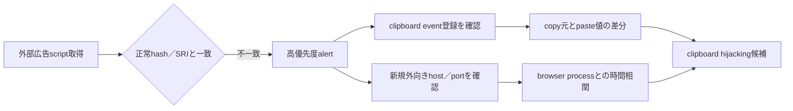

# 2026-08-02 検知・ハント指針

## 優先検知点

| 優先度 | 対象 | 検知点 |
|---|---|---|
| 緊急 | 改ざん広告script | `s2.adform.net/banners/scripts/st/trackpoint-async.js`の取得と、既知の正常hash／SRIからの逸脱 |
| 高 | clipboard hijacking | browser内の暗号資産addressがcopy元とpaste先で変化する事象 |
| 高 | metadata送信 | browserまたは広告script実行文脈から`84.32.102.230:7744`への外向き接続 |
| 中 | supply-chain再発 | Adform等の外部tagから新規domain／非標準portへの通信が追加される差分 |

## Web／プロキシのテレメトリ

- 完全path `http://s2.adform.net/banners/scripts/st/trackpoint-async.js`の過去取得記録を時刻付きで検索する。
- 同一URLの応答hash、Content-Type、ETag、Last-Modifiedを時系列で比較する。
- 正常時のscript hashまたはSubresource Integrityと一致しない配信を検知する。
- 取得直後に`84.32.102.230:7744`へ接続したbrowser processを相関する。
- 広告配信scriptから未知IPの非標準portへ直接接続する事象を一般化してハントする。

## エンドポイント／ブラウザのテレメトリ

- browser extension、EDR browser sensor、DLPで、暗号資産addressのcopy元とpaste値の不一致を検知する。
- `navigator.clipboard`、`clipboardData`、`copy`／`paste` event handlerの追加を、外部広告scriptのoriginと相関する。
- wallet address形式の文字列を書き換える正規表現、置換table、hard-coded addressをscript解析で探す。
- browser processから非標準portへの直接TCP接続を、広告script読込み直後のnetwork eventと結び付ける。

## ネットワークIOCの扱い

- `84.32.102.230:7744/tcp`は侵害時の情報送信先候補として扱い、観測日と根拠を保持する。
- `s2.adform.net`全体を恒久遮断すると正規広告配信へ影響するため、完全path、時間帯、応答hashを優先する。
- IPは再割当てされ得る。ASN、Geo、reverse DNS、証明書、port状態の履歴をC2監視結果と併用する。
- TCP openだけでC2稼働とせず、報告された送信frameや応答形式が得られた場合にconfidenceを上げる。

## 検知ロジックの一般化

## 誤検知抑制

- Adform domain、Chrome／Edge process、clipboard APIの単独出現ではalertにしない。
- script integrity差分、wallet address置換、非標準port通信のうち複数を短時間相関する。
- password manager、DLP、正規wallet extensionによるclipboard操作は署名・extension ID・管理台帳で除外する。
- 侵害期間外の正常script hashをbaselineとし、現在の到達不能だけで過去ログを安全判定しない。
