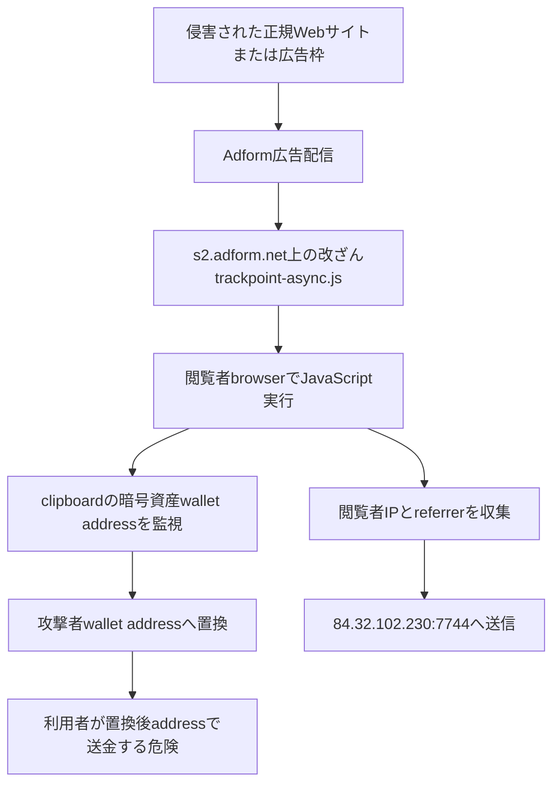
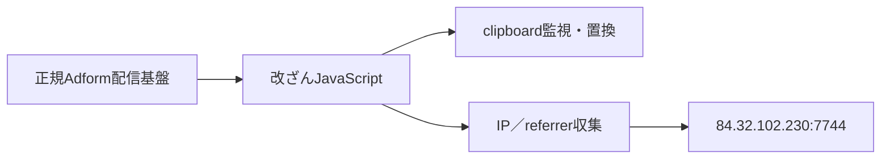

# 2026-08-02 脅威分析

## 調査範囲

tech-memoの2026年8月2日付記事・IOC、Adformの公開説明、報道記事、限定的なDNS／TCP／TLS観測を統合した。
IOCは3件で、ファイルハッシュは0件だった。したがってMalwareBazaar、VirusTotal、静的検体解析の対象はなく、
本項では侵害された配信JavaScriptと情報送信先を中心に評価する。

## 主要な結論

Adformの広告配信サブドメイン`s2.adform.net`上の`trackpoint-async.js`が改ざんされ、
暗号資産wallet addressのclipboard置換と、閲覧者IP・referrerの外部送信に使われたと報告されている。
これは端末へPEを配置する従来型マルウェアではなく、正規広告配信経路へ悪性JavaScriptを混入させる
supply-chain／web skimming型の活動である。開発者と運用actorは公開情報だけでは特定できず、
単一campaignに限定されたtoolか、再利用されたcommodity scriptかも確定できない。

## 実行・感染チェーン

## モジュール関係

## 本日のライブ観測

- `84.32.102.230`はDNS処理不要の直接IPであり、TCP/80・443はいずれもtimeoutだった。
- TLS/443もtimeoutで、証明書は取得できなかった。
- 報告済みポート`7744/tcp`は全履歴C2ライブチェック対象へ明示的に登録した。
- `s2.adform.net`と改ざんpathは配布基盤であり、C2と同一視しない。
- TCP open、TLS応答、IP所有情報だけでは悪性serviceの稼働やactor支配を確定しない。

## コード・挙動上の特徴

本日のIOC一覧には改ざん前後のJavaScript本文やhashが含まれないため、関数単位のコード比較はできない。
現時点で保持できる再利用可能なナレッジは、広告配信scriptがclipboard APIまたはcopy/paste eventを監視し、
暗号資産address形式を攻撃者addressへ置換すると同時に、非標準TCP portへ閲覧metadataを送るという処理関係である。
次回はscript本文、Subresource Integrity不一致、配信時刻別hash、wallet address、送信frame形式を優先して取得する。

## 帰属と過去利用

Adformは自社基盤のsecurity incidentとして公表しているが、公開情報は攻撃者名やmalware familyを示していない。
このため開発者・actorは`unknown`とし、暗号資産clipboard hijackingという一般的手法だけで既知groupへ帰属しない。
正規広告・tag manager・外部scriptの侵害は広い配信面を一度に悪用できるため、個別端末hashよりも
script integrity、配信元path、CSP violation、clipboard変更、送金先addressの相関が重要である。

## 制約

- 本日分には検体hashがなく、MalwareBazaarから取得・解析できる検体はなかった。
- 改ざんJavaScript本文がIOC資料に含まれず、独自の関数単位静的解析は未実施である。
- 情報送信先へ認証情報、マルウェア固有protocol、check-in codeは送信していない。
- host到達性は観測時点のsnapshotであり、過去の侵害時稼働状態を否定しない。

## 参考資料

- [Adform: Security Incident Company Update](https://site.adform.com/resources/newsroom/security-incident-company-update/)
- [BleepingComputer: Online ad firm Adform's script compromised to steal cryptocurrency](https://www.bleepingcomputer.com/news/security/online-ad-firm-adforms-script-compromised-to-steal-cryptocurrency/)
