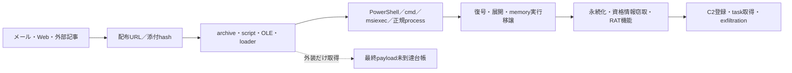

# 検知・ハント方針 — 2026-08-06

## 基本方針

本日のIOCは寿命と共有可能性が異なるため、hash、配布元、process chain、書き込み先、永続化、通信先、protocol証跡を相関して使用する。IP、domain、TCP open、TLS証明書、単一providerのfamily名だけでは高確度alertにしない。

## 優先する相関

| 優先度 | 相関条件 | 主な用途 |
|---|---|---|
| 高 | 完全hash一致 + 取得元一致 + 実行／書き込みprocess chain | 侵入端末の隔離、同一検体の追跡 |
| 高 | loader／scriptの親子process + 復号・展開先 + 後段PEまたはmemory移譲 | BamboLoader、MonikerLoader、GuLoaderなどの段階型chain検知 |
| 高 | family固有endpoint + malware固有protocol応答または認証成功 | 稼働C2の確認。結果は全履歴C2監視を参照 |
| 中 | URL／domain + archive・script・OLE取得 + LOLBin／PowerShell／MSI実行 | 配布・感染chainの探索 |
| 中 | 正規RMMのsilent install + 非標準取得元 + 不審な親process／導入先 | ScreenConnect悪用の検知 |
| 低 | IP、DNS解決、TCP open、TLS証明書の単独一致 | pivot候補。単独alertは抑止 |

## 感染チェーンの観測点

各段階で、親process、command line、書き込み先、image load、network eventを同じ端末・短い時間窓で結び付ける。後段未取得の場合は、外装のfamilyラベルを最終payloadの確定判定へ昇格させない。

## 本日分の検知観点

- `powershell.exe`や`cmd.exe`から外部resourceを取得し、TEMP／APPDATAへ書き込んだ直後に実行またはmemory loadする連鎖。
- `msiexec.exe /i ... /qn`などのsilent installが、メール・script・非標準download hostを起点に実行される連鎖。
- Defender除外、SmartScreen設定変更、UAC昇格、Explorer再起動などが短時間に連続するscript。
- OLE／scriptから復号関数、control-flow flattening、環境確認を経て別processへ実行移譲する挙動。
- 正規RMMや署名付きbinaryであっても、取得元、導入先、親process、直後の外部接続が通常運用と一致しない場合の相関。
- C2候補は、`transport_reachable_c2_not_confirmed`と`c2_protocol_confirmed`を区別し、後者だけを高確度の稼働証跡として扱う。

## Sigma／ネットワークruleへ落とす際の条件

- Sigmaはprocess creation、file write、registry／service／scheduled task、image load、network connectionの2種類以上を組み合わせる。
- Snort／Suricataは共有TLS、CDN IP、一般的なHTTP pathだけをsignatureにしない。固定magic、message framing、URI構造、header組合せなどfamily固有性を確認する。
- hash ruleは即時封じ込めに使える一方、variant追跡には代表関数fingerprint、復号routine、設定構造、埋め込みresource関係を併用する。
- OSINT由来IOCは観測日を保持し、DNS／IP遷移、ASN、Geo、hosting属性を履歴として更新する。

## 誤検知抑止

- VirusTotal／MalwareBazaarのfamily名だけを検知条件にしない。
- ScreenConnect、cloudflared、正規署名binary、CDN edge、一般hostingは、悪性chainの証跡がなければ除外する。
- TLS証明書不一致はAsyncRATなどの否定根拠にせず、変更・再発行・共有の可能性を記録する。
- HTTP 200、TCP open、FTP bannerだけをC2確定としない。認証、check-in、登録、task応答など、review済みprofileの結果を優先する。

## 参照

- [脅威分析](THREAT-ANALYSIS.md)
- [取得検体の静的解析](STATIC-ANALYSIS.md)
- [全履歴C2監視](../../c2-monitoring/2026-08-06/README.md)
