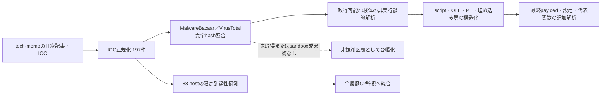

# 公開情報・挙動・検知の整理 — 2026-08-06

## 評価要約

- 正規化IOC: 197件（SHA-256 70、IPv4 58、URL 37、domain 32）
- MalwareBazaarで確認: 20件
- VirusTotalで確認: 35件
- 取得して非実行静的解析した検体: 20件（PE 9、script 4、OLE 3、data 4）
- 限定インフラ観測: 88 host（DNS解決 67、TCP到達 39、TLS handshake 33）

本日の情報は、FDMTP、EtherRAT、ScreenConnect悪用、Cobalt Strike、BamboLoader、MonikerLoader、GuLoaderなど複数の活動を含む。IOCラベルだけで同一actorまたは同一campaignとは判定せず、配布経路、取得物、process chain、設定値、通信手順の一致を段階的に評価する。

## 主な観測群

| 観測群 | IOC件数 | 評価 |
|---|---:|---|
| FDMTP | 88 | staging C2、loader、暗号化archiveなどを含む大規模cluster。個別endpointだけでなく、登録・plugin取得・後段展開の関係を追跡する。 |
| EtherRAT | 29 | C2候補と関連ファイルを含む。family名はOSINT帰属であり、検体側の設定復元と照合するまで確定扱いにしない。 |
| ScreenConnect | 16 | 正規RMMの悪用を含むため、製品名や署名だけでは検知せず、取得元、silent install、親process、導入先を相関する。 |
| Cobalt Strike | 16 | beaconまたは関連インフラ候補。共有インフラや誤検知を避け、profile・通信・process injectionなど複数証跡を要求する。 |
| BamboLoader | 9 | loader段階の検体と関連IOC。復号・展開後のPE、実行移譲、永続化、C2設定を後続解析の優先対象とする。 |
| MonikerLoader | 8 | loaderとして扱い、最終payloadをfamily確定の根拠にする。外装だけの類似性でcampaignを統合しない。 |
| GuLoader | 4 | PowerShell／Donut系shellcodeを経由する段階型chain。取得済み別ケースの静的復元結果と比較し、外部payload・shellcode・実行移譲を区別する。 |

## 解析フローと未観測区間

静的解析した20件のうち、4 scriptは関数・分岐・外部取得処理を構造化した。PE、OLE、dataを含む16件は自動抽出だけでは関数本体の意味を確定できないため、`function_analysis_required`として追加解析対象を明示した。これは解析失敗ではなく、importや文字列だけで挙動を断定しないための保守的な状態である。

## IOCカテゴリ

| カテゴリ | 件数 |
|---|---:|
| `c2` | 99 |
| `malware` | 65 |
| `abusefile` | 14 |
| `related-file` | 11 |
| `tool` | 7 |
| `srcip` | 1 |

## 確度と制約

- hashのprovider一致は同一ファイルの存在証跡であり、actorまたはcampaignの同一性を意味しない。
- DNS解決、TCP open、TLS handshakeは到達性証跡であり、malware protocolの確認ではない。本日のC2稼働評価は[全履歴C2監視](../../c2-monitoring/2026-08-06/README.md)を正本とする。
- 正規署名付きRMM、CDN、共有hosting、srcipは、悪性process chainまたは配布証跡がない限り単独検知へ使用しない。
- 検体、復元payload、memory dump、生の逆コンパイル、資格情報はGitへ保存していない。

## 関連成果物

- [検知・ハント方針](DETECTION.md)
- [取得検体の静的解析](STATIC-ANALYSIS.md)
- [全履歴C2監視](../../c2-monitoring/2026-08-06/README.md)
- [MalwareBazaar新着Windows 50件](../../../collections/malwarebazaar-windows-20260806-0050/README.md)
- [ClickFix／ClearFake 50件](../../../clickfix/collections/clickfix-daily-20260806/README.md)
