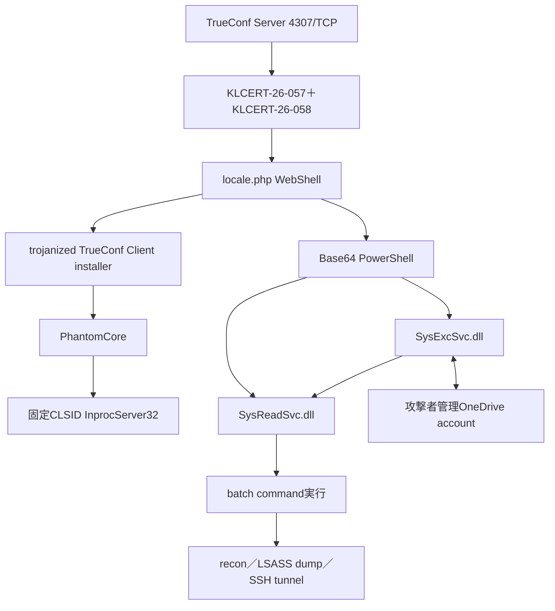

# Head Mare／TrueConf追加分析

## 解析結果

本日の35 IOCは、2026年7月に観測されたHead MareによるTrueConf Server侵害にまとまります。入口はTrueConf Serverの`4307/TCP`で、`KLCERT-26-057`と`KLCERT-26-058`の連鎖により、認証なしのscript実行から`NT AUTHORITY\SYSTEM`のOS command実行へ到達したと報告されています。`4307/TCP`は初期侵入面であり、C2ではありません。

侵害後は次の2経路へ分岐します。

1. `locale.php` WebShellから正規TrueConf Client installerを改ざんし、利用者へPhantomCoreを配布する経路
2. Serverへ`SysExcSvc.dll`と`SysReadSvc.dll`をserviceとして配置し、OneDrive command channelを使うPhantomGraphの経路

## providerと公開sandbox

- 20 MD5をMalwareBazaarへ照合: 0件
- 20 MD5をVirusTotalへ照合: 6件
- 復元したSHA-256: 6件
- 新規provider submit: 0件
- 公開Triage exact hash一致: `260722-z86htahl6y`

Triageでは、改ざんTrueConf installerからInno Setup一時process、既存TrueConf process停止、firewall rule更新、`TrueConf.exe`起動、次のCOM hijackが観測されています。

- key: `HKCU\Software\Classes\CLSID\{0340F119-A598-4ed9-B0AC-6F6A12D3E755}\InprocServer32`
- value: `C:\Program Files\TrueConf\Client\api-ms-win-crt-time-l1-1-0-2.dll`

一般的なOneDrive／Microsoft endpoint、`c.pki.goog`、Cloudflare共有IPは、正規サービスまたは共有基盤の文脈であり、campaign IOCへ昇格しません。

## root検体の非実行静的解析

公開Triageとexact hashで一致するroot installerを認証付き暗号化archiveとして取得し、ディスクへ平文展開せずメモリ内で解析しました。実行と外部通信は行っていません。

| 項目 | 結果 |
|---|---|
| SHA-256 | `e66bbb6c651b5ab839434b8e62f502169f35894e28dbe9f3275911582eccd250` |
| 形式 | 32-bit x86 native PE／Inno Setup 6.5.2 |
| root構造 | 1,161,728-byte stub＋192,156,242-byte overlay |
| overlay比率 | 99.3991% |
| 埋め込みPE | `MZ`候補2,925件を検証、妥当なPE 0件 |
| 子payload／C2 | 未復元 |
| 自動family判定 | `unknown`／low。OSINT帰属とは分離 |

`JR.Inno.Setup`、`SetupLdrAndSetup`、`Inno Setup Setup Data (6.5.2)`を確認しました。一方、7-Zipはmemberを列挙できず、全域carvingでも子PEを安全に復元できませんでした。したがって、PhantomCore DLL、設定復号、C2 protocolはrootから独立確認できていません。providerで確認したPhantomCore候補hashを、rootから抽出したhashとして扱わないよう分離しています。

検体はrepository外で暗号化保管し、整合性検証済みです。公開成果物には検体、復号済みpayload、保管先、資格情報を含めません。

## 詳細成果物

- [campaign概要](../../campaigns/head-mare-trueconf-202607/README.md)
- [感染チェーン](../../campaigns/head-mare-trueconf-202607/INFECTION-CHAIN.md)
- [モジュール関係](../../campaigns/head-mare-trueconf-202607/MODULES.md)
- [20 MD5のprovider照合](../../campaigns/head-mare-trueconf-202607/PROVIDER-EVIDENCE.md)
- [公開Triage証拠](../../campaigns/head-mare-trueconf-202607/TRIAGE.md)
- [root installerの静的解析](../../campaigns/head-mare-trueconf-202607/STATIC-ANALYSIS.md)
- [Sigmaルール](../../campaigns/head-mare-trueconf-202607/rules/)
