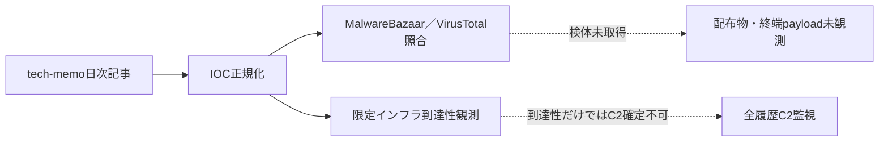

# 公開情報・挙動・検知分析 — 2026-08-18

## 評価要約

- 正規化したIOC: 32件
- MalwareBazaarで確認: 0件
- VirusTotalで確認: 5件
- 取得して非実行静的解析した検体: 0件
- 限定インフラ観測: 11対象（DNS解決 8件、HTTP応答 0件）

検体を取得できなかったIOCは、配布物や最終payloadが存在しないとは判定しない。配布停止、provider未収録、hash種別の差、認証・公開範囲の制約を分離して扱う。

## 調査フローと未観測区間

実線はこの日次処理で実施した情報処理、点線は未観測区間または別の監視レーンとの関係を示す。

## IOCの構成

| 区分 | 件数 |
|---|---:|
| `c2` | 17 |
| `malware` | 5 |
| `srcip` | 3 |
| `tool` | 7 |

## IOCラベル上のマルウェア

| ラベル | 件数 |
|---|---:|
| reverse_ssh（IOCラベル） | 12 |
| ChainDrop (Shai-Hulud variant)（IOCラベル） | 7 |
| unknown（IOCラベル） | 7 |
| linuxFile（IOCラベル） | 5 |
| Babuk variant（IOCラベル） | 1 |

これらはtech-memoのIOCラベルであり、独自の設定復元、process帰属付き通信、またはコード相関がない項目を検体単位の確定帰属として扱わない。

## 確度と制約

- hashのprovider一致は同一ファイルの存在確認であり、actorまたはcampaignの同一性を意味しない。
- DNS解決、TCP open、TLS handshake、通常HTTP応答は到達性証拠であり、C2 protocol確認ではない。
- srcip、共有CDN、正規クラウド、一般サービスは、悪性processとの相関なしに検知IOCへ昇格しない。
- 検体、復元payload、通信内容は実行しておらず、公開成果物へ保存していない。

## 関連成果物

- [検知・ハント方針](DETECTION.md)
- [取得検体の静的解析](STATIC-ANALYSIS.md)
- [全履歴C2監視](../../c2-monitoring/2026-08-18/README.md)
