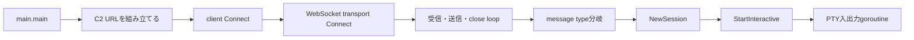

# ARM／Go ELFの追加静的解析

## 結論

SHA-256 `90b7b2c6f3d05234dc55678243039d7e51f0d54190239e5234a0005533337dc8` は、ARM 32-bit向けに静的linkされたGo ELFである。custom Go `pclntab`から5,996関数を復元し、Ghidraで通信・packet分岐・session・疑似端末処理の代表7関数を確認した。

検体は起動時に空白埋めされたhost文字列を整形し、`ws://` schemeと`/ws` pathを連結してWebSocket接続処理へ渡す。静的に確認したC2 endpointは `ws://112[.]213[.]124[.]132:4081/ws` である。WebSocket処理、4-byte keepalive、message type分岐、interactive session、PTY入出力の組合せはAntniumの公開機能と整合する。exact SHA-256のJoe Sandbox観測も同じendpointとWebSocket通信を示すため、family帰属は高確度と評価する。ただし、特定のAntnium source revisionからbuildされたことまでは立証していない。

## 検体構造

| 項目 | 静的結果 |
|---|---|
| SHA-256 | `90b7b2c6f3d05234dc55678243039d7e51f0d54190239e5234a0005533337dc8` |
| サイズ | 7,208,960 bytes |
| 形式 | ELF32、ARM、little-endian、静的link |
| entry point | `0x8293c` |
| Go関数inventory | 5,996件 |
| 代表関数レビュー | 7件 |
| Go metadata | 独自magic `0x4ec3ef01`、text開始位置 `0x11000` |
| import状態 | dynamic interpreter／共有libraryなし |
| 実行保護 | NX有効 |

`pclntab`は標準magicではないが、関数table、名前table、text開始位置、関数entryの相互関係を境界検証し、Ghidra上の同一addressと照合した。garble難読化により一部package名と型名は無意味化されているが、`main.main`、`Connect`、`KeepAlivePacket`、`NewSession`、`StartInteractive`などの役割を示すsymbolは復元できた。

## 静的call chain

実線はGhidraの命令参照、復元したGo関数境界、または関数内callから確認した関係を示す。通信先へ接続して動作を確認したものではない。

## 代表関数

### `main.main` — 起動統制とendpoint生成

56-byteの空白埋めhost領域を整形し、schemeとpathを連結してclientの`Connect`へ渡す。検体内の参照先addressと長さを確認しており、周辺文字列からの推測ではない。

### `main.(*BbxCzwFFkO).Connect` — client構成

WebSocket transport、受信handler、close処理、再接続とbackoffに関係する処理を登録する。garble後の型名は帰属根拠に使わず、call先とhandler構成を役割判定に使った。

### `ApA6baF3.(*NsTRizbMr6N).Connect` — WebSocket転送処理

WebSocket dial、reader／writer、close handlerを準備し、複数goroutineで送受信を開始する。HTTPの通常GETだけを行うdownloaderではなく、双方向channelを維持する構造である。

### `main.(*BbxCzwFFkO).KeepAlivePacket` — keepalive生成

4-byteのmessage type `3`を構成し、接続状態を伴う送信処理へ渡す。公開成果物にはframe全体や接続識別子を保存していない。

### `main.(*BbxCzwFFkO).Connect.func11` — 受信packet分岐

4 bytes未満のpacketを処理対象外とし、先頭typeを使って分岐する。静的に確認した分岐値には`0x50`、`0x51`、`0x1b`があり、選択された処理をgoroutineとして開始する。個々のcommand意味は全件復元していない。

### `uM3uajFZFmzd.(*R6VAAPoxZb2q).NewSession` — session生成

既存sessionとの重複を確認し、新しいinteractive処理を開始してregistryへ登録する。単発command実行だけでなく、複数sessionを管理する設計が確認できる。

### `EzfLX9y.(*f5M3rU).StartInteractive` — PTY処理

端末サイズを構成し、疑似端末のread／writeを扱う4本のgoroutineを開始する。interactive shell能力は高確度で確認できるが、検体は実行していない。

## C2とprotocol評価

| 項目 | 結果 | 確度 |
|---|---|---|
| endpoint | `ws://112[.]213[.]124[.]132:4081/ws` | 静的参照で確認済み |
| transport | plain WebSocket | client／transport call chainで確認済み |
| keepalive | 4-byte message type `3` | packet生成関数で確認済み |
| 受信type | `0x50`、`0x51`、`0x1b`を含む分岐 | dispatcherで確認済み |
| session | 複数session registryとinteractive開始 | 関数本文で確認済み |
| command一覧 | 全件未復元 | 未完了 |

endpointは静的configとして確認したためIOC候補にできるが、2026-08-20時点のlive稼働を意味しない。本タスクでは検体通信もactive C2 probeも行っていない。

## Antnium帰属

高確度評価には、検体内のWebSocket／keepalive／session／PTYという独立したコード軸、[Antnium公開repository](https://github.com/dobin/antnium)の機能・`/ws` endpointとの構造一致、[Joe Sandboxのexact SHA-256解析](https://www.joesandbox.com/analysis/1927740)による同endpointの観測を使用した。単一IOCやsandbox labelだけでは帰属していない。

compiler生成code、WebSocket library、PTY libraryは他toolでも共有され得るため、source revision、builder、operator、campaignの同一性は未確認である。

## 検知材料

- exact SHA-256または検証済みの派生hash
- Linux上の未知ARM ELFによるplain WebSocket接続
- `/ws` pathと4-byte type fieldを持つ持続通信
- 疑似端末の作成、terminal resize、双方向read／write
- 同一process内のsession registryと再接続処理

IPまたは`/ws`単独は誤検知が大きいため、高確度alertへ使わない。WebSocket handshakeだけでもmalware protocol確認にはならない。

## 制約と安全性

- 全5,996関数をinventory化したが、本文を詳細レビューしたのは通信・session中心の7関数である。
- garble難読化により型名、package名、局所変数名の一部は不完全である。
- command type全体、暗号化の有無、file transferのwire形式は未復元である。
- 検体、payload、逆コンパイル全文、C2 frame、秘密値はGitへ保存していない。
- 検体は実行せず、C2へ接続していない。Ghidraの任意script実行も有効化していない。

## 出典

- [MalwareBazaarのexact sample](https://bazaar.abuse.ch/sample/90b7b2c6f3d05234dc55678243039d7e51f0d54190239e5234a0005533337dc8/)
- [Triageのexact sample](https://tria.ge/260614-qqwq8aez8l/)
- [Joe Sandboxのexact sample解析](https://www.joesandbox.com/analysis/1927740)
- [Antnium公開repository](https://github.com/dobin/antnium)
