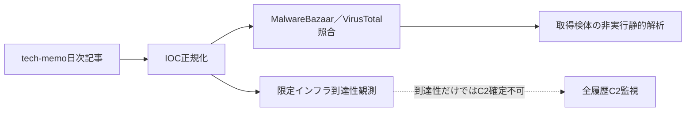

# 公開情報・挙動・検知分析 — 2026-08-20

## 評価要約

- 正規化したIOC: 106件
- MalwareBazaarで確認: 1件
- VirusTotalで確認: 19件
- 取得して非実行静的解析した検体: 1件
- 限定インフラ観測: 76対象（DNS解決 72件、HTTP応答 4件）

取得検体の結果は[静的解析](STATIC-ANALYSIS.md)へ分離し、IOCラベルだけでfamilyを確定しない。取得したARM／Go ELFは、5,996関数のinventoryと通信・session中心の7関数レビューからAntnium系と高確度で評価した。静的に復元したWebSocket endpointは `ws://112[.]213[.]124[.]132:4081/ws` である。現在の稼働状態とbuild provenanceは未確認である。

## 調査フローと未観測区間

実線はこの日次処理で実施した情報処理、点線は未観測区間または別の監視レーンとの関係を示す。

## IOCの構成

| 区分 | 件数 |
|---|---:|
| `abusefile` | 3 |
| `c2` | 76 |
| `malware` | 13 |
| `phishing-site` | 4 |
| `related-file` | 5 |
| `tool` | 2 |
| `unknown` | 3 |

## IOCラベル上のマルウェア

| ラベル | 件数 |
|---|---:|
| MacSync Stealer（IOCラベル） | 31 |
| QUICAgent（IOCラベル） | 16 |
| TencShell（IOCラベル） | 13 |
| ValleyRAT（IOCラベル） | 12 |
| unknown（IOCラベル） | 8 |
| Gshell（IOCラベル） | 7 |
| p2pwn（IOCラベル） | 7 |
| ErrTraffic（IOCラベル） | 5 |
| Cruciferra（IOCラベル） | 4 |
| Remus（IOCラベル） | 2 |
| SalatStealer（IOCラベル） | 1 |

これらはtech-memoのIOCラベルであり、独自の設定復元、process帰属付き通信、またはコード相関がない項目を検体単位の確定帰属として扱わない。

## 確度と制約

- hashのprovider一致は同一ファイルの存在確認であり、actorまたはcampaignの同一性を意味しない。
- DNS解決、TCP open、TLS handshake、通常HTTP応答は到達性証拠であり、C2 protocol確認ではない。
- srcip、共有CDN、正規クラウド、一般サービスは、悪性processとの相関なしに検知IOCへ昇格しない。
- 検体、復元payload、通信内容は実行しておらず、公開成果物へ保存していない。

## 関連成果物

- [検知・ハント方針](DETECTION.md)
- [取得検体の静的解析](STATIC-ANALYSIS.md)
- [ARM／Go ELFの追加静的解析](ELF-DEEP-DIVE.md)
- [全履歴C2監視](../../c2-monitoring/2026-08-20/README.md)
