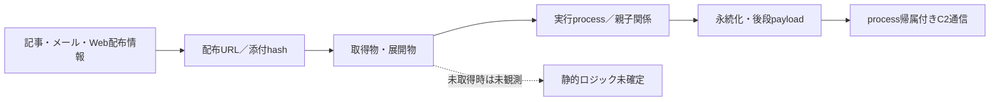

# 検知・ハント方針 — 2026-09-02

## 方針

IOCは寿命と共有可能性が異なるため、hash、取得元、process系譜、名前解決、通信先、署名状態を相関して使う。IP単独、domain単独、TCP open単独では高確度アラートにしない。

## 優先する相関

| 優先度 | 相関条件 | 用途 |
|---|---|---|
| 高 | 完全hash一致 + 実行／書込process + 取得元 | 隔離・同一検体の追跡 |
| 中 | URL／domain + script／archive／LOLBINのprocess系譜 + 直後の外向き通信 | 配布・感染chainの探索 |
| 中 | C2候補endpoint + 悪性process帰属 + family固有protocol応答 | C2稼働・感染端末の確認 |
| 低 | IP、DNS解決、TLS証明書、TCP openのいずれか単独 | pivot候補。単独alert禁止 |

## infection chainの記録要件

各段階は観測証拠がある場合だけ実線で結び、未取得・未復号・sandbox未公開は未観測として残す。

## 本日の適用範囲

- IOC: 173件
- 独自静的解析済み検体: 4件
- 検体固有の静的特徴はSTATIC-ANALYSIS.mdと各caseのFEATURES／STATIC-LOGICを参照する。
- Sigma候補はprocess作成、file write、image load、network eventを複合し、共有サービスの単独一致を除外する。

## 誤検知抑止

- VirusTotal／MalwareBazaarのfamily名だけを検知条件にしない。
- 正規署名付きhost、remote administration製品、CDN edgeは、悪性sidecarやprocess帰属がない限り除外する。
- C2候補は全履歴監視のprotocol確度を参照し、transport reachableをC2 confirmedへ昇格しない。
