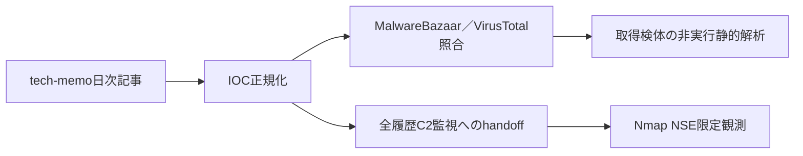

# 公開情報・挙動・検知分析 — 2026-09-02

## 評価要約

- 正規化したIOC: 173件
- MalwareBazaarで確認: 4件
- VirusTotalで確認: 54件
- 取得して非実行静的解析した検体: 4件
- 全履歴C2監視へのhandoff: 96対象（日次取込からのdirect観測なし）

取得検体の結果は[静的解析](STATIC-ANALYSIS.md)へ分離し、IOCラベルだけでfamilyを確定しない。

## 調査フローと未観測区間

handoffは対象集合の固定であり、この日次取込によるlive観測を意味しない。

## IOCの構成

| 区分 | 件数 |
|---|---:|
| `abusefile` | 14 |
| `c2` | 103 |
| `malware` | 48 |
| `related-file` | 8 |

## IOCラベル上のマルウェア

| ラベル | 件数 |
|---|---:|
| NetSupport Manager（IOCラベル） | 94 |
| BraZetsu（IOCラベル） | 25 |
| NodeRabbit（IOCラベル） | 22 |
| NodeRabbit / PollCat（IOCラベル） | 12 |
| unknown（IOCラベル） | 11 |
| ValleyRAT（IOCラベル） | 5 |
| PollCat（IOCラベル） | 4 |

これらはtech-memoのIOCラベルであり、独自の設定復元、process帰属付き通信、またはコード相関がない項目を検体単位の確定帰属として扱わない。

## 確度と制約

- hashのprovider一致は同一ファイルの存在確認であり、actorまたはcampaignの同一性を意味しない。
- 日次取込ではdirect DNS／TCP／TLS／HTTPを実施せず、live観測は全履歴C2監視laneへ委譲する。
- srcip、共有CDN、正規クラウド、一般サービスは、悪性processとの相関なしに検知IOCへ昇格しない。
- 検体、復元payload、通信内容は実行しておらず、公開成果物へ保存していない。

## 関連成果物

- [検知・ハント方針](DETECTION.md)
- [取得検体の静的解析](STATIC-ANALYSIS.md)
- [全履歴C2監視](../../c2-monitoring/2026-09-02/README.md)
