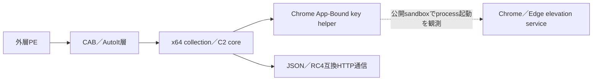
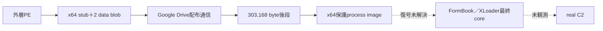
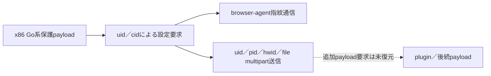
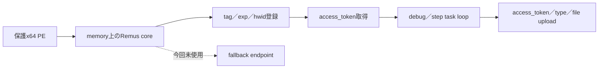

# StealC／FormBook／Lumma／Remusの静的・通信プロトコル比較

## 結論

2026年8月4日時点の代表4検体を、ローカル実行せず、静的復元物、完全SHA-256一致の公開Hatching Triage報告、PCAP、process memoryで比較しました。StealC、Lumma、Remusでは実通信の段階を特定できました。FormBookはGoogle Driveから303,168 byteの後段を取得するところまでは観測できましたが、最終FormBook／XLoader coreとC2は復元できていません。

| ファミリー | 最終段の到達状態 | 実通信profile | 確度 | 安全な稼働確認 |
|---|---|---|---|---|
| StealC | collection／C2 coreとChrome App-Bound helperを分離 | JSON→RC4→Base64、`create`→`loader` | 高 | 完全一致profile・二重許可時だけ合成登録可 |
| FormBook | x64保護stageまで。最終core未復元 | 最終C2未観測 | 未解決 | 復号済みreal C2と鍵が得られるまで受動観測のみ |
| Lumma | PCAPで`uid/cid`とmultipart送信を確認 | Lumma v6互換、合成hwid task要求 | 高。ただし版は未確定 | 完全一致profile・二重許可時だけ合成登録可 |
| Remus | memory configとtask／upload列を確認 | ChaCha20応答、token・`step=1` | 高 | 完全一致profile・二重許可時だけ合成登録可 |

機械可読な全要求列は、本文値、token、query、filenameを除いた[StealC](stealc-pcap-evidence.json)、[FormBook](formbook-pcap-evidence.json)、[Lumma](lummastealer-pcap-evidence.json)、[Remus](remusstealer-pcap-evidence.json)に保存しています。検体・PCAP・memory dumpはリポジトリ外に保持しています。全体の判断は[解析要約](analysis-summary.json)を参照してください。

## 実装した自動化

- `analysis-framework/common/stealer_protocol_evidence.py`
  - PCAPを`TShark`で読み、socket接続先、DNS名、HTTP Host、URI path、Content-Type、フォームkey名、multipart name、要求順序を生成します。
  - 本文値、query、token、filenameを出力しません。
  - socket接続先とHTTP Hostを別fieldに保持し、RemusのHost偽装を見落としません。
  - `StealC v2 JSON`、`Lumma v6 uid/cid`、`Remus token/task/file`、`FormBook terminal未観測`を必要条件付きで分類します。
- `extractors/stealc/structural.py`
  - ASCIIとUTF-16LEを同じ基準で調べ、StealCのcollection／C2 coreとChrome App-Bound helperを分離します。
  - 親coreへhelperが内包されている場合も、JSON、WinINet、credential collectionの独立3群が成立すれば親をcoreとして扱います。
- `extractors/stealer_protocols.py`
  - candidate infrastructure、confirmed C2、terminal protocol、active probe policyを4系統で統一しました。

## 感染・実行・module関係

### StealCの解析

対象のsubmitted SHA-256は`47854afb3cfeb64a85dda148e00e5ca83168f431a28e5c5fb28733e37f484b13`です。静的復元ではCAB／AutoIt層の後にx64 coreを取得し、その内部からChrome App-Bound Encryption用helperを復元しました。最深PEをC2 coreとみなす従来の単純な判断は、この構成では誤りです。

core `1d3821...e26f`では`json.h`／`nlohmann`、`application/json`、WinINet API、credential collection markerを確認しました。helper `61ab1d...1fb`では`app_bound_encrypted_key`、`CryptStringToBinaryA`、COM利用を確認しました。`builder_v3`文字列はbuilder世代の手掛かりですが、単独では製品version 3の確定根拠にしていません。

公開PCAPでは`31.77.228.62:80`への`POST /`、`Content-Type: application/json`、Base64様の暗号化本文を反復していました。公開向け成果物では本文を保持していません。StealC v2のRC4鍵と要求列をPCAPから復元しました。監視器は完全一致profile・単一IP pin・二重の明示許可が揃う場合だけ、合成hwidの`create`とtokenを用いた`loader`取得を各1回行います。

### FormBook／XLoaderの解析

対象のsubmitted SHA-256は`7ba2b0a420e45f02c5c13ec7732213859685586db9586122a8cb382652e49d6d`です。

Google Driveは後段配布先であり、最終C2ではありません。取得したprocess memoryはx64、importなし、単一`.text`、`SizeOfImage=303,104`、entropy 7.986でした。既存`native_xloader.py`はx86 stack-builderと外部鍵材料を前提にするため、このx64保護stageには適用できませんでした。FLOSSでも通信文字列は復元できず、公開PCAPでは最終C2通信を観測していません。

FormBook 4.1／XLoader系はmain URIと64 domainのdecoy構造、404偽装を使います。HTTP status、root page、domain単独ではC2確認になりません。次の最小手順は、303,168 byte後段の完全file dump、または復号後process imageを取得し、x64向けのstring builder／protected function復元を追加することです。

### Lummaの解析

対象のsubmitted SHA-256は`4b7d75f5c35d8d326af5723fb77c44d769478c90ca2f88e2edfb3e08817fb29c`です。外層はx86 Go系の保護payloadで、静的設定は復元できませんでした。

公開PCAPでは`bizsmmit.cyou`（`64.89.161.173:80`）へ、最初に`uid`／`cid`、続いてbrowser fingerprint用`/api/set_agent`、その後`uid`／`pid`／`hwid`／`file`を持つmultipart送信を確認しました。`uid/cid`と`act`不在はMicrosoftが説明するLumma v6形式と一致します。ただし`/api/set_agent`は追加browser-agent componentの可能性があり、これだけでcanonical Lumma coreのversionを断定していません。

v5以前の`act=life`を汎用probeとして送ることも避けます。exact versionがv5以前と静的に確認されていない対象へ送ると、v6や別系統で意味が変わる可能性があります。

### Remusの解析

対象のsubmitted SHA-256は`2b3a23db5ca7464a5c7f0975790af54097ed127a66ab0b551123831e8f40dfc6`です。外層はx64、高entropyの大きなcarrier sectionを持つ保護PEでした。公開memory configから`onesdto.shop:2535`と`azurhay.shop:8539`を復元し、前者だけが今回のPCAPで使用されました。

実際のsocket接続先は`onesdto.shop`が解決した`154.12.237.176:2535`ですが、HTTP Hostは`microsoft.com`でした。したがってHostだけを信頼すると見落とします。高確度検知には、非標準port、socket destinationとHostの不一致、`tag/exp/hwid`、`access_token/debug`、`access_token/step`、multipartの`access_token/type/file`という要求列を組み合わせます。

応答の32 byte鍵＋8 byte nonce＋ChaCha20 ciphertext形式を復元しました。監視器は完全一致profile・単一IP pin・二重の明示許可が揃う場合だけ、合成hwidで登録し、復号tokenを公開せず`step=1`を1回取得します。task本文は保存・実行しません。

## 検知へ使う比較軸

| 軸 | StealC | FormBook／XLoader | Lumma | Remus |
|---|---|---|---|---|
| transport | HTTP JSON | HTTP(S)、RC4系 | 世代別form data／multipart | HTTP form data／multipart |
| 初期識別 | `create`相当、HWID／build | 復号config依存 | v6は`uid/cid` | `tag/exp/hwid` |
| task／config | JSON response | 404偽装とreal domain選択 | config／plugin要求 | `access_token/step` |
| exfil | JSON upload | RC4暗号化HTTP | `uid/pid/hwid/file` | `access_token/type/file` |
| 強い追加証拠 | coreとApp-Bound helperのmodule関係 | real C2をdecoyから分離 | `act`有無による世代差 | socket先とHTTP Hostの不一致 |
| 避ける単独条件 | `POST /`、JSON | 404、64 domain | `uid`、multipart | `Host: microsoft.com`、非標準port |

## 能動確認の安全境界

2026年8月4日の静的・公開PCAP復元工程では、C2への新規接続を行っていません。今回追加した監視器は、StealC／Lumma／Remusについて完全一致profile、単一IP pin、二重の明示許可が揃う場合だけ合成端末登録とtask取得を最大2要求で行います。FormBook／XLoaderは引き続き受動観測だけです。

- StealC: `create`は感染登録を行うため、完全一致profileと二重許可時だけ合成IDを使います。
- FormBook／XLoader: real C2、campaign path、鍵を復元できず、404だけでは判定できません。
- Lumma: v6には`LIFE`がなく、`uid/cid`と合成hwidによるtask要求を各1回に限定します。
- Remus: token取得と`step=1`はtask取得へ進むため、本文を公開・実行しません。

TCP open、通常のHTTP応答、証明書、bannerは到達性証拠にとどめ、protocol確認へ昇格しません。

## 静的解析の制約

- Ghidra MCPは明示的なprogram selectorで既存projectのStealC helperを開く処理を試しましたが、program open、analysis status、import列挙がtimeoutしました。任意script実行は有効化していません。
- Ghidraが応答しなかったため、PE構造、文字列、FLOSS、既存静的unpacker、公開PCAP／memory configを用いました。
- FormBookのx64 protected functionと最終C2、Lummaの静的C2 configは未解決です。StealCのtraffic RC4 keyとRemusのtask response復号形式は今回解決しました。
- `builder_v3`、`uid/cid`、RemusとLummaのcode類似だけで製品version、actor、campaignを確定していません。

## 情報源

調査日は2026年8月4日です。

- [Zscaler ThreatLabz: I StealC You: Tracking the Rapid Changes To StealC](https://www.zscaler.com/blogs/security-research/i-stealc-you-tracking-rapid-changes-stealc) — StealC v2のJSON operationとRC4変更。
- [Check Point Research: Stealth is never enough, or Revealing Formbook successor's C&C infrastructure](https://research.checkpoint.com/2021/stealth-is-never-enough-or-revealing-formbook-successors-cc-infrastructure/) — FormBook／XLoaderの64 domain、main URI、404偽装。
- [Check Point Research: XLoader Botnet: Find Me If You Can](https://research.checkpoint.com/2022/xloader-botnet-find-me-if-you-can/) — FormBook 4.1／XLoaderのreal C2とdecoy選択。
- [Microsoft Security Blog: Lumma Stealer: Breaking down the delivery techniques and capabilities of a prolific infostealer](https://www.microsoft.com/en-us/security/blog/2025/05/21/lumma-stealer-breaking-down-the-delivery-techniques-and-capabilities-of-a-prolific-infostealer/) — Lumma v1～v6のfield差、`LIFE`廃止、plugin取得。
- [Check Point Research: Impersonation, Click Hijacking, and TDS: Inside a Malware Distribution Ecosystem](https://research.checkpoint.com/2026/impersonation-click-hijacking-and-tds-inside-a-malware-distribution-ecosystem/) — Remusのtoken／step tasking、encrypted JSON、収集機能。
- [Flashpoint: Remus Stealer: A New, Not-So-New Infostealer](https://flashpoint.io/blog/remus-stealer-a-new-not-so-new-infostealer/) — RemusのMaaS性、Lummaとのcode-level overlap、access token型C2。
- [Hatching Triage Cloud API: Samples](https://tria.ge/docs/cloud-api/samples/) — 公開解析report、PCAPNG、memory dumpの取得仕様。
