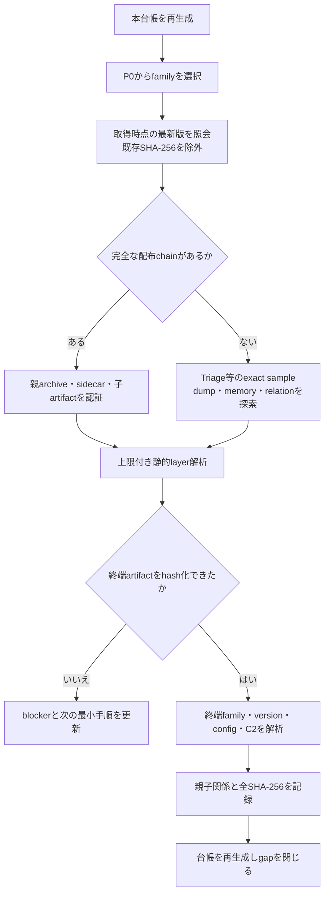

# 終端ペイロード未取得ケースと最新版取得優先表

## 結論

過去の2,549ケースを対象に、精査済み難解析台帳、構造化レポート、人が読めるケース文書を統合し、終端ペイロードまたは終端ファミリーの確認まで到達していない732ケース／39ファミリーを抽出しました。

単なる解析状態の`partial`は対象にしていません。精査済み難解析台帳に登録済みであるか、終端payload・本体・family・assemblyなどの未取得が現在の成果物に明記されている場合だけを収録します。最終C2だけが未回収で、終端本体を確認済みのケースはこの台帳へ自動追加しません。

| 状態 | 件数 | 意味 |
|---|---:|---|
| 明示的未取得 | 672 | 現在のreportまたはケース文書が終端未取得を明記 |
| 継続復元backlog | 55 | 精査済み難解析台帳に残る復元課題。最新成果物で再確認が必要 |
| 必要byte不在 | 5 | 提出物に終端byteがなく、同じ検体の静的処理だけでは復元不能 |

全ケースは[ケース一覧](CASES.md)、表計算向けには[inventory.csv](inventory.csv)、根拠を含む機械可読正本は[inventory.json](inventory.json)を参照してください。

## ファミリー別優先順位

P0から順に、MalwareBazaar等でfirst seenが新しい検体を実行時に照会します。ここに書かれた『最新版』を固定hashとして保持せず、取得時点で既存SHA-256を除外して選び直します。DLL単体より、親archive、sidecar、decoy、設定blobを含む完全な配布chainを優先します。

| 優先度 | ファミリー | 未取得ケース | 明示的未取得 | byte不在 | ローカル最新観測 | MalwareBazaar署名候補 |
|---|---|---:|---:|---:|---|---|
| P0 | `vidar` | 22 | 10 | 2 | 2026-08-17 | `Vidar` |
| P0 | `venomrat` | 8 | 6 | 2 | 不明 | `VenomRAT` |
| P0 | `valleyrat` | 37 | 34 | 1 | 2026-08-12 | `ValleyRAT` |
| P0 | `purehvnc` | 3 | 3 | 0 | 2026-08-13 | `PureHVNC`, `PureRAT` |
| P0 | `stealc` | 36 | 1 | 0 | 2024-10-15 | `Stealc` |
| P1 | `efimer` | 171 | 171 | 0 | 2026-08-17 | `Efimer` |
| P1 | `lummastealer` | 16 | 16 | 0 | 不明 | `LummaStealer`, `LummaC2` |
| P1 | `remusstealer` | 15 | 15 | 0 | 2026-08-10 | `RemusStealer` |
| P1 | `amadey` | 13 | 13 | 0 | 2026-08-01 | `Amadey` |
| P1 | `acrstealer` | 9 | 9 | 0 | 2026-07-22 | `ACRStealer` |
| P1 | `prometei` | 7 | 7 | 0 | 2026-08-12 | `Prometei` |
| P1 | `hijackloader` | 6 | 6 | 0 | 2026-08-10 | `HijackLoader` |
| P1 | `formbook` | 5 | 5 | 0 | 2026-08-06 | `Formbook` |
| P1 | `agenttesla` | 4 | 4 | 0 | 2026-07-22 | `AgentTesla` |
| P1 | `mirai` | 4 | 4 | 0 | 2026-07-23 | `Mirai` |
| P1 | `remcosrat` | 2 | 2 | 0 | 2026-07-28 | `RemcosRAT` |
| P1 | `latrodectus` | 1 | 1 | 0 | 不明 | `Latrodectus` |
| P1 | `purelogs` | 1 | 1 | 0 | 2026-07-28 | `PureLogs` |
| P1 | `njrat` | 3 | 0 | 0 | 2026-07-15 | `njRAT` |
| P1 | `redlinestealer` | 2 | 0 | 0 | 2026-07-11 | `RedLineStealer` |
| P1 | `snakekeylogger` | 2 | 0 | 0 | 2026-07-14 | `SnakeKeylogger` |
| P1 | `shadowpad` | 1 | 0 | 0 | 不明 | `ShadowPad` |
| P1 | `unclassified` | 321 | 321 | 0 | 2026-08-18 | 要OSINT確認 |
| P1 | `dotnet-resource-loader` | 13 | 13 | 0 | 2026-08-18 | 要OSINT確認 |
| P1 | `windows-script-stager` | 10 | 10 | 0 | 2026-07-20 | 要OSINT確認 |
| P1 | `putita-v3` | 3 | 3 | 0 | 2026-07-20 | 要OSINT確認 |
| P1 | `wannacry` | 3 | 3 | 0 | 2026-08-12 | 要OSINT確認 |
| P1 | `catddos` | 2 | 2 | 0 | 2026-07-20 | 要OSINT確認 |
| P1 | `png-registry-loader` | 2 | 2 | 0 | 2026-07-20 | 要OSINT確認 |
| P1 | `blackhorse-miner-agent` | 1 | 1 | 0 | 2026-07-20 | 要OSINT確認 |
| P1 | `freepbx-k-php` | 1 | 1 | 0 | 2026-07-20 | 要OSINT確認 |
| P1 | `linux-downloader` | 1 | 1 | 0 | 2026-07-20 | 要OSINT確認 |
| P1 | `linux-reverse-shell` | 1 | 1 | 0 | 2026-07-20 | 要OSINT確認 |
| P1 | `macos-stealer-v2` | 1 | 1 | 0 | 2026-07-20 | 要OSINT確認 |
| P1 | `mirai-derived-ens-doh-bot` | 1 | 1 | 0 | 2026-07-20 | 要OSINT確認 |
| P1 | `nsis-obfuscated-loader` | 1 | 1 | 0 | 2026-07-20 | 要OSINT確認 |
| P1 | `protected-pe-loader` | 1 | 1 | 0 | 2026-07-19 | 要OSINT確認 |
| P1 | `protection-agent-loader` | 1 | 1 | 0 | 2026-07-19 | 要OSINT確認 |
| P1 | `suomi-agent` | 1 | 1 | 0 | 2026-07-20 | 要OSINT確認 |

## 次回以降の取得・解析フロー



1. `build_terminal_payload_gap_inventory.py --check`で台帳同期を確認します。
2. P0の先頭familyから、取得時点で最も新しいWindows検体を照会します。signatureは外部サービスの表記変更があるため候補として扱い、tag・完全一致hash・relationでも確認します。
3. leaf DLL／loaderだけでなく、親archive、sidecar、resource、download script、公開sandboxのdump・memory artifactを探します。必要byte不在ケースでは、同じrootの解析を繰り返さず、新しい完全配布物を優先します。
4. ローカルでは検体を実行しません。静的復元で足りない場合は、公開sandboxの既存実行からexact sampleのdump・memoryを取得するか、別途承認された隔離環境の結果を入力にします。
5. 復元した各layerにSHA-256、親SHA-256、復元方法、取得日時、実行有無を付け、通常の静的解析pipelineへ再帰投入します。復元binary自体は公開成果物へ保存しません。
6. 終端artifact、family、version、config、C2を確認するか、追加stageが存在しないことを静的に説明できた時だけgapを閉じます。外層の解析完了や`partial`解除だけでは閉じません。

## MalwareBazaar選定例

最初はdownloadせず`--selection-only`で候補と既存hashの重複を確認します。保存先はリポジトリ外のアクセス制限領域とします。

```powershell
py -3.13 .\analysis-framework\common\malwarebazaar_batch.py --signature <署名候補> --selection-only --limit 10 --exclude-manifest <既存manifest> --root <非公開隔離領域>
```

## 安全性と解釈

この生成処理は成果物の読み取りだけを行い、検体取得、検体実行、C2接続、外部通信を行いません。P0は脅威度ではなく、終端解析を進めるための取得優先度です。ファミリー名は既存catalogの帰属であり、未復元の終端familyを新たに断定するものではありません。

## 更新

```powershell
py -3.13 .\analysis-framework\common\build_terminal_payload_gap_inventory.py --repository . --write
py -3.13 .\analysis-framework\common\build_terminal_payload_gap_inventory.py --repository . --check
```
